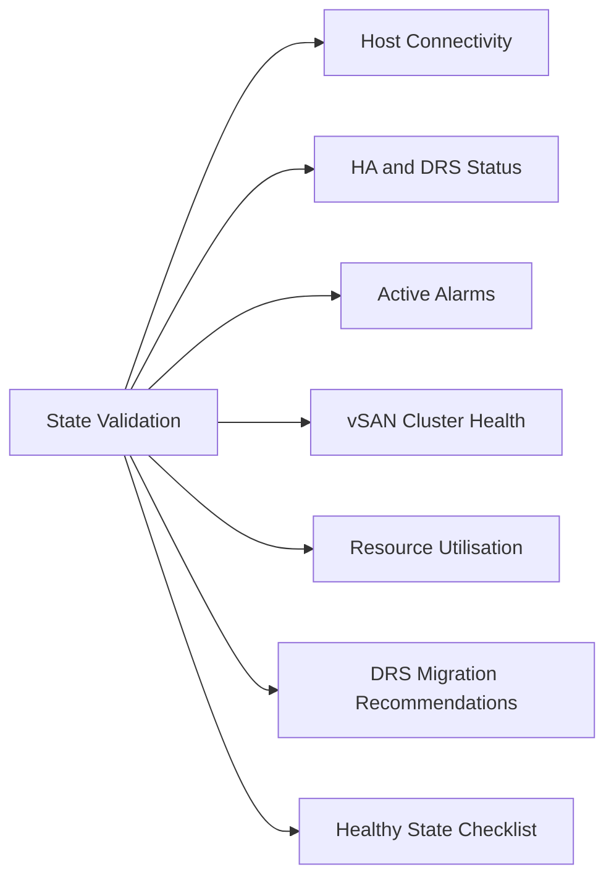

# Cluster State Validation

Quick checks to confirm a vSphere cluster is healthy before and after changes.



## Host Connectivity

```powershell
# All hosts should show ConnectionState: Connected, PowerState: PoweredOn
Get-VMHost -Location (Get-Cluster "ClusterName") |
    Select-Object Name, ConnectionState, PowerState, OverallStatus |
    Sort-Object Name

# Flag any non-Connected hosts
Get-VMHost | Where-Object { $_.ConnectionState -ne "Connected" }
```

## HA and DRS Status

```powershell
# Check HA and DRS are enabled and configured
Get-Cluster | Select-Object Name, HAEnabled, DrsEnabled, DrsAutomationLevel

# Check HA admission control
Get-Cluster | Get-View | Select-Object -ExpandProperty Configuration |
    Select-Object -ExpandProperty DasConfig |
    Select-Object AdmissionControlEnabled, FailoverLevel
```

## Active Alarms

```powershell
# List all triggered alarms across the cluster
$cluster = Get-Cluster "ClusterName"
$alarms = $cluster | Get-View
$alarms.TriggeredAlarmState | ForEach-Object {
    [PSCustomObject]@{
        Entity = (Get-View $_.Entity).Name
        Alarm  = (Get-View $_.Alarm).Info.Name
        Status = $_.OverallStatus
        Time   = $_.Time
    }
}
```

## vSAN Cluster Health

```bash
# On any ESXi host in the cluster
esxcli vsan cluster get
esxcli vsan health cluster list

# Check object health
esxcli vsan debug object list | grep -i "Degraded\|Absent"
```

## Resource Utilisation

```powershell
# CPU and memory headroom per cluster
Get-Cluster | ForEach-Object {
    $c = $_
    $hosts = Get-VMHost -Location $c
    $cpuUsedGHz  = ($hosts | Measure-Object CpuUsageMhz -Sum).Sum / 1000
    $cpuTotalGHz = ($hosts | Measure-Object CpuTotalMhz -Sum).Sum / 1000
    $memUsedGB   = ($hosts | Measure-Object MemoryUsageGB -Sum).Sum
    $memTotalGB  = ($hosts | Measure-Object MemoryTotalGB -Sum).Sum
    [PSCustomObject]@{
        Cluster      = $c.Name
        "CPU Used %"  = [math]::Round($cpuUsedGHz / $cpuTotalGHz * 100, 1)
        "Mem Used %"  = [math]::Round($memUsedGB / $memTotalGB * 100, 1)
    }
}
```

## DRS Migration Recommendations

```powershell
# List pending DRS recommendations
(Get-Cluster "ClusterName" | Get-View).GetRecommendation() |
    Where-Object { $_.ReasonText -match "DRS" } |
    Select-Object ReasonText, Rating
```

## Healthy State Checklist

| Check | Expected |
|---|---|
| All hosts ConnectionState | Connected |
| All hosts PowerState | PoweredOn |
| HA enabled | True |
| DRS automation | FullyAutomated |
| No triggered alarms | 0 critical/warning alarms |
| vSAN health | All green |
| CPU utilisation | < 70% average |
| Memory utilisation | < 80% average |
| No active DRS recommendations | 0 pending |
