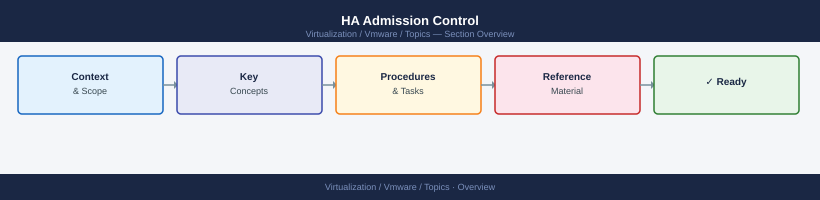

---
tags:
  - vmware
---
# HA Admission Control


<div class="kb-summary">
HA Admission Control reference covering Purpose, Admission Control Policies, Checking Admission Control Status, Configure Admission Control, Admission Control and Overcommit and 3 more sections.

*Applies to: vSphere 7.x / 8.x*
</div>



## Purpose

Admission control reserves cluster capacity so that in the event of a host failure, vSphere HA can restart all VMs from the failed host on remaining hosts. Without it, a cluster at 100% utilisation cannot restart failed VMs.

## Admission Control Policies

| Policy | How It Works | Best For |
|---|---|---|
| **Host failures tolerated** | Reserves capacity equivalent to N hosts worth of CPU and memory | Homogeneous clusters |
| **Cluster resource percentage** | Reserves X% of total cluster CPU and memory | Heterogeneous clusters |
| **Dedicated failover hosts** | Designated hosts sit idle, used only for failover | Compliance environments requiring dedicated DR capacity |

## Checking Admission Control Status

```powershell
# HA configuration including admission control policy
Get-Cluster | Select-Object Name, HAEnabled,
    @{N="FailoverLevel";E={$_.ExtensionData.Configuration.DasConfig.AdmissionControlPolicy.FailoverLevel}},
    @{N="AdmissionControlEnabled";E={$_.ExtensionData.Configuration.DasConfig.AdmissionControlEnabled}}

# Cluster current failover capacity
Get-Cluster | ForEach-Object {
    $view = $_.ExtensionData
    [PSCustomObject]@{
        Cluster     = $_.Name
        FailoverCPU = $view.Summary.AdmissionControlInfo.CurrentFailoverResourcesUsed.Cpu
        FailoverMem = $view.Summary.AdmissionControlInfo.CurrentFailoverResourcesUsed.Memory
    }
}
```

## Configure Admission Control

```powershell
# Set to tolerate 1 host failure (percentage policy)
Set-Cluster -Cluster "<cluster_name>" -HAAdmissionControlEnabled:$true -HAFailoverLevel 1

# Disable admission control (not recommended for production)
Set-Cluster -Cluster "<cluster_name>" -HAAdmissionControlEnabled:$false
```

## Admission Control and Overcommit

Admission control uses *reservation* values where set, or a default 32 MHz / 0 MB where no reservations exist. VMs with large reservations can cause admission control to block VM power-ons even when physical resources are available.

```powershell
# Find VMs with CPU reservations
Get-VM | Where-Object { $_.VMResourceConfiguration.CpuReservationMhz -gt 0 } |
    Select-Object Name, @{N="CpuResMHz";E={$_.VMResourceConfiguration.CpuReservationMhz}}

# Find VMs with memory reservations
Get-VM | Where-Object { $_.VMResourceConfiguration.MemReservationMB -gt 0 } |
    Select-Object Name, @{N="MemResMB";E={$_.VMResourceConfiguration.MemReservationMB}}
```

## Risk Indicators

| Warning | Meaning |
|---|---|
| "Insufficient failover resources" | Cluster is too full — HA cannot guarantee restarts |
| Admission control disabled | Any host failure may leave VMs unrecoverable |
| All hosts at DRS imbalance level 4–5 | Pre-failure utilisation too high |
| Host in maintenance with no headroom | Remaining hosts cannot absorb a second failure |

## HA Heartbeat Datastores

HA uses datastore heartbeats to distinguish host isolation from host failure (avoiding false restarts).

```powershell
# Heartbeat datastores configured on a cluster
$cluster = Get-Cluster "<cluster_name>"
$cluster.ExtensionData.Configuration.DasConfig.HeartbeatDatastore
```

Ensure at least 2 heartbeat datastores are configured — ideally on different storage arrays.

## Operational Checklist

- [ ] Admission control enabled and policy matches cluster design
- [ ] Failover capacity available (no "Insufficient failover resources" warning)
- [ ] HA heartbeat datastores ≥ 2
- [ ] No hosts in unexpected maintenance mode reducing capacity
- [ ] VM reservations reviewed — excessive reservations inflate required failover capacity
