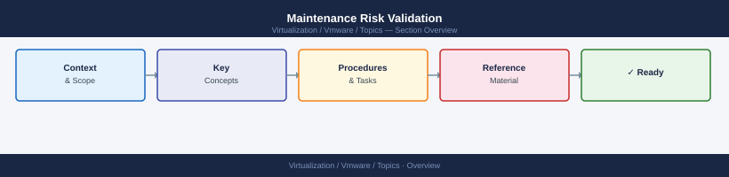

---
tags:
  - vmware
---
# Maintenance Risk Validation


<div class="kb-summary">
Validate cluster health before any maintenance window. All checks must pass before placing a host into maintenance mode or performing upgrades. Use the tables below as a structured pre-flight checklist.

*Applies to: vSphere 7.x / 8.x*
</div>



---

```d2
direction: right

center: "Maintenance Risk Validation" {shape: hexagon}
premaintenance_validation: "Pre-Maintenance Validation" {shape: rectangle}
redflag_conditions: "Red-Flag Conditions" {shape: rectangle}
safetoproceed_validation_checklist: "Safe-to-Proceed Validation Checklist" {shape: rectangle}

center -> premaintenance_validation
center -> redflag_conditions
center -> safetoproceed_validation_checklist
```

```vega-lite
{
  "$schema": "https://vega.github.io/schema/vega-lite/v5.json",
  "title": {
    "text": "Maintenance Risk Validation \u2014 Thresholds",
    "fontSize": 13,
    "fontWeight": "normal"
  },
  "width": 480,
  "height": {
    "step": 26
  },
  "data": {
    "values": [
      {
        "metric": "Get-VsanSpaceUsage -Cluster <name>",
        "zone": "Safe",
        "val": 75
      },
      {
        "metric": "Get-VsanSpaceUsage -Cluster <name>",
        "zone": "Alert",
        "val": 25
      }
    ]
  },
  "mark": {
    "type": "bar",
    "cornerRadiusEnd": 3
  },
  "encoding": {
    "y": {
      "field": "metric",
      "type": "nominal",
      "axis": {
        "title": null,
        "labelLimit": 200
      },
      "sort": null
    },
    "x": {
      "field": "val",
      "type": "quantitative",
      "stack": "normalize",
      "axis": {
        "title": "Threshold boundary",
        "format": ".0%"
      }
    },
    "color": {
      "field": "zone",
      "type": "nominal",
      "scale": {
        "domain": [
          "Safe",
          "Alert"
        ],
        "range": [
          "#15803d",
          "#dc2626"
        ]
      },
      "legend": {
        "title": "Zone"
      }
    },
    "order": {
      "field": "zone",
      "sort": [
        "Safe",
        "Alert"
      ]
    },
    "tooltip": [
      {
        "field": "metric",
        "type": "nominal",
        "title": "Metric"
      },
      {
        "field": "zone",
        "type": "nominal",
        "title": "Zone"
      },
      {
        "field": "val",
        "type": "quantitative",
        "title": "Segment %",
        "format": ".0f"
      }
    ]
  }
}
```

## Pre-Maintenance Validation

Run these commands before every maintenance operation. Resolve any failures before proceeding.

| Check | Command | Pass Criteria |
|---|---|---|
| vSAN cluster health | `esxcli vsan health cluster get` | All tests green; no failures or warnings |
| vSAN health (PowerCLI) | `Get-VsanClusterHealthSummary -Cluster <name>` | `OverallHealth: green` |
| vSAN resync status | `esxcli vsan debug resync list` | Empty output (no objects resyncing) |
| vSAN capacity | `Get-VsanSpaceUsage -Cluster <name>` | Free capacity > 30% |
| Host power state | `Get-VMHost \| Where-Object { $_.PowerState -ne "PoweredOn" }` | Empty — all hosts powered on |
| Host connection state | `Get-VMHost \| Where-Object { $_.ConnectionState -ne "Connected" }` | Empty — all hosts connected |
| Active alarms | `Get-AlarmAction \| Where-Object { $_.Alarm.Info.Enabled }` | No critical active alarms on cluster or hosts |
| HA admission control | `(Get-Cluster <name>).HAAdmissionControlEnabled` | `True` |
| DRS enabled | `(Get-Cluster <name>).DrsEnabled` | `True` |
| vSAN cluster config | `Get-VsanClusterConfiguration -Cluster <name>` | `SpaceEfficiencyEnabled`, `FaultDomainsEnabled` match expected config |
| Storage latency | `esxcli storage core adapter stats get` | Read/write latency < 20 ms |
| Network uplinks | `esxcli network nic list` | All uplinks `Link: Up`; no unexpected `Down` |
| Backup jobs | Check backup tool (Veeam, VADP) last run status | All VMs backed up within RPO window |

---

## Red-Flag Conditions

Do NOT proceed with maintenance if any of the following thresholds are breached.

| Condition | Threshold / Signal | Check Command |
|---|---|---|
| vSAN resync bytes outstanding | > 0 bytes (any resync in progress) | `esxcli vsan debug resync list` |
| vSAN capacity free | < 25% free | `Get-VsanSpaceUsage -Cluster <name>` |
| vSAN component repair delay active | Delay timer > 0 (objects awaiting repair) | `esxcli vsan debug object list \| grep -i degraded` |
| Host hardware alerts | Any IPMI / iDRAC / ILO critical alerts | Check hardware OOB console; `Get-VMHostHardware -VMHost <name>` |
| vSAN disk group degraded | Any disk group not fully operational | `esxcli vsan storage list` → check `In CMMDS: true` for all disks |
| Network uplink down | Any vmnic with `Link: Down` on a vSAN or management VMNIC | `esxcli network nic list` |
| Active HA failover | HA failover event in the last 24 h | vCenter Events → filter `com.vmware.vc.ha.VmFailoverSucceededEvent` |
| Unsaved/unpresented snapshots | Snapshots older than 72 h | `Get-VM \| Get-Snapshot \| Where-Object { $_.Created -lt (Get-Date).AddHours(-72) }` |
| DRS fully disabled | DRS mode is `Manual` or disabled on maintenance target cluster | `(Get-Cluster <name>).DrsAutomationLevel` |

---

## Safe-to-Proceed Validation Checklist

All rows must show **Pass** before placing a host into maintenance mode.

| Item | Expected State | Verified |
|---|---|---|
| vSAN health summary | Green (no failures) | [ ] |
| Resync queue | Empty | [ ] |
| Capacity free | > 30% | [ ] |
| All hosts connected and powered on | True | [ ] |
| No critical active alarms | True | [ ] |
| HA admission control | Enabled | [ ] |
| DRS mode | FullyAutomated | [ ] |
| All disk groups healthy | True | [ ] |
| Network uplinks all up | True | [ ] |
| VMs backed up within RPO | True | [ ] |
| Change freeze / CAB approval | Approved | [ ] |

Once all items are verified, proceed with: `Set-VMHost -VMHost <hostname> -State Maintenance`

After the host enters maintenance mode, confirm with:

```powershell
Get-VMHost -Name <hostname> | Select-Object Name, ConnectionState, PowerState
# Expected: ConnectionState: Maintenance
```
