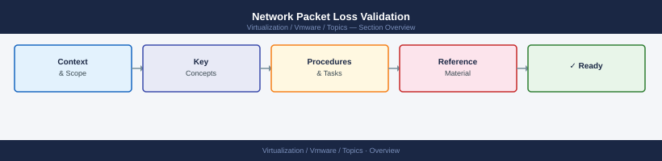

---
tags:
  - vmware
---
# Network Packet Loss Validation


<div class="kb-summary">
Network Packet Loss Validation reference covering Symptoms, NIC Statistics, vmkping — Reachability and MTU Testing, PowerCLI Network Checks, Common Causes and Fixes and 1 more sections.

*Applies to: vSphere 7.x / 8.x*
</div>



## Symptoms

| Symptom | Likely Cause |
|---|---|
| Dropped packets on vmnic | Physical NIC, cable, or switch port issue |
| Slow or failed vMotion | vMotion VMkernel packet loss or high latency |
| VM intermittent connectivity | Port group misconfiguration or uplink saturation |
| vSAN health: network errors | vSAN VMkernel path issues |
| NSX tunnel flapping | Geneve underlay MTU mismatch |

## NIC Statistics

```bash
# Per-NIC stats including drops, errors, and CRC errors
esxcli network nic stats get -n vmnic0
esxcli network nic stats get -n vmnic1

# Key counters to check
# RX/TX dropped   — driver ring buffer overflow
# RX/TX errors    — physical layer (cable, SFP, switch)
# RX/TX CRC       — physical layer corruption

# List all NICs and link state
esxcli network nic list
```

## vmkping — Reachability and MTU Testing

```bash
# Basic ping from a VMkernel adapter
vmkping -I vmk0 <destination_ip>

# Large packet test (MTU validation — 8972 bytes = 9000 MTU minus headers)
vmkping -I vmk0 -d -s 8972 <destination_ip>

# vSAN VMkernel MTU test
vmkping -I vmk2 -d -s 8972 <peer_vsan_vmk_ip>

# vMotion VMkernel latency test
vmkping -I vmk1 -c 100 <target_host_vmk1_ip>
```

Packet loss should always be **zero**. Any loss requires investigation before proceeding with maintenance.

## PowerCLI Network Checks

```powershell
# Physical NIC link state for all hosts in a cluster
Get-Cluster "<cluster>" | Get-VMHost | ForEach-Object {
    $h = $_
    Get-VMHostNetworkAdapter -VMHost $h -Physical |
        Select-Object @{N="Host";E={$h.Name}}, Name, BitRatePerSec,
        @{N="LinkUp";E={$_.ExtensionData.LinkSpeed -ne $null}}
}

# VMkernel adapters and their tagging
Get-VMHostNetworkAdapter -VMHost "<host>" -VMKernel |
    Select-Object Name, IP, VMotionEnabled, ManagementTrafficEnabled, VsanTrafficEnabled

# Portgroup VLAN assignments
Get-VirtualPortGroup -VMHost "<host>" | Select-Object Name, VLanId
```

## Common Causes and Fixes

| Cause | Detection | Fix |
|---|---|---|
| MTU mismatch | `vmkping -d -s 8972` fails | Align MTU on vSwitch, physical switch, and NIC |
| NIC queue full | `esxcli network nic stats` shows drops | Reduce load or enable receive-side scaling (RSS) |
| Bad cable/SFP | CRC errors in NIC stats | Replace cable or SFP |
| Uplink saturation | High TX/RX utilisation | Add uplink or redistribute workloads |
| Wrong VLAN on portgroup | VMs in same subnet can't communicate | Fix VLAN ID in portgroup config |
| Spanning tree topology change | Transient loss after switch change | Enable PortFast on host-facing switch ports |

## Ongoing Monitoring

```bash
# Watch NIC stats (refresh every 2s)
watch -n 2 "esxcli network nic stats get -n vmnic0 | grep -E 'Dropped|Error|CRC'"

# Or use esxtop for real-time network metrics
esxtop   # press 'n' to switch to network view
```
