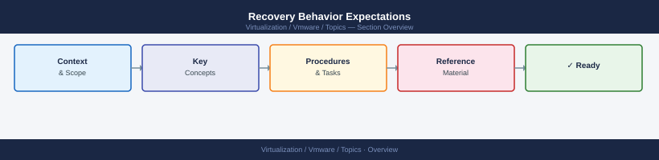

---
tags:
  - vmware
---
# Recovery Behavior Expectations


<div class="kb-summary">
Understanding what normal recovery looks like prevents unnecessary intervention during incidents.

*Applies to: vSphere 7.x / 8.x*
</div>



```d2
direction: right

center: "Recovery Behavior" {shape: hexagon}
after_host_failure: "After Host Failure" {shape: rectangle}
after_storage_failure: "After Storage Failure" {shape: rectangle}
after_network_failure: "After Network Failure" {shape: rectangle}
after_vsan_component_failure: "After vSAN Component Failure" {shape: rectangle}
recovery_performance_impact: "Recovery Performance Impact" {shape: rectangle}
when_to_escalate: "When to Escalate" {shape: rectangle}

center -> after_host_failure
center -> after_storage_failure
center -> after_network_failure
center -> after_vsan_component_failure
center -> recovery_performance_impact
center -> when_to_escalate
```

## After Host Failure

| Phase | Expected Behavior | Timeframe |
|---|---|---|
| HA detection | vCenter marks host as unreachable | 0–30 seconds |
| HA restart | FDM restarts VMs on remaining hosts | 1–5 minutes |
| VM boot | Guest OS boots normally | 1–3 minutes |
| vSAN resync | If vSAN — rebuild begins for affected components | Minutes to hours (data-dependent) |
| DRS rebalance | DRS may initiate vMotions to rebalance | Within 5–15 minutes |

```powershell
# Monitor HA restart events
Get-VIEvent -MaxSamples 500 | Where-Object { $_.GetType().Name -match "VmRestartedByHA" } |
    Select-Object CreatedTime, @{N="VM";E={$_.Vm.Name}}, FullFormattedMessage

# Check current host state
Get-VMHost | Select-Object Name, ConnectionState, PowerState
```

## After Storage Failure

| Phase | Expected Behavior |
|---|---|
| Path marked dead | `esxcli storage core path list` shows `State: dead` |
| APD declared | After 140 seconds of all paths down (APD) |
| PDL declared | If array signals permanent loss via SCSI sense code |
| VMs paused | APD/PDL triggers HA response (if configured) |
| Object rebuild (vSAN) | New replica created on remaining disk capacity |

```bash
# Check path states on ESXi host
esxcli storage core path list | grep -E "State:|Device:"

# APD/PDL events in vmkernel log
grep -i "APD\|PDL\|lost path" /var/log/vmkernel.log | tail -20
```

**Do not rescan storage unnecessarily during a recovery** — it can delay path re-establishment.

## After Network Failure

| Phase | Expected Behavior |
|---|---|
| Link down detected | vmkernel.log logs "Link down" immediately |
| HA heartbeat breaks | After 10 seconds without heartbeat, HA considers host isolated |
| Isolation response | Host executes configured isolation response (leave/power off/shutdown) |
| Alarms | Alarm storm for disconnected VMs and host |
| Recovery | Once link restored, host reconnects to vCenter within 60–120 seconds |

```powershell
# Check for recent network isolation events
Get-VIEvent -MaxSamples 1000 | Where-Object { $_.GetType().Name -match "DasHostIsolated" } |
    Select-Object CreatedTime, FullFormattedMessage
```

## After vSAN Component Failure

```bash
# Resync activity (normal after component failure)
esxcli vsan debug resync list

# Object health — degraded objects mean rebuild in progress
esxcli vsan debug object list | grep -v healthy

# Do NOT remove a second disk until resync completes
esxcli vsan debug resync list | grep "Total Bytes"
```

## Recovery Performance Impact

| Event | Performance Impact | Duration |
|---|---|---|
| HA restart | Affected VMs fully stopped during restart | Minutes |
| vSAN resync | Up to 30% IOPS reduction during rebuild | Hours |
| NIC failover (teaming) | Brief (<1s) packet loss during failover | Sub-second |
| vMotion | 10–15% overhead on source host during transfer | Minutes per VM |

## When to Escalate

- HA restarts still in progress after 15 minutes
- vSAN resync has not started 10 minutes after host failure
- APD not resolved after storage path recovery
- VM fails to power on with "insufficient resources" after HA restart
