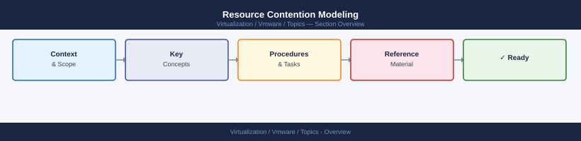

---
tags:
  - vmware
---
# Resource Contention Modeling


<div class="kb-summary">
Resource Contention Modeling reference covering CPU Contention, Memory Contention, Storage Latency, Network Contention, Contention Response Actions and 1 more sections.

*Applies to: vSphere 7.x / 8.x*
</div>



```d2
direction: right

center: "Resource Contention" {shape: hexagon}
cpu_contention: "CPU Contention" {shape: rectangle}
memory_contention: "Memory Contention" {shape: rectangle}
storage_latency: "Storage Latency" {shape: rectangle}
network_contention: "Network Contention" {shape: rectangle}
contention_response_actions: "Contention Response Actions" {shape: rectangle}
drs_imbalance_score: "DRS Imbalance Score" {shape: rectangle}

center -> cpu_contention
center -> memory_contention
center -> storage_latency
center -> network_contention
center -> contention_response_actions
center -> drs_imbalance_score
```

```vega-lite
{
  "$schema": "https://vega.github.io/schema/vega-lite/v5.json",
  "title": {
    "text": "Resource Contention Modeling \u2014 Thresholds",
    "fontSize": 13,
    "fontWeight": "normal"
  },
  "width": 480,
  "height": {
    "step": 26
  },
  "data": {
    "values": [
      {
        "metric": "Memory usage %",
        "zone": "Safe",
        "val": 90
      },
      {
        "metric": "Memory usage %",
        "zone": "Alert",
        "val": 10
      },
      {
        "metric": "RX/TX utilisation",
        "zone": "Safe",
        "val": 80
      },
      {
        "metric": "RX/TX utilisation",
        "zone": "Alert",
        "val": 20
      },
      {
        "metric": "Packet loss (vmkping)",
        "zone": "Safe",
        "val": 0
      },
      {
        "metric": "Packet loss (vmkping)",
        "zone": "Alert",
        "val": 100
      }
    ]
  },
  "mark": {
    "type": "bar",
    "cornerRadiusEnd": 3
  },
  "encoding": {
    "y": {
      "field": "metric",
      "type": "nominal",
      "axis": {
        "title": null,
        "labelLimit": 200
      },
      "sort": null
    },
    "x": {
      "field": "val",
      "type": "quantitative",
      "stack": "normalize",
      "axis": {
        "title": "Threshold boundary",
        "format": ".0%"
      }
    },
    "color": {
      "field": "zone",
      "type": "nominal",
      "scale": {
        "domain": [
          "Safe",
          "Alert"
        ],
        "range": [
          "#15803d",
          "#dc2626"
        ]
      },
      "legend": {
        "title": "Zone"
      }
    },
    "order": {
      "field": "zone",
      "sort": [
        "Safe",
        "Alert"
      ]
    },
    "tooltip": [
      {
        "field": "metric",
        "type": "nominal",
        "title": "Metric"
      },
      {
        "field": "zone",
        "type": "nominal",
        "title": "Zone"
      },
      {
        "field": "val",
        "type": "quantitative",
        "title": "Segment %",
        "format": ".0f"
      }
    ]
  }
}
```

## CPU Contention

**CPU Ready** is the primary indicator: time a vCPU waited in the run queue because the physical CPU was busy.

| CPU Ready % | State |
|---|---|
| < 5% | Normal |
| 5–10% | Monitor |
| > 10% | Contention — investigate |
| > 20% | Severe — VM performance severely impacted |

```powershell
# CPU usage across all hosts
Get-VMHost | Select-Object Name,
    @{N="CPUUsageMHz";E={$_.CpuUsageMhz}},
    @{N="CPUTotalMHz";E={$_.CpuTotalMhz}},
    @{N="UsedPct";E={[math]::Round($_.CpuUsageMhz / $_.CpuTotalMhz * 100, 1)}}

# Per-VM CPU ready (use esxtop or performance charts — not directly queryable via PowerCLI)
# In esxtop: press 'c' for CPU view — %RDY column
```

```bash
# esxtop CPU view — look for %RDY > 10
esxtop   # press 'c', then look at %RDY per world
```

## Memory Contention

| Indicator | Threshold | Meaning |
|---|---|---|
| Balloon (MB) | > 0 | Host reclaiming memory from VMs |
| Swap rate (MB/s) | > 0 | Severe — swapping to disk, significant performance hit |
| Memory usage % | > 90% | High — ballooning imminent |
| Overhead | N/A | Hypervisor overhead, not controllable |

```powershell
# Memory state per host
Get-VMHost | Select-Object Name,
    @{N="MemUsedGB";E={[math]::Round($_.MemoryUsageGB,1)}},
    @{N="MemTotalGB";E={[math]::Round($_.MemoryTotalGB,1)}},
    @{N="UsedPct";E={[math]::Round($_.MemoryUsageGB / $_.MemoryTotalGB * 100, 1)}}
```

```bash
# esxtop memory view — look for MCTLSZ (balloon) and SWPRD/SWPWT (swap)
esxtop   # press 'm'
```

## Storage Latency

| Latency | State |
|---|---|
| < 10 ms | Normal |
| 10–20 ms | Warning — monitor under load |
| > 20 ms | Problem — investigate |
| > 50 ms | Severe — application timeouts likely |

```powershell
# Datastore latency (requires performance metrics collection enabled)
$stats = Get-Stat -Entity (Get-Datastore "<ds_name>") -Stat "datastore.totalReadLatency.average", "datastore.totalWriteLatency.average" -Realtime -MaxSamples 20
$stats | Select-Object Entity, MetricId, Value, Timestamp
```

## Network Contention

| Indicator | Threshold | Meaning |
|---|---|---|
| Dropped packets | > 0 | NIC ring buffer full or physical issue |
| RX/TX utilisation | > 80% | NIC saturation — add uplinks |
| Packet loss (vmkping) | > 0% | Physical or MTU issue |

```bash
# NIC utilisation
esxcli network nic stats get -n vmnic0 | grep -E "Bytes|Dropped"

# Real-time: esxtop network view
esxtop   # press 'n'
```

## Contention Response Actions

| Resource | Contention | Response |
|---|---|---|
| CPU | %RDY > 10% | vMotion VMs to less loaded host; review DRS settings |
| Memory | Balloon > 0 | vMotion VMs; add RAM; reduce VM memory reservations |
| Memory | Swap > 0 | Emergency — vMotion immediately; swap = disk I/O |
| Storage | Latency > 20ms | Check array load; rebalance VMs across datastores |
| Network | Drops > 0 | Check MTU, cable, uplink saturation |

## DRS Imbalance Score

```powershell
# DRS migration recommendations pending
Get-Cluster "<cluster>" | Select-Object Name,
    @{N="DRSScore";E={$_.ExtensionData.Summary.UsagesSummary.OverallUsage}}

# Review DRS recommendations
(Get-Cluster "<cluster>").ExtensionData.RecommendedAction
```
