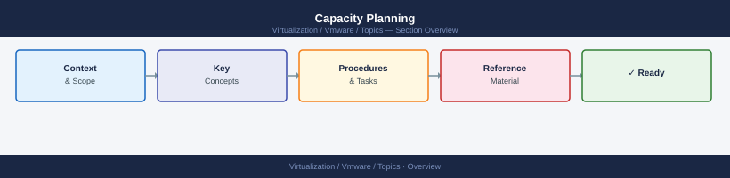

---
tags:
  - scenarios
  - vmware
---
# Capacity Planning

<div class="kb-summary">
Capacity planning is deciding when to add compute or storage resources before performance degrades
or space runs out — not after. Aria Operations is the primary tool: it provides time-remaining
projections, reclaimable waste identification, and what-if modelling. This scenario walks through
the full capacity review workflow, from checking raw headroom to making a justified hardware
procurement decision.

*Applies to: vSphere 7.x / 8.x*
</div>



## Products Involved

| Product | Role in This Scenario |
|---|---|
| Aria Operations | Primary capacity analytics: time remaining, reclaimable waste, what-if analysis, trending |
| vCenter Server | Cluster CPU and RAM inventory; HA admission control effective capacity |
| vSAN | Storage capacity used vs total; slack space; capacity trending on the vSAN datastore |
| VxRail Manager | Node expansion wizard for HCI clusters — do not add nodes outside VxRail Manager |

---

## 1. Check vSAN Storage Headroom

Never exceed 70% used capacity on a vSAN production cluster — at 80% vSAN stops accepting writes.

```powershell
# Get vSAN datastore capacity via PowerCLI
Get-Datastore | Where-Object {$_.Type -eq "vsan"} | Select Name,
  @{N="CapacityGB";E={[math]::Round($_.CapacityGB,1)}},
  @{N="FreeSpaceGB";E={[math]::Round($_.FreeSpaceGB,1)}},
  @{N="UsedPct";E={[math]::Round((($_.CapacityGB - $_.FreeSpaceGB) / $_.CapacityGB) * 100, 1)}}
```

Expected: UsedPct below 70%; if 70–80%, hardware procurement should already be in progress.

From the vCenter UI: **Cluster → Monitor → vSAN → Capacity**. Review:

- **Used**: current capacity consumed including mirror/parity overhead
- **Total**: raw usable capacity after FTT policy deduplication/compression
- **Slack**: free space available for writes and resync

| Usage level | Status | Action |
|---|---|---|
| < 70% | Healthy | No action required |
| 70–80% | Warning | Order expansion hardware now |
| > 80% | Critical — stop new VMs | Emergency: reclaim or expand immediately |

---

## 2. Check Compute Headroom (CPU and RAM)

Compare effective cluster capacity (after HA reservation) against actual usage to find real headroom.

```powershell
# Cluster effective CPU and memory after HA reservation
Get-Cluster "cluster-name" | Select Name,
  @{N="EffectiveCPUMHz";E={($_ | Get-View).Summary.EffectiveCpu}},
  @{N="EffectiveMemMB";E={($_ | Get-View).Summary.EffectiveMemory}}

# Current actual usage across all hosts in the cluster
Get-Cluster "cluster-name" | Get-VMHost |
  Measure-Object -Property CpuUsageMhz, MemoryUsageMB -Sum |
  Select Property, Sum
```

Expected: actual usage below 80% of effective capacity on both CPU and memory.

---

## 3. Aria Operations Capacity View

Navigate to **Aria Operations → Capacity → Clusters → select cluster → Capacity Remaining** for the most actionable combined view.

Key metrics to review:

- **Time Remaining**: days until the cluster runs out of CPU, RAM, or storage at the current growth
  rate. Below 90 days is a trigger to start hardware procurement.
- **Reclaimable Waste**: capacity that can be recovered without purchasing hardware — oversized VMs,
  idle VMs, reclaimed snapshots.
- **What-If Analysis**: models the impact of adding a workload or a node on time remaining.

---

## 4. Trending — 90-Day Growth Analysis

Review 90-day growth slope to determine whether point-in-time readings are representative.

Aria Operations → **Capacity** → select the vSAN datastore → **Historical** → set time range to
90 days. Compare the growth slope:

- **Linear growth**: predictable — use the slope to project when 70% will be hit.
- **Accelerating growth**: new workloads being added faster than expected — revise the order
  timeline forward.
- **Flat**: no growth. Check whether new VMs are being deployed on this cluster at all.

---

## 5. Check Reclaimable Resources Before Ordering Hardware

Before submitting a hardware request, check Aria Operations for waste that can be recovered at zero cost.

```powershell
# Find powered-off VMs still consuming VMDK space
Get-VM | Where-Object {$_.PowerState -eq "PoweredOff"} |
  Select Name, ProvisionedSpaceGB,
  @{N="DaysSincePoweredOff";E={(Get-Date) - $_.ExtensionData.Runtime.PowerOffTime | Select -Expand Days}}

# Find VMs with snapshots (snapshots consume storage continuously)
Get-VM | Get-Snapshot | Select VM, Name, SizeGB, Created
```

Expected: Aria Ops reclaimable waste report and PowerCLI output identify candidates for cleanup before any procurement request.

| Waste type | How to find | Action |
|---|---|---|
| Powered-off VMs | PowerCLI above / Aria Ops → Waste | Confirm with owner, delete if stale |
| Oversized vCPU or RAM | Aria Ops → Rightsizing recommendations | Reduce reservation to match actual usage |
| Orphaned VMDKs | vCenter → Datastore → Files → search for .vmdk with no associated VM | Delete after confirming no VM ownership |
| Old snapshots | Get-Snapshot / Aria Ops waste | Consolidate or delete snapshots > 7 days old |

---

## 6. Node Expansion Decision

Use these trigger points to decide when a node expansion is justified.

| Metric | Warning threshold | Action required threshold |
|---|---|---|
| vSAN capacity used | > 70% | > 80% — emergency |
| Cluster CPU (effective) | > 75% sustained | > 85% |
| Cluster RAM (effective) | > 80% sustained | > 90% |
| CPU ready (cluster avg) | > 3% | > 5% |
| Memory ballooning | Intermittent on 1–2 hosts | Active on multiple hosts |
| Time remaining (Aria Ops) | < 90 days | < 45 days |

Document the specific metrics that triggered the decision. Procurement teams require justification
and capacity data, not just "the cluster is getting full."

---

## 7. VxRail Node Expansion

For VxRail HCI clusters, all node additions must go through **VxRail Manager**.

VxRail Manager → **Cluster** → **Expand Cluster** → follow the node expansion wizard.

VxRail Manager validates that the new node matches the cluster's VxRail bundle (ESXi version,
firmware, driver stack), adds the node to vSAN with the correct disk claim policy, and verifies
the post-expansion vSAN health. **Do not add a node to a VxRail cluster via vCenter directly.**
Doing so skips firmware validation, may apply an incorrect VxRail personality, and breaks
the supportability of the cluster.

---

## Post-Task Validation

After adding capacity (hardware or reclamation), verify the following:

| Check | Location | Expected Result |
|---|---|---|
| vSAN used % dropped | vCenter → vSAN → Capacity | Below 70% |
| Aria Ops time remaining updated | Aria Ops → Capacity → Clusters | Value increased |
| vSAN health green | vCenter → vSAN → Skyline Health | All green |
| New node visible in cluster | vCenter inventory | Host Connected, in cluster |
| DRS rebalanced after node add | vCenter → DRS → Recommendations | No pending recommendations |

---

## Key Terms

| Term | Definition |
|---|---|
| Aria Operations capacity analytics | The capacity module within Aria Operations that aggregates current usage, growth trends, reclaimable waste, and what-if modelling into a single view per cluster or datastore |
| vSAN slack space | The buffer of free capacity vSAN requires to perform resyncs, repairs, and policy re-satisfaction; the 70% warning and 80% write-stop thresholds define the operating window |
| HA admission control | vCenter HA mechanism that reserves a portion of cluster CPU and RAM to guarantee capacity for VM restarts after a host failure; reduces effective usable capacity |
| effective CPU/RAM | The cluster compute capacity reported by vCenter after subtracting HA admission control reserves — the real headroom available for running workloads |
| reclaimable waste | Capacity identified by Aria Operations that can be recovered without hardware — powered-off VMs, oversized VMs, old snapshots, and orphaned VMDKs |
| thin provisioning | A disk allocation mode where a VMDK only consumes datastore space as data is written, rather than pre-allocating the full disk size; inflates apparent free space until actual writes occur |
| Time Remaining | An Aria Operations metric that projects the number of days until a cluster exhausts CPU, RAM, or storage at the current consumption growth rate — the primary procurement trigger |
| DRS | Distributed Resource Scheduler — automatically rebalances VM placement across hosts; also rebalances after a new node is added to the cluster following expansion |
| VxRail Manager | Dell-provided management layer for VxRail HCI clusters that orchestrates node expansion, ensuring firmware/driver/ESXi bundle alignment before adding a node to vSAN |
| svMotion | Storage vMotion — live migration of a VM's VMDK files from one datastore to another without VM downtime; used during capacity reclamation to move VMs off full datastores |
| powered-off VM | A VM that is shut down but still has VMDK files consuming datastore space; a common source of reclaimable waste identified by Aria Operations |
