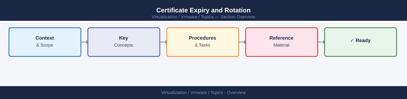

---
tags:
  - scenarios
  - vmware
---
# Certificate Expiry and Rotation

<div class="kb-summary">
Certificate expiry causes cascading failures across VMware products — SSO authentication breaks,
product-to-product API calls fail, and browsers show trust warnings. Rotation must be done in the
right order because each Aria product and ESXi host trusts the vCenter VMCA as its root authority.
Replace the root before the leaf certs, or all products immediately distrust the new root and break
again. This scenario covers identification, rotation order, and validation across all affected products.

*Applies to: vSphere 7.x / 8.x*
</div>



```d2
direction: right

center: "Scenarios" {shape: hexagon}
products_involved: "Products Involved" {shape: rectangle}
1_identify_expiring_certificates: "1. Identify Expiring Certificates" {shape: rectangle}
2_rotate_vcenter_vmca_certificate: "2. Rotate vCenter VMCA Certificate" {shape: rectangle}
3_rotate_esxi_host_certificates: "3. Rotate ESXi Host Certificates" {shape: rectangle}
4_rotate_nsx_manager_certificate: "4. Rotate NSX Manager Certificate" {shape: rectangle}
5_rotate_aria_suite_product_certific: "5. Rotate Aria Suite Product Certificates via Aria SuiteLC" {shape: rectangle}

center -> products_involved
center -> 1_identify_expiring_certificates
center -> 2_rotate_vcenter_vmca_certificate
center -> 3_rotate_esxi_host_certificates
center -> 4_rotate_nsx_manager_certificate
center -> 5_rotate_aria_suite_product_certific
```

## Products Involved

| Product | Role in This Scenario |
|---|---|
| Aria Suite Lifecycle | Certificate manager for all Aria products; manages rotation across the Aria Suite in sequence |
| vCenter Server | VMCA (VMware Certificate Authority) — root CA for ESXi hosts and vCenter solution certs |
| ESXi | Leaf certificates provisioned by VMCA; shows thumbprint warnings in vCenter if stale |
| NSX Manager | TLS certificates for the Manager UI, API, and edge nodes — independent from VMCA |

---

## 1. Identify Expiring Certificates

Certificates expiring within 60 days should be scheduled for rotation immediately — run this audit against every VMware product.

```bash
# vCenter certificate expiry
echo | openssl s_client -connect vcenter.domain.local:443 2>/dev/null \
  | openssl x509 -noout -dates

# ESXi host certificate
echo | openssl s_client -connect esxi-host.domain.local:443 2>/dev/null \
  | openssl x509 -noout -dates

# NSX Manager certificate
echo | openssl s_client -connect nsxmanager.domain.local:443 2>/dev/null \
  | openssl x509 -noout -dates

# Aria Operations
echo | openssl s_client -connect ariaops.domain.local:443 2>/dev/null \
  | openssl x509 -noout -dates

# Aria Operations for Logs
echo | openssl s_client -connect arialogs.domain.local:443 2>/dev/null \
  | openssl x509 -noout -dates
```

```bash
# Batch audit across all known VMware hosts — outputs hostname and notAfter date
for host in vcenter.domain.local nsxmanager.domain.local ariaops.domain.local arialogs.domain.local; do
  printf "%-40s " "$host:"
  echo | openssl s_client -connect $host:443 2>/dev/null \
    | openssl x509 -noout -dates 2>/dev/null | grep notAfter
done
```

Expected: each line prints the hostname and a `notAfter` date; any date within 60 days requires rotation.

---

## 2. Rotate vCenter VMCA Certificate

Option A (CA-signed) is recommended for all production environments; Option B (self-signed renewal) is acceptable for isolated lab environments only.

**Option A — Replace with CA-signed certificate (recommended):**

```bash
# SSH into vCenter VCSA, then run the certificate manager
/usr/lib/vmware-vmca/bin/certificate-manager
```

In the certificate manager menu:

1. Select **Option 1**: Replace Machine SSL Certificate with Custom Certificate
2. Follow prompts to generate a CSR
3. Sign the CSR with your internal CA (Active Directory CS, HashiCorp Vault, etc.)
4. Import the signed certificate and CA chain
5. The VCSA services restart automatically after import

**Option B — Renew VMCA self-signed certificate (lab use only):**

```bash
/usr/lib/vmware-vmca/bin/certificate-manager
# Select Option 8: Regenerate all certificates
```

Expected: VCSA services restart; `openssl s_client` against vCenter returns a `notAfter` date beyond 1 year from today.

---

## 3. Rotate ESXi Host Certificates

After replacing the VMCA cert, regenerate all ESXi host certificates so they are signed by the new VMCA root.

```powershell
# PowerCLI — renew ESXi certificates from vCenter for all hosts in a cluster
foreach ($vmhost in Get-Cluster "cluster-name" | Get-VMHost) {
    $certMgr = Get-View -Id $vmhost.ExtensionData.ConfigManager.CertificateManager
    Write-Host "Renewing cert on $($vmhost.Name)"
    $certMgr.InstallServerCertificate($null)
}
```

Expected: thumbprint warning banner on each host in vCenter clears after renewal.

Alternatively via the vCenter UI: **Administration → Certificate Management → Renew**. This
triggers vCenter to push a new VMCA-signed cert to every connected ESXi host.

---

## 4. Rotate NSX Manager Certificate

NSX uses its own TLS certificate, independent from VMCA — replace it through the NSX Manager UI.

1. NSX Manager → **System** → **Certificates** → **Import Certificate**
2. Paste the signed certificate and private key
3. After import, go to **Service Certificates** → **Edit** next to the API/Manager certificate
4. Select the newly imported certificate and save
5. NSX Manager UI and API will restart — the new cert is active after the restart

Expected: `openssl s_client` against NSX Manager returns the new certificate with updated `notAfter` date.

NSX edge node certificates (used for BGP and load balancer TLS) are managed separately under
**System → Certificates → Node Certificates**.

---

## 5. Rotate Aria Suite Product Certificates via Aria SuiteLC

Aria SuiteLC coordinates certificate rotation for all registered Aria products as a single sequenced operation.

Aria SuiteLC → **Lifecycle Operations** → **Environments** → select the Aria environment →
**Certificates** → **Replace**.

Aria SuiteLC will:
1. Validate connectivity to each product
2. Replace certificates in the correct dependency order within the Aria Suite
3. Restart affected services per product
4. Validate that each product is reachable with the new cert before proceeding to the next

**Do not replace Aria product certificates individually outside Aria SuiteLC.** Manual replacement
of individual product certs without updating the SuiteLC trust store causes the products to lose
mutual trust with each other and with vCenter.

---

## 6. Verify Rotation Order Was Followed

The rotation order must be: CA trust store → vCenter VMCA → ESXi hosts → NSX → Aria Suite products.

| Stage | What trusts what | Must come before |
|---|---|---|
| Internal CA / SuiteLC store | Root of all trust chains | Everything else |
| vCenter VMCA | Signs ESXi and solution certs | ESXi, Aria Suite |
| ESXi host certs | Signed by VMCA | — |
| NSX cert | Independent; trusts external CA | — |
| Aria Suite certs | Trust vCenter VMCA | vCenter VMCA rotated first |

If you replace an Aria product cert before replacing the VMCA root, the Aria product receives a
cert signed by the new VMCA root, but the product's trust store still contains only the old VMCA
root — the new cert is immediately untrusted, breaking product-to-vCenter communication.

---

## Post-Task Validation

```bash
# Verify new expiry dates on all products after rotation
for host in vcenter.domain.local nsxmanager.domain.local ariaops.domain.local arialogs.domain.local; do
  printf "%-40s " "$host:"
  echo | openssl s_client -connect $host:443 2>/dev/null \
    | openssl x509 -noout -dates 2>/dev/null | grep notAfter
done
```

| Check | Location | Expected Result |
|---|---|---|
| vCenter cert expiry | `openssl s_client` against vCenter | notAfter > 1 year from today |
| ESXi host thumbprint warnings | vCenter → Hosts → each host | No thumbprint warning banner |
| NSX Manager cert | `openssl s_client` against NSX | notAfter > 1 year from today |
| Aria Ops UI accessible | Browser to Aria Ops FQDN | No certificate warning |
| vCenter → Aria Ops trust | Aria Ops → Administration → vCenter connection | Connected, no auth errors |

---

## Key Terms

| Term | Definition |
|---|---|
| VMCA | VMware Certificate Authority — the internal CA embedded in vCenter Server that signs ESXi host certificates and vCenter solution user certificates; acts as the root of trust for all managed hosts |
| CSR | Certificate Signing Request — a file generated by the VMCA certificate-manager or openssl containing the public key and identity information that an external CA signs to produce a trusted certificate |
| SAN | Subject Alternative Name — the X.509 certificate extension that lists all hostnames and IP addresses the certificate is valid for; vCenter and NSX certificates must include all FQDNs used to reach the service |
| Aria SuiteLC | Aria Suite Lifecycle — the Dell/Broadcom lifecycle management product that handles installation, upgrades, and certificate rotation for all Aria Suite products in a coordinated sequence |
| Locker | The credential and certificate store within Aria SuiteLC where imported CA certificates and product certificates are stored and referenced during rotation operations |
| TLS/SSL | Transport Layer Security (formerly SSL) — the cryptographic protocol that secures HTTPS connections; all VMware product UIs and APIs communicate over TLS and fail if the certificate is expired or untrusted |
| certificate-manager CLI | The `/usr/lib/vmware-vmca/bin/certificate-manager` command-line tool on the vCenter VCSA appliance used to generate CSRs, replace Machine SSL certificates, and regenerate solution user certificates |
| trust store | The collection of CA certificates that a product uses to validate the certificates presented by other services; the SuiteLC trust store must contain the current CA root before new product certificates are deployed |
| thumbprint | A hash fingerprint of a certificate used by vCenter to identify ESXi host certificates; a stale thumbprint warning appears in vCenter when the host's certificate no longer matches the recorded fingerprint |
| SSO STS | Single Sign-On Security Token Service — the vCenter component that issues SAML tokens for inter-product authentication; SSO STS has its own signing certificate that must be renewed separately if it expires |
| intermediate CA | A certificate authority that is itself signed by a root CA and in turn signs leaf certificates; VMware environments using a PKI hierarchy often use an intermediate CA so the offline root CA is never exposed |
| vIDM | VMware Identity Manager — the identity and access management service used by Aria Suite products for SSO; vIDM has its own TLS certificate that Aria SuiteLC manages during rotation |
