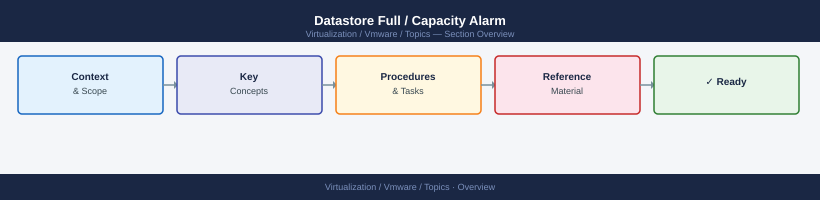

---
tags:
  - scenarios
  - vmware
---
# Datastore Full / Capacity Alarm

<div class="kb-summary">
A full datastore stops VMs from writing to disk — they pause or crash within seconds of the
datastore becoming completely full. On vSAN, the write-stop threshold is 80% capacity, not 100%.
Snapshots are the most common cause of sudden unexpected capacity consumption. This scenario covers
finding what is consuming space, recovering quickly, and setting up proactive capacity monitoring
to prevent recurrence.

*Applies to: vSphere 7.x / 8.x*
</div>



```d2
direction: right

center: "Scenarios" {shape: hexagon}
products_involved: "Products Involved" {shape: rectangle}
1_identify_the_alarm_and_affected_da: "1. Identify the Alarm and Affected Datastore" {shape: rectangle}
2_check_what_is_consuming_space: "2. Check What Is Consuming Space" {shape: rectangle}
3_find_large_snapshots_powercli: "3. Find Large Snapshots — PowerCLI" {shape: rectangle}
4_find_orphaned_vmdks_on_the_datasto: "4. Find Orphaned VMDKs on the Datastore" {shape: rectangle}
5_expand_capacity_or_storage_vmotion: "5. Expand Capacity or Storage vMotion VMs" {shape: rectangle}

center -> products_involved
center -> 1_identify_the_alarm_and_affected_da
center -> 2_check_what_is_consuming_space
center -> 3_find_large_snapshots_powercli
center -> 4_find_orphaned_vmdks_on_the_datasto
center -> 5_expand_capacity_or_storage_vmotion
```

## Products Involved

| Product | Role in This Scenario |
|---|---|
| vCenter | Datastore capacity alarm; snapshot management; VMDK inventory |
| vSAN | vSAN-specific 80% write-stop threshold; SPBM policy compliance |
| ESXi | Direct filesystem access for orphan detection; snapshot delta file location |
| Aria Operations | Capacity trending, "Days Remaining to Full" projection, historical growth rate |

---

## 1. Identify the Alarm and Affected Datastore

Sort vCenter → **Storage** → **Datastores** by **Free Space** ascending to find the problem datastore; for vSAN use Cluster → **Monitor** → **vSAN** → **Capacity**.

vSAN write-stop thresholds (default):

| Capacity used | vSAN behaviour |
|---|---|
| < 70% | Normal operation |
| 70% | Warning alarm fires |
| 80% | vSAN stops accepting new write I/O — VMs pause immediately |
| 80%+ | No new VMs can be created; no snapshot creation possible |

Look for: vSAN above 80% = urgent; proceed directly to Step 3 to remove snapshots as the fastest path to recovering write I/O.

---

## 2. Check What Is Consuming Space

Identify the cause before taking action — in order of frequency:

1. **Snapshots** — snapshot delta files (.vmdk-delta) grow with every write to the VM while
   the snapshot exists. A busy VM can generate tens of GB per hour in delta files.
2. **Thin-provisioned VMDKs inflating** — thin disks start small and grow as data is written.
   A VM that was thin-provisioned at 100 GB can reach 100 GB of actual allocation over time.
3. **Orphaned VMDKs** — VMDK files left on the datastore from deleted or migrated VMs with no
   corresponding VM record in vCenter.
4. **Thick-provisioned VMDKs** — thick-eager VMDKs consume their full allocation immediately on
   creation. A recently provisioned thick VM consumes space whether the guest OS is using it
   or not.

---

## 3. Find Large Snapshots — PowerCLI

Snapshots are the fastest path to recovering space — confirm with the VM owner before deleting, but treat any snapshot older than your retention policy (typically 7 days) as a removal candidate.

```powershell
# Find all snapshots, sorted by size descending — top 20
Get-VM | Get-Snapshot | `
  Select-Object VM, Name, SizeMB, Created | `
  Sort-Object SizeMB -Descending | `
  Select-Object -First 20
```

```powershell
# Find snapshots older than 7 days across all VMs
Get-VM | Get-Snapshot | Where-Object {$_.Created -lt (Get-Date).AddDays(-7)} | `
  Select-Object VM, Name, SizeMB, Created | Sort-Object Created
```

```powershell
# Remove a specific VM's stale snapshots (confirm with owner first)
Get-VM "vm-name" | Get-Snapshot | `
  Where-Object {$_.Created -lt (Get-Date).AddDays(-7)} | `
  Remove-Snapshot -Confirm:$false
```

Look for: snapshots older than 7 days or with SizeMB > 10,000 as priority targets.

Note: consolidation needs free space equal to the delta size — if the datastore is completely full, svMotion one VM off first, then consolidate.

---

## 4. Find Orphaned VMDKs on the Datastore

Orphaned VMDKs have no corresponding VM in vCenter — safe to remove but must be confirmed carefully before deletion.

```bash
# SSH to ESXi host — list all VMDK files on a datastore
find /vmfs/volumes/<datastore-name>/ -name "*.vmdk" -not -name "*-flat.vmdk" | sort

# Find large delta files (snapshot deltas over 10 GB)
find /vmfs/volumes/<datastore-name>/ -name "*-delta.vmdk" -size +10G
```

Look for: VMDKs absent from every VM's **Edit Settings** → **Hard Disk** list and not a system snapshot = orphan candidate.

**Never delete a VMDK directly without confirming it has no vCenter registration.** If in doubt, move it to a holding folder and monitor for 72 hours before deletion.

---

## 5. Expand Capacity or Storage vMotion VMs

If removing snapshots and orphans is not enough, move VMs or add capacity:

```powershell
# Move a VM's storage to a different datastore (no downtime)
Move-VM -VM "vm-name" -Datastore "target-datastore" -DiskStorageFormat Thin
```

For vSAN: add a host or additional disk capacity — new capacity is available immediately after the disk group rebuilds.

---

## 6. vSAN SPBM Policy Compliance

When capacity drops below what SPBM requires (e.g., FTT=1 needs space for two copies), vSAN marks affected VMs **Non-Compliant** — check via vCenter → Cluster → **Monitor** → **vSAN** → **Virtual Objects** → filter **Non-Compliant**.

Look for: Non-Compliant VMs; compliance resolves automatically once capacity is recovered — no manual policy reapplication is needed.

---

## 7. Aria Ops Capacity Trending — Get Ahead of the Next Alarm

After recovering space, project the next fill date: Aria Operations → **Capacity** → **vSAN Cluster** → **Time Remaining**.

Look for: Days Remaining to Full under 30 = expansion request; under 7 = urgent incident.

```bash
# Aria Ops REST API — get capacity remaining for a specific resource
curl -sk -X GET \
  "https://ariaops.domain.local/suite-api/api/resources/<resource-uuid>/stats?statKey=summary|capacity_remaining" \
  -H "Authorization: Bearer <token>" \
  | jq '.values[].statList.stat[] | {timestamp: .timestamps[], value: .data[]}'
```

Set proactive thresholds: vCenter → **Cluster** → **Monitor** → **vSAN** → **Configure** → **Advanced Options** — set warning to 60% and error to 70% for production clusters, giving lead time before the 80% write-stop.

---

## Common Mistakes

- **Deleting snapshots without notifying the VM owner.** Snapshots are often taken deliberately
  before patching or application changes. Deleting them without warning removes the rollback
  option while the change window is still open.
- **Not checking Aria Ops trends before the alarm fires.** Capacity issues are predictable.
  A datastore growing at a consistent rate will hit 80% at a calculable date. Aria Ops shows this
  — use it proactively rather than reactively.
- **Letting vSAN hit 80%.** At 80%, write operations stop and VMs pause immediately. There is no
  grace period. Production clusters should never exceed 70% under normal operating conditions.
- **Attempting snapshot consolidation when the datastore is completely full.** Consolidation
  needs working space. Free a few GB first (Storage vMotion one VM off the datastore), then
  consolidate.

---

## Key Terms

| Term | Definition |
|---|---|
| vSAN datastore | The single logical datastore per vSAN cluster; backed by the distributed object storage across all cluster hosts rather than a shared array |
| SPBM (Storage Policy-Based Management) | The vSphere framework that assigns storage requirements (FTT, stripe width, cache reservation) to VMs as a named policy; vSAN enforces these requirements per object |
| Thin provisioning | A disk allocation method where a VMDK occupies only the space actually written by the guest OS, growing up to its configured maximum over time |
| Snapshot delta | A `-delta.vmdk` file that accumulates all writes to a VM while a snapshot is active; grows at the VM's write rate and can consume tens of GB per hour for busy VMs |
| VMDK | Virtual Machine Disk — the file format used to store a VM's guest OS disk on the datastore; each virtual disk appears as one or more `.vmdk` files on the datastore |
| Slack space | The free capacity reserved in a vSAN cluster for object rebuilds, resync operations, and policy re-compliance; vSAN stops writes at 80% to preserve sufficient slack |
| FTT | Failures to Tolerate — the SPBM parameter specifying how many host, disk, or site failures a VM's storage can withstand; FTT=1 requires capacity for 2 full copies |
| Policy compliance | Whether a VM's actual storage configuration meets its assigned SPBM policy; drops to Non-Compliant when there is insufficient capacity to maintain the required number of copies |
| svMotion | Storage vMotion — live migration of a VM's VMDK files from one datastore to another with no guest OS downtime; used here to free space on the full datastore |
| Aria Ops capacity | The Aria Operations capacity analytics module that tracks historical growth and projects Days Remaining to Full for each datastore or vSAN cluster |
| Orphaned VMDK | A VMDK file present on the datastore filesystem with no corresponding VM registration in vCenter; left behind by deleted or improperly migrated VMs |
| vSAN capacity threshold (70%/80%) | The two built-in vSAN capacity watermarks — 70% fires a warning alarm; 80% immediately stops all write I/O to protect cluster integrity |

---

## Related Scenarios

- [vSAN Stretched Cluster Split-Brain](vsan-stretched-cluster-split-brain/index.md) — vSAN resync after a partition consumes capacity; a near-full cluster can hit write-stop during resync.
- [SRM Replication Lag / RPO Violation](srm-replication-lag-rpo-violation/index.md) — Full datastores on the DR site prevent vSphere Replication from writing replicated data, causing RPO violations.
- [Aria Ops Alert Storm](aria-ops-alert-storm/index.md) — Datastore alarms often appear as part of a larger alert storm triggered by sudden snapshot growth or VM provisioning events.
