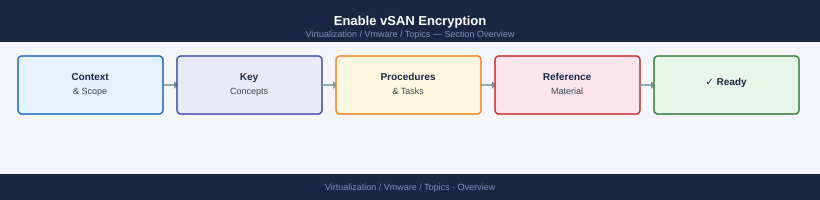

---
tags:
  - scenarios
  - vmware
  - vsan
  - vsphere-8
---
# Enable vSAN Encryption

<div class="kb-summary">
Enabling vSAN data-at-rest encryption triggers a full rebuild of the entire vSAN datastore. Every
object on every disk is re-encrypted end-to-end. On a large cluster this takes hours to days and
must not be interrupted. The key provider must be configured and backed up before starting — losing
the key means losing access to all encrypted data. Plan for a dedicated maintenance window and
ensure the cluster has at least 30% free space before enabling.

*Applies to: vSphere 7.x / 8.x*
</div>



!!! warning "Full data rebuild required"
    Enabling or disabling vSAN encryption triggers a full data migration across all disk groups. This can take hours on large clusters. Do not proceed without confirming available capacity and a tested rollback snapshot of vCenter.
## Products Involved

| Product | Role in This Scenario |
|---|---|
| vSAN | Applies data-at-rest encryption to all objects; manages the rebuild process |
| vCenter Server | Cluster configuration entry point; hosts Key Provider management UI |
| Native Key Provider (NKP) | vCenter-managed key provider — no external KMS required; keys stored in vCenter DB |
| External KMS | Third-party key management server (KMIP protocol) for FIPS/compliance environments |
| ESXi | Executes the encryption I/O on each host's disk groups during the rebuild |

---

## 1. Choose the Key Provider

Select NKP for general use or an external KMS only when FIPS compliance or independent key management is a hard requirement.

| Option | When to use | Dependency |
|---|---|---|
| Native Key Provider (NKP) | General use — simplest setup; keys managed by vCenter | vCenter must be healthy at all times to decrypt data |
| External KMS | FIPS 140-2 compliance, KMIP standard required, or key management must be separate from VMware | Dedicated KMS appliance required; must be highly available |

If unsure: use NKP. The external KMS path adds operational complexity (KMS HA, certificate management, firewall rules) that is only warranted for specific compliance requirements.

---

## 2. Configure Native Key Provider (NKP)

Create the NKP in vCenter, then immediately export and store the backup — losing the key means losing access to all encrypted data permanently.

vCenter → select the vSAN cluster → **Configure** → **Key Providers** → **Add** → **Native Key Provider** → name it (e.g., `vSAN-NKP-prod`).

vCenter → **Key Providers** → select the NKP → **Back Up** → set a strong password → download the file.

Store the backup:

- **Not on the vCenter VM** — if vCenter is lost, you cannot access the backup
- **Not on the vSAN datastore** — if encryption is the problem, the datastore may be inaccessible
- **On an offline secure medium** — USB drive or file share outside the VMware environment, access restricted to backup administrators

Expected: backup file downloaded and stored off-system before proceeding to the next step.

---

## 3. Configure External KMS (If Using External)

Add the KMS server to vCenter and verify connectivity before proceeding — the Test Connection check must return green.

vCenter → select the cluster → **Configure** → **Key Providers** → **Add** → **Standard Key Provider**.

```bash
# Verify KMS port is reachable from vCenter appliance shell
nc -zv <kms-server-ip> 5696
```

Expected: connection succeeds on TCP 5696 (KMIP standard port). Import the KMS TLS certificate into vCenter to establish trust. If the KMS is clustered, add both nodes — vCenter uses the first available.

---

## 4. Pre-Encryption Checks

Confirm all five requirements are met before enabling encryption — the rebuild cannot be paused once started.

```powershell
# Check vSAN cluster health — all tests must be green
Get-VsanView -Id "VsanVcClusterHealthSystem-vsan-cluster-health-system" | `
  Select -ExpandProperty OverallHealth

# Check current vSAN capacity — need at least 30% free before starting
Get-Datastore "vsanDatastore" | Select Name, FreeSpaceGB, CapacityGB
```

```bash
# Check resync queue — must be 0 before enabling encryption
esxcli vsan debug resync summary get
```

| Check | Requirement |
|---|---|
| vSAN Skyline Health | All tests green — no warnings or errors |
| vSAN resync queue | 0 bytes remaining |
| vSAN free space | At least 30% free (rebuild requires scratch space for re-encryption) |
| Key provider status | Connected and tested (green) |
| Cluster hosts | All hosts connected — no hosts in maintenance mode |

---

## 5. Enable Encryption

Enable data-at-rest encryption via the cluster vSAN configuration — a full rebuild begins immediately on all hosts.

vCenter → select the vSAN cluster → **Configure** → **vSAN** → **Services** → **Data-At-Rest Encryption** → **Edit** → toggle **Encryption** enabled → select the Key Provider → **Apply**.

Expected: vCenter displays a warning that the rebuild cannot be paused — confirm to proceed. All VMs continue running during the rebuild, but no other storage maintenance should be performed concurrently.

---

## 6. Monitor the Rebuild

Monitor the resyncing objects queue until it reaches 0 — do not perform any storage maintenance operations while the rebuild is in progress.

```bash
esxcli vsan debug resync summary get
```

Also monitor: vCenter → **vSAN** → **Monitor** → **Resyncing Objects** (updates every few minutes).

Reference rebuild times:

| Cluster used capacity | Approximate rebuild time |
|---|---|
| 1 TB | 1-3 hours |
| 5 TB | 4-10 hours |
| 10 TB | 8-24 hours |
| 50 TB+ | Multiple days |

During the rebuild, do not: put any host in maintenance mode, add or remove disks, run policy changes on large VMs, or run svMotion on large VMDKs. Any concurrent resync operation extends rebuild time and may stall the rebuild entirely.

---

## 7. Verify Encryption Status After Rebuild

Once the resync queue reaches 0, confirm encryption is active and vSAN health is all green.

```bash
esxcli vsan debug object list | grep -i encrypt
esxcli vsan encryption get
```

```powershell
Get-VsanView -Id "VsanVcClusterHealthSystem-vsan-cluster-health-system" | `
  Select -ExpandProperty OverallHealth
```

Expected: vCenter → **Cluster** → **Configure** → **vSAN** → **Services** → **Data-At-Rest Encryption** shows **Enabled** with key provider status **Active**, and all Skyline Health tests return green.

---

## 8. Post-Encryption Key Backup

Export a fresh NKP backup now that encryption is active — this replaces the pre-encryption backup and captures the key in its current in-use state.

vCenter → **Key Providers** → select the NKP → **Back Up** → download and store per the guidance in Step 2.

Expected: backup file labelled with date and cluster name, stored off-system. Establish a schedule to refresh the backup whenever the key is rotated.

---

## Post-Task Validation

| Check | Location | Expected Result |
|---|---|---|
| Encryption status | vCenter → Cluster → vSAN → Services | Enabled, key provider Active |
| vSAN Skyline Health | vCenter → Cluster → vSAN → Skyline Health | All tests green |
| Resync queue | `esxcli vsan debug resync summary get` | 0 bytes remaining |
| Key provider connectivity | vCenter → Key Providers | Connected, no errors |
| NKP backup stored | Offline secure storage | Post-encryption backup saved |
| vSAN free space | vCenter → Datastore | Within normal range (no unexpected consumption) |

---

## Common Mistakes

- **Starting encryption without 30% free space.** The rebuild requires scratch space to create
  re-encrypted copies of objects before removing the originals. If space runs out mid-rebuild, the
  cluster enters a critically degraded state that requires emergency intervention to resolve.
- **Not backing up the NKP before enabling encryption.** If vCenter is lost before the backup is
  taken and the NKP key is gone, all encrypted data is permanently unrecoverable.
- **Interrupting the rebuild by putting a host in maintenance mode.** Entering maintenance mode
  during the encryption rebuild causes objects on that host's disk group to become temporarily
  inaccessible. In a stretched cluster or a cluster already at minimum fault tolerance, this causes
  VM unavailability.
- **Using vSAN encryption when VM encryption was actually needed.** vSAN encryption protects data
  at rest on the disk — it does not encrypt data in memory or in transit. If the requirement is to
  encrypt specific VMs independently (for multi-tenancy or compliance per-VM), use VM Encryption
  Storage Policy instead of vSAN cluster-level encryption.

---

---

## Key Terms

| Term | Definition |
|---|---|
| NKP | Native Key Provider — a vCenter-managed key provider introduced in vSphere 7.0 U2 that stores encryption keys in the vCenter database; no external KMS appliance required |
| KMS | Key Management Server — an external appliance that stores and serves encryption keys to vCenter via the KMIP protocol; required for FIPS-compliant environments |
| KMIP | Key Management Interoperability Protocol — the OASIS standard protocol (default port TCP 5696) used for communication between vCenter and an external KMS |
| FIPS | Federal Information Processing Standard — US government cryptographic standard (FIPS 140-2) that mandates specific approved algorithms and independent key management; requires an external KMS, not NKP |
| Data-at-rest encryption | Encryption applied to data stored on disk so that physically removed drives cannot be read without the key; vSAN data-at-rest encryption protects all objects on all disk groups in the cluster |
| vSAN full rebuild | The process triggered by enabling vSAN encryption where every object is re-encrypted on disk end-to-end; all data is read, encrypted, and written back — cannot be paused once started |
| SPBM encryption policy | A storage policy that includes an encryption rule, applied per-VM to enforce VM Encryption at the VMDK level; separate from and not a substitute for vSAN cluster-level encryption |
| VM Encryption | A per-VM encryption feature (distinct from vSAN encryption) that encrypts VM home files and VMDKs individually via a storage policy; used when per-VM key isolation is required |
| Key backup | The password-protected export of the NKP or KMS credentials used to recover encrypted data if vCenter is rebuilt; must be stored offline, not on the vSAN datastore or vCenter VM |
| Resync queue | The set of vSAN object components that need to be rebuilt or relocated; must be 0 before enabling encryption and is monitored throughout the rebuild to track progress |
| vSAN slack space | The free capacity vSAN reserves for rebuild operations; at least 30% free space is required before enabling encryption so the rebuild has room to create re-encrypted copies before removing originals |
| vCenter Key Provider | The umbrella vCenter feature that manages both NKP and external KMS configurations; accessed at cluster level under Configure → Key Providers |

## Related Scenarios

- Host Maintenance and Patching
- vSAN Disk or Component Failure
- Storage vMotion / Datastore Migration
- Capacity Planning

---

## See also

- [vSAN Cluster Health — Internals](../../internals/vsan-cluster-health/)
- [vSAN — Security](../../vsan/security/)
- [vSAN — Operations](../../vsan/operations/)
