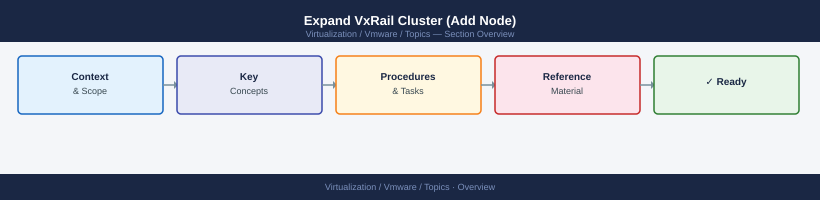

---
tags:
  - scenarios
  - vmware
  - vxrail
---
# Expand VxRail Cluster (Add Node)

<div class="kb-summary">
Adding a node to a VxRail cluster is done exclusively through VxRail Manager — never manually
through vCenter. VxRail Manager validates firmware, enforces the bundle version, and orchestrates
the full join sequence: network configuration, vSAN disk claim, NSX transport node registration,
and vCenter cluster join. Bypassing VxRail Manager causes firmware mismatches that break future
LCM upgrades and voids the support configuration.

*Applies to: vSphere 7.x / 8.x*
</div>



## Products Involved

| Product | Role in This Scenario |
|---|---|
| VxRail Manager | Expansion wizard — the only supported entry point for adding a node |
| vCenter Server | Receives the new node into the cluster; hosts the OMIVV plugin |
| vSAN | Automatically claims disks on the new node; rebalances data post-expansion |
| NSX | Transport node registration performed by VxRail Manager during expansion |
| iDRAC | Out-of-band management; node readiness verification before expansion |
| OMIVV (OpenManage Integration) | Hardware inventory and health visibility post-join |

---

## 1. Hardware Pre-Checks and iDRAC

Rack and cable the new node identically to existing nodes, then assign the iDRAC IP via the DCUI and confirm hardware health before proceeding.

```bash
# Confirm iDRAC is reachable on the management network
ping <new-node-idrac-ip>
```

Expected: iDRAC web UI accessible at `https://<idrac-ip>` with all PSUs present, no drive faults, and BIOS POST completed. Do not proceed if iDRAC shows hardware faults. Default credentials: root / Calvin — change immediately after expansion.

---

## 2. Network Pre-Checks

Verify layer-2 connectivity on all required VLANs and confirm DNS A+PTR records are created before starting the expansion wizard.

| Network | MTU requirement | Verification |
|---|---|---|
| Management | 1500 | ping from jump host to management network gateway |
| vMotion | 1500 or 9000 (match cluster) | check switch port VLAN assignment |
| vSAN | 9000 (jumbo frames required) | MTU configured on switch port and VDS |

```bash
# Verify DNS from the VxRail Manager VM or jump host
nslookup new-node-hostname.domain.local
nslookup <new-node-management-ip>
```

Expected: both directions resolve correctly. VxRail Manager validates the FQDN during the wizard and will fail if either record is missing.

---

## 3. Discover the New Node in VxRail Manager

Trigger node discovery to confirm the new node is visible on the management network before running the expansion wizard.

VxRail Manager → **Cluster Expansion** → **Discover Nodes**.

If the node does not appear:

| Symptom | Likely cause |
|---|---|
| Node not visible in discovery | Management VLAN not reaching the node |
| Node appears but shows error | Factory ESXi boot failed — check iDRAC for POST errors |
| Duplicate node found | Node was previously partially configured — factory reset required |

---

## 4. Run the Expansion Wizard

Select the discovered node and click **Next**, then supply the four required network values — all pre-checks must pass before expansion begins.

- **Management IP** — new node's management VMkernel IP
- **vMotion IP** — new node's vMotion VMkernel IP
- **vSAN IP** — new node's vSAN VMkernel IP
- **Hostname** — FQDN that matches the pre-created DNS records

Common pre-check failures:

| Pre-check failure | Resolution |
|---|---|
| DNS validation failed | Create or fix A+PTR records |
| Network connectivity failed | Check VLAN assignment on switch port |
| Firmware bundle mismatch | VxRail Manager will auto-update — allow extra time |
| Existing cluster health not green | Resolve vSAN or host issues before expanding |

---

## 5. Firmware Bundle Check and Update

VxRail Manager automatically compares the new node's firmware against the cluster's LCM bundle and updates any mismatched component — no manual action required.

A full firmware update pass typically takes 30–60 minutes and involves a node reboot. Do not power off the node or disconnect cables during this phase.

---

## 6. Expansion Runs Automatically

After wizard confirmation, VxRail Manager runs the full join sequence without further input — monitor progress in VxRail Manager → **Cluster Expansion** → **Status**.

1. Applies firmware (if required)
2. Configures ESXi: hostname, management IP, VMkernel ports
3. Joins the node to the vCenter cluster
4. Deploys the HA agent on the new node
5. Configures the NSX transport node (if NSX is deployed on the cluster)
6. Claims vSAN disks and creates a disk group on the new node

Expected: VxRail Manager reports expansion complete within 45–90 minutes.

---

## 7. vSAN Rebalance Monitoring

Monitor the automatic vSAN rebalance until 0 bytes remain — do not put any host in maintenance mode while it is in progress.

vCenter → **vSAN** → **Monitor** → **Resyncing Objects**.

```powershell
# Check resyncing state via PowerCLI
Get-VsanView -Id "VsanVcClusterHealthSystem-vsan-cluster-health-system"

# Verify the new host's disk group is present and healthy
Get-VMHost "new-node.domain.local" | Get-VsanDiskGroup
```

Expected: resyncing objects count reaches 0 and the new node's disk group shows all disks healthy.

---

## 8. OMIVV Hardware Inventory Verification

Confirm the new node appears in OMIVV after expansion — allow 10–15 minutes for automatic discovery, then trigger a manual scan if needed.

vCenter → **Menu** → **Dell** → **OpenManage Integration for VMware vCenter** → **Infrastructure Overview**.

If the node does not appear: OMIVV → **Settings** → **Discovery** → **Run Discovery**.

```powershell
# Confirm new host appears in vCenter cluster
Get-Cluster "vxrail-cluster" | Get-VMHost | Select Name, ConnectionState, Version

# Confirm vSAN disk group on new node
Get-VMHost "new-node.domain.local" | Get-VsanDiskGroup
```

Expected: new node visible in OMIVV infrastructure overview and disk group showing healthy.

---

## Post-Task Validation

| Check | Expected Result |
|---|---|
| New node in vCenter cluster | Connected, PoweredOn |
| vSAN disk group on new node | All disks claimed, disk group healthy |
| vSAN rebalance complete | 0 bytes resyncing |
| NSX transport node status | Configured / Success (green) |
| OMIVV hardware inventory | New node visible in Infrastructure Overview |
| iDRAC default password changed | Not root / Calvin |
| LCM bundle version | New node matches cluster bundle version |

---

## Common Mistakes

- **Adding the node to vCenter directly instead of through VxRail Manager.** The node joins the
  cluster but firmware and driver versions are not validated. Future VxRail Manager LCM upgrades
  will fail because the node is outside the managed bundle.
- **Not pre-creating DNS A and PTR records.** The expansion wizard validates the FQDN before
  committing. A missing DNS record causes wizard failure after the firmware update phase has already
  run, resulting in a partially configured node.
- **Checking vSAN rebalance before expansion fully completes.** The resyncing objects count shows
  partial data during expansion. Wait for VxRail Manager to report expansion complete before
  interpreting vSAN resync metrics.
- **Leaving iDRAC on default credentials.** The default root/Calvin credential is publicly known.
  Change it immediately after expansion.

---

---

## Key Terms

| Term | Definition |
|---|---|
| VxRail Manager | Dell's appliance lifecycle management service that orchestrates VxRail cluster operations — the only supported entry point for adding nodes, running upgrades, and managing the hardware-software bundle |
| iDRAC | Integrated Dell Remote Access Controller — out-of-band management interface used throughout expansion for hardware health checks, console access, and firmware visibility independent of ESXi |
| OMIVV | OpenManage Integration for VMware vCenter — Dell plugin that surfaces hardware health and firmware inventory for VxRail nodes directly inside the vCenter UI |
| vSAN rebalance | Automatic background process triggered when a new node joins a vSAN cluster; redistributes object components across all nodes to use the new capacity evenly |
| Node discovery | VxRail Manager's scan of the management network broadcast domain to find unconfigured VxRail nodes; nodes must be factory-state (not previously configured) to appear in discovery |
| LCM bundle | The validated firmware-driver-ESXi combination for a specific VxRail hardware generation; VxRail Manager enforces bundle version consistency across all nodes in the cluster |
| TEP | Tunnel Endpoint — VMkernel port created by NSX on each transport node to carry GENEVE-encapsulated east-west overlay traffic between hosts |
| Firmware bundle | The collection of BIOS, HBA, NIC, and iDRAC firmware versions that VxRail Manager applies during node expansion to bring a new node up to the cluster's current LCM bundle level |
| GENEVE | Generic Network Virtualization Encapsulation — the overlay protocol NSX uses to encapsulate VM traffic between TEP endpoints across the physical network underlay |
| vSAN disk group | One cache disk plus one or more capacity disks on a single host; created automatically by VxRail Manager on the new node during expansion |
| mystic account | The local service account on VxRail nodes used by VxRail Manager for internal orchestration; not a user-accessible account — any changes to it break VxRail Manager communication |

## Related Scenarios

- Add ESXi Host to Cluster
- Host Maintenance and Patching
- VxRail LCM Upgrade Failure
- vSAN Disk or Component Failure
