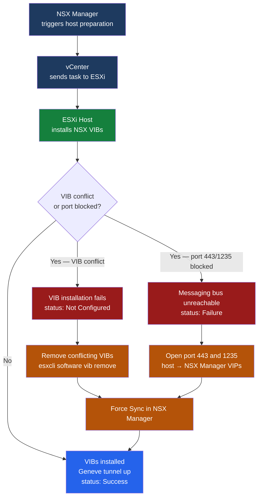

---
tags:
  - nsx
  - nsx-4
  - scenarios
  - vmware
---
# NSX Transport Node Preparation Failed

<div class="kb-summary">
During NSX host preparation, the transport node transitions to Failed state and the host does not join
the NSX fabric. This scenario covers reading the exact error from NSX Manager, removing conflicting
NSX-V VIBs or stale NSX-T state, validating port reachability between the host and NSX Manager, and
retrying preparation cleanly. A staged rollout process prevents cascading failures across an entire
host cluster.
</div>



## Symptoms

| Indicator | Detail |
|---|---|
| NSX Manager UI | `System → Fabric → Hosts → <host>` shows Configuration Status = `Failed` or `Not Configured` |
| NSX Manager UI | Error banner visible on transport node detail page with error code and message |
| Missing VIBs | `esxcli software vib list` on host does not show `nsx-aggservice`, `nsx-context-mux`, etc. |
| ESXi log | `/var/log/esxupdate.log` contains VIB installation error messages |
| NSX syslog | `/var/log/nsx/nsx-syslog.log` shows connection refused or timeout to NSX Manager |

---

## 1. Read the Exact Error from NSX Manager

Navigate to: **NSX Manager → System → Fabric → Hosts → `<host-name>`**

Expand the **Errors** accordion. Note:

- Error code (e.g., `10020`, `10044`)
- Full message text — do not dismiss until you have copied it
- Timestamp — cross-reference with `/var/log/esxupdate.log` on the host

Common error patterns:

```text
Error 10020: VIB install failed: incompatible VIBs present
Error 10044: Unable to establish message bus connection to NSX Manager
Error 10012: Host acceptance level too restrictive for partner VIBs
```

---

## 2. Check for Conflicting VIBs

SSH to the affected ESXi host:

```bash
# Check for stale NSX-V VIBs (block NSX-T installation)
esxcli software vib list | grep -iE "esx-vsip|esx-vxlan|vmware-nsx"

# Check for partial NSX-T VIBs (failed mid-install)
esxcli software vib list | grep -i nsx
```

NSX-V VIBs (`esx-vsip`, `esx-vxlan`) are incompatible with NSX-T and must be removed before retrying.

---

## 3. Verify Host Acceptance Level

```bash
esxcli software acceptance get
```

NSX-T VIBs are `PartnerSupported` — the host acceptance level must be `PartnerSupported` or lower
(i.e., `CommunitySupported`). If the host is set to `VMwareCertified` or `VMwareAccepted`, NSX VIBs
will be rejected:

```bash
esxcli software acceptance set --level PartnerSupported
```

---

## 4. Verify Port Reachability

From the ESXi host, confirm both required ports reach NSX Manager:

```bash
# Port 443 — NSX Manager API and VIB download
nc -z <nsx-manager-vip> 443
esxcli network diag ping -H <nsx-manager-vip> -I vmk0 -c 4

# Port 1235 — NSX messaging bus (host to NSX Manager)
nc -z <nsx-manager-vip> 1235
```

If `nc` is unavailable on the ESXi host, check from a jump host on the same management network. Any
failure here points to a firewall or routing issue rather than a VIB conflict.

---

## 5. Check esxupdate.log for VIB Install Errors

```bash
grep -iE "error|fail|conflict|reject" /var/log/esxupdate.log | tail -40
```

Representative failure entries:

```text
2026-06-11T03:10:05Z esxupdate: ERROR: VIB esx-vsip conflicts with nsx-aggservice
2026-06-11T03:10:06Z esxupdate: ERROR: Installation aborted; rollback initiated
2026-06-11T03:15:22Z esxupdate: ERROR: Package download from <nsx-mgr>:443 timed out after 30s
```

---

## 6. Resolution

### Remove Conflicting NSX-V VIBs

Put the host into maintenance mode first if VMs are running:

```bash
# Via PowerCLI
Set-VMHost -VMHost <host-fqdn> -State Maintenance

# Via ESXi CLI (if vCenter unreachable)
esxcli system maintenanceMode set --enable true
```

Remove NSX-V VIBs:

```bash
esxcli software vib remove -n esx-vsip -n esx-vxlan --maintenance-mode
```

### Remove Stale NSX-T VIBs (Partial Install)

If a previous preparation attempt left partial NSX-T VIBs:

```bash
esxcli software vib remove \
  -n nsx-aggservice \
  -n nsx-context-mux \
  -n nsx-exporter \
  -n nsx-sfhc \
  --maintenance-mode
```

After removal, reboot the host to clear any loaded kernel modules:

```bash
reboot
```

### Return Host to Normal Mode and Retry Preparation

```bash
esxcli system maintenanceMode set --enable false
```

In NSX Manager: **System → Fabric → Hosts → `<host>` → Actions → Force Sync**

Monitor the preparation task in NSX Manager — it typically completes within 5–10 minutes.

### Address VIB Version Mismatch

If the error indicates a version mismatch between the VIB bundle and NSX Manager:

1. Confirm NSX Manager version: **System → Appliances → `<manager>` → Version**
2. Check the [VMware NSX Compatibility Matrix](https://interopmatrix.vmware.com) for the correct ESXi
   host version.
3. Either upgrade NSX Manager to a version compatible with the host ESXi version, or patch the host to
   match the NSX compatibility requirement before retrying.

### Open Firewall Port 1235

If port 1235 is blocked between hosts and NSX Manager VIPs, add a firewall rule:

```text
Source: ESXi management VMkernel subnet
Destination: NSX Manager VIP (all three nodes if cluster)
Port: TCP 1235
Direction: Outbound from hosts
```

---

## 7. Verification

```bash
# Confirm NSX VIBs are installed on host
esxcli software vib list | grep -i nsx
```

Expected VIBs (version strings vary by NSX release):

```text
nsx-aggservice     <version>   Partner   PartnerSupported
nsx-context-mux   <version>   Partner   PartnerSupported
nsx-exporter       <version>   Partner   PartnerSupported
nsx-sfhc           <version>   Partner   PartnerSupported
nsx-ids            <version>   Partner   PartnerSupported
```

In NSX Manager, confirm:

- Transport node status = `Success` (green check icon)
- **Transport Nodes → `<host>` → BFD Status** = `Up` (Geneve tunnel established)

```bash
# Confirm TEP VMkernel adapter is present and has an IP
esxcli network ip interface list | grep -i tep
vmkping -I <tep-vmkernel> <peer-tep-ip> -c 4
```

---

## 8. Prevention

| Control | Implementation |
|---|---|
| Pre-check: VIB audit | Before NSX preparation, run `esxcli software vib list grep -i nsx` on all target hosts; confirm no NSX-V VIBs present |
| Compatibility matrix | Validate ESXi version against NSX compatibility matrix before beginning host preparation; pin ESXi baseline if needed |
| Staged rollout | Prepare one host, validate BFD tunnel and application connectivity, then proceed to remaining hosts in the cluster |
| Port validation | Include TCP 443 and 1235 reachability in the pre-work checklist for any NSX deployment or upgrade |
| Acceptance level | Set host acceptance level to `PartnerSupported` as a pre-requisite step in the runbook before triggering NSX preparation |

---

## Related Scenarios

- [NSX Connectivity Broken](nsx-connectivity-broken/index.md) — once hosts are prepared, this covers
  data-plane connectivity failures in the overlay network.
- [NSX DFW Blocking Application Traffic](nsx-dfw-blocking-application-traffic/index.md) — after
  successful preparation, DFW policy misconfigurations are a common next issue.
- [NSX Edge Failure / BGP Down](nsx-edge-failure-bgp-down/index.md) — edge node failures often
  surface after transport node preparation when edge nodes share host clusters.
