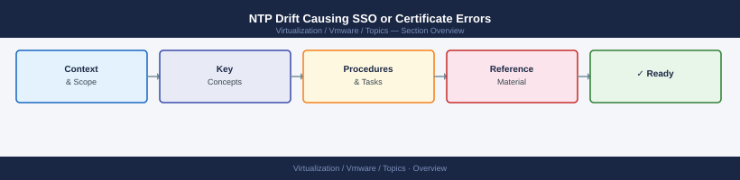

---
tags:
  - scenarios
  - vmware
---
# NTP Drift Causing SSO or Certificate Errors

<div class="kb-summary">
Time synchronisation failures across VMware products cause a cascade of symptoms: SSO login failures,
SSL handshake errors, vCenter showing hosts as "Not Responding", and vSAN health warnings. This scenario
covers identifying which components have drifted, correcting NTP on ESXi hosts, VCSA, and NSX Manager,
and recovering SSO and certificate services after time is fixed.

*Applies to: vSphere 7.x / 8.x*
</div>



## Products Involved

| Product | Role in This Scenario |
|---|---|
| ESXi | NTP client on each host; drift causes disconnection from vCenter and vSAN health warnings |
| vCenter VCSA | NTP client; SSO token validity and TLS certificates are time-bound |
| NSX Manager | NTP client; drift causes control plane instability and API authentication failures |
| Aria Operations | NTP client; metric gaps and false-positive alerts when time diverges from vCenter |
| vSAN | Uses timestamps for component reconciliation; "time divergence" health check flags skew |

---

## 1. Understand Why NTP Matters in VMware

Every VMware product validates time before accepting connections — the 60-second threshold comes from the SAML token validity window used by SSO.

| Mechanism | Time dependency | Symptom of drift |
|---|---|---|
| SSO tokens (SAML) | Token validity window is clock-based | "Token expired" at login even with correct credentials |
| TLS certificates | notBefore / notAfter fields are clock-checked | SSL handshake failure; "certificate not yet valid" |
| vSAN component heartbeats | Reconciliation uses timestamps | vSAN health "time divergence" warning; resync anomalies |

---

## 2. Check Time on vCenter VCSA

SSH to the VCSA and check current synchronisation state.

```bash
timedatectl status
chronyc tracking
```

Expected output:

```text
Reference ID    : 10.0.0.1 (ntp1.domain.local)
Stratum         : 3
System time     : 0.000123456 seconds fast of NTP time
Last offset     : +0.000234567 seconds
RMS offset      : 0.000345678 seconds
Frequency       : 12.345 ppm slow
Residual freq   : -0.001 ppm
Skew            : 0.012 ppm
Root delay      : 0.003456 seconds
Root dispersion : 0.001234 seconds
```

Look for: System time offset beyond ±60 seconds. An offset beyond ±300 seconds means chrony will not self-correct and `chronyc makestep` is required.

---

## 3. Check Time on ESXi Hosts

Check each ESXi host that vCenter reports as "Not Responding" or that shows vSAN time warnings.

```bash
esxcli system ntp get
ntpq -p
date
```

Expected `ntpq -p` output:

```text
     remote           refid      st t when poll reach   delay   offset  jitter
==============================================================================
*ntp1.domain.loca .GPS.            1 u   45   64  377    0.832   -0.245   0.187
+ntp2.domain.loca .GPS.            1 u   47   64  377    1.123    0.398   0.211
```

Look for: offset column beyond ±60,000 ms (60 seconds). The `*` prefix marks the currently selected NTP peer; if no peer has `*`, the host has no active time source.

---

## 4. Check Time on NSX Manager

SSH to NSX Manager (admin credentials) and check current time and NTP configuration.

```bash
get system clock
get ntp-server
```

Look for: system clock time matching vCenter within 60 seconds, and NTP servers matching the environment's authoritative sources.

---

## 5. Fix NTP on ESXi Hosts

Configure NTP and force an immediate sync on each drifted host.

```bash
esxcli system ntp set --enabled false
esxcli system ntp set --server ntp1.domain.local --server ntp2.domain.local
esxcli system ntp set --enabled true
ntpdate -u ntp1.domain.local
```

Confirm the fix:

```bash
ntpq -p
date
```

Repeat for every ESXi host in the cluster — NTP must be applied per host unless a Host Profile enforces it cluster-wide.

---

## 6. Fix NTP on VCSA

Configure NTP via VAMI (`https://vcenter-fqdn:5480` → **Time → Edit NTP Servers**) for persistence across reboots.

To fix immediately via SSH:

```bash
timedatectl set-ntp true
chronyc makestep
```

`chronyc makestep` forces an immediate step adjustment rather than the gradual slew — without this, SSL failures continue for minutes or hours while drift corrects naturally.

Confirm:

```bash
chronyc tracking
timedatectl status
```

---

## 7. Fix NTP on NSX Manager

SSH to NSX Manager and reconfigure NTP, then force synchronisation.

```bash
set ntp-server ntp1.domain.local
set ntp-server ntp2.domain.local
restart service ntpd
```

Verify:

```bash
get system clock
```

Look for: clock time within 60 seconds of vCenter after `ntpd` restarts.

---

## 8. Restart SSO After Time Is Fixed

If SSO token errors persist after NTP is corrected, stale tokens remain invalid until the STS service is restarted.

```bash
service-control --restart vmware-stsd
```

Wait 60–90 seconds after restart before attempting login — STS generates new signing keys on startup, which invalidates all cached tokens; this is expected behaviour.

---

## 9. Verify vSAN Time Skew Health Check

Re-run the vSAN health check after fixing NTP on all hosts to confirm the cluster is clean.

Navigate in vCenter to **Cluster → Monitor → vSAN → Skyline Health** and re-run the
**"vSAN cluster member hosts time divergence"** check.

If a host still fails after NTP is configured, force a sync:

```bash
ntpdate -u ntp1.domain.local
```

Then re-run the health check from vCenter.

---

## NTP Requirement Reference

| Product | Max Allowed Skew | Consequence of Drift |
|---|---|---|
| ESXi | 60 seconds from vCenter | Host disconnects from vCenter; vpxa SSL failure |
| vCenter VCSA | 60 seconds from all hosts | SSO tokens invalid; hosts show "Not Responding" |
| vSAN | 60 seconds between nodes | Component health warnings; resync anomalies |
| NSX Manager | 60 seconds from controllers | Control plane instability; API auth failures |
| Aria Operations | 60 seconds from vCenter | Metric collection gaps; false-positive alerts |

---

## Key Terms

| Term | Definition |
|---|---|
| NTP | Network Time Protocol — the standard protocol used to synchronise clocks across hosts, appliances, and network devices to a common time source |
| chronyc | Command-line client for the chrony NTP daemon used on the VCSA; `chronyc tracking` shows current offset and `chronyc makestep` forces an immediate clock correction |
| timedatectl | Linux systemd utility on the VCSA for displaying and configuring the system clock, NTP status, and timezone |
| SSO | Single Sign-On — VMware's authentication service that issues SAML tokens for all vSphere and NSX logins; token validity is clock-bound, so any time skew invalidates active sessions |
| STS | Security Token Service — the component within SSO (vmware-stsd) that generates and validates SAML tokens; must be restarted after large time corrections to clear stale in-memory token state |
| vmware-stsd | The systemd service name for the VMware Security Token Service on the VCSA; restarting it forces new signing key generation and clears invalid token caches |
| Time skew | The measured difference between a system's local clock and the NTP reference time; skew beyond 60 seconds breaks VMware TLS and SSO validation |
| ntpdate | Command-line tool used on ESXi hosts to force an immediate one-shot time synchronisation, bypassing the gradual correction that the NTP daemon applies |
| NTP stratum | A number indicating how many hops away a time source is from a hardware reference clock; stratum 1 = GPS/atomic clock, stratum 2 = synced to stratum 1; lower stratum = higher accuracy |
| Certificate validity window | The time range between a certificate's notBefore and notAfter fields; if the system clock is outside this window, TLS handshakes fail with "not yet valid" or "expired" errors |
| Aria Operations | VMware's observability and monitoring platform; also an NTP client — if its clock drifts, metric timestamps diverge from vCenter and trigger false-positive connectivity alerts |
| NSX Manager | The NSX control plane appliance that manages overlay networking and security policy; NTP drift on NSX Manager causes API authentication failures and control plane instability |

---

## Common Mistakes

- **Fixing NTP on vCenter but not on ESXi hosts.** vCenter and ESXi must both be synced. Fixing only
  one side does not resolve SSL handshake failures between them.
- **Not running `chronyc makestep` after configuring NTP on VCSA.** Without a forced step, chrony
  corrects large drift gradually over minutes or hours. Errors continue during the slew period.
- **Not restarting SSO after time is fixed.** Stale tokens in the SSO service memory remain invalid
  even after the clock is corrected. Restart `vmware-stsd` to clear them.
- **Applying NTP to only one ESXi host in the cluster.** vSAN time skew is measured between all
  cluster members. All hosts must be synced, not just the one flagged in the initial alert.

---

## Related Scenarios

- [ESXi Host Disconnected from vCenter](esxi-host-disconnected/index.md) — NTP drift is one of the
  silent causes of host disconnection covered in Step 7 of that scenario.
- [vCenter Down / Unreachable](vcenter-down/index.md) — if the VCSA itself has drifted severely,
  vpxd refuses to start and the full vCenter recovery procedure applies.
- [VxRail LCM Upgrade Failure](vxrail-lcm-upgrade-failure/index.md) — NTP skew is one of the
  pre-check failures that blocks a VxRail LCM upgrade from starting.
