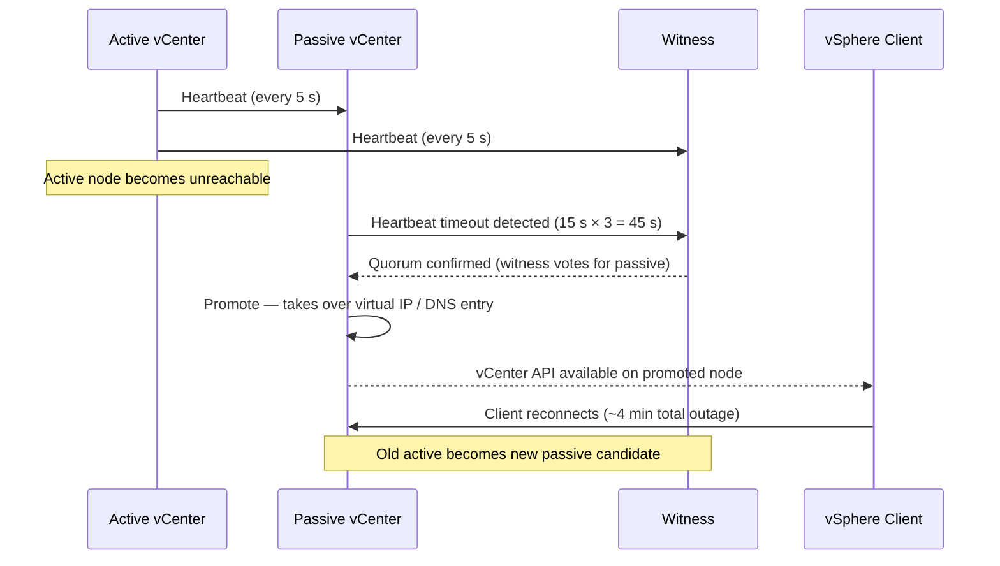

---
tags:
  - scenarios
  - vcenter
  - vmware
  - vsphere-8
---
# vCenter HA — Passive Node Failover

<div class="kb-summary">
The vCenter HA passive node is promoted to active after the active node becomes unreachable. Operators
observe a vSphere Client session drop lasting approximately 4 minutes, then a successful reconnect.
ESXi hosts and running VMs are unaffected — this is a control-plane event only. This scenario covers
confirming the failover completed cleanly, re-adding the old active as a new passive node, and handling
edge cases where VCHA gets stuck in Isolated state.

*Applies to: vSphere 7.x / 8.x*
</div>

```text
┌──────────────────────────────────── Virtualization Vmware Topics ─────────────────────────────────────┐
│                                                                                                       │
│   ┌───────────────────────────────────────────────────────────────────────────────────────────────┐   │
│   │                         Vmware: Virtualization Vmware Topics platform                         │   │
│   │                                  Protocols: Various protocols                                 │   │
│   │                  Management: Virtualization Vmware Topics management console                  │   │
│   │                Sections: Architecture · Operations · Security · Troubleshooting               │   │
│   └───────────────────────────────────────────────────────────────────────────────────────────────┘   │
│                                                                                                       │
│    Architecture → Operations → Security → Troubleshooting → Escalation                                │
│                                                                                                       │
│                  ▼                                ▼                                ▼                  │
│                                                                                                       │
│   ┌─────────────────────────────┐  ┌─────────────────────────────┐  ┌─────────────────────────────┐   │
│   │            Layer            │  │          Component          │  │            Notes            │   │
│   │             Core            │  │       Primary service       │  │        Main function        │   │
│   │          Management         │  │        Control plane        │  │         Admin access        │   │
│   │          Monitoring         │  │         Health/perf         │  │      Alerts/dashboards      │   │
│   │           Security          │  │         Auth/encrypt        │  │        Access control       │   │
│   │         Integration         │  │        APIs/plug-ins        │  │         Third-party         │   │
│   └─────────────────────────────┘  └─────────────────────────────┘  └─────────────────────────────┘   │
│                                                                                                       │
│                          ▼                                                 ▼                          │
│                                                                                                       │
│   ┌───────────────────────────────────────────────────────────────────────────────────────────────┐   │
│   │      Layer       │    Component     │      Function     │      Notes       │       Auth       │   │
│   │       Core       │ Primary service  │   Main function   │     See docs     │       RBAC       │   │
│   │    Management    │  Control plane   │    Admin access   │     See docs     │       RBAC       │   │
│   │    Monitoring    │   Health/perf    │  Alerts/dashboard │     See docs     │       RBAC       │   │
│   │     Security     │   Auth/encrypt   │   Access control  │     See docs     │       RBAC       │   │
│   └───────────────────────────────────────────────────────────────────────────────────────────────┘   │
│                                                                                                       │
│    Physical: Virtualization Vmware Topics infrastructure · management network · monitoring            │
│                                                                                                       │
│    Key terms:                                                                                         │
│                                                                                                       │
│    Vmware             = Virtualization Vmware Topics platform overview and core concepts              │
│    Management         = management console and command-line interface for administration              │
│    Monitoring         = health and performance monitoring dashboards and alerting                     │
│    Automation         = REST API, scripting, and pipeline integration capabilities                    │
│    Security           = access control, authentication, and encryption configuration                  │
│    Backup             = backup and recovery procedures and schedule configuration                     │
│    Upgrade            = software version upgrades and firmware patching procedures                    │
│    Troubleshooting    = diagnostic procedures and common issue resolution steps                       │
│    Escalation         = vendor support escalation path and severity triage process                    │
│    Documentation      = vendor knowledge base and official product documentation                      │
│    Change management  = change ticket requirements for production modifications                       │
│    Audit log          = admin action logging for compliance and security review                       │
│                                                                                                       │
└───────────────────────────────────────────────────────────────────────────────────────────────────────┘
```




## Symptoms

| Indicator | Detail |
|---|---|
| vSphere Client session drops | Browser shows "Service unavailable"; reconnect succeeds after ~4 min |
| VCHA status | "Passive node is primary" shown in vCenter HA cluster status panel |
| vCenter alarm | `vCenter High Availability state changed` fires on VCHA state transition |
| ESXi hosts | Hosts and VMs continue running normally — no VM impact during control-plane outage |
| DNS / VIP | Virtual IP (or DNS A-record) resolves to promoted passive node after failover |

---

## 1. Confirm VCHA State After Failover

### PowerCLI

```powershell
Connect-VIServer -Server <vcenter-fqdn>
Get-VchaState
```

Expected output after successful failover:

```text
ClusterState : HEALTHY
ActiveNode   : <former-passive-ip>
PassiveNode  : <former-active-ip>   # may show as "not connected" initially
WitnessNode  : <witness-ip>
```

### REST API

```bash
curl -sk -u administrator@vsphere.local:<password> \
  https://<vcenter-fqdn>/api/vcenter/vcha/cluster/active \
  -H "vmware-api-session-id: $(curl -sk -u administrator@vsphere.local:<password> \
    -X POST https://<vcenter-fqdn>/api/session | tr -d '"')"
```

Response field `state` must be `HEALTHY`; `active_node.ha_ip.ipv4.address` must show the promoted node IP.

---

## 2. Check vcha.log for Promotion Entry

SSH to the currently active (promoted) node:

```bash
ssh root@<promoted-vcenter-ip>
grep -i "Promotion complete" /var/log/vcha/vcha.log
grep -i "sync lag" /var/log/vcha/vcha.log | tail -20
```

Confirm the `Promotion complete` entry is present. The sync lag lines before failover must show lag was
below 60 seconds — if lag exceeded 60 s, inspect whether any DB transactions were lost.

```text
2026-06-11T03:42:17.123Z INFO vcha: Heartbeat timeout from active node (3 consecutive misses)
2026-06-11T03:42:17.124Z INFO vcha: Quorum reached — witness voted PASSIVE
2026-06-11T03:42:18.001Z INFO vcha: Promotion complete. Node role: ACTIVE
```

---

## 3. Verify DB Sync Lag Was Acceptable

```bash
grep -i "replication lag" /var/log/vcha/vcha.log | tail -30
```

Lag values below 30 s indicate a clean failover. Values between 30–60 s are acceptable but warrant
investigation. Values above 60 s indicate the passive may have missed recent transactions; check whether
any tasks or events appear missing from the vCenter inventory after reconnect.

---

## 4. Verify Witness Connectivity

From the promoted active node, ping the witness over the HA network:

```bash
ping -I vmk1 <witness-ha-ip> -c 5
```

Confirm packet loss = 0%. If the witness is unreachable, VCHA cannot perform automatic failover for
future failures — restore witness connectivity immediately.

---

## 5. Resolution Paths

### Clean Failover — Re-add Old Active as Passive

If the auto-failover completed without errors and the old active node is recoverable:

1. In vSphere Client: **vCenter HA → Configure → Add Node**.
2. Provide the old active's management IP and HA network IP.
3. VCHA re-syncs the DB to the rejoining node and places it in Passive role.
4. Allow sync to complete (monitor `/var/log/vcha/vcha.log` for `Sync complete` on the new passive).

### VCHA Stuck in "Isolated" State

If the VCHA cluster is stuck and neither node can determine quorum:

```bash
curl -sk -u administrator@vsphere.local:<password> \
  -X POST "https://<vcenter-fqdn>/api/vcenter/vcha/cluster?action=failover" \
  -H "Content-Type: application/json" \
  -d '{"planned": false}'
```

If `force` failover is required (witness unreachable, split-brain):

```bash
-d '{"planned": false, "force": true}'
```

The `force: true` flag bypasses witness quorum — use only when both nodes are healthy and witness
connectivity cannot be restored within the maintenance window.

### DB Sync Lag — Disk Space on Passive

If sync lag was high, check `/storage/db/` utilisation on the passive (now active) node:

```bash
df -h /storage/db
du -sh /storage/db/vpostgres/*
```

If near capacity, clear rotated logs:

```bash
find /storage/log -name "*.gz" -mtime +7 -delete
```

---

## 6. Verification

```powershell
# PowerCLI — confirm HEALTHY state
Get-VchaState | Select-Object ClusterState, ActiveNode, PassiveNode, WitnessNode

# Confirm both data nodes and witness are green
(Get-VchaState).ClusterState -eq "HEALTHY"
```

Optionally run a controlled test failover to confirm VCHA is fully operational:

```powershell
# UI: vCenter HA → Actions → Initiate Failover
# This returns to the original active node after a brief outage
Test-VchaFailover
```

Clear the vCenter alarm after confirming HEALTHY:
vSphere Client → **Alarms → vCenter High Availability state changed → Reset to Green**.

---

## 7. Prevention

| Control | Implementation |
|---|---|
| HA network isolation | Dedicated 1 GbE (minimum) or 10 GbE vNIC for VCHA replication; no routing hops between active and passive; VLAN separation from management |
| DB sync lag alerting | Monitor `replication lag` in vcha.log via syslog pipeline; alert if lag exceeds 30 s |
| Witness placement | Deploy witness in a third availability zone or physical site; never co-locate witness with active or passive on the same host |
| `/storage/db` monitoring | Alert when DB partition exceeds 70% capacity; VCHA replication stalls when disk is full |
| Scheduled health checks | Run `Get-VchaState` weekly as part of platform health routine; validate all three nodes report green |

---

## Related Scenarios

- [vCenter Down / Unreachable](vcenter-down/index.md) — covers active vCenter failures where VCHA is
  not configured or did not complete auto-failover.
- [NTP Drift Causing SSO or Certificate Errors](ntp-drift-sso-certificate/index.md) — NTP skew
  between VCHA nodes can cause replication and quorum failures.
