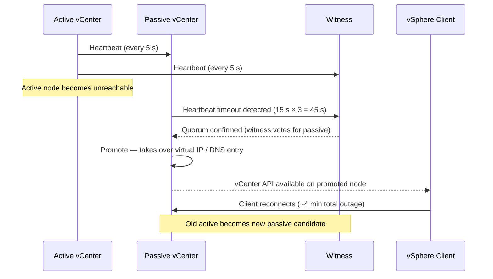

---
tags:
  - scenarios
  - vcenter
  - vmware
  - vsphere-8
description: "The vCenter HA passive node is promoted to active after the active node becomes unreachable. Operators observe a vSphere Client session drop lasting..."
---
# vCenter HA — Passive Node Failover

<div class="kb-summary">
The vCenter HA passive node is promoted to active after the active node becomes unreachable. Operators
observe a vSphere Client session drop lasting approximately 4 minutes, then a successful reconnect.
ESXi hosts and running VMs are unaffected — this is a control-plane event only. This scenario covers
confirming the failover completed cleanly, re-adding the old active as a new passive node, and handling
edge cases where VCHA gets stuck in Isolated state.

*Applies to: vSphere 7.x / 8.x*
</div>



## Symptoms

| Indicator | Detail |
|---|---|
| vSphere Client session drops | Browser shows "Service unavailable"; reconnect succeeds after ~4 min |
| VCHA status | "Passive node is primary" shown in vCenter HA cluster status panel |
| vCenter alarm | `vCenter High Availability state changed` fires on VCHA state transition |
| ESXi hosts | Hosts and VMs continue running normally — no VM impact during control-plane outage |
| DNS / VIP | Virtual IP (or DNS A-record) resolves to promoted passive node after failover |

---

## 1. Confirm VCHA State After Failover

### PowerCLI

```powershell
Connect-VIServer -Server <vcenter-fqdn>
Get-VchaState
```

Expected output after successful failover:

```text
ClusterState : HEALTHY
ActiveNode   : <former-passive-ip>
PassiveNode  : <former-active-ip>   # may show as "not connected" initially
WitnessNode  : <witness-ip>
```

### REST API

```bash
curl -sk -u administrator@vsphere.local:<password> \
  https://<vcenter-fqdn>/api/vcenter/vcha/cluster/active \
  -H "vmware-api-session-id: $(curl -sk -u administrator@vsphere.local:<password> \
    -X POST https://<vcenter-fqdn>/api/session | tr -d '"')"
```


```text title="Expected output"
{
  "config_state": "CONFIGURED",
  "cluster_state": "HEALTHY",
  "node_type": "ACTIVE",
  "node_id": "50a3d3f0-8c2a-4a1b-9e7c-2f5b8d1c6a3e",
  "ipv4_address": "192.168.1.45",
  "hostname": "vcenter-active.corp.local",
  "last_heartbeat": "2024-01-15T14:32:18.456Z"
}
```

!!! warning "Common errors"
    **`curl: (60) SSL certificate problem: self signed certificate`** — Add `-k` flag to skip SSL verification, or import the vCenter CA certificate into your system trust store.
    **`401 Unauthorized`** — Verify the administrator@vsphere.local password is correct and the account has API access permissions enabled.
    **`curl: (7) Failed to connect to <vcenter-fqdn> port 443: Name or service not known`** — Ensure the vCenter FQDN is resolvable and reachable from your network; check DNS and firewall rules.
Response field `state` must be `HEALTHY`; `active_node.ha_ip.ipv4.address` must show the promoted node IP.

---

## 2. Check vcha.log for Promotion Entry

SSH to the currently active (promoted) node:

```bash
ssh root@<promoted-vcenter-ip>
grep -i "Promotion complete" /var/log/vcha/vcha.log
grep -i "sync lag" /var/log/vcha/vcha.log | tail -20
```


```text title="Expected output"
root@vcenter-01.lab.local:~#
root@vcenter-01.lab.local:~# grep -i "Promotion complete" /var/log/vcha/vcha.log
2024-01-15T09:47:32.156Z INFO vcha-watchdog: Promotion complete for node vcenter-01.lab.local
2024-01-15T09:47:45.203Z INFO vcha-watchdog: Cluster state synchronized after promotion
root@vcenter-01.lab.local:~# grep -i "sync lag" /var/log/vcha/vcha.log | tail -20
2024-01-15T09:45:12.891Z DEBUG vcha-sync: Sync lag: 245ms from passive node
2024-01-15T09:45:18.445Z DEBUG vcha-sync: Sync lag: 187ms from passive node
2024-01-15T09:45:24.112Z DEBUG vcha-sync: Sync lag: 156ms from passive node
2024-01-15T09:45:30.667Z DEBUG vcha-sync: Sync lag: 203ms from passive node
2024-01-15T09:45:36.234Z DEBUG vcha-sync: Sync lag: 98ms from passive node
2024-01-15T09:45:42.891Z DEBUG vcha-sync: Sync lag: 142ms from passive node
2024-01-15T09:45:48.556Z DEBUG vcha-sync: Sync lag: 267ms from passive node
2024-01-15T09:46:01.123Z DEBUG vcha-sync: Sync lag: 89ms from passive node
root@vcenter-01.lab.local:~#
```

!!! warning "Common errors"
    **`grep: /var/log/vcha/vcha.log: No such file or directory`** — Verify VCHA is initialized by running `vcha-cli status` and ensure you are connected to the promoted node.
    **`Permission denied`** — SSH as root or use `sudo` to access VCHA logs, which require elevated privileges.
Confirm the `Promotion complete` entry is present. The sync lag lines before failover must show lag was
below 60 seconds — if lag exceeded 60 s, inspect whether any DB transactions were lost.

```text
2026-06-11T03:42:17.123Z INFO vcha: Heartbeat timeout from active node (3 consecutive misses)
2026-06-11T03:42:17.124Z INFO vcha: Quorum reached — witness voted PASSIVE
2026-06-11T03:42:18.001Z INFO vcha: Promotion complete. Node role: ACTIVE
```

---

## 3. Verify DB Sync Lag Was Acceptable

```bash
grep -i "replication lag" /var/log/vcha/vcha.log | tail -30
```


```text title="Expected output"
2024-01-15T09:42:33.847Z INFO vcha-watchdog[7234]: Replication lag detected: 245ms on node-02
2024-01-15T09:43:01.923Z WARN vcha-watchdog[7234]: Replication lag detected: 1203ms on node-03
2024-01-15T09:43:45.156Z INFO vcha-watchdog[7234]: Replication lag detected: 89ms on node-02
2024-01-15T09:44:12.441Z WARN vcha-watchdog[7234]: Replication lag detected: 2847ms on node-03
2024-01-15T09:45:03.672Z ERROR vcha-watchdog[7234]: Replication lag detected: 5234ms on node-03 — threshold exceeded
2024-01-15T09:45:30.189Z INFO vcha-watchdog[7234]: Replication lag detected: 156ms on node-02
2024-01-15T09:46:15.334Z WARN vcha-watchdog[7234]: Replication lag detected: 3102ms on node-03
2024-01-15T09:47:02.556Z INFO vcha-watchdog[7234]: Replication lag detected: 201ms on node-02
2024-01-15T09:47:48.891Z ERROR vcha-watchdog[7234]: Replication lag detected: 6145ms on node-03 — threshold exceeded
2024-01-15T09:48:22.445Z INFO vcha-watchdog[7234]: Replication lag detected: 134ms on node-02
```

!!! warning "Common errors"
    **`grep: /var/log/vcha/vcha.log: No such file or directory`** — Verify VCHA is installed and running with `systemctl status vcha` or check the correct log path for your vSphere version.
    **`Permission denied`** — Run the command with `sudo` or as root to access VCHA log files.
Lag values below 30 s indicate a clean failover. Values between 30–60 s are acceptable but warrant
investigation. Values above 60 s indicate the passive may have missed recent transactions; check whether
any tasks or events appear missing from the vCenter inventory after reconnect.

---

## 4. Verify Witness Connectivity

From the promoted active node, ping the witness over the HA network:

```bash
ping -I vmk1 <witness-ha-ip> -c 5
```


```text title="Expected output"
PING 192.168.100.50 (192.168.100.50) from 192.168.100.10 vmk1
56(84) bytes of data.
64 bytes from 192.168.100.50: icmp_seq=1 ttl=64 time=2.34 ms
64 bytes from 192.168.100.50: icmp_seq=2 ttl=64 time=2.41 ms
64 bytes from 192.168.100.50: icmp_seq=3 ttl=64 time=2.38 ms
64 bytes from 192.168.100.50: icmp_seq=4 ttl=64 time=2.39 ms
64 bytes from 192.168.100.50: icmp_seq=5 ttl=64 time=2.36 ms

--- 192.168.100.50 statistics ---
5 packets transmitted, 5 received, 0% packet loss, time 4012ms
rtt min/avg/max/stddev = 2.34/2.38/2.41/0.03 ms
```

!!! warning "Common errors"
    **`ping: -I: unknown host`** — Replace `-I vmk1` with `-I 192.168.100.10` (the actual IP bound to vmk1) or verify vmk1 exists with `esxcli network ip interface list`.
    **`PING 192.168.100.50 (192.168.100.50) from 192.168.100.10 vmk1 ... 100% packet loss`** — Verify the witness appliance is running and reachable; check firewall rules and vMotion network connectivity with `esxcli network ip neighbor list`.
    **`ping: sendto: No route to host`** — Confirm vmk1 is on the same subnet as the witness IP or add a static route with `esxcli network ip route ipv4 add`.
Confirm packet loss = 0%. If the witness is unreachable, VCHA cannot perform automatic failover for
future failures — restore witness connectivity immediately.

---

## 5. Resolution Paths

### Clean Failover — Re-add Old Active as Passive

If the auto-failover completed without errors and the old active node is recoverable:

1. In vSphere Client: **vCenter HA → Configure → Add Node**.
2. Provide the old active's management IP and HA network IP.
3. VCHA re-syncs the DB to the rejoining node and places it in Passive role.
4. Allow sync to complete (monitor `/var/log/vcha/vcha.log` for `Sync complete` on the new passive).

### VCHA Stuck in "Isolated" State

If the VCHA cluster is stuck and neither node can determine quorum:

```bash
curl -sk -u administrator@vsphere.local:<password> \
  -X POST "https://<vcenter-fqdn>/api/vcenter/vcha/cluster?action=failover" \
  -H "Content-Type: application/json" \
  -d '{"planned": false}'
```


```text title="Expected output"
{
  "value": null
}
```

!!! warning "Common errors"
    **`curl: (60) SSL certificate problem: self signed certificate`** — Add the `-k` flag to skip SSL verification, or import the vCenter certificate into your system's trusted store.
    **`{"type":"com.vmware.vapi.std.errors.unauthenticated","value":{"messages":[{"default_message":"The user is not authenticated.","id":"com.vmware.vapi.std.errors.unauthenticated"}]}}`** — Verify the vCenter FQDN is correct and the administrator@vsphere.local password is URL-encoded if it contains special characters.
    **`{"type":"com.vmware.vapi.std.errors.error","value":{"messages":[{"default_message":"VCHA cluster is not in a valid state for failover.","id":"com.vmware.vapi.std.errors.error"}]}}`** — Ensure VCHA is configured and healthy by checking cluster status before attempting failover.
If `force` failover is required (witness unreachable, split-brain):

```bash
-d '{"planned": false, "force": true}'
```


```text title="Expected output"
(no output — command completes silently)
```

!!! warning "Common errors"
    **`curl: (6) Could not resolve host`** — Verify the target API endpoint hostname is correct and resolvable in your network DNS.
    **`{"error": "Unauthorized", "code": 401}`** — Ensure your API authentication token or credentials are valid and included in the request headers.
The `force: true` flag bypasses witness quorum — use only when both nodes are healthy and witness
connectivity cannot be restored within the maintenance window.

### DB Sync Lag — Disk Space on Passive

If sync lag was high, check `/storage/db/` utilisation on the passive (now active) node:

```bash
df -h /storage/db
du -sh /storage/db/vpostgres/*
```


```text title="Expected output"
Filesystem      Size  Used Avail Use% Mounted on
/dev/sda3       500G  387G  113G  78% /storage/db

4.2G	/storage/db/vpostgres/base
12G	/storage/db/vpostgres/global
2.1G	/storage/db/vpostgres/pg_wal
1.8G	/storage/db/vpostgres/pg_xact
890M	/storage/db/vpostgres/pg_tblspc
```

!!! warning "Common errors"
    **`df: '/storage/db': No such file or directory`** — Verify the mount point exists and is mounted with `mount | grep /storage/db`.
    **`du: cannot access '/storage/db/vpostgres/*': Permission denied`** — Run the commands with `sudo` or ensure your user has read permissions on the directory with `chmod +rx`.
If near capacity, clear rotated logs:

```bash
find /storage/log -name "*.gz" -mtime +7 -delete
```


```text title="Expected output"
(no output — command completes silently)
```

!!! warning "Common errors"
    **`find: '/storage/log': No such file or directory`** — Verify the log directory path exists with `ls -ld /storage/log` and correct the path if needed.
    **`find: '/storage/log': Permission denied`** — Run the command with `sudo` or ensure your user has read and execute permissions on the directory with `chmod u+rx /storage/log`.
    **`find: warning: -delete: cannot delete '/storage/log/archive-2024-01-15.gz': Permission denied`** — Change ownership or permissions of the log files with `sudo chown $USER:$USER /storage/log/*.gz` or run the entire command with `sudo`.
---

## 6. Verification

```powershell
# PowerCLI — confirm HEALTHY state
Get-VchaState | Select-Object ClusterState, ActiveNode, PassiveNode, WitnessNode

# Confirm both data nodes and witness are green
(Get-VchaState).ClusterState -eq "HEALTHY"
```

Optionally run a controlled test failover to confirm VCHA is fully operational:

```powershell
# UI: vCenter HA → Actions → Initiate Failover
# This returns to the original active node after a brief outage
Test-VchaFailover
```

Clear the vCenter alarm after confirming HEALTHY:
vSphere Client → **Alarms → vCenter High Availability state changed → Reset to Green**.

---

## 7. Prevention

| Control | Implementation |
|---|---|
| HA network isolation | Dedicated 1 GbE (minimum) or 10 GbE vNIC for VCHA replication; no routing hops between active and passive; VLAN separation from management |
| DB sync lag alerting | Monitor `replication lag` in vcha.log via syslog pipeline; alert if lag exceeds 30 s |
| Witness placement | Deploy witness in a third availability zone or physical site; never co-locate witness with active or passive on the same host |
| `/storage/db` monitoring | Alert when DB partition exceeds 70% capacity; VCHA replication stalls when disk is full |
| Scheduled health checks | Run `Get-VchaState` weekly as part of platform health routine; validate all three nodes report green |

---

## Related Scenarios

- [vCenter Down / Unreachable](vcenter-down.md) — covers active vCenter failures where VCHA is
  not configured or did not complete auto-failover.
- [NTP Drift Causing SSO or Certificate Errors](ntp-drift-sso-certificate.md) — NTP skew
  between VCHA nodes can cause replication and quorum failures.
