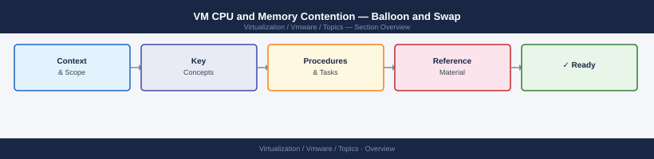
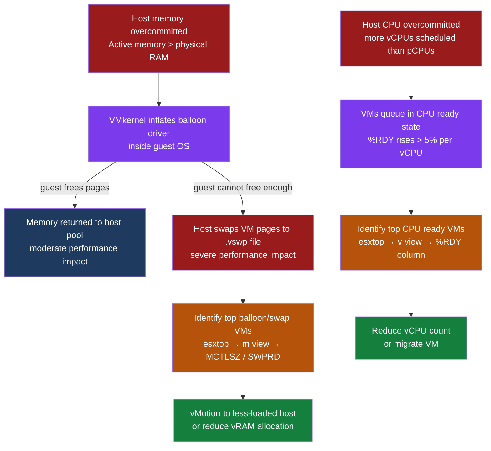

---
tags:
  - scenarios
  - vmware
---
# VM CPU and Memory Contention — Balloon and Swap

<div class="kb-summary">
VMs on a host or cluster experience degraded performance. ESXtop shows balloon memory inflated and swap
activity. This scenario covers identifying which VMs are consuming excess memory, distinguishing balloon
from swap pressure, resolving the immediate contention via DRS or vMotion, and right-sizing VM
allocations to prevent recurrence. CPU ready time analysis is included because high I/O swap latency
is frequently misread as a CPU bottleneck.

*Applies to: vSphere 7.x / 8.x*
</div>





## Symptoms

| Indicator | Detail |
|---|---|
| Application response time elevated | Guest OS shows high I/O wait or slow response; application team reports latency |
| ESXtop `%RDY` > 5% | CPU ready time per vCPU exceeds threshold; VM is waiting for physical CPU time |
| ESXtop `MCTLSZ` > 0 MB | Balloon driver is inflated inside the guest VM |
| ESXtop `SWPRD` / `SWPWT` > 0 | Host is reading from or writing to the `.vswp` file — most severe form of memory pressure |
| vSphere Performance chart | Host-level `Memory Balloon` counter rising; `Memory Swap In Rate` > 0 |
| DRS recommendations pending | Cluster DRS is suggesting migrations due to resource imbalance |

---

## 1. Identify Balloon and Swap in ESXtop

Connect to the ESXi host via SSH and launch esxtop:

```bash
esxtop
```

Press `m` to switch to memory view. Key columns:

| Column | Meaning | Threshold |
|---|---|---|
| `MCTLSZ` | Balloon size in MB — memory reclaimed from guest | > 0 MB indicates pressure |
| `SWPRD` | Swap read rate MB/s — host reading from .vswp | > 0 indicates active swap |
| `SWPWT` | Swap write rate MB/s — host writing to .vswp | > 0 indicates active swap |
| `GRANT` | Memory granted to VM in MB | Below configured size = constrained |
| `SZTGT` | Target balloon size — how much VMkernel wants to reclaim | Rising = increasing pressure |

Sort by `MCTLSZ` descending (press `F` then select column, then `R` to reverse sort) to identify the
top balloon consumers.

Press `v` to switch to VM CPU view. Key column:

| Column | Meaning | Threshold |
|---|---|---|
| `%RDY` | CPU ready time as percentage — time VM waited for a physical CPU | > 5% per vCPU is contention |

---

## 2. Collect Host-Level Statistics via PowerCLI

```powershell
# Memory pressure indicators — last 5 samples (20-second intervals)
Get-VMHost | Get-Stat `
  -Stat mem.usage.average, mem.swapinRate.average, mem.balloonRate.average `
  -MaxSamples 5 | Format-Table Entity, MetricId, Value, Unit -AutoSize

# Identify top balloon consumers across cluster
Get-VM | Get-Stat `
  -Stat mem.active.average, mem.overhead.average `
  -MaxSamples 10 |
  Sort-Object Value -Descending |
  Select-Object -First 20 |
  Format-Table Entity, MetricId, Value, Unit
```

---

## 3. Check DRS Migration History

In vSphere Client: **Cluster → Monitor → DRS → Migration History**

If DRS is moving VMs frequently, the cluster is genuinely overcommitted and individual VM remediation
will not resolve the root cause — capacity must be added or VMs powered off.

Check DRS recommendations not yet executed (if DRS is in Manual mode):

vSphere Client → **Cluster → Monitor → DRS → Recommendations** — apply pending recommendations
immediately if cluster is in active contention.

---

## 4. Identify a Specific VM's Memory Profile

```powershell
Get-VM <vm-name> | Get-Stat `
  -Stat mem.active.average, mem.overhead.average, mem.consumed.average `
  -MaxSamples 60 |
  Sort-Object Timestamp |
  Format-Table Timestamp, MetricId, Value, Unit
```

Active memory below 60% of configured vRAM indicates the VM is over-provisioned and is a candidate
for right-sizing. Overhead memory above 5% of configured vRAM indicates the hypervisor itself is
consuming excessive memory for VM metadata — this increases with higher vCPU counts.

---

## 5. Resolution

### Short-Term — DRS Rebalance or Manual vMotion

If the cluster has DRS in Manual or Partially Automated mode, switch to Fully Automated temporarily:

```powershell
(Get-Cluster "<cluster-name>").ExtensionData.ReconfigureComputeResource(
  (New-Object VMware.Vim.ClusterConfigSpecEx -Property @{
    DrsConfig = New-Object VMware.Vim.ClusterDrsConfigInfo -Property @{
      DefaultVmBehavior = "fullyAutomated"
      Enabled = $true
    }
  }), $true
)
```

Or manually vMotion the highest balloon-consumer VMs to less-loaded hosts:

```powershell
# Identify least-loaded host by memory usage
Get-VMHost | Sort-Object MemoryUsageGB | Select-Object -First 3 |
  Format-Table Name, MemoryUsageGB, MemoryTotalGB

# Move top balloon VM to least-loaded host
Move-VM -VM <vm-name> -Destination (Get-VMHost <target-host>)
```

### Set Memory Reservation on Critical VMs

Prevents balloon and swap for tier-1 workloads, at the cost of reduced DRS flexibility:

```powershell
Set-VM -VM <vm-name> -MemoryReservationGB <reservation-GB> -Confirm:$false
```

Do not set reservations on all VMs — this eliminates the overcommit benefit entirely.

### Reduce vRAM Allocation (Right-Sizing)

For VMs where active memory is consistently below 60% of configured vRAM:

```powershell
# Check active vs configured
Get-VM <vm-name> | Select-Object Name,
  @{N="ConfiguredGB";E={$_.MemoryGB}},
  @{N="ActiveGB";E={(Get-Stat -Entity $_ -Stat mem.active.average -MaxSamples 5 |
    Measure-Object Value -Average).Average / 1MB}}
```

Power off the VM, reduce vRAM to 110% of peak active memory, power back on.

### Resolve CPU Ready — Reduce vCPU Count

VMs with `%RDY` > 5% and configured vCPUs significantly exceeding the workload thread count:

```powershell
# Check per-VM CPU ready summation (ms per 20s interval — divide by 200 for %)
Get-VM | Get-Stat -Stat cpu.ready.summation -MaxSamples 3 |
  Sort-Object Value -Descending |
  Select-Object -First 10 |
  Format-Table Entity, Value, Unit
```

Reduce vCPU count for over-vCPUd VMs — more vCPUs create more scheduling pressure on the host,
not less. A single-threaded application gains nothing from 8 vCPUs but creates 7 extra scheduling
units the host must satisfy.

### Emergency — Suspend Non-Critical VMs

If all hosts in the cluster are memory-pressured and vMotion cannot solve it:

```powershell
# Suspend non-critical VMs to release memory immediately
Get-VM -Name "<dev-vm-*>" | Suspend-VM -Confirm:$false
```

---

## 6. Verification

```bash
# ESXtop — confirm balloon and swap cleared on host
# Press m in esxtop → check MCTLSZ = 0 and SWPRD = 0 for all VMs
esxtop
```

```powershell
# PowerCLI — confirm host memory usage below 90%
Get-VMHost | ForEach-Object {
  [PSCustomObject]@{
    Host     = $_.Name
    UsedPct  = [math]::Round($_.MemoryUsageGB / $_.MemoryTotalGB * 100, 1)
  }
} | Where-Object { $_.UsedPct -gt 85 }

# Confirm CPU ready below 5% for top VMs
Get-VM | Get-Stat -Stat cpu.ready.summation -MaxSamples 3 |
  Sort-Object Value -Descending |
  Select-Object -First 10 |
  ForEach-Object {
    [PSCustomObject]@{
      VM      = $_.Entity.Name
      ReadyPct = [math]::Round($_.Value / 200, 2)
    }
  }
```

Validate with the application team that response times have normalised. For database workloads, run a
synthetic transaction test (e.g., `sysbench` or application-specific benchmark) before closing the
incident.

---

## 7. Prevention

| Control | Implementation |
|---|---|
| Memory overcommit ratio | Keep host memory overcommit below 1.2× for production clusters; measure as `sum(VM configured RAM) / host physical RAM` |
| Tier-1 reservations | Set memory reservations for database and middleware VMs; prevents balloon at the cost of reduced overcommit benefit |
| Monitoring — swap alert | Alert on `mem.swapinRate.average > 100 KBps` per host; swap indicates severe pressure requiring immediate action |
| Monitoring — CPU ready alert | Alert on `cpu.ready.summation` equivalent to > 5% per vCPU; sample every 5 minutes |
| Quarterly right-sizing | Review VM active memory vs configured memory quarterly; reclaim unused vRAM; typical overprovision factor is 30–40% for general workloads |
| DRS automation level | Keep production clusters on Fully Automated DRS; Manual mode allows imbalances to accumulate silently |

---

## Related Scenarios

- [VM Performance Degraded](vm-performance-degraded/index.md) — broader VM performance triage
  including storage and network latency contributors.
- [vSAN Capacity Alarm](vsan-capacity-alarm/index.md) — swap file growth can rapidly consume vSAN
  datastore capacity on HCI deployments.
- [Storage APD — Datastore Inaccessible](storage-apd-datastore-inaccessible/index.md) — `.vswp`
  files on an APD datastore cause immediate VM freeze; distinguish from memory contention.
