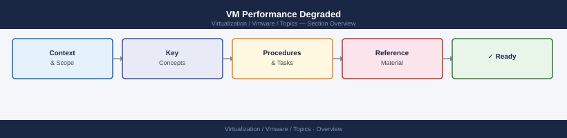

---
tags:
  - scenarios
  - vmware
---
# VM Performance Degraded

<div class="kb-summary">
A VM is slow or unresponsive. This scenario walks through a layered investigation across Aria Operations,
ESXi host metrics, vSAN storage performance, and NSX Distributed Firewall overhead to pinpoint the root
cause and apply the correct fix — CPU, memory, storage, or network.

*Applies to: vSphere 7.x / 8.x*
</div>



```d2
direction: right

center: "Scenarios" {shape: hexagon}
products_involved: "Products Involved" {shape: rectangle}
1_start_in_aria_operations_triage_th: "1. Start in Aria Operations — Triage the Alert" {shape: rectangle}
2_esxi_layer_run_esxtop_on_the_host: "2. ESXi Layer — Run esxtop on the Host" {shape: rectangle}
3_vsan_layer_check_storage_performan: "3. vSAN Layer — Check Storage Performance" {shape: rectangle}
4_nsx_dfw_layer_rule_overhead_on_net: "4. NSX DFW Layer — Rule Overhead on Network Traffic" {shape: rectangle}
5_powercli_pull_historical_performan: "5. PowerCLI — Pull Historical Performance Stats" {shape: rectangle}

center -> products_involved
center -> 1_start_in_aria_operations_triage_th
center -> 2_esxi_layer_run_esxtop_on_the_host
center -> 3_vsan_layer_check_storage_performan
center -> 4_nsx_dfw_layer_rule_overhead_on_net
center -> 5_powercli_pull_historical_performan
```

## Products Involved

| Product | Role in This Scenario |
|---|---|
| Aria Operations | Initial alert triage; CPU ready %, memory balloon, latency, dropped packets |
| ESXi (esxtop) | Host-level CPU, memory, disk, and network metrics; ground truth |
| vSAN | Storage IOPS/throughput/latency per VM; component health |
| NSX (DFW) | East-west firewall overhead; connection timeouts vs packet drops |

---

## 1. Start in Aria Operations — Triage the Alert

Open the affected VM's alert in Aria Operations and note which metric is elevated — it determines where to dig next.

| Metric | Threshold | Meaning |
|---|---|---|
| CPU Ready (%) | > 5% | VM waiting for physical CPU — host overcommitted |
| Memory Balloon (KB) | > 0 sustained | Hypervisor reclaiming guest memory |
| Storage Latency (ms) | > 20 ms (DAVG) | Disk I/O contention at datastore layer |
| Network Dropped Packets | > 0.1% | NIC saturation or DFW overhead |

---

## 2. ESXi Layer — Run esxtop on the Host

SSH to the ESXi host and run esxtop to get real-time ground-truth metrics before acting.

```bash
# Batch mode — 3 samples, 50 lines of output; good for capture
esxtop -b -n 3 | head -50
```

Key esxtop views and what to look for:

```text
Press key to switch view:
  c  — CPU: look at %RDY (>5% = problem), %USED, %WAIT
  m  — Memory: look at MCTLSZ (balloon), SWPWRT (swap writes active)
  d  — Disk: look at DAVG (>20ms = latency), KAVG, QAVG
  n  — Network: look at %DRPD (dropped packets on vmnic)
```

```bash
# Check CPU ready and memory for a specific VM world
esxtop -b -n 1 | grep -A2 "vmx-vcpu"

# Check which VMs are consuming physical CPUs on the host
esxcli vm process list
```

Look for: `%RDY` high across many VMs = host overcommitted; `%RDY` high on one VM only = check resource pool limits.

---

## 3. vSAN Layer — Check Storage Performance

Navigate to **Cluster → Monitor → vSAN → Performance Service** and check per-VM IOPS, throughput, and latency.

```bash
# List all vSAN objects and their health on the host
esxcli vsan debug object list

# List vSAN storage devices and disk group membership
esxcli vsan storage list

# Show per-VM vSAN performance counters (if performance service enabled)
esxcli vsan debug vmdk list
```

Look for:

```text
vSAN Latency Tiers (DAVG from esxtop):
  < 5 ms   — healthy
  5–20 ms  — monitor closely
  > 20 ms  — investigate disk group / resync
  > 50 ms  — critical; likely degraded component or disk failure
```

In vCenter also check **vSAN → Monitor → Skyline Health** for capacity imbalance, absent/degraded components, and active resync queue (resync adds latency for all VMs on the disk group).

---

## 4. NSX DFW Layer — Rule Overhead on Network Traffic

If network is the bottleneck, run **Path Analysis** in Aria Networks (source VM → destination VM) to identify the blocking DFW rule ID.

```bash
# From NSX Manager REST API — get hit count for a specific rule
curl -sk -u admin:<password> \
  https://<nsx-manager>/api/v1/firewall/stats/rules/<rule-id> \
  | python3 -m json.tool
```

Look for: high hit-count rules on east-west flows. Reduce overhead by consolidating rules with the same action and groups, adding a service exception for high-throughput backup VMs, or disabling packet logging on stateful rules.

---

## 5. PowerCLI — Pull Historical Performance Stats

Pull the past hour of stats without needing Aria Operations access.

```powershell
# CPU ready — high sustained values confirm host-level contention
Get-VM "vm-name" | Get-Stat -Stat cpu.ready.summation `
  -Start (Get-Date).AddHours(-1) -IntervalMins 5 | Format-Table -AutoSize

# Memory balloon — non-zero means hypervisor is reclaiming guest memory
Get-VM "vm-name" | Get-Stat -Stat mem.balloon.average `
  -Start (Get-Date).AddHours(-1) -IntervalMins 5 | Format-Table -AutoSize

# Disk latency — check both read and write
Get-VM "vm-name" | Get-Stat -Stat disk.totalLatency.average `
  -Start (Get-Date).AddHours(-1) -IntervalMins 5 | Format-Table -AutoSize
```

---

## 6. Resolution Reference

| Symptom | Root Cause | Fix |
|---|---|---|
| CPU Ready > 5% | Host overcommitted | DRS migration to less-loaded host; adjust resource pool limits |
| Memory balloon active | Host memory pressure | Increase VM RAM reservation; add RAM to host if persistent |
| vSAN DAVG > 20 ms | Disk group contention or component rebuild | Check resync queue; replace failed disk; rebalance capacity |
| Network dropped packets | NIC saturation or DFW overhead | Check vmnic utilisation; reduce DFW rule count; disable rule logging |
| East-west latency spike | DFW stateful tracking overhead | Profile DFW rules with Aria Networks; add exclusion for high-throughput flows |

---

## Key Terms

| Term | Definition |
|---|---|
| Aria Operations | VMware observability platform; used here to receive the initial performance alert and surface CPU ready %, balloon, and latency metrics per VM |
| esxtop | ESXi CLI tool that shows real-time host-level metrics — CPU, memory, disk, network — at the individual VM and physical device level |
| CPU Ready (%RDY) | Time a VM spends waiting for physical CPU time; measured in esxtop; > 5% indicates the host is overcommitted and the VM is being starved |
| DAVG | Disk average latency (milliseconds) as reported by esxtop at the device driver layer; > 20 ms on vSAN indicates storage contention or a degraded component |
| DRS | Distributed Resource Scheduler; vCenter feature that automatically migrates VMs via vMotion to balance CPU and memory load across cluster hosts |
| vSAN | VMware's hyperconverged storage layer; aggregates local host disks into a shared datastore; performance degrades during component rebuild (resync) |
| DFW | Distributed Firewall; NSX kernel-level firewall enforced per vNIC on every ESXi host; high rule counts or stateful logging add per-packet overhead to east-west traffic |
| PCPU | Physical CPU; a single logical processor core on the ESXi host; %RDY in esxtop reflects how many PCPU cycles a VM is waiting to receive |
| Memory balloon | Hypervisor memory reclamation technique where ESXi inflates a balloon driver inside the guest to reclaim pages; any sustained balloon value means the host is under memory pressure |
| vmnic | Physical NIC on the ESXi host; %DRPD in the esxtop network view shows dropped packets per vmnic; saturation here causes VM network degradation |
| IOPS | Input/output operations per second; the throughput metric for storage; monitored via vSAN Performance Service per VM to distinguish storage bottlenecks from CPU/memory issues |
| vNIC | Virtual NIC presented to the guest VM; DFW rules are enforced at the vNIC kernel layer, so overhead is incurred even for traffic between VMs on the same host |

---

## Common Mistakes

- **Checking vSAN before ESXi host metrics.** Always verify host-level CPU and memory first. vSAN can appear healthy while the host is CPU-starved, masking the real cause.
- **Ignoring CPU ready while focusing on guest CPU.** A guest OS showing 90% CPU usage may actually be waiting for physical CPU time — %RDY in esxtop tells the real story.
- **Overlooking DFW as a latency source.** East-west traffic between VMs on the same host still traverses the DFW kernel module. High rule counts add measurable overhead.
- **Forgetting resource pool limits.** A VM inside a resource pool with a hard CPU limit will show high CPU ready even on an otherwise idle host.

---

## Related Scenarios

- [vMotion Failing](vmotion-failing/index.md) — vMotion failures often surface during performance investigations when DRS tries to rebalance a degraded host.
- [vSAN Disk or Component Failure](vsan-disk-component-failure/index.md) — vSAN latency spikes are frequently caused by active component rebuild after a disk event.
- [NSX Connectivity Broken](nsx-connectivity-broken/index.md) — When dropped packets point to the network layer, a full NSX path trace is the logical next step.
