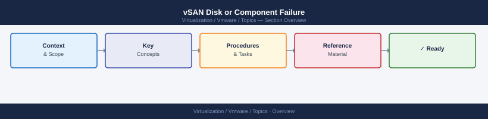

---
tags:
  - scenarios
  - vmware
  - vsan
  - vsphere-8
---
# vSAN Disk or Component Failure

<div class="kb-summary">
A vSAN disk fails or a component becomes absent, leaving one or more VMs with reduced fault tolerance.
This scenario covers how to identify the failed component, assess the risk window based on FTT policy,
initiate or monitor rebuild after disk replacement, and use VxRail Manager for hardware-assisted workflows
on HCI deployments.

*Applies to: vSphere 7.x / 8.x*
</div>



```d2
direction: right

center: "Scenarios" {shape: hexagon}
products_involved: "Products Involved" {shape: rectangle}
1_identify_the_alarm_skyline_health: "1. Identify the Alarm — Skyline Health" {shape: rectangle}
2_identify_the_failed_component: "2. Identify the Failed Component" {shape: rectangle}
3_assess_the_risk_window: "3. Assess the Risk Window" {shape: rectangle}
4_check_physical_disk_health: "4. Check Physical Disk Health" {shape: rectangle}
5_initiate_or_monitor_rebuild: "5. Initiate or Monitor Rebuild" {shape: rectangle}

center -> products_involved
center -> 1_identify_the_alarm_skyline_health
center -> 2_identify_the_failed_component
center -> 3_assess_the_risk_window
center -> 4_check_physical_disk_health
center -> 5_initiate_or_monitor_rebuild
```

## Products Involved

| Product | Role in This Scenario |
|---|---|
| vCenter | vSAN health alarms; Virtual Objects view; cluster monitoring |
| vSAN | Component health; disk group management; resync queue |
| ESXi | Disk health via esxcli; disk group operations |
| VxRail Manager | Disk replacement wizard; iDRAC hardware event correlation |
| OMIVV (Dell) | Surfaces iDRAC hardware alerts as vCenter alarms |

---

## 1. Identify the Alarm — Skyline Health

Navigate to **vCenter → Cluster → Monitor → vSAN → Skyline Health** to find the specific failing check before touching any disk.

```text
Common red health checks and their meaning:
  Disk capacity utilisation  — overall capacity above threshold (>70% warn, >80% crit)
  vSAN disk balance          — uneven data distribution across disk groups
  Component health           — one or more components in Absent or Degraded state
  Disk group health          — disk group error; possible disk failure on cache or capacity tier
  Physical disk health       — SMART errors or disk returned hardware error
```

Look for: the **Virtual Objects** view (**vSAN → Monitor → Virtual Objects**) filtered by "Non-compliant" shows exactly which VMs have a live protection gap.

---

## 2. Identify the Failed Component

Expand a non-compliant VM in Virtual Objects to see its component map, then correlate with CLI output to confirm which disk.

```bash
# List all vSAN objects and their health on the host
esxcli vsan debug object list | grep -E "UUID|Health|Host|Disk"

# List vSAN storage devices and disk group membership on the affected host
esxcli vsan storage list

# Identify which disk group is affected
esxcli vsan storage list | grep -E "DiskGroupUUID|SSD|Capacity|State"
```

Look for: note which host the absent component lives on, which disk group it belongs to, and whether the state is `Absent` (disk gone) or `Degraded` (disk present but component needs rebuild).

---

## 3. Assess the Risk Window

Before touching anything, determine whether the cluster can survive another failure during the rebuild.

| FTT | Policy | Failures Tolerated | VM State with 1 Absent Component | Action |
|---|---|---|---|---|
| 1 | RAID-1 (mirroring) | 1 | Still compliant — 1 replica remains | Monitor; replace within maintenance window |
| 1 | RAID-5 (erasure coding) | 1 | Still compliant — parity intact | Monitor; do not remove another host |
| 2 | RAID-6 (erasure coding) | 2 | Still compliant after first failure | Monitor; urgent if second failure occurs |
| 1 | RAID-1 | 1 | Second component absent | Non-compliant — data risk; act immediately |

```text
Risk window = time between first failure and rebuild completion.
During this window, a second disk or host failure may cause data loss.
Do NOT put other hosts into maintenance mode during an active risk window.
```

---

## 4. Check Physical Disk Health

SSH to the affected ESXi host to confirm whether the disk has truly failed or is merely disconnected before ordering a replacement.

```bash
# List all storage devices visible to ESXi
esxcli storage core device list | grep -E "Display|State|Device"

# Check SMART health data for the specific device
# Replace naa.<device-id> with the actual NAA identifier from the list above
esxcli storage core device smart get -d naa.<device-id>

# Key SMART attributes to check:
# Reallocated Sector Count > 0    — sectors remapped; disk degrading
# Uncorrectable Sector Count > 0  — data loss risk
# SSD Wear Indicator < 5%         — flash near end of life
# Drive Temperature > 55°C        — thermal issue
```

For VxRail deployments, check iDRAC before acting — OMIVV surfaces hardware events as vCenter alarms:

```bash
# SSH to iDRAC (or use web UI at https://<idrac-ip>)
racadm getsel | grep -i "storage\|disk\|drive"
```

Look for: cross-reference **vCenter → Alarms → Triggered Alarms** for any Dell OMIVV alarm correlated with the vSAN alert to confirm the physical disk identity.

---

## 5. Initiate or Monitor Rebuild

Replace the failed disk — vSAN automatically detects the new disk and begins rebuilding absent components; do not manually re-add it.

```bash
# Monitor resync progress from ESXi CLI
esxcli vsan debug resync summary get

# Output fields:
#   BytesToResync     — remaining data to rebuild
#   ResyncType        — REPAIR (failed component) / REBALANCE / POLICY_CHANGE
#   ObjectsToResync   — number of VM disk objects still rebuilding
#   ActiveResyncETA   — estimated completion time
```

Look for: `ResyncType = REPAIR` with decreasing `BytesToResync` confirms rebuild is in progress. For VxRail, use **VxRail Manager → Maintenance → Disk Replacement** wizard — it verifies cluster capacity before removal and monitors rebuild post-replacement.

---

## 6. PowerCLI — Disk Group and Health Queries

Pull disk group and cluster health state programmatically for post-replacement validation.

```powershell
# Get all disk groups for a specific ESXi host
Get-VsanDiskGroup -VMHost (Get-VMHost "esxi-host.domain.local") `
  | Format-List

# List all disks in each disk group with health status
Get-VsanDiskGroup -VMHost (Get-VMHost "esxi-host.domain.local") `
  | Get-VsanDisk | Select-Object DisplayName, State, Vendor, IsSsd

# Query cluster-level vSAN health summary via API
$vsanHealth = Get-VsanView -Id "VsanVcClusterHealthSystem-vsan-cluster-health-system"
$spec = New-Object VMware.Vimautomation.Storage.Impl.V1.VsanQueryVcClusterHealthSummarySpec
$vsanHealth.VsanQueryVcClusterHealthSummary($cluster.ExtensionData.MoRef, $null, $null, $true, $null, $null, "defaultView")
```

---

## Key Terms

| Term | Definition |
|---|---|
| vSAN | VMware's hyperconverged storage layer that pools local disks across cluster hosts into a shared datastore; data is distributed as objects and components across hosts |
| OSA | Original Storage Architecture — the vSAN disk group model using a dedicated cache disk (SSD) plus capacity disks; used in vSAN 7 and earlier by default |
| ESA | Express Storage Architecture — vSAN 8+ all-NVMe model that eliminates the cache tier; each disk contributes directly to both capacity and performance |
| FTT | Failures to Tolerate — the SPBM policy attribute that defines how many simultaneous host or disk failures a VM's data can survive; determines the minimum host count required |
| RAID-1 | vSAN mirroring protection; writes N+1 full copies of each object across different fault domains; FTT=1 RAID-1 requires 3 hosts and uses 2x capacity overhead |
| RAID-5 | vSAN erasure coding for FTT=1; distributes data + parity across 4 hosts; uses 1.33x capacity overhead compared to RAID-1's 2x |
| Disk group | OSA grouping of one cache SSD plus 1–7 capacity disks on a single ESXi host; all capacity disks in the group share the cache tier |
| Component | The smallest unit of a vSAN object; a single VM disk (VMDK) is split into one or more components distributed across different hosts according to the FTT policy |
| Resync | The rebuild process vSAN runs after a disk or host failure to recreate absent components on surviving hosts and restore the configured FTT level |
| SPBM | Storage Policy-Based Management — vSphere framework where VM storage rules (FTT, RAID level, encryption) are defined as policies and applied per VM or VMDK |
| Skyline Health | The vSAN health monitoring dashboard in vCenter; runs continuous health checks across disk, capacity, network, and cluster configuration categories |
| OMIVV | OpenManage Integration for VMware vCenter — Dell plugin that forwards iDRAC hardware alerts (disk failures, SMART errors) into vCenter as native alarms |
| iDRAC | Integrated Dell Remote Access Controller — out-of-band management interface on Dell servers; provides hardware-level disk and controller event logs independent of the OS |

---

## Common Mistakes

- **Replacing a disk before checking whether another component is already absent.** If the cluster already has one absent component and you place the affected host in maintenance mode to replace the disk, you may create a second absent component — making some VMs non-compliant or causing data loss.
- **Not monitoring resync ETA before other maintenance.** Any host maintenance during an active resync reduces the protection level further. Always check resync queue first.
- **Confusing "Absent" with "Degraded."** Absent means the physical disk or host is gone — the component cannot serve reads or writes. Degraded means the component is present but needs to be rebuilt. The urgency is different.
- **Skipping iDRAC/OMIVV for VxRail.** vSAN may show a component absent before the iDRAC alarm fires. Checking both sources prevents misidentifying which physical disk to replace.

---

## Related Scenarios

- [VM Inaccessible / HA Failover](vm-inaccessible-ha-failover/index.md) — Host failure produces the same vSAN resync queue as a disk failure; HA adds VM restart complexity.
- [VM Performance Degraded](vm-performance-degraded/index.md) — Active vSAN resync increases disk latency for all VMs sharing the disk group, causing performance complaints.
- [vMotion Failing](vmotion-failing/index.md) — DRS may attempt to evacuate VMs from a host with a degraded disk group; Storage vMotion failures can occur if vSAN components are non-compliant.
