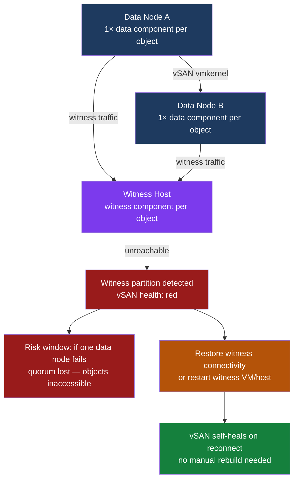

---
tags:
  - scenarios
  - vmware
  - vsan
  - vsphere-8
---
# vSAN 2-Node — Witness Host Unreachable

<div class="kb-summary">
In a 2-node vSAN cluster, the witness host provides the tiebreaker vote for quorum. When the witness
loses connectivity, the cluster degrades silently — VMs continue running as long as both data nodes are
healthy, but the cluster cannot tolerate a simultaneous data-node failure. This scenario covers detecting
witness loss, restoring connectivity or the witness host, and applying a temporary workaround to prevent
unnecessary data rebuilds while the witness is being restored.

*Applies to: vSphere 7.x / 8.x*
</div>



## Symptoms

| Indicator | Detail |
|---|---|
| vSAN Health | "Witness host component health" = red under `Monitor → vSAN → Health Service` |
| vSAN Health | "Component metadata health" may show degraded or absent witness components |
| `esxcli` output | `esxcli vsan debug object list` shows witness components in ABSENT state |
| Cluster still running | VMs remain accessible if both data nodes are healthy (FTT=1 satisfied with 2 data copies) |
| Hostd log | `/var/log/hostd.log` on witness shows repeated heartbeat timeout messages |

---

## 1. Confirm Witness Is Disconnected

Run on either data node:

```bash
esxcli vsan cluster list
```

Output shows 3 members when healthy. With witness unreachable, the witness UUID appears as disconnected
or absent from the member list:

```text
Cluster Information
   Enabled: true
   Current master UUID: <data-node-uuid>
   Local node UUID: <data-node-uuid>
   Local node type: NORMAL
   Local node state: MASTER
   Local node health state: HEALTHY
   Sub-Cluster Master UUID: <data-node-uuid>
   Sub-Cluster Backup UUID: <data-node-uuid>
   Sub-Cluster UUID: <cluster-uuid>
   Sub-Cluster Membership Entry Revision: 5
   Sub-Cluster Member Count: 2       <-- only 2 when witness is gone
   Sub-Cluster Member UUIDs: <node-a-uuid> <node-b-uuid>
```

---

## 2. Check Network Connectivity to Witness

From a data node, ping the witness TEP and management IPs:

```bash
# Ping witness management IP from data node management VMkernel
vmkping -I vmk0 <witness-mgmt-ip>

# Ping witness TEP from data node vSAN VMkernel
vmkping -I vmk1 <witness-tep-ip>
```

If pings fail to the TEP (vmk1) but succeed to management (vmk0), the vSAN witness traffic VLAN or
routing is broken. If both fail, the witness host or VM is down.

---

## 3. Audit Affected Objects

```bash
esxcli vsan debug object list --cluster-uuid <cluster-uuid> 2>/dev/null | grep -E "ABSENT|DEGRADED"
```

Objects with only witness components ABSENT are tolerable (VMs still running). Objects with a data
component ABSENT are at risk — a second failure causes immediate inaccessibility.

To get the cluster UUID:

```bash
esxcli vsan cluster list | grep "Sub-Cluster UUID"
```

---

## 4. Review Witness Logs

SSH to the witness host (if reachable via management network):

```bash
grep -i "heartbeat" /var/log/hostd.log | tail -30
grep -i "vsan" /var/log/vmkernel.log | grep -i "partition\|disconnect\|timeout" | tail -30
```

Look for repeated entries:

```text
WARNING: Heartbeat to cluster master lost (attempt 3 of 3)
ERROR: vSAN witness partition: unable to reach data nodes on vmk_witness
```

---

## 5. Resolution

### Network Partition — Restore L2/L3 Connectivity

If the witness host is running but isolated by a network change:

1. Identify the network segment carrying witness traffic (typically a dedicated VLAN or routed subnet).
2. Check switch port state, VLAN membership, and any firewall/ACL changes applied to the witness subnet.
3. Restore connectivity — vSAN self-heals automatically once the witness rejoins. No manual object
   rebuild is required.
4. Confirm in `esxcli vsan cluster list` that member count returns to 3.

### Witness VM or Host Down — Power On

If using the VMware vSAN Witness Appliance (OVA-deployed VM):

```bash
# Via vCenter or directly on the vSphere cluster hosting the witness VM
Get-VM -Name "vSAN-Witness-*" | Start-VM
```

After power-on, allow 2–3 minutes for ESXi services and vSAN witness participation to initialise
before checking cluster membership.

### Witness Disk Full — Expand Datastore

Witness appliance needs ~10 GB minimum for component metadata. Check:

```bash
df -h   # run on witness ESXi via SSH
```

If the witness datastore is full, expand the witness VM disk via vSphere Client and extend the
filesystem inside the witness appliance:

```bash
# On witness ESXi — rescan storage
esxcli storage core adapter rescan --all
```

### Temporary Workaround — Defer Rebuild Timer

If restoring the witness will take more than 60 minutes and both data nodes are healthy, prevent
unnecessary data moves during the outage window:

```bash
# Run on each data node ESXi
esxcli system settings advanced set -o /VSAN/ClomRepairDelay -i 480
```

This sets the rebuild delay to 480 minutes. Reset to default (60) once the witness is restored:

```bash
esxcli system settings advanced set -o /VSAN/ClomRepairDelay -i 60
```

---

## 6. Verification

```powershell
# PowerCLI — check vSAN health summary
Get-VsanHealthSummary -Cluster (Get-Cluster "<cluster-name>") |
  Where-Object { $_.OverallHealth -ne 'green' }
```

Expected: no results (all checks green).

```bash
# ESXi — confirm 3-member cluster
esxcli vsan cluster list | grep "Sub-Cluster Member Count"
# Expected: Sub-Cluster Member Count: 3

# ESXi — confirm no ABSENT witness components
esxcli vsan debug object list | grep -c "ABSENT"
# Expected: 0
```

---

## 7. Prevention

| Control | Implementation |
|---|---|
| Witness placement | Separate L3 network from data site; routed over WAN or dedicated management VLAN; never same physical host as data nodes |
| Witness appliance sizing | 4 vCPU / 8 GB RAM / 50 GB disk minimum; use VMware-provided witness OVA to ensure correct component counts |
| Monitoring | Alert immediately on vSAN health degradation — witness partition is silent at the VM level until a data node also fails |
| Witness VM HA | Run witness appliance on a separate vSphere cluster with HA enabled; ensure the cluster has capacity to restart the witness VM |
| Network validation | Test witness TEP connectivity (`vmkping`) after any network maintenance; include in change-window verification checklist |

---

## Related Scenarios

- [vSAN Disk or Component Failure](vsan-disk-component-failure/index.md) — a disk failure on a data
  node combined with witness loss is the highest-risk event for a 2-node cluster.
- [vSAN Stretched Cluster Split Brain](vsan-stretched-cluster-split-brain/index.md) — stretched
  cluster quorum failure shares root cause patterns with 2-node witness loss.
- [Storage APD — Datastore Inaccessible](storage-apd-datastore-inaccessible/index.md) — if vSAN
  objects become inaccessible after quorum loss, APD handling is triggered on the ESXi hosts.
