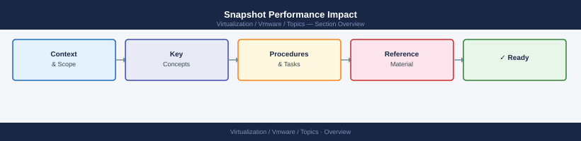

---
tags:
  - vmware
---
# Snapshot Performance Impact


<div class="kb-summary">
Snapshots are a write-redirect mechanism — they do not freeze data, they redirect writes to a delta disk. This has measurable performance and operational consequences.

*Applies to: vSphere 7.x / 8.x*
</div>



```d2
direction: right

center: "Snapshot Impact" {shape: hexagon}
how_snapshots_work: "How Snapshots Work" {shape: rectangle}
performance_impact_by_chain_depth: "Performance Impact by Chain Depth" {shape: rectangle}
detecting_snapshot_issues: "Detecting Snapshot Issues" {shape: rectangle}
consolidation_warnings: "Consolidation Warnings" {shape: rectangle}
esxtop_identifying_snapshot_latency: "esxtop — Identifying Snapshot Latency" {shape: rectangle}
backupinduced_snapshots: "Backup-Induced Snapshots" {shape: rectangle}

center -> how_snapshots_work
center -> performance_impact_by_chain_depth
center -> detecting_snapshot_issues
center -> consolidation_warnings
center -> esxtop_identifying_snapshot_latency
center -> backupinduced_snapshots
```

## How Snapshots Work

```text
Base VMDK (read-only once snapshot exists)
  └── Delta disk (-000001.vmdk) — all new writes go here
        └── Delta disk (-000002.vmdk) — if a second snapshot is taken
```

Every read must check whether the block exists in the delta chain before falling back to the base disk. Chain depth increases read latency.

## Performance Impact by Chain Depth

| Snapshot Depth | Typical IOPS Impact | Typical Latency Impact |
|---|---|---|
| 1 snapshot | 5–10% overhead | Minimal |
| 2–3 snapshots | 10–25% overhead | Noticeable on I/O-intensive VMs |
| 4+ snapshots | 25–50%+ overhead | Significant; backup tools may create multi-snapshot chains |
| 32 snapshots | VMware-imposed maximum | Near-unusable for write-heavy workloads |

## Detecting Snapshot Issues

```powershell
# List all VMs with snapshots, sorted by snapshot count
Get-VM | Where-Object { $_.ExtensionData.Snapshot -ne $null } |
    Select-Object Name,
        @{N="SnapCount"; E={ ($_ | Get-Snapshot | Measure-Object).Count }},
        @{N="OldestSnap"; E={ ($_ | Get-Snapshot | Sort-Object Created | Select-Object -First 1).Created }} |
    Sort-Object SnapCount -Descending

# Flag snapshots older than 3 days
Get-VM | Get-Snapshot | Where-Object { $_.Created -lt (Get-Date).AddDays(-3) } |
    Select-Object VM, Name, Created, SizeGB
```

## Consolidation Warnings

```powershell
# Find VMs needing consolidation (orphaned delta files present)
Get-VM | Where-Object { $_.ExtensionData.Runtime.ConsolidationNeeded -eq $true } |
    Select-Object Name

# Trigger consolidation
Get-VM "vm-name" | Get-View | Invoke-Method -Name ConsolidateVMDisks_Task
```

## esxtop — Identifying Snapshot Latency

```bash
# Connect to host, run esxtop in disk mode
esxtop
# Press 'u' for disk view
# Look for GAVG (guest average latency) > 25ms and DAVG (device latency) > 15ms
# Compare VMs with/without snapshots for correlation
```

## Backup-Induced Snapshots

Backup tools (Veeam, NBU, Commvault) create and delete a snapshot per job run. If the delta disk grows large during backup and consolidation is slow:

- I/O is redirected to the delta for the entire backup window.
- Consolidation after backup can cause a "stun" (VM pause of 1–30 seconds) while delta is merged.

```powershell
# Monitor consolidation task progress
Get-Task | Where-Object { $_.Name -match "ConsolidateVM" } |
    Select-Object ObjectId, State, PercentComplete, StartTime
```

## Storage Impact

```powershell
# Check total snapshot disk consumption per datastore
Get-Datastore | ForEach-Object {
    $ds = $_
    $snaps = Get-VM -Datastore $ds | Get-Snapshot
    [PSCustomObject]@{
        Datastore     = $ds.Name
        FreeSpaceGB   = [math]::Round($ds.FreeSpaceGB, 1)
        SnapshotCount = ($snaps | Measure-Object).Count
        SnapshotSizeGB= [math]::Round(($snaps | Measure-Object SizeGB -Sum).Sum, 1)
    }
}
```

## Policy and Remediation

| Threshold | Action |
|---|---|
| Snapshot > 3 days old | Alert; review with VM owner |
| Snapshot > 7 days old | Escalate; delete unless exception approved |
| Snapshot chain > 3 deep | Immediate remediation |
| Consolidation needed flag | Schedule consolidation in next maintenance window |
| Delta disk > 50% of base disk | Emergency — consolidate immediately |
