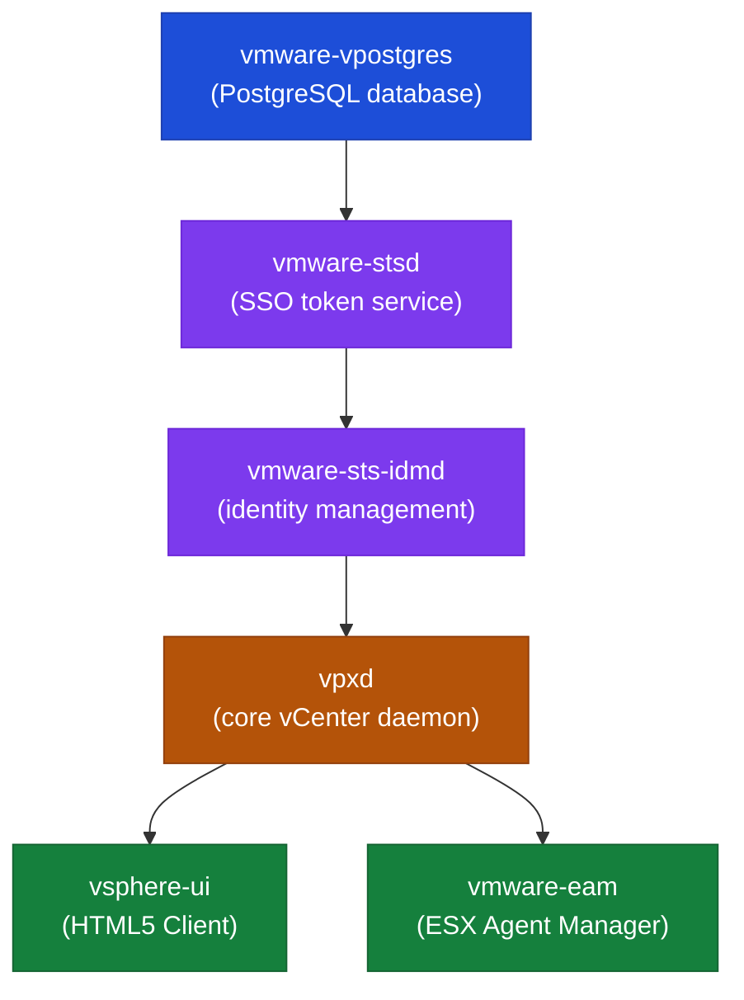

# vCenter Architecture — Components

## Platform Role

vCenter is the central management plane for VMware environments. It manages inventory, clusters, hosts, VMs, datastores, networks, permissions, alarms, tasks, events, and automation APIs.

## Core Services

| Service | Description |
|---|---|
| vCenter Server Appliance (VCSA) | The main management appliance; Photon OS-based |
| vpxd | Core vCenter daemon — inventory, scheduling, HA/DRS orchestration |
| vSphere Client | HTML5 web UI at `https://<vcenter>/ui` |
| Embedded PSC / SSO | Authentication, SSO domain, VMCA certificate authority, licensing |
| vPostgres (PostgreSQL) | Embedded database — vCenter inventory, events, tasks |
| Inventory Service | Object indexing and search |
| vAPI Endpoint | Modern REST API at `https://<vcenter>/api` |
| Lookup Service | Service registry for all vCenter components |
| Certificate Manager (VMCA) | Issues and renews certificates for VCSA and ESXi hosts |
| Task and Event Subsystem | Tracks all operations and changes |
| Backup Scheduler | Built-in file-based backup via VAMI |

## Main Dependencies

| Dependency | Notes |
|---|---|
| DNS | Forward and reverse resolution required for VCSA FQDN and all ESXi hosts |
| NTP | Time sync mandatory; skew > 5 minutes breaks Kerberos and SSO |
| Authentication Source | AD/LDAP identity source for user authentication |
| Management Network | VCSA must be reachable from all ESXi hosts on port 443; hosts reachable on 902 |
| Storage | VCSA runs as a VM; requires reliable datastore access |
| Certificate Trust | All services use TLS; expired certificates cascade into auth failures |
| Monitoring | Aria Operations or equivalent |
| Backup / Recovery | VAMI file-based backup or equivalent; tested restore procedure |
| Vendor Support | Broadcom support portal access for escalation |

## Ports and Protocols

| Use | Protocol | Port |
|---|---|---|
| vSphere Client / API | HTTPS | 443 |
| ESXi host management | HTTPS | 443 |
| ESXi host agent heartbeat | TCP/UDP | 902 |
| VCSA VAMI (appliance management) | HTTPS | 5480 |
| vCenter HA replication | TCP | 8443 |
| LDAP | TCP | 389 |
| LDAPS | TCP | 636 |
| Syslog | UDP/TCP | 514 |
| DNS | TCP/UDP | 53 |
| NTP | UDP | 123 |

## Key Logs

| Component | Log Path |
|---|---|
| vpxd (core vCenter service) | `/var/log/vmware/vpxd/vpxd.log` |
| vSphere Client | `/var/log/vmware/vsphere-ui/logs/vsphere_client_virgo.log` |
| SSO / identity | `/var/log/vmware/sso/vmware-sts-idmd.log` |
| SSO admin server | `/var/log/vmware/sso/ssoAdminServer.log` |
| vAPI endpoint | `/var/log/vmware/vapi/` |
| Appliance management (VAMI) | `/var/log/vmware/applmgmt/applmgmt.log` |
| Upgrade / patch | `/var/log/vmware/applmgmt/software-packages.log` |
| Certificate manager | `/var/log/vmware/vmcad/certificate-manager.log` |
| Postgres DB | `/var/log/vmware/vpostgres/postgresql-*.log` |

## Common Failure Points

- Expired certificates (machine SSL, STS signing, VMCA root)
- SSO or identity source failure (AD bind account, LDAP connectivity)
- Appliance partition full (`/storage/log`, `/storage/db`)
- vCenter service failure (vpxd, vmware-vpostgres)
- Host communication failure (vpxa agent stopped, certificate mismatch)
- Backup target failure (SFTP unreachable, credentials expired)
- DNS or NTP drift (causes cascading auth and certificate failures)
- Permission drift (unexpected access changes, lost admin access)

## Useful Commands

```bash
# Service management (VCSA SSH)
service-control --status
service-control --status --all
service-control --start vmware-vpostgres
service-control --start vpxd
service-control --stop --all
service-control --start --all

# Disk usage
df -h

# VECS certificate store
/usr/lib/vmware-vmafd/bin/vecs-cli store list
/usr/lib/vmware-vmafd/bin/vecs-cli entry list --store MACHINE_SSL_CERT --text | grep -E "Alias|Not After"

# SSO domain info
/usr/lib/vmware-vmafd/bin/vmafd-cli get-domain-name --server-name localhost
```

## Service Interdependencies

Understanding service startup dependencies matters during recovery. Services must start in the correct order or vpxd will fail to initialise.

```
vmware-vpostgres      ← must start first (database)
  └── vmware-stsd     ← SSO token service (depends on vmdir)
        └── vmware-sts-idmd   ← identity management
              └── vpxd        ← core vCenter daemon
                    └── vsphere-ui     ← HTML5 client
                    └── vmware-eam     ← ESX Agent Manager
```



If a manual restart is required:
```bash
# Stop all cleanly
service-control --stop --all

# Start in dependency order
service-control --start vmware-vpostgres
service-control --start vmware-stsd
service-control --start vmware-sts-idmd
service-control --start vpxd
service-control --start --all   # start remaining services

# Verify final state
service-control --status --all
```

## vCenter Processes on Photon OS

The VCSA runs Photon OS (a VMware-maintained minimal Linux distribution). Key system-level tools:

```bash
# List running processes
ps aux | grep -E "vpxd|postgres|java"

# Monitor system resource usage
top
vmstat 1 5

# Check Photon OS version
cat /etc/photon-release

# Check systemd service status (alternative to service-control)
systemctl status vmware-vpxd
systemctl status vmware-vpostgres

# Network connectivity
ss -tlnp                     # open listening ports
ip addr                      # interface and IP config
ping -c 4 <esxi-host-ip>    # basic reachability to ESXi
```

## Database (vPostgres) Operations

The embedded PostgreSQL instance stores all vCenter inventory, configuration, events, and tasks. Direct manipulation is rarely needed but useful during recovery diagnostics.

```bash
# Connect to the embedded database (VCSA shell)
/opt/vmware/vpostgres/current/bin/psql -U postgres -d VCDB

# Inside psql — list tables
\dt

# Check DB size
SELECT pg_size_pretty(pg_database_size('VCDB'));

# Count events (verify DB is intact)
SELECT COUNT(*) FROM vc_event;

# Exit
\q
```

Do not modify the vCenter database directly unless directed by VMware Support. The database schema is internal and subject to change between versions.

## vCenter REST API — Quick Reference

```bash
# Authenticate (returns session token)
TOKEN=$(curl -sk -u 'administrator@vsphere.local:<password>' \
    -X POST https://vcenter.corp.local/api/session | tr -d '"')

# Host inventory
curl -sk -H "vmware-api-session-id: $TOKEN" \
    "https://vcenter.corp.local/api/vcenter/host" | python3 -m json.tool

# VM inventory
curl -sk -H "vmware-api-session-id: $TOKEN" \
    "https://vcenter.corp.local/api/vcenter/vm" | python3 -m json.tool

# Cluster inventory
curl -sk -H "vmware-api-session-id: $TOKEN" \
    "https://vcenter.corp.local/api/vcenter/cluster" | python3 -m json.tool

# Power on a VM (replace <vm-id> with the VM moRef, e.g. vm-42)
curl -sk -H "vmware-api-session-id: $TOKEN" \
    -X POST "https://vcenter.corp.local/api/vcenter/vm/<vm-id>/power?action=start"

# System health
curl -sk -H "vmware-api-session-id: $TOKEN" \
    "https://vcenter.corp.local/api/vcenter/health/system"

# Delete session
curl -sk -H "vmware-api-session-id: $TOKEN" \
    -X DELETE https://vcenter.corp.local/api/session
```

The Swagger/OpenAPI UI is available at `https://<vcenter>/apiexplorer` for interactive exploration of all endpoints.
