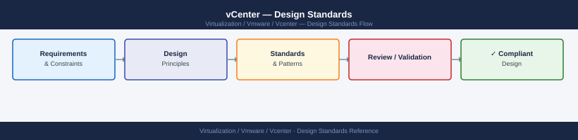

---
tags:
  - architecture
  - vcenter
  - vmware
  - vsphere-8
---
# vCenter — Design Standards

<div class="kb-summary">
Design Standards reference covering Naming Conventions, Cluster Configuration Baseline, vSAN Cluster Baseline (where applicable), vCenter Configuration Checklist, VM Template Standards and 6 more sections.

*Applies to: vSphere 7.x · 8.x*
</div>


## Naming Conventions

Consistent naming across the vSphere inventory is critical for readability, automation, and audit filtering.

| Object | Format | Example |
|---|---|---|
| Datacenter | `DC-<site>` | `DC-LON`, `DC-AMS` |
| Cluster | `CL-<site>-<function>` | `CL-LON-PROD`, `CL-AMS-DEV` |
| ESXi Host | `esxi-<nn>.<domain>` | `esxi-01.corp.example.com` |
| VMFS Datastore | `DS-VMFS-<array>-<nn>` | `DS-VMFS-PURE01-01` |
| NFS Datastore | `DS-NFS-<array>-<nn>` | `DS-NFS-NETAPP01-01` |
| vSAN Datastore | `DS-VSAN-<cluster>` | `DS-VSAN-CL-LON-PROD` |
| vDS | `VDS-<site>-<nn>` | `VDS-LON-01` |
| Port Group | `PG-<vlan>-<purpose>` | `PG-100-MGMT`, `PG-200-VMOTION` |
| Resource Pool | `RP-<tier>-<team>` | `RP-PROD-APP`, `RP-DEV-TEST` |
| vSphere Tag | `<category>:<value>` | `env:prod`, `tier:gold` |

## Cluster Configuration Baseline

### HA Settings

| Setting | Value | Notes |
|---|---|---|
| HA Enabled | Yes | Mandatory for production clusters |
| Admission Control | Cluster Resource Percentage | Reserve 25% CPU and memory |
| Host Failures to Tolerate | 1 | Increase to 2 for critical clusters |
| VM Monitoring | VM and Application | Requires VMware Tools |
| Datastore Heartbeating | 2 datastores | Select datastores on different arrays |
| VM Restart Priority | Medium (default) | Adjust per VM criticality |

### DRS Settings

| Setting | Value | Notes |
|---|---|---|
| DRS Enabled | Yes | Mandatory for production clusters |
| Automation Level | Fully Automated | Manual only acceptable in DR/test clusters |
| Migration Threshold | 3 (Conservative) | Adjust if vMotion noise is high |
| Predictive DRS | Enabled | Requires Aria Operations integration |
| VM Overrides | Per business requirement | Document in CMDB |

### vSphere HA Advanced Options (production)

Tools must report `running` status in vCenter. A stale or not-running Tools status blocks live migration.

## vNIC Type and Network Configuration

| Setting | Required Value |
|---|---|
| Network adapter type | VMXNET3 |
| E1000/E1000e | Not permitted on new builds |
| NIC count | One per network segment (no bonding in guest) |
| MAC address type | VMware-generated (do not set static MACs) |

Each VM connects to a named port group. Port group names follow the VLAN naming convention. Do not connect VMs directly to a vSwitch uplink.

PCI passthrough and SR-IOV are permitted only for workloads with documented performance requirements and approved by the platform team.

## Disk Provisioning Standards

| Scenario | Provisioning Type | Justification |
|---|---|---|
| Production VMs | Thick eager zeroed | Best performance, no lazy-zero latency |
| Staging/test VMs | Thin provisioned | Space efficiency acceptable |
| Templates | Thin provisioned | Templates are not run directly |
| Linked clones | Not permitted | Not used in standard builds |

All VM disks must reside on a vSphere datastore with sufficient free space. Alert threshold is 80% capacity; hard limit for new provisioning is 85%.

```bash
# Recommended disk layout
Disk 1: OS        50 GB   thick eager zeroed
Disk 2: Data      varies  thick eager zeroed
Disk 3: Swap/page 8 GB    thick eager zeroed (Windows only)
```


```text title="Expected output"
(no output — command completes silently)
```
Do not store data on the OS VMDK. Separate OS and data disks from day one.

## Snapshot Policy

Snapshots are a temporary operational tool, not a backup mechanism.

| Rule | Requirement |
|---|---|
| Maximum active snapshots per VM | 1 |
| Maximum snapshot age (production) | 48 hours |
| Maximum snapshot age (non-production) | 7 days |
| Snapshot before patching | Permitted; must be deleted within 48 hours of successful patch |
| Snapshots on SQL/Oracle VMs | Only with application-consistent pre-freeze scripts |

Stale snapshots (older than the limit) are reported daily. After 7 days overdue, snapshots are deleted automatically with prior notification to the VM owner.

Never use snapshots as a substitute for a tested backup and restore process.

## Resource and DRS Configuration

All production VMs must be placed in a DRS-enabled cluster. DRS automation level: fully automated.

vCPU and memory allocations must be sized to the approved tier:

| Tier | vCPU | RAM |
|---|---|---|
| Small | 2 | 4 GB |
| Medium | 4 | 8 GB |
| Large | 8 | 16 GB |
| XL | 16 | 32 GB |
| Custom | Requires platform team sign-off | — |

CPU and memory hot-add must be enabled on all VMs to allow online scaling without a maintenance window. Confirm in VM settings: `Edit Settings > VM Options > Memory/CPU Hot Plug`.

## See also

- [vCenter — How It Works](../how-it-works/)
- [vCenter — Deploy](../../deploy/)
