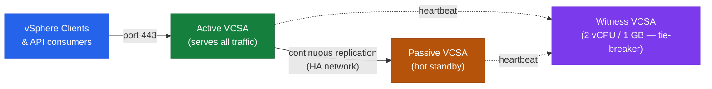
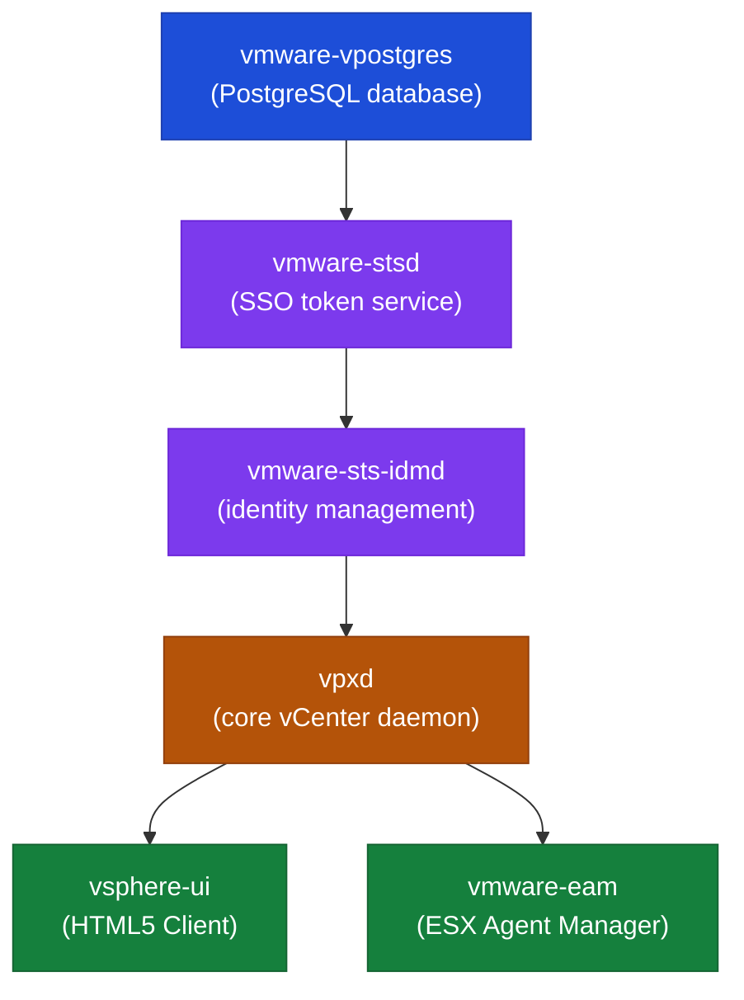

# vCenter — How It Works


<div class="kb-summary">
How It Works reference covering Deployment Model, Core Services, Main Dependencies, vCenter HA (VCHA), Service Startup Order and 7 more sections.
</div>

## Deployment Model

vCenter Server is delivered as the **vCenter Server Appliance (VCSA)** — a Photon OS-based virtual appliance. Since vCenter 7.0, the Platform Services Controller (PSC) is embedded directly in the appliance (external PSC is deprecated). The embedded database is PostgreSQL.

A single VCSA manages the full vSphere inventory: datacenters, clusters, hosts, VMs, datastores, networks, and policies.

## Core Services

| Service | Description |
|---|---|
| vCenter Server Appliance (VCSA) | The main management appliance; Photon OS-based |
| vpxd | Core vCenter daemon — inventory, scheduling, HA/DRS orchestration |
| vSphere Client | HTML5 web UI at `https://<vcenter>/ui` |
| Embedded PSC / SSO | Authentication, SSO domain, VMCA certificate authority, licensing |
| vPostgres (PostgreSQL) | Embedded database — vCenter inventory, events, tasks |
| vAPI Endpoint | Modern REST API at `https://<vcenter>/api` |
| Lookup Service | Service registry for all vCenter components |
| Certificate Manager (VMCA) | Issues and renews certificates for VCSA and ESXi hosts |
| Backup Scheduler | Built-in file-based backup via VAMI |

## Main Dependencies

| Dependency | Notes |
|---|---|
| DNS | Forward and reverse resolution required for VCSA FQDN and all ESXi hosts |
| NTP | Time sync mandatory; skew > 5 minutes breaks Kerberos and SSO |
| Authentication Source | AD/LDAP identity source for user authentication |
| Management Network | VCSA must be reachable from all ESXi hosts on port 443; hosts reachable on 902 |
| Storage | VCSA runs as a VM; requires reliable datastore access |
| Certificate Trust | All services use TLS; expired certificates cascade into auth failures |

---

## vCenter HA (VCHA)

VCHA provides active/passive failover for the VCSA itself. Three nodes required:

- **Active** — serves all management traffic
- **Passive** — hot standby, continuously replicates from active
- **Witness** — tie-breaker for split-brain; can be a small VM (2 vCPU / 1 GB RAM)

Shared storage is **not** required — replication is network-based over a dedicated HA network. Failover is automatic on active node failure; RPO is near-zero, RTO is typically under 60 seconds.


```
┌──────────────────────────────────── vCenter Server — How It Works ────────────────────────────────────┐
│                                                                                                       │
│  vCenter Server is the centralised management platform for vSphere; all                               │
│  ESXi hosts, VMs, clusters, and policies are controlled through its APIs.                             │
│                                                                                                       │
│   ┌──────────────────────────────────────────────┐  ┌─────────────────────────────────────────────┐   │
│   │                 Client Layer                 │  │             API / Service Layer             │   │
│   │          vSphere Client (HTML5 UI)           │  │             REST API + SOAP API             │   │
│   │             CLI: govc, PowerCLI              │  │           SSO token auth for calls          │   │
│   │            SDKs: Python, Go, Java            │  │             vCenter API gateway             │   │
│   │             vCenter Mob browser              │  │               Task / event bus              │   │
│   └──────────────────────────────────────────────┘  └─────────────────────────────────────────────┘   │
│                                                                                                       │
│  Client requests hit the API gateway; SSO validates the token before any operation.                   │
│                                                                                                       │
│                          ▼                                                 ▼                          │
│                                                                                                       │
│   ┌──────────────────────────────────────────────┐  ┌─────────────────────────────────────────────┐   │
│   │                Core Services                 │  │              Host Agent (vpxa)              │   │
│   │          Inventory: hosts/VMs/nets           │  │            Runs on each ESXi host           │   │
│   │            Scheduler: DRS/HA/DPM             │  │            Relays tasks to hostd            │   │
│   │            Storage: SDRS/profiles            │  │           Reports events up to VC           │   │
│   │           Postgres DB: full state            │  │           Reconnects on VC restart          │   │
│   └──────────────────────────────────────────────┘  └─────────────────────────────────────────────┘   │
│                                                                                                       │
│  Physical Infrastructure (the hardware everything above runs on):                                     │
│  vCenter Server Appliance (VCSA) runs as a Linux VM on an ESXi host; requires                         │
│  shared storage and management network reachability from all managed hosts.                           │
│                                                                                                       │
│  Key terms:                                                                                           │
│                                                                                                       │
│  VCSA          = vCenter Server Appliance; OVA-deployed Photon OS VM                                  │
│  vpxd          = vCenter Server daemon; core process; crash restarts service                          │
│  vpxa          = vCenter agent on each ESXi host; bridges host and vCenter                            │
│  hostd         = host daemon on ESXi; handles VM power ops, storage, network                          │
│  PSC           = Platform Services Controller; merged into VCSA 7.0+                                  │
│  SSO           = Single Sign-On; identity store; issues SAML tokens for API                           │
│  DRS           = Distributed Resource Scheduler; automates VM placement                               │
│  HA            = High Availability; restarts VMs on host failure automatically                        │
│  DPM           = Distributed Power Management; powers off idle hosts                                  │
│  SDRS          = Storage DRS; balances datastore utilisation automatically                            │
│  vDS           = vSphere Distributed Switch; managed centrally from vCenter                           │
│  Inventory     = hierarchical object tree: DC → cluster → host → VM                                   │
│                                                                                                       │
└───────────────────────────────────────────────────────────────────────────────────────────────────────┘
```

---

## Service Startup Order

Services must start in the correct dependency order or vpxd will fail to initialise:



```bash
# Manual restart in dependency order
service-control --stop --all
service-control --start vmware-vpostgres
service-control --start vmware-stsd
service-control --start vmware-sts-idmd
service-control --start vpxd
service-control --start --all

# Verify
service-control --status --all
```

---

## Sizing

| Deployment Size | Max Hosts | Max VMs | vCPU | RAM | Disk (OS + DB) |
|---|---|---|---|---|---|
| Tiny (lab) | 10 | 100 | 2 | 12 GB | 415 GB |
| Small | 100 | 1,000 | 4 | 19 GB | 480 GB |
| Medium | 400 | 4,000 | 8 | 28 GB | 700 GB |
| Large | 1,000 | 10,000 | 16 | 37 GB | 1,065 GB |
| X-Large | 2,000 | 35,000 | 24 | 56 GB | 1,805 GB |

Sizing is set at deploy time and can be changed by modifying vCPU/RAM after deployment (requires reboot). Disk partitions can be expanded online.

---

## Failure Domains

| Failure | Impact | Recovery |
|---|---|---|
| vCenter failure | Hosts and VMs continue running; HA/DRS stop; no management plane | Restore VCSA from backup or VCHA failover |
| PSC/SSO failure | Authentication failures; vSphere Client inaccessible | Restart SSO services; fix identity source |
| Database failure | vCenter services crash | Restore from last backup |
| VCHA passive failure | No impact to active; witness still provides quorum | Repair passive before next failover |
| Partition full (`/storage/log`) | vCenter services may crash or stop logging | Free space; rotate/archive logs |

---

## Ports and Protocols

| Use | Protocol | Port |
|---|---|---|
| vSphere Client / API | HTTPS | 443 |
| ESXi host agent heartbeat | TCP/UDP | 902 |
| VCSA VAMI (appliance management) | HTTPS | 5480 |
| vCenter HA replication | TCP | 8443 |
| LDAP | TCP | 389 |
| LDAPS | TCP | 636 |
| Syslog | UDP/TCP | 514 |
| DNS | TCP/UDP | 53 |
| NTP | UDP | 123 |

---

## Key Logs

| Component | Log Path |
|---|---|
| vpxd (core service) | `/var/log/vmware/vpxd/vpxd.log` |
| vSphere Client | `/var/log/vmware/vsphere-ui/logs/vsphere_client_virgo.log` |
| SSO / identity | `/var/log/vmware/sso/vmware-sts-idmd.log` |
| SSO admin server | `/var/log/vmware/sso/ssoAdminServer.log` |
| VAMI | `/var/log/vmware/applmgmt/applmgmt.log` |
| Upgrade / patch | `/var/log/vmware/applmgmt/software-packages.log` |
| Certificate manager | `/var/log/vmware/vmcad/certificate-manager.log` |
| Postgres DB | `/var/log/vmware/vpostgres/postgresql-*.log` |

---

## Useful Commands

```bash
# Service status
service-control --status --all

# Disk usage
df -h

# VECS certificate store — check expiry
/usr/lib/vmware-vmafd/bin/vecs-cli entry list --store MACHINE_SSL_CERT --text | grep -E "Alias|Not After"

# SSO domain info
/usr/lib/vmware-vmafd/bin/vmafd-cli get-domain-name --server-name localhost

# System resource usage
top
vmstat 1 5

# Network — open listening ports
ss -tlnp

# Photon OS version
cat /etc/photon-release
```

---

## Database Operations

```bash
# Connect to embedded PostgreSQL
/opt/vmware/vpostgres/current/bin/psql -U postgres -d VCDB

# Inside psql
\dt                                          # list tables
SELECT pg_size_pretty(pg_database_size('VCDB'));  # check DB size
SELECT COUNT(*) FROM vc_event;               # verify DB is intact
\q
```

Do not modify the vCenter database directly unless directed by VMware Support.

---

## REST API Quick Reference

```bash
# Authenticate
TOKEN=$(curl -sk -u 'administrator@vsphere.local:<password>' \
    -X POST https://vcenter.example.local/api/session | tr -d '"')

# Host inventory
curl -sk -H "vmware-api-session-id: $TOKEN" \
    "https://vcenter.example.local/api/vcenter/host" | python3 -m json.tool

# VM inventory
curl -sk -H "vmware-api-session-id: $TOKEN" \
    "https://vcenter.example.local/api/vcenter/vm" | python3 -m json.tool

# System health
curl -sk -H "vmware-api-session-id: $TOKEN" \
    "https://vcenter.example.local/api/vcenter/health/system"

# Delete session
curl -sk -H "vmware-api-session-id: $TOKEN" \
    -X DELETE https://vcenter.example.local/api/session
```

Swagger UI: `https://<vcenter>/apiexplorer`


---

## vCenter HA (VCHA) — Topology


---

## Identity Federation (vSphere 8)


---

## VM Encryption — Key Hierarchy


---

## Content Library — Publish & Subscribe

```
┌─────────────────────────── Content Library — Publish & Subscribe Topology ────────────────────────────┐
│                                                                                                       │
│  A published library exposes its catalogue over HTTPS. Subscribed libraries on any                    │
│  vCenter instance sync the content locally, enabling fast VM deployment without cross-site I/O.       │
│                                                                                                       │
│   ┌──────────────────────────────────────────────┐  ┌─────────────────────────────────────────────┐   │
│   │      Published Library (source vCenter)      │  │     Subscribed Library (target vCenter)     │   │
│  ─────────────────────────────────────────────────────────────────────────────────────────            │
│   │ Contains: OVF/OVA templates                  │  │ Subscribes to published HTTPS URL           │   │
│   │   VM templates (native format)               │  │ Sync policy: on-demand or immediate         │   │
│   │   ISO images                                 │  │ Content cached locally on datastore         │   │
│   │   Scripts and files                          │  │ VM deploy uses local copy — fast            │   │
│   │ Publication endpoint: HTTPS URL              │  │ Read-only — changes made at source          │   │
│   │ HTTPS + optional password                    │  │ Multiple subscribers supported              │   │
│   │                                              │  │                                             │   │
│   └──────────────────────────────────────────────┘  └─────────────────────────────────────────────┘   │
│                                                                                                       │
│    Published → Subscribed sync flow:                                                                  │
│      1.  Admin creates local library → enables "Published" checkbox → gets HTTPS URL                  │
│      2.  On target vCenter: New Subscribed Library → paste URL → set sync policy                      │
│      3.  Initial full sync downloads all items to target datastore                                    │
│      4.  Updates: source library changes → subscribers detect delta → sync diff only                  │
│      5.  Deploy VM from subscribed library = pulls from local datastore copy                          │
│                                                                                                       │
│    OVF template  = Open Virtualisation Format; portable VM descriptor + disk(s)                       │
│    On-demand     = content downloaded only when needed for deployment                                 │
│    Immediate     = content synced as soon as source library updates                                   │
│    ISO sync      = entire ISO downloaded; large files sync in background                              │
│                                                                                                       │
└───────────────────────────────────────────────────────────────────────────────────────────────────────┘
```

---

## Resource Pools — Shares, Limits & Reservations

```
┌─────────────────────────── Resource Pools — Shares, Limits & Reservations ────────────────────────────┐
│                                                                                                       │
│  Resource pools create a hierarchy of guaranteed and throttled resource entitlements.                 │
│  Shares determine proportional access when contention exists; limits cap usage absolutely.            │
│                                                                                                       │
│    Cluster root  (all hosts combined: e.g. 128 pCPU, 1024 GB RAM)                                     │
│    │                                                                                                  │
│    ├── Resource Pool: Production  [shares: High 8000, limit: none, reservation: 64 GHz]               │
│    │     │  VMs here guaranteed 64 GHz floor; can burst to cluster max                                │
│    │     ├── VM-Prod-1  (4 vCPU, reservation: 4 GHz)                                                  │
│    │     └── VM-Prod-2  (8 vCPU, no reservation)                                                      │
│    │                                                                                                  │
│    ├── Resource Pool: Dev  [shares: Normal 4000, limit: 32 GHz, reservation: none]                    │
│    │     │  VMs capped at 32 GHz total even if cluster is idle                                        │
│    │     └── VM-Dev-1  (2 vCPU, no reservation or limit)                                              │
│    │                                                                                                  │
│    └── Resource Pool: Test  [shares: Low 2000, limit: 16 GHz, reservation: none]                      │
│          │  During contention: Prod gets 2x Dev shares, 4x Test shares                                │
│          └── VM-Test-1  (2 vCPU, limit: 2 GHz — hard cap always enforced)                             │
│                                                                                                       │
│    Shares      = relative priority during contention; High:Normal:Low = 4:2:1                         │
│    Reservation = guaranteed minimum CPU/mem; cluster must be able to meet all reservations            │
│    Limit       = hard ceiling on usage; never exceeded even if resources are free                     │
│    Expandable  = if set, child pool can borrow from parent when parent has slack                      │
│    Overhead    = vSphere reserves CPU/mem for VMkernel overhead per running VM                        │
│                                                                                                       │
└───────────────────────────────────────────────────────────────────────────────────────────────────────┘
```

---

## vMotion Types — Comparison

```
┌─────────────────────────────── VM Migration — vMotion Type Comparison ────────────────────────────────┐
│                                                                                                       │
│    Type                  VM State     What Moves           Storage         vCenter                    │
│    ────────────────────────────────────────────────────────────────────────────────────               │
│    vMotion               Powered ON   CPU + memory state   Stays on same   Same SSO                   │
│                                       vNIC reconnects      datastore       domain                     │
│                                       < 1 s downtime                                                  │
│                                                                                                       │
│    Storage vMotion       Powered ON   VMDK files (live)    Moves to new    Same SSO                   │
│    (svMotion)                         VM stays running     datastore       domain                     │
│                                       Mirror → switch                                                 │
│                                                                                                       │
│    Cold Migration        Powered OFF  All VM files         Moves (opt.)    Same or                    │
│                                       .vmx .vmdk .nvram    New datastore   cross-VC                   │
│                                       No memory to xfer    or same                                    │
│                                                                                                       │
│    Cross-vCenter Export  Powered OFF  All VM files         Moves           Different                  │
│    (cross-VC vMotion*)   (or ON**)    Registered at dest   Optional        vCenters                   │
│    * Enhanced linked mode required for powered-on cross-VC vMotion (xvMotion)                         │
│                                                                                                       │
│    vMotion requirements: shared storage visible from both hosts; same L2 or vDS port group;           │
│      compatible CPU families (or EVC mode enabled); sufficient memory on target host.                 │
│                                                                                                       │
│    vMotion    = live migration of running VM between hosts; no storage move                           │
│    svMotion   = live storage migration; VM stays on same host; VMDK mirrored then cut                 │
│    EVC        = Enhanced vMotion Compatibility; masks CPU features for cross-gen moves                │
│    xvMotion   = cross-vCenter vMotion (powered-on); requires Enhanced Linked Mode                     │
│                                                                                                       │
└───────────────────────────────────────────────────────────────────────────────────────────────────────┘
```

---

## DRS — Placement & Balancing Logic

```
┌────────────────────────────────── DRS — Placement & Balancing Logic ──────────────────────────────────┐
│                                                                                                       │
│   ┌──────────────────────────────────────────────┐  ┌─────────────────────────────────────────────┐   │
│   │       Initial Placement (VM power-on)        │  │       Ongoing Balancing (every 5 min)       │   │
│  ─────────────────────────────────────────────────────────────────────────────────────────            │
│   │ DRS scores all eligible hosts                │  │ Measures host resource utilisation          │   │
│   │ Prefers host with most headroom              │  │ Calculates cluster imbalance score          │   │
│   │ Respects: affinity rules,                    │  │ Generates migration recommendations         │   │
│   │  reservations, NUMA topology                 │  │ Weighs move cost vs. benefit gained         │   │
│   │ Picks best-scored host,                      │  │ Applies recs per automation level:          │   │
│   │  powers on VM there                          │  │  Manual / Partial / Fully Automated         │   │
│   │                                              │  │                                             │   │
│   └──────────────────────────────────────────────┘  └─────────────────────────────────────────────┘   │
│                                                                                                       │
│    Automation levels:                                                                                 │
│      Manual          — DRS generates recommendations; admin reviews and applies each                  │
│      Partially Auto  — Auto power-on placement; manual approval for ongoing balancing                 │
│      Fully Automated — Auto placement + auto migration; threshold 1 (aggr) – 5 (cons)                 │
│                                                                                                       │
│    Affinity / Anti-affinity rules:                                                                    │
│      VM-VM affinity      — keep these VMs on the same host (HA pair, licensing)                       │
│      VM-VM anti-affinity — keep these VMs on different hosts (HA separation)                          │
│      VM-Host affinity    — prefer or require VMs on specific hosts (licensing, hardware)              │
│                                                                                                       │
│    DRS     = Distributed Resource Scheduler; runs in vCenter; uses vMotion to balance                 │
│    Score   = per-host metric: 0 (ideal) to 100 (overloaded); DRS targets uniform score                │
│    Imbal.  = deviation of host scores from cluster average; triggers migration at threshold           │
│    DPM     = Distributed Power Management; companion to DRS; powers off idle hosts                    │
│                                                                                                       │
└───────────────────────────────────────────────────────────────────────────────────────────────────────┘
```
