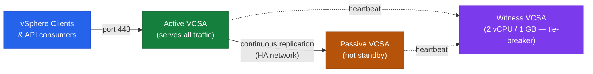
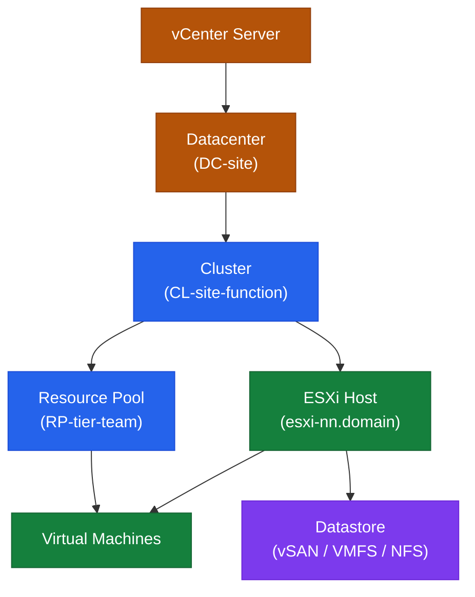
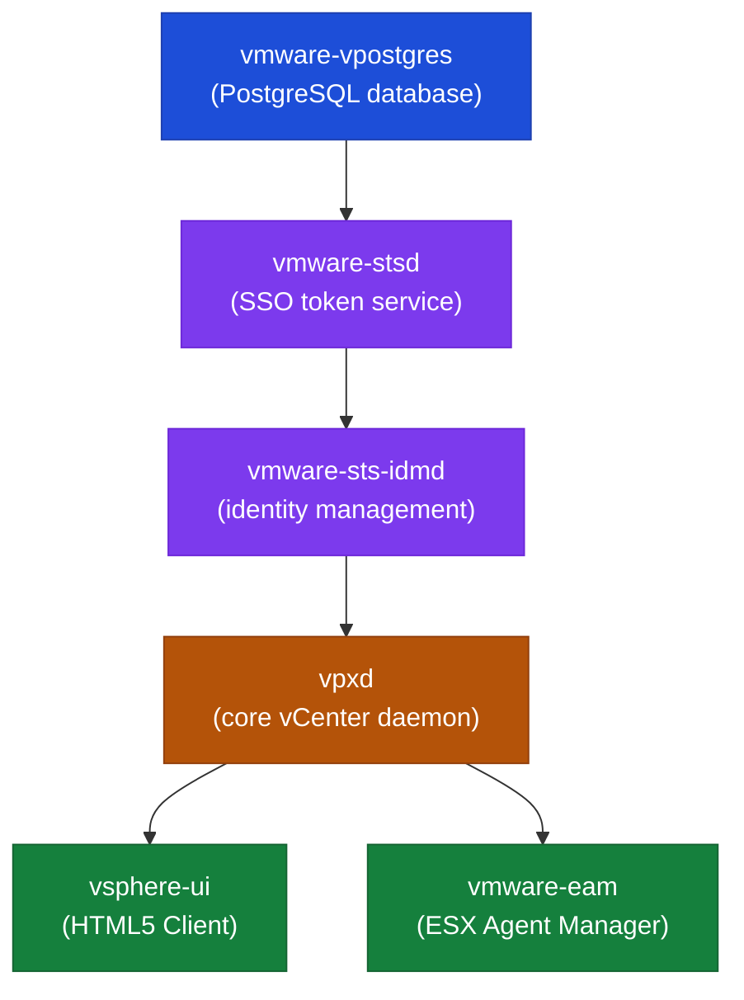

# vCenter — How It Works

## Deployment Model

vCenter Server is delivered as the **vCenter Server Appliance (VCSA)** — a Photon OS-based virtual appliance. Since vCenter 7.0, the Platform Services Controller (PSC) is embedded directly in the appliance (external PSC is deprecated). The embedded database is PostgreSQL.

A single VCSA manages the full vSphere inventory: datacenters, clusters, hosts, VMs, datastores, networks, and policies.

## Core Services

| Service | Description |
|---|---|
| vCenter Server Appliance (VCSA) | The main management appliance; Photon OS-based |
| vpxd | Core vCenter daemon — inventory, scheduling, HA/DRS orchestration |
| vSphere Client | HTML5 web UI at `https://<vcenter>/ui` |
| Embedded PSC / SSO | Authentication, SSO domain, VMCA certificate authority, licensing |
| vPostgres (PostgreSQL) | Embedded database — vCenter inventory, events, tasks |
| vAPI Endpoint | Modern REST API at `https://<vcenter>/api` |
| Lookup Service | Service registry for all vCenter components |
| Certificate Manager (VMCA) | Issues and renews certificates for VCSA and ESXi hosts |
| Backup Scheduler | Built-in file-based backup via VAMI |

## Main Dependencies

| Dependency | Notes |
|---|---|
| DNS | Forward and reverse resolution required for VCSA FQDN and all ESXi hosts |
| NTP | Time sync mandatory; skew > 5 minutes breaks Kerberos and SSO |
| Authentication Source | AD/LDAP identity source for user authentication |
| Management Network | VCSA must be reachable from all ESXi hosts on port 443; hosts reachable on 902 |
| Storage | VCSA runs as a VM; requires reliable datastore access |
| Certificate Trust | All services use TLS; expired certificates cascade into auth failures |

---

## vCenter HA (VCHA)

VCHA provides active/passive failover for the VCSA itself. Three nodes required:

- **Active** — serves all management traffic
- **Passive** — hot standby, continuously replicates from active
- **Witness** — tie-breaker for split-brain; can be a small VM (2 vCPU / 1 GB RAM)

Shared storage is **not** required — replication is network-based over a dedicated HA network. Failover is automatic on active node failure; RPO is near-zero, RTO is typically under 60 seconds.



---

## Logical Hierarchy

```text
vCenter Server
└── Datacenter (DC-<site>)
    ├── Cluster (CL-<site>-<function>)
    │   ├── ESXi Host (esxi-01.<domain>)
    │   │   └── VMs
    │   └── vSAN Datastore / VMFS / NFS
    └── Standalone Host (uncommon in production)
```

Resource pools, vSphere tags, and content libraries are vCenter-level constructs applied within this hierarchy.



---

## Service Startup Order

Services must start in the correct dependency order or vpxd will fail to initialise:



```bash
# Manual restart in dependency order
service-control --stop --all
service-control --start vmware-vpostgres
service-control --start vmware-stsd
service-control --start vmware-sts-idmd
service-control --start vpxd
service-control --start --all

# Verify
service-control --status --all
```

---

## Sizing

| Deployment Size | Max Hosts | Max VMs | vCPU | RAM | Disk (OS + DB) |
|---|---|---|---|---|---|
| Tiny (lab) | 10 | 100 | 2 | 12 GB | 415 GB |
| Small | 100 | 1,000 | 4 | 19 GB | 480 GB |
| Medium | 400 | 4,000 | 8 | 28 GB | 700 GB |
| Large | 1,000 | 10,000 | 16 | 37 GB | 1,065 GB |
| X-Large | 2,000 | 35,000 | 24 | 56 GB | 1,805 GB |

Sizing is set at deploy time and can be changed by modifying vCPU/RAM after deployment (requires reboot). Disk partitions can be expanded online.

---

## Failure Domains

| Failure | Impact | Recovery |
|---|---|---|
| vCenter failure | Hosts and VMs continue running; HA/DRS stop; no management plane | Restore VCSA from backup or VCHA failover |
| PSC/SSO failure | Authentication failures; vSphere Client inaccessible | Restart SSO services; fix identity source |
| Database failure | vCenter services crash | Restore from last backup |
| VCHA passive failure | No impact to active; witness still provides quorum | Repair passive before next failover |
| Partition full (`/storage/log`) | vCenter services may crash or stop logging | Free space; rotate/archive logs |

---

## Ports and Protocols

| Use | Protocol | Port |
|---|---|---|
| vSphere Client / API | HTTPS | 443 |
| ESXi host agent heartbeat | TCP/UDP | 902 |
| VCSA VAMI (appliance management) | HTTPS | 5480 |
| vCenter HA replication | TCP | 8443 |
| LDAP | TCP | 389 |
| LDAPS | TCP | 636 |
| Syslog | UDP/TCP | 514 |
| DNS | TCP/UDP | 53 |
| NTP | UDP | 123 |

---

## Key Logs

| Component | Log Path |
|---|---|
| vpxd (core service) | `/var/log/vmware/vpxd/vpxd.log` |
| vSphere Client | `/var/log/vmware/vsphere-ui/logs/vsphere_client_virgo.log` |
| SSO / identity | `/var/log/vmware/sso/vmware-sts-idmd.log` |
| SSO admin server | `/var/log/vmware/sso/ssoAdminServer.log` |
| VAMI | `/var/log/vmware/applmgmt/applmgmt.log` |
| Upgrade / patch | `/var/log/vmware/applmgmt/software-packages.log` |
| Certificate manager | `/var/log/vmware/vmcad/certificate-manager.log` |
| Postgres DB | `/var/log/vmware/vpostgres/postgresql-*.log` |

---

## Useful Commands

```bash
# Service status
service-control --status --all

# Disk usage
df -h

# VECS certificate store — check expiry
/usr/lib/vmware-vmafd/bin/vecs-cli entry list --store MACHINE_SSL_CERT --text | grep -E "Alias|Not After"

# SSO domain info
/usr/lib/vmware-vmafd/bin/vmafd-cli get-domain-name --server-name localhost

# System resource usage
top
vmstat 1 5

# Network — open listening ports
ss -tlnp

# Photon OS version
cat /etc/photon-release
```

---

## Database Operations

```bash
# Connect to embedded PostgreSQL
/opt/vmware/vpostgres/current/bin/psql -U postgres -d VCDB

# Inside psql
\dt                                          # list tables
SELECT pg_size_pretty(pg_database_size('VCDB'));  # check DB size
SELECT COUNT(*) FROM vc_event;               # verify DB is intact
\q
```

Do not modify the vCenter database directly unless directed by VMware Support.

---

## REST API Quick Reference

```bash
# Authenticate
TOKEN=$(curl -sk -u 'administrator@vsphere.local:<password>' \
    -X POST https://vcenter.example.local/api/session | tr -d '"')

# Host inventory
curl -sk -H "vmware-api-session-id: $TOKEN" \
    "https://vcenter.example.local/api/vcenter/host" | python3 -m json.tool

# VM inventory
curl -sk -H "vmware-api-session-id: $TOKEN" \
    "https://vcenter.example.local/api/vcenter/vm" | python3 -m json.tool

# System health
curl -sk -H "vmware-api-session-id: $TOKEN" \
    "https://vcenter.example.local/api/vcenter/health/system"

# Delete session
curl -sk -H "vmware-api-session-id: $TOKEN" \
    -X DELETE https://vcenter.example.local/api/session
```

Swagger UI: `https://<vcenter>/apiexplorer`
