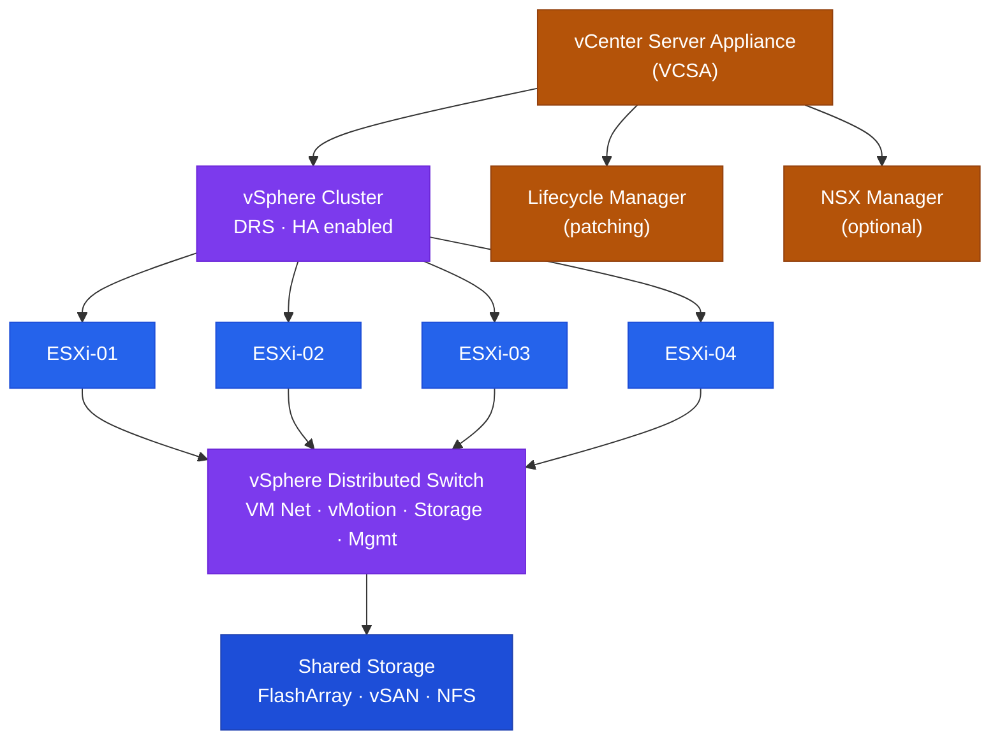

# vCenter — Architecture

vCenter Server is the management plane for VMware vSphere, deployed as the VCSA appliance. It supports standard single-node, vCenter HA (3-node active/passive/witness), and Enhanced Linked Mode topologies.

vCenter Server is the management plane for VMware vSphere. It is deployed as the VCSA appliance and supports several topology options depending on scale and resilience requirements.

| Deployment | Description | Use Case |
|---|---|---|
| Standard VCSA | Single appliance, embedded PSC and DB | Standard production |
| vCenter HA (VCHA) | Active / Passive / Witness — 3 nodes | HA for the management plane |
| Enhanced Linked Mode | Multiple vCenters sharing one SSO domain | Multi-site / large-scale |
| vCenter Cloud Gateway | Connects on-prem to VMware Cloud | Hybrid cloud |

<a class="kb-card" href="how-it-works/"><strong>How It Works</strong>Core services, VCHA, logical hierarchy, service startup order, sizing, ports, and logs.</a>
<a class="kb-card" href="integrations/"><strong>Integrations</strong>Storage, NSX, identity, backup, and monitoring integrations.</a>
<a class="kb-card" href="design-standards/"><strong>Design Standards</strong>Naming conventions, cluster baseline, HA/DRS settings, VM standards, and snapshot policy.</a>

---

## vSphere Cluster Topology

