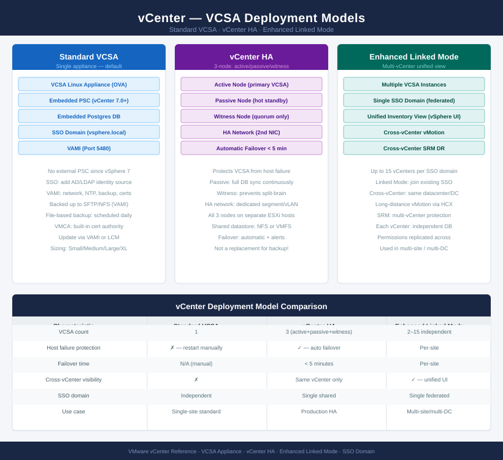

---
tags:
  - architecture
  - vcenter
  - vmware
  - vsphere-8
---
# vCenter — Architecture

vCenter Server is the management plane for VMware vSphere, deployed as the VCSA appliance. It supports standard single-node, vCenter HA (3-node active/passive/witness), and Enhanced Linked Mode topologies.

<a class="kb-card" href="how-it-works/">
  <strong>How It Works</strong>
  VCSA internals, SSO domain, inventory hierarchy, and vCenter HA.
</a>

<a class="kb-card" href="integrations/">
  <strong>Integrations</strong>
  AD/LDAP identity, NSX-T, Aria Operations, and backup targets.
</a>

<a class="kb-card" href="design-standards/">
  <strong>Design Standards</strong>
  Sizing, HA topology, certificate policy, and NTP requirements.
</a>

