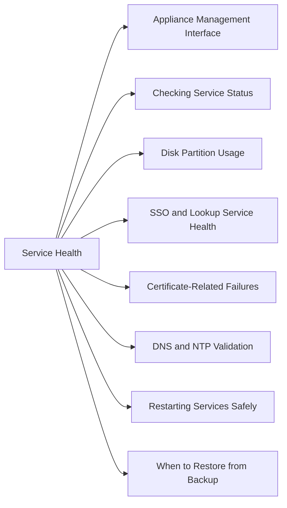

# vCenter Service Health



## Appliance Management Interface

- Log into the VCSA Appliance Management Interface (VAMI) at `https://<vcenter>:5480`
- Check CPU, memory, and disk usage
- Confirm all services are shown as healthy

## Checking Service Status

```bash
# SSH to vCenter, then:
service-control --status
```

## Disk Partition Usage

```bash
df -h
```

Key partitions to monitor:
- `/storage/log` — fills quickly during issues
- `/storage/db` — vCenter database
- `/storage/core` — core appliance data

## SSO and Lookup Service Health

- Confirm SSO is running: `service-control --status vmware-sts`
- Confirm Lookup Service: `service-control --status vmware-lookupsvc`
- Confirm Identity Management: `service-control --status vmware-eam`

## Certificate-Related Failures

- Browser certificate warning usually means the machine SSL cert is expired
- Login failures with SSO errors often point to the STS certificate
- Check certificate expiration in VAMI → Certificate Management

## DNS and NTP Validation

```bash
# Check DNS from vCenter appliance shell
nslookup <vcenter-fqdn>
dig <vcenter-fqdn>

# Check NTP status
timedatectl
```

## Restarting Services Safely

Only restart services after checking disk space and reviewing recent changes.

```bash
service-control --restart --all
```

> Restart one service at a time where possible. A full restart causes brief vCenter unavailability.

## When to Restore from Backup

- Corrupt database
- STS certificate failure that cannot be resolved in place
- Multi-service failure with no clear root cause
- Disk partition full with no recovery path

## Evidence to Collect Before Escalation

- `df -h` output
- `service-control --status` output
- Screenshots of VAMI health
- Recent vCenter events and tasks
- Support bundle from VAMI
