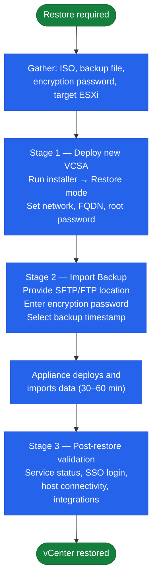

# vCenter — Backup & Restore

## Overview

vCenter backup is critical — without a working restore path the entire management plane is at risk. The VCSA ships with a built-in file-based backup mechanism accessible from the VAMI. This is the only officially supported backup method for the VCSA itself; VM-level snapshots of the appliance are not a substitute and are not supported for production restore.

---

## Backup Configuration (VAMI)

Access the Appliance Management Interface at `https://<vcenter>:5480` → **Backup**.

### Configuring a Scheduled Backup

1. Navigate to **Backup → Configure**
2. Set the **backup location** (protocol + destination):
   - `sftp://backup-server.corp.local/backups/vcenter` (recommended — encrypted in transit)
   - `ftps://`, `https://` also supported
3. Enter **backup server credentials** (username and password)
4. Set a **backup encryption password** — this is required for restore; store it in your password vault immediately
5. Enable **Schedule** → set to Daily at a low-activity time (e.g. 02:00)
6. Set **Retention** — minimum 3 copies; increase to 7 for production environments
7. Click **Save** and then **Back Up Now** to verify connectivity

### What the Backup Includes

The file-based backup captures:
- vCenter inventory database (PostgreSQL dump)
- Configuration data (SSO, identity sources, roles, permissions)
- Historical events and tasks (configurable inclusion)
- Certificates and VMCA state
- Alarm definitions and scheduled tasks

The backup does **not** capture:
- VM disks or VM data (VADP is used for those)
- ESXi host configurations (use Host Profiles for that)
- NSX configuration (NSX has its own backup)

### Backup Target Sizing

| Deployment Size | Approximate Backup Size |
|---|---|
| Small (< 100 hosts) | 2–5 GB per backup |
| Medium (100–400 hosts) | 5–15 GB per backup |
| Large (400–1000 hosts) | 15–40 GB per backup |

Allow 3–5x headroom for retention copies.

---

## Backup Verification

After configuring, verify:

```bash
# From VCSA shell — check the backup logs
tail -100 /var/log/vmware/applmgmt/backup.log

# Check last backup timestamp and result in VAMI UI:
# https://<vcenter>:5480 → Backup → Last Backup Status
```

Include in weekly health check:
- Confirm last backup completed successfully (green status in VAMI)
- Confirm backup files exist on target (SSH to backup server and list directory)
- Confirm retention is working (old files being pruned)

### Alert on Backup Failure

Create a vCenter alarm or monitoring rule to alert if the backup job has not completed within 25 hours. Backup failure silently means no recovery path exists.

---

## Restore Procedure

Restore is a full appliance redeploy — you are deploying a new VCSA and importing the backup into it. The original VCSA must be powered off or removed before the restored appliance takes over.



### Prerequisites

- Encryption password (from your password vault)
- Access to the backup target (SFTP/FTP/HTTPS server with backup files)
- A target ESXi host or cluster to deploy the new VCSA onto
- VCSA ISO for the **same version** as the backup (or a supported upgrade version)
- DNS record for the vCenter FQDN pointing to the new IP (if changing)

### Stage 1 — Deploy the New VCSA

1. Mount the VCSA ISO on a Windows/Linux/macOS workstation
2. Launch the installer:
   - Windows: `\vcsa-ui-installer\win32\installer.exe`
   - Linux: `./vcsa-ui-installer/lin64/installer`
3. Select **Restore**
4. Step through the installer wizard:
   - Provide the target ESXi host credentials
   - Accept the SSL certificate of the target host
   - Configure network settings (IP, FQDN, gateway, DNS)
   - Set a new root password for the appliance

### Stage 2 — Import Backup Data

5. On the **Backup Details** screen:
   - Enter backup server protocol, address, and path
   - Enter backup server credentials
   - Enter the encryption password
   - Select the specific backup timestamp to restore from
6. The installer will connect to the backup target and validate the backup file
7. Confirm the restore preview and click **Finish**
8. The installer deploys the appliance, imports the backup, and starts services (typically 30–60 minutes)

### Stage 3 — Post-Restore Validation

```bash
# SSH to restored vCenter appliance

# Confirm all services started
service-control --status --all

# Check for any service failures
service-control --status vpxd
service-control --status vmware-vpostgres
service-control --status vmware-stsd

# Check disk usage
df -h
```

```powershell
# PowerCLI — confirm connection and inventory
Connect-VIServer -Server <vcenter-fqdn>
Get-VMHost | Select-Object Name, ConnectionState, PowerState
Get-Cluster | Select-Object Name, HAEnabled, DrsEnabled
```

Post-restore checklist:
- [ ] vSphere Client accessible at `https://<vcenter>/ui`
- [ ] SSO login working for both `administrator@vsphere.local` and AD accounts
- [ ] All ESXi hosts show Connected in vCenter
- [ ] DRS and HA active on all clusters
- [ ] Backup job reconfigured and tested on restored appliance
- [ ] NSX, Aria, and Veeam integrations verified
- [ ] VAMI accessible at `https://<vcenter>:5480`

---

## Recovery Scenarios

### When to Troubleshoot In Place

Troubleshoot first if:
- A single service (vpxd, vmware-sts) can be restarted successfully
- Disk space can be freed to restore normal function
- A single certificate or SSO issue can be repaired using `certificate-manager`
- Database is accessible and only needs a service restart

### When to Restore from Backup

Restore from backup if:
- PostgreSQL database is corrupt (vpxd fails to start with DB connection errors)
- STS signing certificate is expired and cannot be repaired in place
- Multiple services fail to start after full service restart attempt
- The appliance VM is unrecoverable (hardware failure, corrupt disk)
- Partition table or Photon OS is corrupt

### Recovery Time Estimates

| Recovery Path | Estimated RTO |
|---|---|
| Service restart (vpxd, STS) | 5–15 minutes |
| In-place certificate replacement | 30–60 minutes + maintenance window |
| Full restore from backup (small environment) | 60–90 minutes |
| Full restore from backup (large environment) | 2–4 hours |

---

## Certificates to Track Before Any Restore

| Certificate | Location | Risk if Expired |
|---|---|---|
| vCenter Machine SSL | VAMI → Certificate Management | Browser warnings, API failures |
| VMCA Root Certificate | VAMI → Certificate Management | Breaks all VMCA-issued certs |
| STS Certificate | vSphere Client → SSO → Certificates | Login failures platform-wide |
| Solution User Certificates | VAMI → Certificate Management | Service-to-service auth failures |
| NSX Manager Certificate | NSX Manager → System | NSX UI and API failures |
| Aria Endpoint Certificates | Aria Suite Lifecycle | Integration and access failures |

Review all certificate expiration dates monthly. Flag certificates expiring within 60 days for planned replacement. Escalate certificates expiring within 30 days as urgent.

---

## vCenter High Availability (vCHA) vs. Backup

vCHA provides active/passive failover but is **not a substitute for file-based backup**:

| Scenario | vCHA Protects? | Backup Protects? |
|---|---|---|
| Active node hardware failure | Yes — failover to passive | Yes (via restore) |
| Database corruption on active | No — replicated to passive | Yes |
| Accidental mass permission deletion | No — replicated to passive | Yes |
| Ransomware/OS corruption | No | Yes (if backup is offsite) |
| Site-level failure (both nodes) | No | Yes |

If vCHA is deployed, maintain file-based backup regardless. The backup encryption password must be stored off-site and separate from vCenter access.

---

## Backup Audit Evidence

For compliance or audit:
- Export backup history screenshot from VAMI → Backup
- Document backup target, schedule, retention, and encryption password storage location
- Record annual restore test results (date, time taken, issues found, validated by)
- Store all evidence in your ITSM or change management system

Recovery test cadence: test restore to a non-production environment at minimum annually, ideally every 6 months. Document time taken and any issues encountered.
