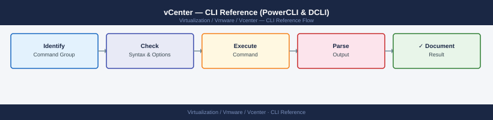

---
tags:
  - operations
  - vcenter
  - vmware
  - vsphere-8
---
# vCenter — CLI Reference (PowerCLI & DCLI)

<div class="kb-summary">
CLI Reference (PowerCLI & DCLI) reference covering Hosts, Clusters, Virtual Machines, Snapshots, Datastores and 3 more sections.

*Applies to: vSphere 7.x / 8.x*
</div>


---

## Before you begin

- **Access:** vCenter read-only minimum; Administrator role for remediation steps
- **Timing:** safe to run during business hours unless a step is marked ⚠ (causes interruption)
- **Dependencies:** no active upgrades or migrations on the same infrastructure
- **Logging:** capture command output — paste into the change record on completion

---

## Clusters

```powershell
Get-Cluster
Get-Cluster -Name <name>
Get-Cluster | Select-Object Name, HAEnabled, DrsEnabled, DrsAutomationLevel | Format-Table
Get-Cluster | Get-VMHost | Select-Object Name, State, @{N="Cluster";E={$_.Parent}} | Format-Table

# Create a new cluster
New-Cluster -Name <name> -Location (Get-Datacenter <dc>) -HAEnabled -DrsEnabled
```

---

## Virtual Machines

```powershell
# List
Get-VM
Get-VM -Name <name>
Get-VM | Where-Object { $_.PowerState -eq "PoweredOff" }
Get-VM | Select-Object Name, PowerState, NumCpu, MemoryGB, VMHost | Format-Table

# Power operations
Start-VM -VM <name>
Stop-VM -VM <name> -Confirm:$false
Shutdown-VMGuest -VM <name> -Confirm:$false
Restart-VM -VM <name> -Confirm:$false

# VM configuration
Get-VM <name> | Get-HardDisk
Get-VM <name> | Get-NetworkAdapter
Set-VM -VM <name> -NumCpu 4 -MemoryGB 16 -Confirm:$false

# Move VM (vMotion)
Move-VM -VM <name> -Destination (Get-VMHost <host>)
Move-VM -VM <name> -Datastore (Get-Datastore <ds>)

# Clone
New-VM -Name <new_name> -VM <source_vm> -VMHost <host> -Datastore <ds>
```

---

## Snapshots

```powershell
# List snapshots for a VM
Get-Snapshot -VM "<vm_name>"

# All snapshots sorted by size
Get-VM | Get-Snapshot |
    Select-Object @{N="VM";E={$_.VM.Name}}, Name, Created,
    @{N="SizeGB";E={[math]::Round($_.SizeGB, 2)}} |
    Sort-Object SizeGB -Descending

# Snapshots older than 7 days
Get-VM | Get-Snapshot |
    Where-Object { $_.Created -lt (Get-Date).AddDays(-7) } |
    Select-Object @{N="VM";E={$_.VM.Name}}, Name, Created,
    @{N="AgeDays";E={[math]::Round(((Get-Date) - $_.Created).TotalDays, 0)}}

# Create snapshots
New-Snapshot -VM "<vm_name>" -Name "pre-patch-$(Get-Date -Format yyyy-MM-dd)" `
    -Memory:$false -Quiesce:$false

# Remove snapshots
Remove-Snapshot `
    -Snapshot (Get-Snapshot -VM "<vm_name>" -Name "<snap_name>") `
    -Confirm:$false
Remove-Snapshot -VM "<vm_name>" -RemoveChildren -Confirm:$false   # all snapshots

# Revert to snapshot
Set-VM -VM "<vm_name>" `
    -Snapshot (Get-Snapshot -VM "<vm_name>" -Name "<snap_name>") `
    -Confirm:$false
```

---

## Datastores

```powershell
# All datastores with capacity and free space
Get-Datastore | Select-Object Name, CapacityGB, FreeSpaceGB,
    @{N="UsedPct";E={[math]::Round((1 - $_.FreeSpaceGB / $_.CapacityGB) * 100, 1)}} |
    Sort-Object UsedPct -Descending

# Datastores below 20% free
Get-Datastore | Where-Object { ($_.FreeSpaceGB / $_.CapacityGB) -lt 0.2 } |
    Select-Object Name, @{N="FreeGB";E={[math]::Round($_.FreeSpaceGB,1)}}

# VMs on a specific datastore
Get-Datastore -Name "<datastore_name>" | Get-VM | Select-Object Name, PowerState

# Export datastore report
Get-Datastore | Select-Object Name,
    @{N="CapacityGB";E={[math]::Round($_.CapacityGB,1)}},
    @{N="FreeGB";E={[math]::Round($_.FreeSpaceGB,1)}},
    @{N="UsedPct";E={[math]::Round((1 - $_.FreeSpaceGB / $_.CapacityGB) * 100, 1)}} |
    Sort-Object UsedPct -Descending |
    Export-Csv -Path datastores.csv -NoTypeInformation
```

---

## Alarms & Events

```powershell
# List all alarm definitions
Get-AlarmDefinition

# VMs with active triggered alarms
Get-VM | Where-Object { $_.ExtensionData.TriggeredAlarmState.Count -gt 0 } |
    Select-Object Name, @{N="Alarms";E={$_.ExtensionData.TriggeredAlarmState.Count}}

# Events
Get-VIEvent -MaxSamples 200 | Select-Object CreatedTime, UserName, FullFormattedMessage
Get-VIEvent -Start (Get-Date).AddHours(-24) | Select-Object CreatedTime, UserName, FullFormattedMessage

# Events for a specific VM
Get-VIEvent -Entity (Get-VM "<vm_name>") -MaxSamples 50 |
    Select-Object CreatedTime, FullFormattedMessage

# Error events only
Get-VIEvent -MaxSamples 1000 | Where-Object { $_.GetType().Name -match "Error|Fault" } |
    Select-Object CreatedTime, FullFormattedMessage
```

---

## Permissions & Roles

```powershell
# Roles
Get-VIRole
Get-VIRole -Name "ReadOnly" | Select-Object Name, PrivilegeList

# Permissions
Get-VIPermission
Get-VIPermission | Where-Object { $_.Principal -eq "<domain>\<user>" }

# Assign a role
New-VIPermission `
    -Entity (Get-Datacenter "<dc_name>") `
    -Principal "<domain>\<user>" `
    -Role (Get-VIRole "ReadOnly") `
    -Propagate:$true

# Audit: export all permissions
Get-VIPermission | Select-Object Entity, Principal, Role, IsGroup, Propagate |
    Export-Csv -Path vcenter_permissions.csv -NoTypeInformation

# Identify users with Administrator role
Get-VIPermission | Where-Object { $_.Role -eq "Admin" } |
    Select-Object Entity, Principal, Propagate
```

---

## vCenter Appliance (SSH)

```bash
# Service management
service-control --status
service-control --start --all
service-control --stop vpxd

# Disk usage
df -h

# Log locations
ls /var/log/vmware/vpxd/
tail -f /var/log/vmware/vpxd/vpxd.log
tail -f /var/log/vmware/vmdird/vmdird-syslog.log

# SSO / identity
/usr/lib/vmware-vmafd/bin/vmafd-cli get-domain-name --server-name localhost
/usr/lib/vmware-vmafd/bin/vmafd-cli get-ls-location --server-name localhost

# Certificate inventory
/usr/lib/vmware-vmafd/bin/vecs-cli store list
/usr/lib/vmware-vmafd/bin/vecs-cli entry list --store MACHINE_SSL_CERT
```


```text title="Expected output"
SERVICE STATUS
vpxd                                    running
vmdird                                  running
vmafdd                                  running
vsan-health                             running
vsphere-ui                              running
pschealth                               running

SERVICE START
Starting vpxd...
Starting vmdird...
Starting vmafdd...
Starting vsan-health...
Starting vsphere-ui...
All services started successfully.

STOP vpxd
Stopping vpxd...
vpxd stopped successfully.

DISK USAGE
Filesystem      Size  Used Avail Use% Mounted on
/dev/sda1       500G  287G  213G  58% /
/dev/sda2       100G   45G   55G  45% /storage
tmpfs            32G     0   32G   0% /dev/shm

LOG DIRECTORY
vpxd.log  vpxd-ui.log  vpxd-profiler.log  vpxd-stats.log

VPXD LOG (last 10 lines)
2024-01-15T09:42:17.123Z [vpxd 7654] [Originator@6876 sub=Default opID=52e4c8f9] [INFO] vCenter Server initialization complete
2024-01-15T09:42:18.456Z [vpxd 7654] [Originator@6876 sub=Hostd opID=52e4c8fa] [INFO] Connected to host esx-01.lab.local

VMDIRD LOG (last 5 lines)
2024-01-15T09:41:55.789Z [vmdird] [INFO] Directory server started on port 389
2024-01-15T09:42:01.234Z [vmdird] [INFO] Replication cycle completed

DOMAIN NAME
vsphere.local

LS LOCATION
cn=default-first-site,cn=Sites,cn=Configuration,dc=vsphere,dc=local

CERTIFICATE STORES
MACHINE_SSL_CERT
TRUSTED_ROOTS
TRUSTED_ROOT_CRLS
CRL
TRUSTED_MGMT_CA

MACHINE_SSL_CERT ENTRIES
Alias                          NotBefore           NotAfter            Issuer
machine-ssl                    Jan 10 2023         Jan 10 2026         CN=CA,DC=vsphere,DC=local
machine-ssl-old                Jan 10 2022         Jan 10 2025         CN=CA,DC=vsphere,DC=local
```

!!! warning "Common errors"
    **`service-control: command not found`** — Verify the vCenter Server is fully installed and /usr/lib/vmware-vmafd/bin is in PATH, or use full path `/usr/lib/vmware-vmafd/bin/service-control`.
    **`tail: cannot open '/var/log/vmware/vpxd/vpxd.log' for reading: No such file or directory`** — Ensure vpxd service is running with `service-control --start vpxd` and the log directory exists.
    **`Error: Cannot connect to server localhost`** — Verify vmdird and vmafdd services are running with `service-control --status` and check network connectivity to localhost.
---

## See also

- [vCenter — Procedures](../procedures/)
- [vCenter — Scripts](../scripts/)
- [vCenter — Health Checks](../health-checks/)

## Verify

- **Alarms:** vSphere Client → Home → Alarms — no new critical alarms after the operation
- **Events:** monitor the vCenter Events view for the affected object for 5 minutes
- **Health check:** run the morning health-check sequence for the affected product tier
