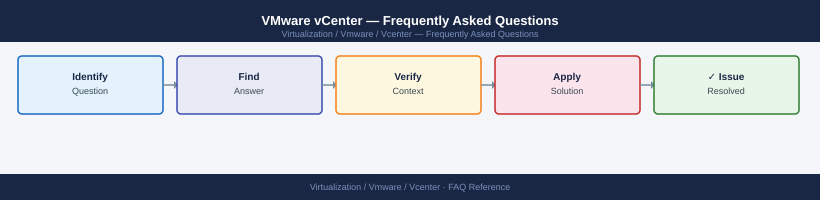

---
tags:
  - vcenter
  - faq
  - operations
---
# VMware vCenter — Frequently Asked Questions

<div class="kb-summary">
Common questions about VMware vCenter operations, configuration, and troubleshooting. For step-by-step procedures, see the <a href="index.md">Operations</a> section.
</div>



```d2
direction: right

hub: "vCenter Server\nOperations" {shape: hexagon}
general: "General" {shape: rectangle}
configuration: "Configuration" {shape: rectangle}
operations: "Operations" {shape: rectangle}
troubleshooting: "Troubleshooting" {shape: rectangle}
backup_and_recovery: "Backup and Recovery" {shape: rectangle}

hub -> general
hub -> configuration
hub -> operations
hub -> troubleshooting
hub -> backup_and_recovery
```

## General

**Q: What vCenter version is recommended for new deployments?**
A: vCenter 8.0 Update 3 is the current recommendation. Check: VCSA VAMI (https://vcenter:5480) → Summary → Version. vCenter must be at least equal to or newer than all managed ESXi hosts.

**Q: How do I check the current VMware vCenter version?**
A: `https://<vcenter>:5480 → Summary → Version`

## Configuration

**Q: What is the default SSO lockout policy and when should it change?**
A: Default SSO lockout is 5 failed attempts in 3 minutes, locked for 5 minutes. Align with your corporate password policy. Adjust via vCenter → Administration → Single Sign On → Configuration → Lockout Policy.

**Q: How do I enable vCenter HA for management plane redundancy?**
A: vCenter → Administration → vCenter HA → Set Up vCenter HA. Requires a dedicated HA network between active, passive, and witness nodes. VCHA provides automatic failover of vCenter with sub-minute RTO.

## Operations

**Q: What is the correct upgrade order when upgrading vCenter and ESXi?**
A: Always upgrade vCenter before ESXi hosts. vCenter N supports ESXi N-2, but not the reverse. After upgrading vCenter, upgrade hosts via vLCM. Test a single host first. Upgrade clusters one at a time.

**Q: What is the correct procedure to add a new PSC (legacy) or renew SSO after a cert change?**
A: For embedded VCSA (8.x): re-run `certificate-manager` (option 4 or 6). For vCenter HA, certificate renewal must be coordinated across all VCHA nodes. Refer to KB 2112283 for the certificate renewal order.

## Troubleshooting

**Q: vCenter shows 'SSL certificate will expire in 30 days'. What does it mean?**
A: The machine SSL certificate (used for vCenter API/HTTPS) is nearing expiry. Renew via VCSA VAMI → Certificate Management → Machine SSL Certificate → Renew. Schedule renewal during a maintenance window — vCenter services restart.

**Q: vCenter is slow and the vSphere Client takes a long time to load — where do I start?**
A: SSH to VCSA and check `top` for CPU/memory. Check disk space: `df -h`. Review vpxd logs: `tail -f /var/log/vmware/vpx/vpxd.log`. Check database health: `service-control --status vmware-vpostgres`. Large inventories may require VCSA large/xlarge sizing.

## Backup and Recovery

**Q: How often should I back up vCenter?**
A: Daily file-based backup via VCSA VAMI → Backup → Schedule. Remote SFTP/FTP/HTTP destination. Backup includes: database, config, and seat data. Test restore quarterly. Retain at least 7 daily backups.

**Q: Can I restore vCenter while VMs continue running on ESXi hosts?**
A: Yes — restore VCSA to a new appliance. VMs continue running on ESXi hosts independently. After restore, vCenter reconnects to ESXi hosts and discovers running VMs. Check vCenter HA config after restore if VCHA was in use.

## See Also

- [VMware vCenter Operations](index.md)
- [VMware vCenter Troubleshooting](../../../troubleshooting/index.md)
