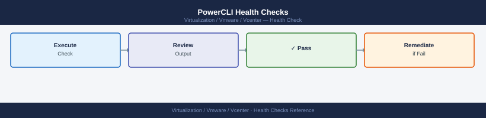

---
tags:
  - operations
  - vcenter
  - vmware
  - vsphere-8
---
# vCenter — Health Checks

<div class="kb-summary">
Health Checks reference covering Disk Partition Usage, SSO and Lookup Service Health, DNS and NTP Validation, PowerCLI Health Checks, Daily Checks and 2 more sections.

*Applies to: vSphere 7.x / 8.x*
</div>

## Before you begin

- **Access:** vCenter read-only minimum; Administrator role for remediation steps
- **Timing:** safe to run during business hours unless a step is marked ⚠ (causes interruption)
- **Dependencies:** no active upgrades or migrations on the same infrastructure
- **Logging:** capture command output — paste into the change record on completion

---

## Run This Routine

Run these commands in sequence for a complete vCenter health snapshot. Each block can be pasted directly into an SSH session on the VCSA appliance shell.

```bash
# 1. VCSA service health — list all services, filter out stopped ones
service-control --status --all | grep -v STOPPED

# 2. vCenter version and build number
vpxd --version

# 3. SSO / Lookup Service health
service-control --status vmware-sts
service-control --status vmware-lookupsvc

# 4. Certificate store list — inspect VECS stores for expiring certs
/usr/lib/vmware-vmafd/bin/vecs-cli store list

# 5. Disk usage — key VCSA partitions: DB, logs, seat data
df -h /storage/db /storage/log /storage/seat

# 6. vCenter HA state (run only if VCHA is deployed)
python3 /usr/lib/vmware-vcha/VcHaMgr.py state

# 7. NTP sync status — confirm clock is synchronised
timedatectl status

# 8. Connected host count via REST API
# Replace credentials before running
curl -sk -u 'administrator@vsphere.local:password' \
  https://localhost/api/vcenter/host | python3 -m json.tool | grep -c connection_state

# 9. Recent vpxd errors — last 100 lines of the main vCenter log
tail -100 /var/log/vmware/vpxd/vpxd.log | grep -i error

# 10. Backup job status — check VAMI file-based backup schedule
# Verify via VAMI at https://<vcenter>:5480 → Backup, or inspect cron
crontab -l 2>/dev/null | grep -i backup
```

Key partitions to monitor:
- `/storage/log` — fills quickly during issues
- `/storage/db` — vCenter database
- `/storage/core` — core appliance data

## SSO and Lookup Service Health


```bash
service-control --status vmware-sts
service-control --status vmware-lookupsvc
service-control --status vmware-eam
```

## DNS and NTP Validation


```bash
# Check DNS from vCenter appliance shell
nslookup <vcenter-fqdn>
dig <vcenter-fqdn>

# Check NTP status
timedatectl
```

## PowerCLI Health Checks



```powershell
# Host connectivity
Get-VMHost | Select-Object Name, ConnectionState, PowerState

# Cluster DRS/HA state
Get-Cluster | Select-Object Name, DrsEnabled, HAEnabled

# Recent error events
Get-VIEvent -MaxSamples 100 -Type Error | Select-Object CreatedTime, FullFormattedMessage

# Stale snapshots
Get-VM | Get-Snapshot | Where-Object {$_.Created -lt (Get-Date).AddDays(-3)} | Select-Object VM, Name, Created

# vCenter REST API health
curl -sk -u 'administrator@vsphere.local' https://<vcenter>/api/vcenter/health/system
```

## Daily Checks


| Check | Command | Notes |
|---|---|---|
| vCenter GUI accessible | Browser to `https://<vcenter>/ui` | All VCSA services should be healthy |
| DRS and HA enabled | `Get-Cluster \| Select Name,DrsEnabled,HAEnabled` | Should be enabled on all production clusters |
| Hosts connected | `Get-VMHost \| Where-Object {$_.ConnectionState -ne "Connected"}` | Result should be empty |
| Unexpected powered-off VMs | `Get-VM \| Where-Object {$_.PowerState -eq "PoweredOff"}` | Flag unexpected powered-off VMs |
| Snapshots older than 3 days | `Get-VM \| Get-Snapshot \| Where-Object {$_.Created -lt (Get-Date).AddDays(-3)}` | Flag old snapshots |
| Certificate expiry | VAMI → Certificate Management | Flag any expiring within 60 days |
| Recent task failures | vCenter Monitor → Tasks | Review error-level tasks |

## Change Readiness Checklist

- [ ] vCenter backup is current — file-based backup or VAMI snapshot completed and verified
- [ ] No active DRS migrations in progress — confirm vCenter Tasks pane is idle
- [ ] HA admission control capacity checked
- [ ] Certificates valid for more than 30 days
- [ ] SSO and PSC health confirmed before any appliance-level change
- [ ] Rollback plan documented: VCSA restore procedure confirmed and tested
- [ ] Change window approved and communicated to all dependent teams

## When to Restore from Backup

Troubleshoot first if:
- Services can be restarted and recovered
- Disk space can be freed to restore normal function
- A single certificate or SSO issue can be repaired in place

Restore from backup if:
- Database is corrupt
- STS certificate cannot be repaired
- Services fail to start after all troubleshooting steps
- The appliance is unrecoverable after a hardware or VM failure

---

## See also

- [vCenter Troubleshooting — Common Issues](../troubleshooting/common-issues/)
- [vCenter — Procedures](procedures/)
- [vCenter — CLI Reference (PowerCLI & DCLI)](cli-reference/)

## Verify

- **Alarms:** vSphere Client → Home → Alarms — no new critical alarms after the operation
- **Events:** monitor the vCenter Events view for the affected object for 5 minutes
- **Health check:** run the morning health-check sequence for the affected product tier
