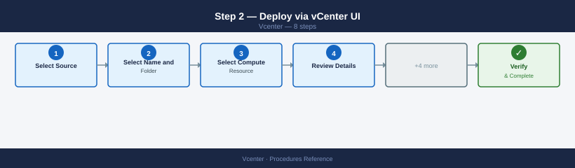
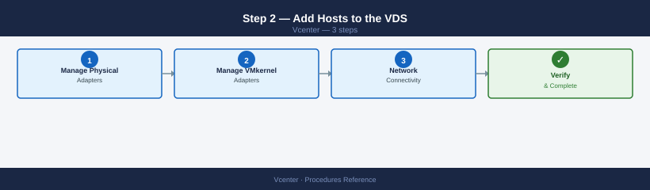
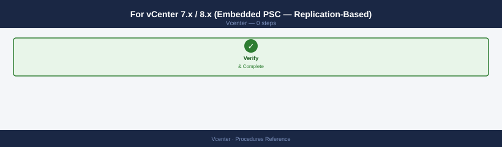
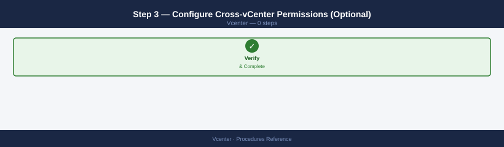

---
tags:
  - operations
  - vcenter
  - vmware
  - vsphere-8
---
# vCenter — Procedures

<div class="kb-summary">
Common vCenter procedures — adding and reconnecting ESXi hosts, vMotion and storage migrations, snapshot management, tag management, HA reconfiguration, content library, certificate replacement, file-based backup, roles/permissions, SSO identity sources, alarms, cluster config, and VCSA upgrade.

*Applies to: vSphere 7.x / 8.x*
</div>

Service restart order for manual recovery:
1. `vmware-vpostgres` — database must be running before vpxd
2. `vmware-stsd` — SSO token service
3. `vpxd` — core vCenter service
4. `vsphere-ui` — vSphere Client (if needed)

---

## Before you begin

- **Access:** vCenter read-only minimum; Administrator role for remediation steps
- **Timing:** safe to run during business hours unless a step is marked ⚠ (causes interruption)
- **Dependencies:** no active upgrades or migrations on the same infrastructure
- **Logging:** capture command output — paste into the change record on completion

---

## Adding an ESXi Host to vCenter

```powershell
# Via PowerCLI
$dc = Get-Datacenter -Name "DC-LON"
$cluster = Get-Cluster -Name "CL-LON-PROD"
$cred = Get-Credential   # ESXi root credentials

Add-VMHost -Name "esxi-05.example.local" -Location $cluster -User root -Password $cred.GetNetworkCredential().Password -Force
```

Via UI: **vCenter → Datacenter or Cluster → Actions → Add Host**. Enter FQDN, root credentials, and accept the host thumbprint.

Post-add checks:
- Host shows Connected state
- VMs on host visible in inventory
- Host belongs to correct cluster (DRS/HA active)
- Host NTP, DNS, and syslog confirmed configured

---

## Placing a Host in Maintenance Mode

```powershell
# PowerCLI — maintenance mode with vMotion evacuation
$vmhost = Get-VMHost -Name "esxi-01.example.local"
Set-VMHost -VMHost $vmhost -State Maintenance -Evacuate

# Wait for maintenance mode to be accepted
do {
    Start-Sleep -Seconds 10
    $vmhost = Get-VMHost -Name "esxi-01.example.local"
    Write-Host "State: $($vmhost.State)"
} until ($vmhost.State -eq "Maintenance")
```

```bash
# From ESXi shell (if vCenter unavailable)
esxcli system maintenanceMode set --enable true
esxcli system maintenanceMode get
```

Exit maintenance mode:
```powershell
Set-VMHost -VMHost (Get-VMHost "esxi-01.example.local") -State Connected
```

---

## vMotion — Migrating a VM

```powershell
# Live vMotion (compute only — same storage)
Move-VM -VM "app-server-01" -Destination (Get-VMHost "esxi-02.example.local")

# Storage vMotion (same host, different datastore)
Move-VM -VM "app-server-01" -Datastore (Get-Datastore "DS-VMFS-PURE01-02")

# Full migration (compute + storage)
Move-VM -VM "app-server-01" `
    -Destination (Get-VMHost "esxi-02.example.local") `
    -Datastore (Get-Datastore "DS-VMFS-PURE01-02")

# Bulk evacuate all VMs from a host
$sourceHost = Get-VMHost "esxi-01.example.local"
$targetHost = Get-VMHost "esxi-02.example.local"
Get-VM -Location $sourceHost | Move-VM -Destination $targetHost
```

vMotion requirements:
- Shared storage visible to both hosts (for compute-only vMotion)
- vMotion VMkernel on both hosts (same layer-2 or routed vMotion network)
- Compatible CPU features (use EVC cluster mode to align CPU generations)

---

## Snapshot Management

Snapshots consume datastore space equal to the delta from the base disk. Stale snapshots degrade I/O performance and fill datastores.

```powershell
# Find all snapshots older than 7 days across all VMs
Get-VM | Get-Snapshot |
    Where-Object { $_.Created -lt (Get-Date).AddDays(-7) } |
    Select-Object @{N="VM";E={$_.VM.Name}}, Name, Created,
    @{N="SizeGB";E={[math]::Round($_.SizeGB, 2)}},
    @{N="AgeDays";E={[math]::Round(((Get-Date) - $_.Created).TotalDays, 0)}} |
    Sort-Object AgeDays -Descending

# Remove a specific snapshot
Remove-Snapshot `
    -Snapshot (Get-Snapshot -VM "app-server-01" -Name "pre-patch-2026-04-01") `
    -Confirm:$false

# Remove ALL snapshots for a VM (consolidate)
Get-Snapshot -VM "app-server-01" | Remove-Snapshot -RemoveChildren -Confirm:$false

# Find VMs needing disk consolidation (snapshot files remain after removal)
Get-VM | Where-Object { $_.ExtensionData.Runtime.ConsolidationNeeded } |
    Select-Object Name, @{N="Host";E={$_.VMHost.Name}}
```

Consolidation via UI: right-click VM → **Snapshots → Consolidate**. This removes orphaned delta files without removing a snapshot from the tree.

---

## Inventory Hygiene Tasks

Run these weekly or include in the daily check script.

```powershell
# Find orphaned / unexpectedly powered-off VMs
Get-VM | Where-Object { $_.PowerState -eq "PoweredOff" } |
    Select-Object Name, @{N="Host";E={$_.VMHost.Name}},
    @{N="LastChange";E={$_.ExtensionData.Config.ChangeVersion}}

# VMs not assigned to any resource pool (using cluster root directly)
Get-VM | Where-Object { $_.ResourcePool.Name -eq (Get-Cluster).Name } |
    Select-Object Name, PowerState

# VMs with VMware Tools not running
Get-VM | Where-Object { $_.ExtensionData.Guest.ToolsRunningStatus -ne "guestToolsRunning" } |
    Select-Object Name, PowerState, @{N="ToolsStatus";E={$_.ExtensionData.Guest.ToolsRunningStatus}}

# Export full VM inventory
Get-VM | Select-Object Name, PowerState, NumCpu, MemoryGB,
    @{N="VMHost";E={$_.VMHost.Name}},
    @{N="Cluster";E={$_.VMHost.Parent.Name}},
    @{N="Datastore";E={($_ | Get-Datastore).Name -join ";"}} |
    Export-Csv -Path vm_inventory.csv -NoTypeInformation
```

---

## Resync Disconnected Host

When a host shows "Not Responding" or "Disconnected":

```bash
# From VCSA SSH — check vpxd log for host connectivity errors
grep "<esxi-hostname>" /var/log/vmware/vpxd/vpxd.log | tail -50
```

```powershell
# PowerCLI — attempt reconnect
(Get-VMHost "esxi-01.example.local").ExtensionData.ReconnectHost_Task($null)
```

```bash
# From ESXi host SSH — restart the vCenter agent (vpxa)
/etc/init.d/vpxa restart
/etc/init.d/hostd restart

# Verify agent is running
/etc/init.d/vpxa status
```

If the host certificate has drifted from vCenter's expected thumbprint, reconnect via UI and accept the new thumbprint, or re-add the host to vCenter after removing it.

---

## Managing vSphere Tags

Tags are used for inventory classification, RBAC scoping, and backup policy targeting.

```powershell
# List all tag categories and tags
Get-TagCategory
Get-Tag

# Assign a tag to a VM
$tag = Get-Tag -Name "prod" -Category "env"
New-TagAssignment -Tag $tag -Entity (Get-VM "app-server-01")

# List all VMs with a specific tag
Get-TagAssignment -Tag (Get-Tag -Name "prod" -Category "env") |
    Select-Object -ExpandProperty Entity |
    Where-Object { $_ -is [VMware.VimAutomation.ViCore.Types.V1.Inventory.VirtualMachine] } |
    Select-Object Name, PowerState

# Bulk tag assignment
$tag = Get-Tag -Name "gold" -Category "tier"
Get-VM -Location (Get-Cluster "CL-LON-PROD") | ForEach-Object {
    New-TagAssignment -Tag $tag -Entity $_ -ErrorAction SilentlyContinue
}

# Export tag assignments to CSV
Get-TagAssignment | Select-Object `
    @{N="Entity";E={$_.Entity.Name}}, `
    @{N="Category";E={$_.Tag.Category.Name}}, `
    @{N="Tag";E={$_.Tag.Name}} |
    Export-Csv -Path tag_assignments.csv -NoTypeInformation
```

---

## Reconfiguring vSphere HA

After adding or removing hosts, or after host failures, HA may need reconfiguration:

```powershell
# Check HA state on all clusters
Get-Cluster | Select-Object Name, HAEnabled, HAAdmissionControlEnabled, HAFailoverLevel

# Reconfigure HA on a specific cluster (resolves most config warnings)
$cluster = Get-Cluster -Name "CL-LON-PROD"
$clusterView = $cluster | Get-View
$clusterView.ReconfigureComputeResource_Task($clusterView.ConfigurationEx, $true)
```

Via UI: right-click cluster → **Reconfigure for vSphere HA**. This re-evaluates all hosts and resolves most "HA configuration issues" warnings without disrupting running VMs.

---

## Content Library Management

Content Libraries store VM templates, OVF/OVA templates, and ISO images centrally.

```powershell
# List content libraries
Get-ContentLibrary

# Get items in a library
Get-ContentLibrary -Name "Templates-LON" | Get-ContentLibraryItem

# Deploy a VM from a template in the content library
$template = Get-ContentLibraryItem -Name "RHEL9-Gold" -ContentLibrary "Templates-LON"
New-VM -Name "new-vm-01" -ContentLibraryItem $template `
    -VMHost (Get-VMHost "esxi-01.example.local") `
    -Datastore (Get-Datastore "DS-VMFS-PURE01-01") `
    -ResourcePool (Get-ResourcePool "RP-PROD-STANDARD")
```

Best practices:
- Publish a single library from a central vCenter; subscribe from spoke vCenters (Linked Mode or subscribed library)
- Keep templates on a dedicated datastore separate from production VM storage
- Update templates monthly — patch, update VMware Tools, then convert back to template

## Replace vCenter Certificates (VMCA)

vCenter certificate replacement is required when certificates expire, are compromised, or when moving to a custom CA.

```bash
# Method 1: Auto-renew machine SSL cert via VAMI (for VMCA-signed certs)
# https://<vcenter-fqdn>:5480 → Certificate Management → Machine SSL Certificate → Renew

# Method 2: Replace with custom CA cert using certificate-manager
ssh root@<vcenter-fqdn>
/usr/lib/vmware-vmca/bin/certificate-manager
# Option 1: Replace Machine SSL certificate with custom certificate
# Option 6: Replace Solution User certificates with custom certificate
# Provide: root CA cert, signed machine cert, private key

# Method 3: STS certificate renewal (required every 2 years for VMCA-signed)
# STS certs do not auto-renew — check expiry:
python /usr/lib/vmware-vmafd/bin/lstool.py list --url http://localhost:7080/lookupservice/sdk 2>/dev/null | grep -i expire

# Renew STS cert (vSphere 7+):
/usr/lib/vmware-vmafd/bin/vecs-cli entry list --store TRUSTED_ROOTS
# Use certificate-manager → Option 8: Reset all certificates
```

Post-replacement validation:

```bash
# Verify new cert is active
echo | openssl s_client -connect <vcenter-fqdn>:443 2>/dev/null | openssl x509 -noout -dates -subject
# Confirm NotAfter shows new expiry

# Verify services are healthy after restart
vmon-cli --status | grep -E "RUNNING|STOPPED"
# All critical services should be RUNNING

# Verify vCenter is accessible from vSphere Client
# Verify ESXi hosts still show Connected
```

## vCenter File-Based Backup

vCenter supports scheduled file-based backups to NFS, SFTP, FTPS, HTTP, or HTTPS locations.

```bash
# Configure backup via VAMI: https://<vcenter-fqdn>:5480
# Backup → Configure → set protocol, location, credentials, schedule, retention

# Trigger manual backup via API
curl -sk -X POST "https://<vcenter-fqdn>/api/vcenter/deployment/backup/schedules?vmw-task=true" \
  -H "vmware-api-session-id: <session-id>" \
  -H "Content-Type: application/json" \
  -d '{
    "location_type": "SFTP",
    "location": "sftp://backup-srv/vcenter-backups",
    "location_user": "vcbackup",
    "location_password": "<password>",
    "parts": ["SEAT"]
  }'

# SEAT = Statistics, Events, Alarms, Tasks (recommended addition to core backup)
```

```powershell
# Monitor backup job status
$headers = @{ "vmware-api-session-id" = $sessionId }
Invoke-RestMethod "https://<vcenter-fqdn>/api/vcenter/deployment/backup/job" -Headers $headers |
  Select-Object id, state, end_time, messages
```

Backup includes: vCenter database, configuration, inventory, and optionally historical data (SEAT). Restore requires the vCenter ISO and backup archive.

---

## Manage Roles and Permissions

vCenter RBAC uses Roles (permission sets) assigned to Principals (users or groups) at a specific inventory object level.

```powershell
# List all roles
Get-VIRole

# Create a custom role with specific privileges
New-VIRole -Name "VM-Operator" -Privilege (Get-VIPrivilege -Id "VirtualMachine.Interact.PowerOn",
    "VirtualMachine.Interact.PowerOff",
    "VirtualMachine.Interact.ConsoleInteract",
    "VirtualMachine.Interact.Suspend")

# Assign role to an AD group at a folder level
$folder = Get-Folder -Name "Production-VMs"
$principal = "DOMAIN\vm-operators"
New-VIPermission -Entity $folder -Principal $principal -Role "VM-Operator" -Propagate:$true

# List permissions on an object
Get-VIPermission -Entity (Get-Folder "Production-VMs")

!!! warning "Permission removal is immediate — export before deleting"
    This command removes the permission immediately. Verify the principal and scope before running. Export current permissions first so you can restore if needed: `Get-VIPermission -Entity <entity> | Export-Csv perms-backup.csv`.

# Remove a permission
Get-VIPermission -Entity (Get-Folder "Production-VMs") -Principal "DOMAIN\vm-operators" |
    Remove-VIPermission -Confirm:$false
```

**Best practices:**
- Assign permissions at the lowest scope that satisfies the use case (folder/cluster, not root)
- Use AD groups, not individual user accounts
- Never assign Administrator role at root unless required for the admin account
- Audit permissions quarterly: export and review unexpected root-level assignments

---

## Configure SSO Identity Source (Active Directory)

Required before AD accounts/groups can authenticate to vCenter.

1. vCenter → **Administration** → **Single Sign On** → **Configuration** → **Identity Sources**
2. Click **Add Identity Source**
3. Select **Active Directory (Integrated Windows Authentication)** for domain-joined VCSA, or **Active Directory as an LDAP Server** for explicit LDAP binding
4. For LDAP binding:
   - **Domain name**: `EXAMPLE.LOCAL`
   - **Domain alias**: `EXAMPLE`
   - **Base DN for users**: `CN=Users,DC=example,DC=local`
   - **Base DN for groups**: `CN=Users,DC=example,DC=local`
   - **Username / Password**: dedicated service account (e.g., `svc-vcenter-ldap`)
5. Click **Test Connection** → confirm AD is reachable
6. Click **Add** → SSO now resolves AD users
7. Assign vCenter roles to AD groups: Administration → **Access Control** → **Global Permissions** or per-object permissions

```bash
# Verify AD identity source via SSO API
curl -sk -X GET "https://<vcenter-fqdn>/api/vcenter/identity/providers" \
  -H "vmware-api-session-id: <session-id>"
```

---

## Configure a vSphere Alarm

Alarms alert on object state changes or metric threshold violations.

1. vCenter → right-click the target object (cluster, datastore, host) → **Alarms → New Alarm**
2. Set the alarm name and description
3. Under **Triggers**, define the condition:
   - **State trigger**: Host Connection State = Not Responding → trigger after 60 seconds
   - **Metric trigger**: Datastore Free Space < 20% for 5 minutes
4. Under **Actions**, configure what happens when the alarm fires:
   - Send email notification (requires SMTP configured: Administration → SMTP)
   - Run a script
   - Send an SNMP trap
5. Click **OK** — the alarm is immediately active for the selected object and (if checked) its children

```powershell
# List all defined alarms
Get-AlarmDefinition | Select-Object Name, Enabled, Description

# Enable/disable a specific alarm
Get-AlarmDefinition -Name "Host CPU Usage" | Set-AlarmDefinition -Enabled:$false

# Acknowledge an active alarm
Get-AlarmAction | Where-Object { $_.Alarm.Name -eq "Host CPU Usage" }
```

---

## Configure a Cluster (DRS and HA)

When creating or reconfiguring a cluster:

```powershell
# Create a new cluster with DRS and HA
New-Cluster -Name "CL-LON-PROD" -Location (Get-Datacenter "DC-LON") `
    -DrsEnabled:$true -DrsAutomationLevel FullyAutomated `
    -HAEnabled:$true -HAAdmissionControlEnabled:$true

# Configure HA admission control (25% = 1-host failover for a 4-node cluster)
$cluster = Get-Cluster "CL-LON-PROD"
$spec = New-Object VMware.Vim.ClusterConfigSpecEx
$spec.DasConfig = New-Object VMware.Vim.ClusterDasConfigInfo
$spec.DasConfig.AdmissionControlPolicy = New-Object VMware.Vim.ClusterFailoverResourcesAdmissionControlPolicy
$spec.DasConfig.AdmissionControlPolicy.CpuFailoverResourcesPercent = 25
$spec.DasConfig.AdmissionControlPolicy.MemoryFailoverResourcesPercent = 25
($cluster | Get-View).ReconfigureComputeResource_Task($spec, $true)

# Enable EVC (Enhanced vMotion Compatibility) for mixed CPU generations
$clusterView = Get-Cluster "CL-LON-PROD" | Get-View
$evcSpec = New-Object VMware.Vim.EVCMode
$evcSpec.Key = "intel-broadwell"  # set to the lowest CPU generation in cluster
$clusterView.ConfigureEvcMode_Task($evcSpec)
```

Verify cluster health after configuration:

```powershell
# Check HA and DRS configuration
Get-Cluster "CL-LON-PROD" | Select-Object Name, HAEnabled, DrsEnabled, DrsAutomationLevel, HAAdmissionControlEnabled, HAFailoverLevel
```

---

## Upgrade vCenter Server (VCSA)

vCenter upgrades use the VCSA installer ISO and run a 2-phase migration: deploy new VCSA then transfer data.

**Pre-upgrade checklist:**
- Snapshot or file-based backup of current VCSA
- Confirm all ESXi hosts are at or below the target vCenter's supported version
- Resolve any existing alarms and health warnings
- Check VMware Interoperability Matrix for NSX/vSAN/Aria compatibility

**Phase 1 — Deploy new VCSA:**
1. Mount the vCenter ISO on a Windows/Linux/macOS machine
2. Run `vcsa-ui-installer/win32/installer.exe` (or `.../lin64/installer` on Linux)
3. Select **Upgrade** → **Install**
4. Enter the source vCenter FQDN and credentials
5. Configure the new VCSA: deployment size, FQDN, IP, NTP, SSO password
6. The installer deploys the new VCSA alongside the existing one — no downtime yet

**Phase 2 — Transfer data:**
1. The installer prompts to switch to the new VCSA
2. vCenter inventory, permissions, and historical data are transferred
3. Source VCSA is powered off after successful transfer
4. Update DNS if using hostname-based access

**Post-upgrade validation:**
```bash
# Verify vCenter version from VAMI
curl -sk "https://<new-vcenter-fqdn>:5480/rest/appliance/system/version" \
  -u "administrator@vsphere.local:<password>"

# Check all services running
ssh root@<new-vcenter-fqdn>
vmon-cli --status | grep -v RUNNING

# Verify ESXi hosts still show Connected in the new vCenter
```

---

## Deploy a VM from OVA/OVF Template

Used to deploy pre-packaged virtual appliances (management tools, security scanners, monitoring agents) from vendor-provided OVA files.

### Step 1 — Download and Validate the OVA


Before deploying, verify the OVA integrity using the vendor-provided SHA-256 checksum:

```bash
shasum -a 256 vendor-appliance.ova
# Compare output against the published checksum on the vendor download page
```

### Step 2 — Deploy via vCenter UI



1. In vCenter, right-click the target cluster or resource pool → **Deploy OVF Template**
2. **Select Source**: upload the local `.ova` file or provide a URL
3. **Select Name and Folder**: choose a meaningful name and the target VM folder
4. **Select Compute Resource**: choose the target cluster, resource pool, or host
5. **Review Details**: confirm the OVA description and disk requirements
6. **Select Storage**: choose a datastore with sufficient free space; select the storage policy (vSAN policy or datastore default)
7. **Select Networks**: map the OVA's virtual networks to vCenter port groups
8. **Customize Template**: fill in IP addresses, DNS, gateway, admin password, and any product-specific fields in the OVF Properties page
9. **Ready to Complete**: review the summary → **Finish**

vCenter creates the VM and imports the disks. Monitor progress in **Tasks** (bottom panel) — deployment may take 5–30 minutes depending on disk size.

### Step 3 — Post-Deploy Configuration


1. Power on the VM: right-click → **Power On**
2. Open the Web Console: right-click → **Open Web Console** — complete first-run setup wizard if the appliance has one
3. Verify network connectivity: `ping <appliance-ip>` and browse to the appliance management UI
4. Optionally convert the VM to a VM template for reuse: right-click → **Template → Convert to Template**

---

## Create a vSphere Distributed Switch (VDS)

A VDS is a cluster-wide virtual switch managed centrally from vCenter, replacing per-host vSS configuration. Required for advanced features: Network I/O Control, port mirroring, LACP, LLDP, and NSX overlay transport.

### Step 1 — Create the VDS


1. vCenter → **Datacenter → Configure → Distributed Switches → New Distributed Switch**
2. Set:
   - **Name**: e.g., `prod-dvs-01`
   - **Version**: match or exceed the oldest ESXi host version in the cluster (VDS version must be ≤ ESXi version)
   - **Number of uplinks**: typically 2 (one per physical NIC per host); increase for link aggregation
   - **Network I/O Control**: enable (allows bandwidth reservations for management, vMotion, storage traffic)
3. Create a default **port group** during the wizard or skip and create manually

### Step 2 — Add Hosts to the VDS



1. Right-click the VDS → **Add and Manage Hosts**
2. Select **Add Hosts** → select all hosts in the cluster
3. **Manage Physical Adapters**: for each host, assign physical NICs to VDS uplinks
   - Uplink 1 → vmnic2 (leave vmnic0 on vSS for management continuity)
   - Uplink 2 → vmnic3
4. **Manage VMkernel Adapters**: optionally migrate existing vmkernel adapters (vMotion, storage) from vSS to VDS port groups
5. **Network Connectivity**: vCenter validates no management connectivity loss before committing

!!! warning "Migrating vmnic0 (management NIC) to the VDS risks losing host connectivity"
    If the management vmkernel adapter (vmk0) is on vmnic0 and vmnic0 is being moved to the VDS, vCenter must simultaneously move the management adapter to a VDS port group. If misconfigured, the host loses management connectivity and requires physical console access to recover. Always migrate management network last, one host at a time, and verify connectivity before proceeding to the next host.

### Step 3 — Create Port Groups


1. Right-click the VDS → **Distributed Port Group → New Distributed Port Group**
2. Configure:
   - **Name**: `dpg-vmotion-vlan20`, `dpg-storage-vlan30`, `dpg-vm-prod-vlan100`, etc.
   - **VLAN**: set the VLAN ID (or VLAN Trunk for uplink-facing port groups)
   - **Port Binding**: Static (for vmkernel) or Dynamic (for VMs)
   - **Security Policy**: Promiscuous mode Off / MAC Changes Reject / Forged Transmits Reject (standard defaults)

### Step 4 — Verify


```powershell
# PowerCLI — confirm VDS is created and hosts are added
Get-VDSwitch -Name "prod-dvs-01" | Select-Object Name, Version, NumUplinkPorts
Get-VDSwitch -Name "prod-dvs-01" | Get-VMHost | Select-Object Name, ConnectionState
Get-VDPortgroup | Where-Object {$_.VDSwitch.Name -eq "prod-dvs-01"} | Select-Object Name, VlanConfiguration
```

---

## Configure Enhanced Linked Mode (ELM)

Enhanced Linked Mode joins multiple vCenter instances into a federated Single Sign-On domain, providing a unified inventory view and single authentication across all vCenters from any vSphere Client.

### Prerequisites


- All vCenters must be in the same SSO domain (e.g., `vsphere.local`) — each vCenter must be deployed pointing to the same Platform Services Controller (external PSC) or replication partner
- vCenter versions must be within one major version of each other
- All vCenters must have network connectivity to each other on TCP 443
- ELM requires vCenter 6.5+ with embedded PSC (VCSA 7.x+ has no separate PSC)

### For vCenter 7.x / 8.x (Embedded PSC — Replication-Based)



1. Deploy the second vCenter VCSA with the same SSO domain (`vsphere.local`) configured during setup — during the VCSA deployment wizard, select **Join an existing SSO domain** and provide the first vCenter's FQDN as the partner
2. Accept the replication partner certificate and provide the SSO administrator password
3. Complete VCSA deployment — the SSO service replicates identity data (users, groups, permissions) between both vCenters automatically

### Step 2 — Verify Linked Mode is Active


1. Log in to either vCenter's vSphere Client
2. Navigate to **Home → Inventory** — both vCenter instances should appear in the inventory tree
3. Click the second vCenter's tree — it should expand without re-authentication (single sign-on)

```bash
# Confirm SSO replication from vCenter CLI
/usr/lib/vmware-vmafd/bin/vdcrepadmin -f showservers -h localhost -u administrator -w <password>
# Output should list both vCenters as replication partners
```

### Step 3 — Configure Cross-vCenter Permissions (Optional)



Global permissions set at the SSO domain level apply across all linked vCenters:

1. vSphere Client → **Administration → Access Control → Global Permissions → Add**
2. Assign the user or group, select the role, and check **Propagate to children** to apply across the linked domain

!!! warning "Global permissions bypass per-vCenter permission scoping"
    A global permission at the root level grants access to every object in every vCenter in the linked domain. Use sparingly — prefer per-vCenter datacenter-level permissions where tighter scoping is needed.

---

## See also

- [vCenter — Health Checks](../health-checks/)
- [vCenter Troubleshooting — Common Issues](../../troubleshooting/common-issues/)
- [vCenter — CLI Reference (PowerCLI & DCLI)](../cli-reference/)

## Verify

- **Alarms:** vSphere Client → Home → Alarms — no new critical alarms after the operation
- **Events:** monitor the vCenter Events view for the affected object for 5 minutes
- **Health check:** run the morning health-check sequence for the affected product tier
