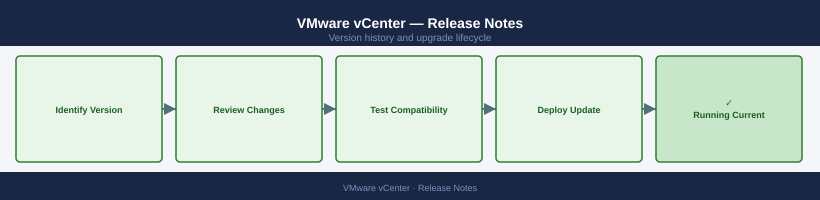

---
tags:
  - vcenter
  - vmware
  - vsphere-8
---
# VMware vCenter — Release Notes

<div class="kb-summary">
Version history and release notes for VMware vCenter.
</div>



```d2
direction: right

center: "vCenter Server" {shape: hexagon}
version_history: "Version History" {shape: rectangle}
key_terminology: "Key Terminology" {shape: rectangle}
upgrade_path: "Upgrade Path" {shape: rectangle}

center -> version_history
center -> key_terminology
center -> upgrade_path
```

## Version History

| Version | Released | Summary | Notes |
|---------|----------|---------|-------|
| 8.0 U3 | 2024-Q3 | vCenter HA improvements, SDDC Manager integration | [Release Notes](#) |
| 8.0 U2 | 2024-Q1 | Reduced footprint appliance, converged management | [Release Notes](#) |
| 8.0 U1 | 2023-Q2 | vCenter Server 8.0 U1 stability and security patches | [Release Notes](#) |
| 8.0 GA | 2022-Q4 | vCenter 8 GA — vSphere Distributed Services Engine | [Release Notes](#) |
| 7.0 U3 | 2022-Q1 | vCenter 7.0 U3 — end of gen LTS baseline | [Release Notes](#) |

## Key Terminology

**Major Version**
: A release containing significant new features or architectural changes; may require additional planning and testing.

**Patch Release**
: A targeted fix release that addresses bugs or security issues within a major/minor version.

**EOL (End of Life)**
: Date after which the vendor no longer provides updates, security patches, or technical support.

**Upgrade Path**
: The supported sequence of versions a system must traverse to reach a target version (some versions cannot be skipped).

## Upgrade Path

Upgrade vCenter Server using the VMware vCenter Server Installer or VAMI. Always upgrade vCenter before ESXi hosts. Ensure the target version is compatible with all managed hosts using the [VMware Product Interoperability Matrix](https://interopmatrix.vmware.com/). Snapshot the vCenter appliance VM before beginning. Post-upgrade, verify vCenter HA and Plugin compatibility.
