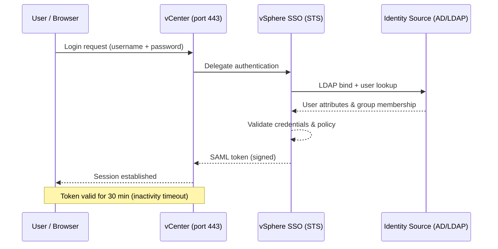
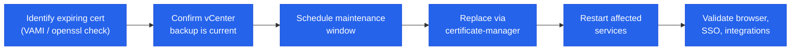

# vCenter Security — Authentication

## SSO Authentication Flow



## SSO Security

### Authentication Policy

Configure at **Administration → Single Sign On → Configuration → Policies → Password Policy**:

| Parameter | Recommended Value |
|---|---|
| Maximum lifetime | 90 days |
| Minimum length | 16 characters |
| Complexity | Uppercase + lowercase + digits + special |
| Lockout (failed attempts) | 5 attempts |
| Lockout duration | 5 minutes |
| Failed attempt interval | 3 minutes |

### Identity Source Best Practices

- Use LDAPS (port 636) not plain LDAP for all AD identity sources
- Use a dedicated service account for LDAP bind; restrict it to read-only AD access
- Enable multi-factor authentication at the IdP level using SAML federation (ADFS/Okta)
- Review identity sources quarterly; remove unused sources

### Unlocking a Locked SSO Account

```bash
# From VCSA shell — unlock administrator@vsphere.local
/usr/lib/vmware-vmafd/bin/dir-cli user unlock --account administrator --domain vsphere.local
```

## TLS Configuration

vCenter enforces TLS 1.2 minimum by default (vSphere 7.0+). TLS 1.0 and 1.1 are disabled.

### Certificate Modes

| Mode | Description | When to Use |
|---|---|---|
| VMCA (default) | vCenter acts as CA; signs all vCenter/host certs | Lab, small deployments |
| Custom CA | Enterprise CA signs all certs; VMCA subordinate to enterprise CA | Enterprise/compliance |
| Hybrid | VMCA for machine SSL; custom CA for solution user certs | Transitional |
| External CA — all custom | All certs replaced with enterprise CA-signed certs | Strict compliance |

### Certificate Replacement — Machine SSL (VCSA)

```bash
# On VCSA shell
/usr/lib/vmware-vmca/bin/certificate-manager
# Option 1: Generate CSR signed by external CA
# Option 5: Replace machine SSL certificate
```

Replacement requires vCenter services restart. Plan a maintenance window.

### Certificate Monitoring

```powershell
# PowerCLI — check vCenter endpoint certificate expiry
$req = [Net.HttpWebRequest]::Create("https://<vcenter>")
$req.GetResponse() | Out-Null
$cert = $req.ServicePoint.Certificate
[DateTime]::Parse($cert.GetExpirationDateString())
```

```bash
# Check certificate expiry from outside VCSA
echo | openssl s_client -connect <vcenter-fqdn>:443 -servername <vcenter-fqdn> 2>/dev/null \
  | openssl x509 -noout -dates

# List certificates in VECS store on VCSA (SSH)
/usr/lib/vmware-vmafd/bin/vecs-cli entry list --store MACHINE_SSL_CERT --text \
  | grep -E "Alias|Not After"
```

## Certificates to Track

| Certificate | Location | Risk if Expired |
|---|---|---|
| vCenter Machine SSL | VAMI → Certificate Management | Browser warnings, API failures |
| VMCA Root Certificate | VAMI → Certificate Management | Breaks all VMCA-issued certs |
| STS Certificate | vSphere Client → SSO → Certificates | Login failures platform-wide |
| Solution User Certificates | VAMI → Certificate Management | Service-to-service auth failures |

## Certificate Replacement Process



1. Identify the certificate and replacement method (VMCA, custom CA, or self-signed)
2. Confirm backup of vCenter is current
3. Schedule a maintenance window
4. Replace the certificate using the appropriate method
5. Restart affected services
6. Validate all integrations and logins

## Validation After Replacement

- Browser access to vCenter confirmed with no certificate warning
- All ESXi hosts Connected
- SSO login working for both local and AD accounts
- Aria, NSX, and backup integrations confirmed working

## Emergency Escalation

If certificate expiry causes a login or service failure:
- Check if the local administrator account (`administrator@vsphere.local`) still works
- Engage VMware support if SSO or STS cannot be recovered in place

---

## SAML Federation (External IdP)

vCenter can act as a SAML service provider for an external IdP such as ADFS, Okta, or Azure AD. This enables MFA enforcement at the IdP level without requiring MFA on every VCSA individually.

Configure at **Administration → Single Sign On → Configuration → Identity Provider → Set up SAML Service Provider**.

### ADFS Configuration (High Level)

1. Export the vCenter SAML metadata from **SSO → Configuration → SAML Service Provider → Download Service Provider Metadata**
2. In ADFS: Add a new Relying Party Trust using the metadata file
3. Add claim rules: `UPN → NameID`, `Token-Groups (unqualified names) → Group`
4. In vCenter: Set the IdP metadata URL (your ADFS federation metadata endpoint)
5. Test login: users should be redirected to ADFS login page and returned to vSphere Client with their AD group memberships

After federation is configured, grant permissions to AD groups (not individual users) in vCenter. The group SID comparison is done via the SAML assertion attributes.

---

## vCenter Enhanced Linked Mode (ELM)

Enhanced Linked Mode connects multiple vCenter instances to a shared SSO domain, providing single-pane-of-glass management across sites.

| Feature | Linked Mode |
|---|---|
| Single login | Yes — authenticate once, manage all vCenters |
| Shared roles | Yes — roles defined on one vCenter are visible on others |
| Shared permissions | Partially — global permissions apply to all; local permissions are per-vCenter |
| Shared inventory | Yes — view VMs and hosts across all vCenters |
| vMotion across vCenters | Yes — cross-vCenter vMotion supported (requires same SSO domain) |

```powershell
# Connect to multiple vCenters simultaneously
Connect-VIServer -Server vcenter-lon.corp.local, vcenter-ams.corp.local

# List all VMs across both vCenters
Get-VM | Select-Object Name, @{N="vCenter";E={$_.Uid.Split(':')[0]}}, PowerState

# Disconnect all
Disconnect-VIServer * -Confirm:$false
```

---

## Unlocking Accounts

### Unlock administrator@vsphere.local

```bash
# SSH to VCSA
/usr/lib/vmware-vmafd/bin/dir-cli user unlock \
    --account administrator \
    --domain vsphere.local \
    --password <current-password>

# If the password is also lost, reset via VCSA console (single-user mode)
# See VMware KB 2069041 for the reset procedure
```

### Unlock an AD Account (from vCenter)

AD account lockouts caused by vCenter (e.g. cached wrong password in identity source):
1. Check if the bind account password has changed — update in **SSO → Identity Sources → Edit**
2. Unlock the AD account from Active Directory Users and Computers or PowerShell:
   ```powershell
   # On a domain controller
   Unlock-ADAccount -Identity jsmith
   ```
3. Restart `vmware-sts-idmd` service to clear any cached authentication state:
   ```bash
   service-control --restart vmware-sts-idmd
   ```
