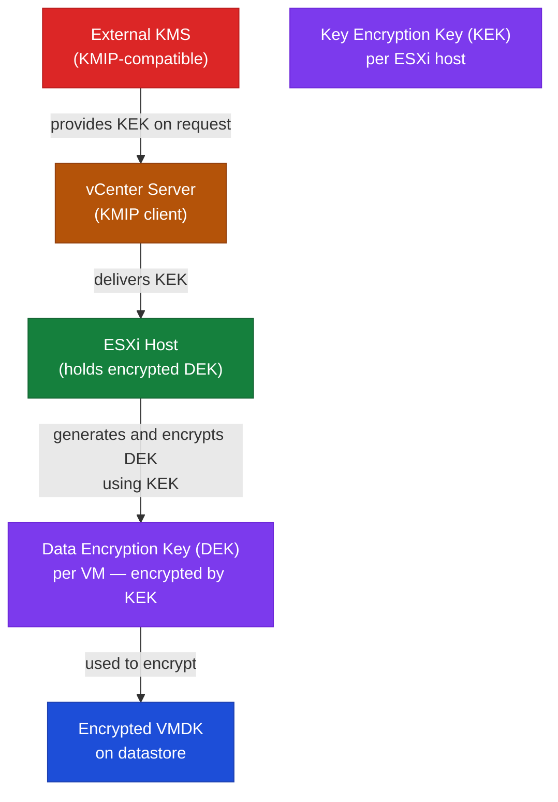

# vCenter Security — Encryption

```
vSphere Encryption Key Flow
════════════════════════════════════════════════════════

  External KMS               vCenter Server          ESXi Host
  ┌──────────────┐           ┌────────────────┐      ┌──────────────────┐
  │  KMIP KMS    │           │  KMIP client   │      │                  │
  │  (Thales /   │──KEK────▶│  (vCenter)     │──KEK▶│  KEK stored      │
  │   Entrust /  │           │                │      │  per-host        │
  │   HyTrust)   │           │                │      │                  │
  └──────────────┘           └────────────────┘      │  DEK generated   │
                                                     │  per-VM,         │
  — or —                                             │  encrypted by KEK│
  ┌──────────────┐                                   │                  │
  │  NKP (built- │──key material─────────────────────│  DEK decrypts    │
  │  in vCenter) │           (vSphere 7.0 U2+)       │  VMDK at I/O     │
  └──────────────┘                                   └──────────────────┘
                                                              │
                                                              ▼
                                                     ┌────────────────┐
                                                     │ Encrypted VMDK │
                                                     │ on datastore   │
                                                     │ (AES-256-XTS)  │
                                                     └────────────────┘

  Data in Transit (TLS)
  ┌────────────────────────────────────────────────────┐
  │  Client ──TLS 1.2+──▶ vCenter :443                 │
  │  vCenter ──TLS 1.2+──▶ VAMI :5480                  │
  │  vCenter ──LDAPS:636──▶ AD domain controller       │
  │  vCenter ──TLS──▶ ESXi :443 (host management)      │
  └────────────────────────────────────────────────────┘
```

## Data in Transit

vCenter enforces TLS 1.2 minimum by default (vSphere 7.0+). TLS 1.0 and 1.1 are disabled.

All API and UI traffic to vCenter uses HTTPS on port 443. VAMI traffic uses HTTPS on port 5480. LDAPS (port 636) is required for Active Directory identity source connections.

Verify TLS configuration after upgrading from older vSphere versions using the `tls-reconfigurator` tool available in the VCSA.

## Data at Rest — VM Encryption

vCenter manages VM-level encryption through vSphere Native Key Provider (NKP) or an external KMS.

### vSphere Native Key Provider (NKP)

Available from vSphere 7.0 U2+. No external KMS required. The key is stored in vCenter and distributed to ESXi hosts.

- Enable from **vCenter → Configure → Key Providers → Add Native Key Provider**
- Back up the NKP immediately after creation — the backup passphrase is required for recovery
- Used for VM encryption, vSAN encryption (where supported), and TPM attestation

### External KMS Integration

For compliance environments requiring an external KMIP-compatible KMS:

- Supported KMS: Thales CipherTrust, Entrust nShield, HyTrust KeyControl
- Register at **vCenter → Configure → Key Providers → Add Standard Key Provider**
- vCenter acts as KMIP client; ESXi hosts retrieve keys via vCenter

### Encrypted VM Management

```powershell
# Check VM encryption status
Get-VM | Get-View | Select-Object -Property Name,
    @{N="Encrypted";E={$_.Config.KeyId -ne $null}}

# Encrypt a VM (requires key provider configured)
# Use vSphere Client: VM → Edit Settings → VM Options → Encryption
```

## vSAN Encryption

vSAN data-at-rest encryption is configured at the cluster level and requires a key provider (NKP or external KMS). Encryption is applied at the disk group layer.

Configure at **vCenter → Cluster → Configure → vSAN → Services → Data Encryption**.

## Certificate Encryption

All vCenter-issued certificates (VMCA) use RSA 2048-bit minimum. Certificate chain of trust is maintained through the VMCA root certificate and STS signing certificate.

See [Authentication](../authentication/index.md) for certificate management procedures.

## VM Encryption Key Flow



## vSphere Trust Authority (vTA)

vSphere Trust Authority (vTA), available from vSphere 7.0+, provides hardware-attested trust for ESXi hosts. A dedicated Trust Authority cluster attests that ESXi hosts are running trusted firmware and software before they are allowed to receive encryption keys.

Use cases:
- Prevent rogue or compromised ESXi hosts from decrypting encrypted VMs
- Enable attestation-based key release (hosts must pass TPM 2.0 attestation)
- Meets requirements for regulated environments requiring hardware root of trust

Configuration is more complex than NKP — requires a dedicated Trust Authority cluster and proper TPM 2.0 hardware on all compute hosts.

---

## Certificate Management

### Certificates to Track

| Certificate | Location | Risk if Expired |
|---|---|---|
| vCenter Machine SSL | VAMI → Certificate Management | Browser warnings, API failures |
| VMCA Root Certificate | VAMI → Certificate Management | Breaks all VMCA-issued certs |
| STS Certificate | vSphere Client → SSO → Certificates | Login failures platform-wide |
| Solution User Certificates | VAMI → Certificate Management | Service-to-service auth failures |
| NSX Manager Certificate | NSX Manager → System | NSX UI and API failures |
| Aria Endpoint Certificates | Aria Suite Lifecycle | Integration and access failures |

### Expiration Tracking Schedule

- Review all certificate expiration dates monthly
- Flag certificates expiring within 60 days — plan replacement
- Escalate certificates expiring within 30 days — urgent action required
- Document next renewal date after each replacement

### Certificate Replacement Process

1. Identify the certificate and replacement method (VMCA, custom CA, or self-signed)
2. Confirm backup of vCenter is current
3. Schedule a maintenance window
4. Replace the certificate using the appropriate method
5. Restart affected services
6. Validate all integrations and logins

### Validation After Replacement

- Browser access to vCenter confirmed with no certificate warning
- All ESXi hosts Connected
- SSO login working for both local and AD accounts
- Aria, NSX, and backup integrations confirmed working

### Emergency Escalation

If certificate expiry causes a login or service failure:
- Check if the local administrator account (`administrator@vsphere.local`) still works
- Engage VMware support if SSO or STS cannot be recovered in place

---

## Certificate Replacement Procedures

### Machine SSL Certificate (VMCA-Signed Renewal)

The simplest replacement — use when VMCA is the CA and no custom CA is required:

```bash
# SSH to VCSA
/usr/lib/vmware-vmca/bin/certificate-manager

# Select option 6: Replace Machine SSL certificate with VMCA Certificate
# Enter administrator@vsphere.local credentials
# Accept default certificate parameters or customise CN/SAN
# The tool will replace the cert and restart required services
```

After renewal:
```bash
# Verify new certificate dates
echo | openssl s_client -connect vcenter.example.local:443 2>/dev/null \
    | openssl x509 -noout -dates

# Confirm services recovered
service-control --status --all
```

### Machine SSL Certificate (Custom CA)

When your organisation uses an enterprise CA (Microsoft CA, DigiCert, etc.):

```bash
# Step 1 — Generate a CSR
/usr/lib/vmware-vmca/bin/certificate-manager
# Select option 1: Generate Certificate Signing Request(s) and Key(s) for Machine SSL certificate

# The tool outputs a CSR file at /tmp/vmca_issued_csr.csr
# Submit this CSR to your enterprise CA

# Step 2 — After receiving the signed certificate
# Place the cert chain and key in a temp location on VCSA

# Step 3 — Replace the certificate
/usr/lib/vmware-vmca/bin/certificate-manager
# Select option 5: Replace Machine SSL certificate with Custom Certificate
# Provide path to: certificate file, key file, and root CA chain
```

### STS Signing Certificate

The STS (Security Token Service) signing certificate is the most impactful — its expiry causes complete login failure for all vSphere accounts. It has a 10-year validity by default but may have been set shorter on older installations.

```bash
# Check STS certificate expiry
/usr/lib/vmware-vmafd/bin/vecs-cli entry list --store STS_INTERNAL_SSL_CERT --text \
    | grep -E "Alias|Not After"

# If expired — this requires special recovery steps
# See VMware KB 2112283 for the STS certificate renewal procedure
# Summary:
# 1. Stop all services
# 2. Run the certificate-manager STS renewal
# 3. Restart all services

service-control --stop --all
/usr/lib/vmware-vmca/bin/certificate-manager
# Select option 8: Reset all certificates
service-control --start --all
```

**Warning**: If the STS certificate is already expired, the `certificate-manager` may not be able to authenticate. In this case, use the `fix_sts_cert.py` script from VMware KB 79248 or engage VMware Support directly.

---

## NKP Backup and Recovery

The Native Key Provider key material is embedded in vCenter. If vCenter is restored from backup or rebuilt, the NKP must also be restored for encrypted VMs to be accessible.

```bash
# Backup procedure (do this immediately after creating NKP, and after any key rotation)
# vSphere Client → vCenter → Configure → Key Providers → <NKP name> → Back Up
# Download the backup file and store securely (offline or in a separate secrets manager)
# The backup is password-protected — store the password separately from the file
```

Recovery procedure:
1. Deploy new VCSA (or restore from vCenter backup)
2. **vCenter → Configure → Key Providers → Restore Key Provider**
3. Provide the backup file and the backup password
4. Encrypted VMs will become accessible once the NKP is restored

If the NKP backup is lost and vCenter cannot be restored: encrypted VM disks are permanently inaccessible. This is by design — encryption without key recovery is irreversible.

---

## VM Encryption Storage Policy

VM encryption is applied through a Storage Policy:

1. Create a storage policy: **vCenter → Policies and Profiles → VM Storage Policies → Create**
2. In the policy rules, enable **Encryption** and select the key provider
3. Apply the policy to a VM: **VM → Edit Settings → VM Options → Encryption → Encrypt VM**

```powershell
# Check VM encryption status across the environment
Get-VM | ForEach-Object {
    $encrypted = $_.ExtensionData.Config.KeyId -ne $null
    [PSCustomObject]@{
        Name = $_.Name
        Encrypted = $encrypted
        KeyId = $_.ExtensionData.Config.KeyId.KeyId
        ProviderId = $_.ExtensionData.Config.KeyId.ProviderId.Id
    }
} | Where-Object { $_.Encrypted } | Format-Table -AutoSize
```

vSAN encryption is preferred over per-VM encryption in all-vSAN environments — it is more performant and simpler to manage at scale.
