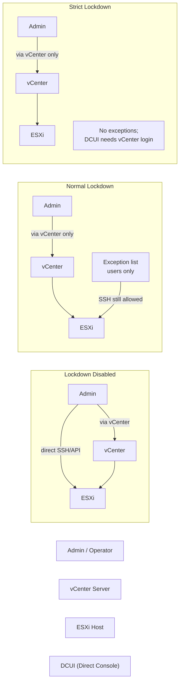

# vCenter Security — Hardening


<div class="kb-summary">
Hardening reference covering TLS Configuration, SSO Password and Lockout Policy, ESXi Host Lockdown Mode, Firewall Hardening, Audit Logging Configuration and 3 more sections.
</div>

```text
vCenter Hardening Layers
════════════════════════════════════════════════════════

  Network Access Control
  ┌──────────────────────────────────────────────────────┐
  │  Firewall / ACL                                      │
  │  :443  → admin jump hosts + monitoring only          │
  │  :5480 → admin jump hosts only (VAMI)                │
  │  :22   → disabled except break-glass                 │
  └───────────────────────┬──────────────────────────────┘
                          │ permitted traffic only
  Authentication Controls ▼
  ┌──────────────────────────────────────────────────────┐
  │  TLS 1.2+ enforced  (1.0 / 1.1 disabled)            │
  │  SSO: 5 failed attempts → 5 min lockout              │
  │  Password: 16 char min, 90 day max lifetime          │
  │  AD via LDAPS (:636) — no plaintext LDAP             │
  │  SAML federation → MFA at IdP                        │
  └───────────────────────┬──────────────────────────────┘
                          │
  Host Lockdown Controls  ▼
  ┌──────────────────────────────────────────────────────┐
  │  Normal Lockdown on all ESXi hosts                   │
  │  ┌──────────────────┐   ┌──────────────────┐         │
  │  │  Admin / Ops     │   │  ESXi Host        │         │
  │  │                  │──▶│  (via vCenter     │         │
  │  │  (no direct SSH  │   │   only)           │         │
  │  │   to ESXi)       │   │                   │         │
  │  └──────────────────┘   └──────────────────┘         │
  └───────────────────────┬──────────────────────────────┘
                          │
  Logging / Visibility    ▼
  ┌──────────────────────────────────────────────────────┐
  │  VAMI → Syslog → SIEM (TLS, port 6514)               │
  │  Event retention: 90 days (vCenter + tasks)          │
  │  SIEM alerts: LoginFailure, PermissionAdded, admin@  │
  └──────────────────────────────────────────────────────┘
```
┌───────────────────────────────────── vCenter Server — Hardening ──────────────────────────────────────┐
│                                                                                                       │
│  vCenter hardening follows the VMware Security Hardening Guide and CIS benchmark;                     │
│  key controls: network isolation, MFA, minimal admin, FIPS mode, audit logging.                       │
│                                                                                                       │
│   ┌──────────────────────────────────────────────┐  ┌─────────────────────────────────────────────┐   │
│   │              Network Hardening               │  │               Access Hardening              │   │
│   │         Mgmt network: dedicated VLAN         │  │            MFA: smart card/RADIUS           │   │
│   │         Firewall: only needed ports          │  │           SSO lockout: 5 attempts           │   │
│   │         Disable SSH when not needed          │  │         Admin group: 2 accounts max         │   │
│   │           TLS 1.2 minimum enforced           │  │            Log: all admin actions           │   │
│   └──────────────────────────────────────────────┘  └─────────────────────────────────────────────┘   │
│                                                                                                       │
│  Network isolation and MFA are the highest-value controls for vCenter hardening.                      │
│                                                                                                       │
│                          ▼                                                 ▼                          │
│                                                                                                       │
│   ┌──────────────────────────────────────────────┐  ┌─────────────────────────────────────────────┐   │
│   │           Patch & Config Hardening           │  │              Audit & Compliance             │   │
│   │         Apply patches within 30 days         │  │           vCenter Chargeback audit          │   │
│   │          FIPS mode: enable in VAMI           │  │           Syslog: forward to SIEM           │   │
│   │          Disable banner-less login           │  │             CIS benchmark scans             │   │
│   │          Shell access: time-limited          │  │            Review perms quarterly           │   │
│   └──────────────────────────────────────────────┘  └─────────────────────────────────────────────┘   │
│                                                                                                       │
│  Physical Infrastructure (the hardware everything above runs on):                                     │
│  VCSA runs on ESXi host; ESXi itself must be hardened; management VLAN must                           │
│  be unreachable from guest VM networks.                                                               │
│                                                                                                       │
│  Key terms:                                                                                           │
│                                                                                                       │
│  VMware Hardening Guide= published per vSphere version; CIS baseline                                  │
│  CIS benchmark= Center for Internet Security; independent hardening standard                          │
│  FIPS 140-2   = US federal cryptography standard; enable in VAMI > Security                           │
│  MFA          = Multi-Factor Authentication; prevents credential-only login                           │
│  SIEM         = Security Info and Event Mgmt; receives syslog from vCenter                            │
│  Shell timeout= SSH session auto-closes after idle period (set to 900s)                               │
│  Lockout      = SSO disables account after N failed login attempts                                    │
│  Banner       = login warning message; required by some compliance frameworks                         │
│  Dedicated VLAN= separate network segment for vCenter management traffic                              │
│  Patch SLA    = agree cadence: critical <7d, high <30d, medium <90d                                   │
│  Quarterly review= revoke stale/unnecessary role assignments                                          │
│  Admin count  = fewer admin accounts = smaller blast radius on compromise                             │
│                                                                                                       │
└───────────────────────────────────────────────────────────────────────────────────────────────────────┘

Configure SSH timeout so idle sessions are terminated automatically:

```bash
# On VCSA shell — /etc/ssh/sshd_config
ClientAliveInterval 300
ClientAliveCountMax 0
PermitRootLogin yes           # required for VCSA; restrict by source IP in firewall
PasswordAuthentication yes    # needed for initial access; prefer key-based where possible
```

---

## TLS Configuration

vCenter 7.0+ enforces TLS 1.2 minimum. Verify after upgrading from older vSphere versions:

```bash
# Check current TLS configuration
/usr/lib/vmware-vmafd/bin/vmafd-cli get-tls-endpoint --server-name localhost

# Use tls-reconfigurator if older TLS versions are detected
/usr/lib/vmware-tls-reconfigurator/VcTlsReconfigurator/reconfigureVc scan
/usr/lib/vmware-tls-reconfigurator/VcTlsReconfigurator/reconfigureVc update --tlsVersion TLSv1.2
```

Test TLS from outside the appliance:
```bash
# Verify only TLS 1.2+ is accepted
openssl s_client -connect vcenter.example.local:443 -tls1   # should fail
openssl s_client -connect vcenter.example.local:443 -tls1_1 # should fail
openssl s_client -connect vcenter.example.local:443 -tls1_2 # should succeed
```

---

## SSO Password and Lockout Policy

Configure at **Administration → Single Sign On → Configuration → Policies → Password Policy**:

| Parameter | Recommended Value | Notes |
|---|---|---|
| Maximum lifetime | 90 days | Apply to vsphere.local accounts; AD accounts follow AD policy |
| Minimum length | 16 characters | Longer is better; 20 characters for break-glass accounts |
| Complexity | Uppercase + lowercase + digits + special | All four categories required |
| Lockout (failed attempts) | 5 attempts | Prevents brute-force |
| Lockout duration | 5 minutes | Auto-unlock; increase to 30 minutes for admin accounts |
| Failed attempt interval | 3 minutes | Window in which failures are counted |

Lockout policy (separate from password policy): **Administration → SSO → Configuration → Lockout Policy**:
- Maximum number of failed login attempts: 5
- Time interval between failures: 3 minutes
- Unlock time: 5 minutes (0 = never auto-unlock; requires manual unlock)

---

## ESXi Host Lockdown Mode

Lockdown mode prevents direct root access to ESXi hosts — all management must go through vCenter. Configure via **vCenter → Host → Configure → System → Security Profile → Edit → Lockdown Mode**.



| Mode | Direct Root SSH | Direct API | vCenter Required |
|---|---|---|---|
| Disabled | Yes | Yes | No |
| Normal | No | No | Yes (exception list users can still SSH) |
| Strict | No | No | Yes (no exceptions; DCUI requires vCenter login) |

Exception list: users in the **Exception Users** list can still access the host directly even in Normal lockdown. Keep this list minimal — typically just a break-glass local account.

```powershell
# Enable Normal lockdown on all hosts in a cluster
Get-Cluster "CL-LON-PROD" | Get-VMHost | ForEach-Object {
    $_.ExtensionData.EnterLockdownMode()
    Write-Host "Lockdown enabled: $($_.Name)"
}

# Check lockdown status
Get-VMHost | Select-Object Name,
    @{N="Lockdown";E={$_.ExtensionData.Config.LockdownMode}}
```

---

## Firewall Hardening

Restrict access to vCenter management interfaces at the network layer:

| Interface | Port | Access Should Be Restricted To |
|---|---|---|
| vSphere Client / API | 443 | Admin jump hosts, automation servers, monitoring |
| VAMI | 5480 | Admin jump hosts only |
| SSH | 22 | Admin jump hosts only; disable when not in use |
| ESXi management | 443, 902 | vCenter appliance IP and admin jump hosts |

Configure host-based firewall rules on ESXi hosts to restrict management traffic:
```bash
# On ESXi host — view firewall rules
esxcli network firewall get
esxcli network firewall ruleset list

# Restrict management traffic to specific subnets
esxcli network firewall ruleset set --ruleset-id sshClient --allowed-all false
esxcli network firewall ruleset allowedip add --ruleset-id sshClient --ip-address 10.0.1.0/24
```

---

## Audit Logging Configuration

### vCenter Events Retention

Default event retention is 30 days. Extend for compliance:

**Administration → vCenter Server Settings → Statistics**:
- Set maximum event age to 90 days minimum
- Set maximum task age to 90 days minimum

### Syslog Forwarding to SIEM

```text
VAMI (https://<vcenter>:5480) → Syslog → Add Syslog Server
Protocol: TLS (preferred)
Port: 6514 (TLS) or 514 (UDP)
```

Key events to alert on in SIEM:

| Event | SIEM Alert Priority |
|---|---|
| `com.vmware.sso.LoginFailure` (> 3 in 5 minutes) | High |
| `vim.event.PermissionAddedEvent` | Medium |
| `vim.event.PermissionRemovedEvent` | Medium |
| `vim.event.UserLoginSessionEvent` where user = `administrator@vsphere.local` | High |
| `vim.event.HostAddedEvent` | Low |
| `vim.event.VMRemovedEvent` | Medium |

### vCenter Alarm for Security Events

```powershell
# Create alarm for failed logins (PowerCLI)
$am = Get-View AlarmManager
$as = New-Object VMware.Vim.AlarmSpec
$as.Name = "SSO Login Failure Alert"
$as.Description = "Alert on repeated failed SSO logins"
$as.Enabled = $true
$as.Expression = New-Object VMware.Vim.EventAlarmExpression
$as.Expression.EventType = "com.vmware.sso.LoginFailure"
$as.Expression.Status = "red"
# Note: Full alarm creation via PowerCLI requires detailed AlarmTriggeringAction — use vSphere Client UI for production
```

Simpler approach: **vCenter → Monitor → Alarms → Alarm Definitions → Add** and select event-based trigger.

---

## vCenter Configuration Hardening Checklist

### Network and Access

- [ ] SSH disabled on VCSA (re-enable only for maintenance)
- [ ] Port 5480 (VAMI) restricted to admin subnets at network level
- [ ] Port 443 restricted to required clients (management, monitoring, automation)
- [ ] TLS 1.0 and 1.1 disabled; TLS 1.2+ enforced (verify with openssl)
- [ ] Firewall rules reviewed and documented

### Authentication and Accounts

- [ ] NTP configured (at least 2 sources, matching ESXi host NTP)
- [ ] DNS forward/reverse resolution working for all hosts
- [ ] AD identity source using LDAPS (port 636), not LDAP (port 389)
- [ ] SSO lockout policy: 5 failed attempts, 5-minute lockout
- [ ] `administrator@vsphere.local` password rotated; stored in password vault
- [ ] No named administrator accounts using shared credentials
- [ ] All admin access through named AD accounts or named local accounts
- [ ] Break-glass procedure documented and tested

### Certificates and Encryption

- [ ] Certificate validity checked (> 90 days remaining on all certs)
- [ ] Certificate expiry monitoring in place (alert at 60 days)
- [ ] VMCA root certificate backed up
- [ ] NKP or external KMS configured if VM encryption is required
- [ ] NKP backup downloaded and stored securely

### Monitoring and Logging

- [ ] Syslog forwarding configured to SIEM/log aggregator
- [ ] SMTP relay configured for alarm email notifications
- [ ] vCenter event retention extended to 90 days
- [ ] SIEM alerts configured for failed logins and permission changes
- [ ] Alarm definitions reviewed and email recipients set

### ESXi Host Controls (Managed via vCenter)

- [ ] Normal Lockdown mode enabled on all production hosts
- [ ] SSH disabled on all hosts (enabled only during maintenance)
- [ ] ESXi Shell disabled on all hosts (enabled only during maintenance)
- [ ] Host Profiles in use for consistent security baseline
- [ ] All hosts NTP-synced and using approved NTP servers

---

## Host Profiles for Security Baseline Enforcement

Host Profiles capture the entire ESXi host configuration (including security settings) and enforce it across all hosts in a cluster. Deviations are flagged as non-compliant.

Create a Host Profile: **vCenter → Policies and Profiles → Host Profiles → Extract Profile from Host**

Select a known-good, fully hardened host as the reference. Apply to all cluster hosts via **Policies and Profiles → Attach/Detach Hosts and Clusters**, then use **Check Compliance** to identify drifted hosts.

```powershell
# Check compliance of all hosts against their profile
Get-VMHost | ForEach-Object {
    $profile = Get-VMHostProfile -Entity $_
    if ($profile) {
        Test-VMHostProfileCompliance -VMHost $_ | Select-Object VMHost, ComplianceStatus
    }
}
```

---

## Reference: VMware Security Advisories (VMSA)

Subscribe to VMware security advisories for critical CVE notifications:

- RSS: `https://support.broadcom.com/web/ecx/security-advisory`
- Email alerts: Configure in your Broadcom Support portal profile

Patch response SLAs (align with your security policy):
- **Critical (CVSS 9.0+)**: Apply within 72 hours; emergency patching
- **High (CVSS 7.0–8.9)**: Apply within 30 days
- **Medium and below**: Include in next quarterly patching cycle
