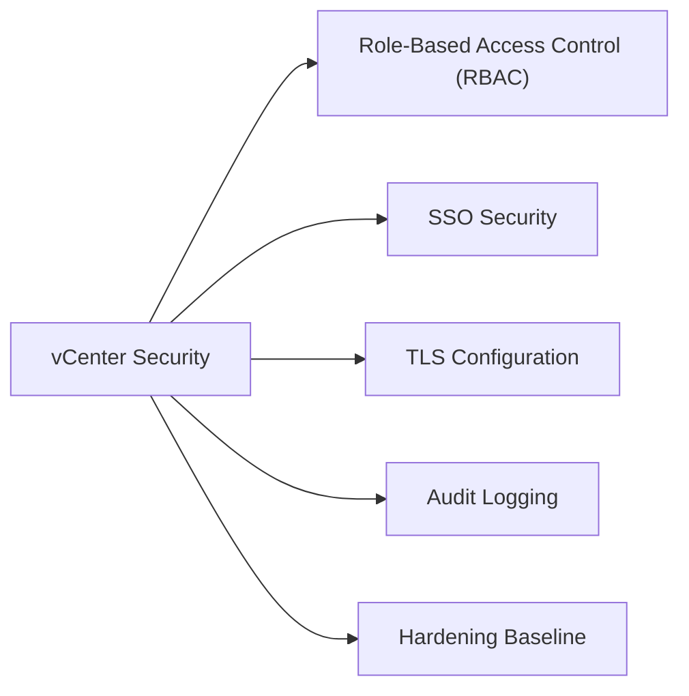

# vCenter Security



## Role-Based Access Control (RBAC)

vCenter uses a privilege-based permission model. Permissions are assigned as: **principal (user/group) + role (privilege set) + inventory object (scope)** + optional propagation to children.

### Built-in Roles

| Role | Description |
|---|---|
| Administrator | Full access to all objects |
| Read-Only | View objects and properties; no configuration changes |
| No Access | Explicitly block access to an object subtree |
| Virtual Machine User | Interact with (console, power on/off) but not configure VMs |
| Virtual Machine Power User | Interact + snapshot + basic reconfiguration |
| Resource Pool Administrator | Manage resource pools and child objects |
| Network Administrator | Manage networks and distributed switches |
| Datastore Consumer | Allocate space from datastores |

### Permission Scopes

- **Global Permission**: Applies across all vCenter instances in the SSO domain; use sparingly
- **Inventory Permission**: Applied at datacenter, cluster, folder, or individual object level
- **Propagation**: Check "Propagate to children" to apply down the hierarchy

### Custom Roles

Create custom roles for least-privilege: **Administration → Roles → New**

Common custom role patterns:
- **Backup Operator**: Snapshot + datastore browse + VM config (VADP minimum)
- **VM Operator**: Power operations + console + snapshot; no host/network/storage access
- **Monitoring Reader**: Read-only + performance counters
- **NSX Integration Service Account**: Specific host/network privileges for NSX compute manager

## SSO Security

### Authentication Policy

Configure at **Administration → Single Sign On → Configuration → Policies → Password Policy**:

| Parameter | Recommended Value |
|---|---|
| Maximum lifetime | 90 days |
| Minimum length | 16 characters |
| Complexity | Uppercase + lowercase + digits + special |
| Lockout (failed attempts) | 5 attempts |
| Lockout duration | 5 minutes |
| Failed attempt interval | 3 minutes |

### Identity Source Best Practices

- Use LDAPS (port 636) not plain LDAP for all AD identity sources
- Use a dedicated service account for LDAP bind; restrict it to read-only AD access
- Enable multi-factor authentication at the IdP level using SAML federation (ADFS/Okta)
- Review identity sources quarterly; remove unused sources

### Unlocking a Locked SSO Account

```bash
# From VCSA shell — unlock administrator@vsphere.local
/usr/lib/vmware-vmafd/bin/dir-cli user unlock --account administrator --domain vsphere.local
```

## TLS Configuration

vCenter enforces TLS 1.2 minimum by default (vSphere 7.0+). TLS 1.0 and 1.1 are disabled.

### Certificate Modes

| Mode | Description | When to Use |
|---|---|---|
| VMCA (default) | vCenter acts as CA; signs all vCenter/host certs | Lab, small deployments |
| Custom CA | Enterprise CA signs all certs; VMCA subordinate to enterprise CA | Enterprise/compliance |
| Hybrid | VMCA for machine SSL; custom CA for solution user certs | Transitional |
| External CA — all custom | All certs replaced with enterprise CA-signed certs | Strict compliance |

### Certificate Replacement — Machine SSL (VCSA)

```bash
# On VCSA shell
/usr/lib/vmware-vmca/bin/certificate-manager
# Option 1: Generate CSR signed by external CA
# Option 5: Replace machine SSL certificate
```

Replacement requires vCenter services restart. Plan a maintenance window.

### Certificate Monitoring

Check expiry for all vCenter certificates:

```powershell
# PowerCLI — check vCenter endpoint certificate expiry
$req = [Net.HttpWebRequest]::Create("https://<vcenter>")
$req.GetResponse() | Out-Null
$cert = $req.ServicePoint.Certificate
[DateTime]::Parse($cert.GetExpirationDateString())
```

## Audit Logging

### vCenter Events and Tasks

All configuration changes in vCenter generate events viewable at **Monitor → Events**. Events are stored in the PostgreSQL database. Default retention: 30 days for tasks, 30 days for events. Adjust at **Administration → vCenter Server Settings → Statistics**.

### Syslog Forwarding

Forward vCenter audit events to SIEM/syslog aggregator:

```
VAMI (https://<vcenter>:5480) → Syslog → Add Syslog Server
Protocol: TLS (preferred) / UDP / TCP
Port: 514 (UDP), 6514 (TLS)
```

Events forwarded include: login/logout, permission changes, VM creation/deletion, host add/remove.

### Alarm for Security Events

Create vCenter alarms for:
- Failed login attempts (event: `com.vmware.sso.LoginFailure`)
- Permission additions/removals
- Certificate expiry (< 30 days)
- SSH enabled on ESXi host

## Hardening Baseline

Follow the **VMware vSphere Security Configuration Guide (SCG)** published by Broadcom for the specific vSphere version. Key controls:

| Control | Setting |
|---|---|
| Restrict Shell access | Disable ESXi Shell except during maintenance |
| Lockdown Mode | Enable Normal or Strict Lockdown on all ESXi hosts |
| vCenter admin accounts | Named accounts only; no shared `administrator@vsphere.local` |
| API access | Restrict API access to management jump hosts (firewall rules) |
| NTP | Synchronised on all vCenter and ESXi nodes |
| Unused services | Disable unused vCenter plugins (e.g., legacy Web Client if not needed) |
| VAMI access | Restrict port 5480 access to admin subnets |
| TLS minimum | 1.2 enforced; verify with `tls-reconfigurator` tool if upgrading from older versions |
