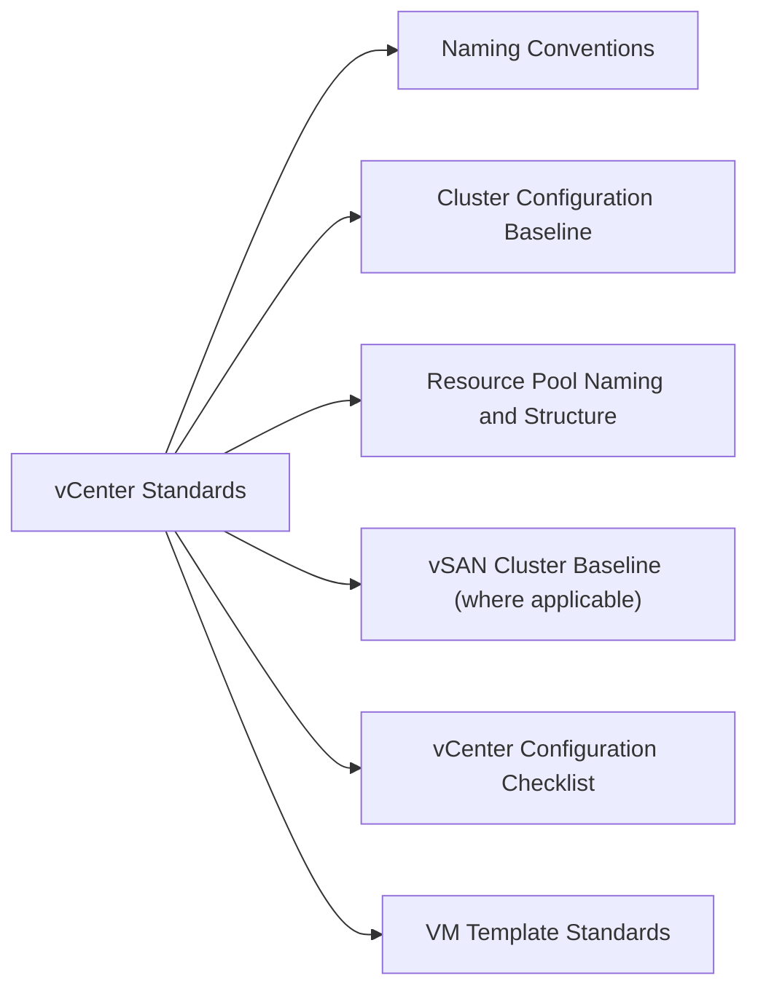

# vCenter Standards



## Naming Conventions

Consistent naming across the vSphere inventory is critical for readability, automation, and audit filtering.

| Object | Format | Example |
|---|---|---|
| Datacenter | `DC-<site>` | `DC-LON`, `DC-AMS` |
| Cluster | `CL-<site>-<function>` | `CL-LON-PROD`, `CL-AMS-DEV` |
| ESXi Host | `esxi-<nn>.<domain>` | `esxi-01.corp.example.com` |
| VMFS Datastore | `DS-VMFS-<array>-<nn>` | `DS-VMFS-PURE01-01` |
| NFS Datastore | `DS-NFS-<array>-<nn>` | `DS-NFS-NETAPP01-01` |
| vSAN Datastore | `DS-VSAN-<cluster>` | `DS-VSAN-CL-LON-PROD` |
| vDS | `VDS-<site>-<nn>` | `VDS-LON-01` |
| Port Group | `PG-<vlan>-<purpose>` | `PG-100-MGMT`, `PG-200-VMOTION` |
| Resource Pool | `RP-<tier>-<team>` | `RP-PROD-APP`, `RP-DEV-TEST` |
| vSphere Tag | `<category>:<value>` | `env:prod`, `tier:gold` |

## Cluster Configuration Baseline

### HA Settings

| Setting | Value | Notes |
|---|---|---|
| HA Enabled | Yes | Mandatory for production clusters |
| Admission Control | Cluster Resource Percentage | Reserve 25% CPU and memory |
| Host Failures to Tolerate | 1 | Increase to 2 for critical clusters |
| VM Monitoring | VM and Application | Requires VMware Tools |
| Datastore Heartbeating | 2 datastores | Select datastores on different arrays |
| VM Restart Priority | Medium (default) | Adjust per VM criticality |

### DRS Settings

| Setting | Value | Notes |
|---|---|---|
| DRS Enabled | Yes | Mandatory for production clusters |
| Automation Level | Fully Automated | Manual only acceptable in DR/test clusters |
| Migration Threshold | 3 (Conservative) | Adjust if vMotion noise is high |
| Predictive DRS | Enabled | Requires Aria Operations integration |
| VM Overrides | Per business requirement | Document in CMDB |

### vSphere HA Advanced Options (production)

```
das.failuredetectiontime = 15000
das.isolationaddress0 = <gateway IP>
das.isolationaddress1 = <secondary IP>
das.usedefaultisolationaddress = false
```

## Resource Pool Naming and Structure

```
Cluster Root
├── RP-PROD-CRITICAL   (Reservation: 40%, Limit: unlimited, Expandable: no)
├── RP-PROD-STANDARD   (Reservation: 20%, Limit: unlimited, Expandable: yes)
├── RP-DEV             (Reservation: 0, Limit: 4 GHz / 16 GB, Expandable: no)
└── RP-TEST            (Reservation: 0, Limit: 2 GHz / 8 GB, Expandable: no)
```

Avoid the **default resource pool** — all production VMs must be in a named pool.

## vSAN Cluster Baseline (where applicable)

| Setting | Value |
|---|---|
| Deduplication and Compression | Enabled (All-Flash only) |
| Encryption | Site-specific (requires KMS) |
| Storage I/O Control | Enabled |
| Default Storage Policy | `VSAN-FTT1-RAID1` (minimum production) |

## vCenter Configuration Checklist

- [ ] NTP configured (at least 2 sources, matching ESXi host NTP)
- [ ] DNS forward/reverse resolution working for all hosts
- [ ] Syslog forwarding configured to log aggregator
- [ ] SMTP relay configured for alarm notifications
- [ ] vCenter backup schedule configured and validated
- [ ] Certificate validity checked (>90 days remaining)
- [ ] SSO lockout policy set (5 failed attempts, 5-minute lockout)
- [ ] Default admin account password rotated per policy
- [ ] Alarm definitions reviewed and recipients set
- [ ] vSphere tags applied to all VMs (env, tier, owner)
- [ ] Resource pools created; default pool empty
- [ ] DRS and HA enabled on all production clusters

## VM Template Standards

| Setting | Standard |
|---|---|
| VMware Tools | Latest available, managed by vCenter |
| VM Hardware Version | Match the cluster's minimum supported version |
| vNIC | VMXNET3 |
| Disk Controller | VMware Paravirtual (PVSCSI) |
| Disk Provisioning | Thin (unless performance tier policy) |
| BIOS/EFI | EFI with Secure Boot for Windows Server 2019+/RHEL 8+ |
