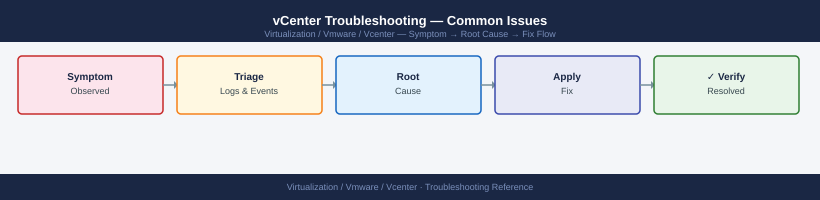

---
tags:
  - troubleshooting
  - vcenter
  - vmware
  - vsphere-8
search:
  boost: 2
---
# vCenter Troubleshooting — Common Issues

<div class="kb-summary">
Common Issues reference covering Issue Summary, vCenter Services Not Starting, Certificate Errors, ESXi Host Disconnected or Not Responding, SSO / Authentication Failures and 5 more sections.

*Applies to: vSphere 7.x / 8.x*
</div>


```d2
direction: down

symptom: Identify Symptom {shape: diamond}
vpxd_service_failure: "vpxd Service Failure" {shape: rectangle}
diagnostic_flow: "Diagnostic Flow" {shape: rectangle}
certificate_errors: "Certificate Errors" {shape: rectangle}
esxi_host_disconnected_or_not_respon: "ESXi Host Disconnected or Not Responding" {shape: rectangle}
sso_authentication_failures: "SSO / Authentication Failures" {shape: rectangle}
vami_inaccessible_port_5480: "VAMI Inaccessible (Port 5480)" {shape: rectangle}
resolution: Resolve or Escalate {shape: oval}

symptom -> vpxd_service_failure: investigate
symptom -> diagnostic_flow: investigate
symptom -> certificate_errors: investigate
symptom -> esxi_host_disconnected_or_not_respon: investigate
symptom -> sso_authentication_failures: investigate
symptom -> vami_inaccessible_port_5480: investigate
vpxd_service_failure -> resolution
diagnostic_flow -> resolution
certificate_errors -> resolution
esxi_host_disconnected_or_not_respon -> resolution
sso_authentication_failures -> resolution
vami_inaccessible_port_5480 -> resolution
```

## vpxd Service Failure

### Resolution

```bash
# If disk space is the cause — clear old logs first, then restart
du -sh /var/log/vmware/*/
find /var/log/vmware -name "*.gz" -mtime +30 -delete

# Restart in dependency order: DB first, then vpxd
service-control --start vmware-vpostgres
service-control --start vpxd
service-control --status vpxd

# If vpxd still fails, attempt a full restart of all services
service-control --stop --all
service-control --start --all
```

**Log location:** `/var/log/vmware/vpxd/vpxd.log`

---

## Diagnostic Flow

```d2
direction: right

S: "What is the symptom?" {shape: rectangle}
A: "Can" {shape: rectangle}
B: "ESXi host disconnected" {shape: rectangle}
C: "Certificate or SSO error" {shape: rectangle}
D: "Service crashed / alarm" {shape: rectangle}
E: "Upgrade failed" {shape: rectangle}
A2: "A2" {shape: rectangle}
A3: "Power on VCSA — check host it runs on" {shape: rectangle}
A4: "→ Services Not Starting section" {shape: rectangle}
A5: "A5" {shape: rectangle}
A6: "→ Certificate Errors section" {shape: rectangle}
A7: "→ SSO / Auth Failures section" {shape: rectangle}
A8: "→ VAMI Inaccessible section" {shape: rectangle}
B1: "→ ESXi Host Disconnected section" {shape: rectangle}
D1: "→ Alarms and Events section" {shape: rectangle}
E1: "→ vCenter Upgrade Failures section" {shape: rectangle}
A1: "A1" {shape: rectangle}

S -> A
S -> B
S -> C
S -> D
S -> E
A2 -> A3
A2 -> A4
A5 -> A6
A5 -> A7
A5 -> A8
B -> B1
C -> A6
D -> D1
E -> E1
```

---

## Before you begin

- **Access:** SSH to vCenter Shell and ESXi hosts; vSphere Client read access
- **Gather first:** recent error message text, event timestamps, and affected object names
- **Scope:** confirm whether the issue affects a single object, host, cluster, or site
- **Escalation:** open a vendor support ticket before running any destructive step
- **Logging:** document each command and output — required if escalation is needed

---

## Certificate Errors

### Symptoms
- Browser shows SSL certificate warning or ERR_CERT_AUTHORITY_INVALID
- ESXi agents cannot connect to vCenter
- PowerCLI `Connect-VIServer` throws certificate-related exceptions
- VAMI shows certificate status as Expired

### Check Certificate Expiry

```bash
# Check Machine SSL certificate expiry from outside VCSA
echo | openssl s_client -connect <vcenter-fqdn>:443 -servername <vcenter-fqdn> 2>/dev/null \
  | openssl x509 -noout -dates

# List certificates in VECS store on VCSA (SSH)
/usr/lib/vmware-vmafd/bin/vecs-cli entry list --store MACHINE_SSL_CERT --text \
  | grep -E "Alias|Not After"
```

### Resolution — Renew Machine SSL (VMCA-signed)

```bash
# From VCSA SSH: launch certificate manager
/usr/lib/vmware-vmca/bin/certificate-manager

# Select option 4: Regenerate a New VMCA Root Certificate and replace all certificates
# OR option 6: Replace Machine SSL certificate with VMCA Certificate
```

After renewal, restart services and verify:

```bash
service-control --stop --all
service-control --start --all

# Re-check certificate
echo | openssl s_client -connect <vcenter-fqdn>:443 2>/dev/null \
  | openssl x509 -noout -dates
```

**Log location:** `/var/log/vmware/vmcad/certificate-manager.log`

---

## ESXi Host Disconnected or Not Responding

### Symptoms
- Host shows "Disconnected" or "Not Responding" in vSphere Client
- `Get-VMHost | Where-Object {$_.ConnectionState -ne "Connected"}` returns host(s)
- VMs on that host still running but unmanaged

### Diagnostic Steps

```bash
# PowerCLI: list all non-connected hosts
Get-VMHost | Select Name, ConnectionState, PowerState | Where-Object {$_.ConnectionState -ne "Connected"}

# PowerCLI: get recent events for the disconnected host
Get-VIEvent -Entity (Get-VMHost "esxi-hostname") -MaxSamples 50 | Select CreatedTime, FullFormattedMessage

# From VCSA SSH: check vpxd log for host connection errors
grep "esxi-hostname" /var/log/vmware/vpxd/vpxd.log | tail -50

# From ESXi host (SSH): check hostd is running
/etc/init.d/hostd status
/etc/init.d/vpxa status
```

### Resolution

```bash
# PowerCLI: attempt reconnect
(Get-VMHost "esxi-hostname").ExtensionData.ReconnectHost_Task($null)

# If agent is stuck on ESXi host, restart it (SSH to ESXi)
/etc/init.d/vpxa restart
/etc/init.d/hostd restart
```

**Log locations:**
- VCSA: `/var/log/vmware/vpxd/vpxd.log`
- ESXi: `/var/log/vmware/vpxa.log`, `/var/log/vmware/hostd.log`

---

## SSO / Authentication Failures

### Symptoms
- Login to vSphere Client fails with "incorrect credentials" despite correct password
- AD/LDAP users cannot authenticate; local SSO accounts still work (or vice versa)
- `vmware-sts` service stopped
- Audit log shows repeated failed login attempts

### Diagnostic Steps

```bash
# Check SSO/STS service on VCSA
service-control --status vmware-stsd
service-control --status vmware-sts-idmd

# Check SSO log for auth errors
tail -100 /var/log/vmware/sso/vmware-sts-idmd.log | grep -i "error\|fail\|bind"

# Check if the AD identity source is reachable from VCSA
nslookup <ad-domain> <dns-server>
ldapsearch -x -H ldap://<dc-fqdn> -b "dc=domain,dc=com" "(objectClass=*)" -D "bind-user@domain.com" -W
```

### Resolution

```bash
# Restart SSO services if stsd is stopped
service-control --start vmware-stsd
service-control --start vmware-sts-idmd

# Unlock the administrator@vsphere.local account (if locked)
/usr/lib/vmware-vmafd/bin/dir-cli user unlock --account administrator --password <current-admin-pwd>
```

**Log location:** `/var/log/vmware/sso/vmware-sts-idmd.log`, `/var/log/vmware/sso/ssoAdminServer.log`

---

## VAMI Inaccessible (Port 5480)

### Symptoms
- `https://<vcenter>:5480` returns connection refused or times out
- Cannot access appliance management UI for backups, updates, certificates

### Diagnostic Steps

```bash
# SSH to VCSA as root

# Check applmgmt service
service-control --status applmgmt

# Check if port 5480 is listening
ss -tlnp | grep 5480

# Check applmgmt log
tail -50 /var/log/vmware/applmgmt/applmgmt.log
```

### Resolution

```bash
# Start the applmgmt service
service-control --start applmgmt

# Verify port is now open
ss -tlnp | grep 5480
```

If SSH itself is inaccessible, use the VCSA VM console in ESXi direct UI to log in as root.

---

## Datastore Alarms — Inaccessible or Over-Committed

### Symptoms
- Red alarm: "Datastore is inaccessible" or "Thin-provisioned disk overcommitment"
- VMs on affected datastore may pause or fail I/O

### Diagnostic Steps

```bash
# PowerCLI: list all datastores with free space
Get-Datastore | Select Name, CapacityGB, FreeSpaceGB, @{N="UsedPct";E={[math]::Round((1-($_.FreeSpaceGB/$_.CapacityGB))*100,1)}} | Sort UsedPct -Descending

# Check datastore accessibility state
Get-Datastore | Where-Object {$_.State -ne "Available"} | Select Name, State

# For NFS datastores: verify NFS export is reachable from all hosts mounting it
# SSH to ESXi: esxcli storage nfs list
```

---

## DRS / HA Configuration Warnings

### Symptoms
- Cluster shows yellow or red warning icon
- HA configuration issue: "Host has no management network redundancy"

### Diagnostic Steps

```bash
# PowerCLI: check cluster HA and DRS state
Get-Cluster | Select Name, DrsEnabled, DrsAutomationLevel, HAEnabled, HAAdmissionControlEnabled

# Check recent cluster events for HA/DRS errors
Get-Cluster "cluster-name" | Get-VIEvent -MaxSamples 50 | Where-Object {$_.FullFormattedMessage -match "HA|DRS"} | Select CreatedTime, FullFormattedMessage
```

### Resolution

Most HA config warnings are resolved by:
1. Reconfiguring HA on the cluster: right-click cluster → Reconfigure for vSphere HA
2. Checking management network redundancy: each host should have at least two vmknics in the management portgroup

---

## vCenter Upgrade Failures

### Symptoms
- VAMI → Update shows upgrade failed mid-process
- `applmgmt.log` shows precheck failure
- vCenter reverted to previous build (if precheck failed before stage 2)

### Diagnostic Steps

```bash
# Check upgrade log on VCSA
tail -200 /var/log/vmware/applmgmt/applmgmt.log | grep -i "error\|fail\|precheck"

# Check disk space — common precheck failure cause
df -h
```

### Resolution

1. If precheck failed (before stage 2 installs): the system is unchanged. Free disk space, then retry.
2. If stage 2 failed: do not reboot until you understand the state. Review `applmgmt.log` and open a VMware Support request if services are partially upgraded.
3. Restore from VAMI backup or snapshot if the environment is non-functional.

**Log locations:**
- `/var/log/vmware/applmgmt/applmgmt.log`
- `/var/log/vmware/applmgmt/software-packages.log`

## Alarms and Events

### Finding the Right Alarm or Event

vCenter alarms are visible under the **Alarms** tab on any inventory object (datacenter, cluster, host, VM). Triggered alarms surface the affected object, the alarm definition, and the time of the trigger.

```powershell
# List all VMs with active triggered alarms
Get-VM | Where-Object { $_.ExtensionData.TriggeredAlarmState.Count -gt 0 } |
    Select-Object Name, @{N="AlarmCount";E={$_.ExtensionData.TriggeredAlarmState.Count}}

# Get alarm details for a specific VM
$vm = Get-VM "app-server-01"
$vm.ExtensionData.TriggeredAlarmState | ForEach-Object {
    [PSCustomObject]@{
        Alarm = $_.Alarm.ToString()
        Status = $_.OverallStatus
        Time = $_.Time
    }
}

# Acknowledge all alarms on a specific host
$host = Get-VMHost "esxi-01.example.local"
$host.ExtensionData.TriggeredAlarmState | ForEach-Object {
    $alarmMgr = Get-View AlarmManager
    $alarmMgr.AcknowledgeAlarm($_.Alarm, $host.ExtensionData.MoRef)
}
```

### Filtering Events by Type and Time

```powershell
# All error-level events in the last 24 hours
Get-VIEvent -Start (Get-Date).AddHours(-24) |
    Where-Object { $_.GetType().Name -match "Error|Fault" } |
    Select-Object CreatedTime, UserName, FullFormattedMessage |
    Sort-Object CreatedTime -Descending

# Events for a specific cluster
Get-VIEvent -Entity (Get-Cluster "CL-LON-PROD") -MaxSamples 200 |
    Select-Object CreatedTime, UserName, FullFormattedMessage

# Login/logout events
Get-VIEvent -MaxSamples 500 |
    Where-Object { $_.GetType().Name -match "Login|Logout" } |
    Select-Object CreatedTime, UserName, FullFormattedMessage
```

### Common Alarm Noise and Tuning

| Alarm | Common False Positive Cause | Tuning Action |
|---|---|---|
| Host memory usage > threshold | Memory balloon during low activity | Raise threshold to 85% or add host-level override |
| Datastore disk usage > threshold | Snapshot growth or thin-provisioning | Set threshold to 80%; alert on trend not point-in-time |
| Virtual machine CPU ready > threshold | Low-vCPU-count VMs in high-density clusters | Tune threshold per workload type |
| SSH enabled on host | Break-glass or maintenance | Add suppression or use alarm action to auto-disable SSH after X hours |

Alarm definitions are managed at **vCenter → Configure → Alarm Definitions**. Each alarm has configurable thresholds, trigger conditions, and actions (send email, run script, send SNMP trap).

---

## See also

- [vCenter HA — Internals](../../../internals/vcha-internals/)
- [Certificate Chain — Internals](../../../internals/certificate-chain/)
- [Scenarios — vCenter Down](../../../topics/scenarios/vcenter-down/)

---

## Verify resolution

- **Alarms cleared:** Home → Alarms — the triggering alarm is no longer active
- **Event log:** confirm no new related error events in the last 5 minutes
- **Functional test:** perform the action that was failing (connect, vMotion, storage I/O) — confirm it succeeds
- **Monitor:** leave the vSphere Client open for 10 minutes and confirm the issue does not recur
