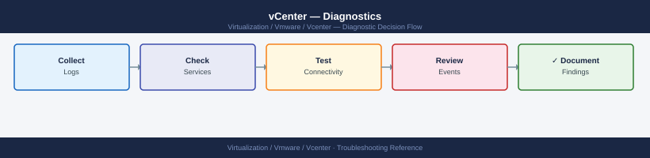

---
tags:
  - troubleshooting
  - vcenter
  - vmware
  - vsphere-8
search:
  boost: 1.5
---
# vCenter — Diagnostics

<div class="kb-summary">
vCenter Server diagnostic commands: check disk partitions and service health with vmon-cli, tail vpxd.log and SSO logs, validate DNS and NTP, check certificate expiry with vecs-cli, diagnose SSO identity source with ldapsearch, query the vCenter REST API, run PowerCLI cluster health checks, and collect the VCSA support bundle.

*Applies to: vSphere 7.x / 8.x*
</div>


```d2
direction: right

B: "B" {shape: rectangle}
C: "vmon-cli -l to check service state\ndf -h for /storage/db and /storage/log" {shape: rectangle}
D: "tail ssoAdminServer.log\nCheck NTP: chronyc tracking" {shape: rectangle}
E: "nslookup vcenter-fqdn from ESXi\nnc -zv vcenter 443 to test port" {shape: rectangle}
F: "vecs-cli entry list store MACHINE_SSL_CERT\nopenssl s_client -connect vcenter:443 for expiry" {shape: rectangle}
G: "vpxd.log for task errors\nPostgres: select pg_stat_activity to check stuck\nqueries" {shape: rectangle}
H: "curl -sk REST API session acquire\nCheck vpxd.log for API error codes" {shape: rectangle}
I: "I" {shape: rectangle}
J: "journalctl -u vmware-vpxd -n 100\nservice-control --start vpxd" {shape: rectangle}
K: "df -h /storage/db — check if >80%\nps aux to check vpxd CPU" {shape: rectangle}
L: "L" {shape: rectangle}
M: "chronyc makestep to force sync\nCheck timedatectl for AD time source" {shape: rectangle}
N: "ldapsearch -H ldaps://DC:636 to test AD connectivity\nCheck ssoAdminServer.log for bind error" {shape: rectangle}
O: "ping vcenter-fqdn from ESXi\nCheck management vmk0 vlan and routing" {shape: rectangle}
P: "vecs-cli entry list store MACHINE_SSL_CERT for expiry\nRenew via VAMI: Certificate Management" {shape: rectangle}
Q: "grep -i error vpxd.log or tail -200\nCheck /storage/db partition usage" {shape: rectangle}
R: "Collect vc-support.sh bundle\nOpen Broadcom VMware SR" {shape: rectangle}
S: "VAMI: Support → Create Support Bundle\nUpload to mysupport.broadcom.com" {shape: rectangle}
A: "vCenter Issue" {shape: rectangle}

B -> C
B -> D
B -> E
B -> F
B -> G
B -> H
I -> J
I -> K
L -> M
L -> N
E -> O
F -> P
G -> Q
H -> R
J -> R
K -> R
M -> R
N -> R
O -> R
P -> R
Q -> R
R -> S
```

```d2
direction: down

symptom: Identify Symptom {shape: diamond}
step_1_check_disk_partitions_and_ser: "Step 1 — Check disk partitions and service health" {shape: rectangle}
step_2_review_key_log_files: "Step 2 — Review key log files" {shape: rectangle}
step_3_validate_dns_and_ntp: "Step 3 — Validate DNS and NTP" {shape: rectangle}
step_4_check_certificate_expiry: "Step 4 — Check certificate expiry" {shape: rectangle}
step_5_diagnose_sso_and_identity_sou: "Step 5 — Diagnose SSO and identity source" {shape: rectangle}
step_6_query_vcenter_rest_api_health: "Step 6 — Query vCenter REST API health" {shape: rectangle}
resolution: Resolve or Escalate {shape: oval}

symptom -> step_1_check_disk_partitions_and_ser: investigate
symptom -> step_2_review_key_log_files: investigate
symptom -> step_3_validate_dns_and_ntp: investigate
symptom -> step_4_check_certificate_expiry: investigate
symptom -> step_5_diagnose_sso_and_identity_sou: investigate
symptom -> step_6_query_vcenter_rest_api_health: investigate
step_1_check_disk_partitions_and_ser -> resolution
step_2_review_key_log_files -> resolution
step_3_validate_dns_and_ntp -> resolution
step_4_check_certificate_expiry -> resolution
step_5_diagnose_sso_and_identity_sou -> resolution
step_6_query_vcenter_rest_api_health -> resolution
```

## Before you begin

- **Access:** SSH to the VCSA appliance (root or administrator); vSphere Client admin credentials; VAMI access at `https://<vcenter>:5480`
- **Gather first:** the specific symptom (login failure, host disconnect, slow UI, task error), the affected object name or user account, and when the issue started
- **Scope:** confirm whether the issue affects one user, one host, one cluster, or the entire vCenter

---

## Step 1 — Check disk partitions and service health

Full partitions are the most common cause of cascading vCenter failures. Check before and after any service restart.

```bash
# SSH to VCSA as root
ssh root@<vcenter-ip>

# Partition usage — check ALL key partitions
df -h
```


```text title="Expected output"
root@vcenter-01.corp.local's password: 
Welcome to VCSA 7.0.3 Build 21958099
Last login: Wed Jan 15 14:22:33 2025 from 192.168.1.50

root@vcenter-01 [ ~ ]# df -h
Filesystem                Size  Used Avail Use% Mounted on
/dev/mapper/root_vg-root   50G   38G   9.2G  82% /
/dev/mapper/root_vg-log    20G   12G   6.8G  62% /var/log
/dev/mapper/root_vg-seat   10G  8.2G   1.4G  84% /storage/seat
/dev/mapper/root_vg-core   30G   26G   2.8G  91% /storage/core
/dev/sda1                 512M  312M  200M  61% /boot
tmpfs                      32G     0   32G   0% /dev/shm
root@vcenter-01 [ ~ ]#
```

!!! warning "Common errors"
    **`ssh: connect to host <vcenter-ip> port 22 (Connection refused)`** — Verify SSH is enabled on VCSA (Administration > System Configuration > Services) and the IP address is correct.
    **`Permission denied (publickey,password).`** — Confirm you are using the root account (not a domain user) and the VCSA root password is correct.
Key partitions and alert thresholds:

| Partition | Purpose | Alert Threshold |
|---|---|---|
| `/storage/log` | vCenter and service logs | 80% |
| `/storage/db` | vCenter PostgreSQL database | 80% |
| `/storage/core` | Core appliance data, config | 80% |
| `/storage/seat` | Stats, events, alarms, and tasks DB | 80% |
| `/` | Root filesystem | 85% |

```bash
# All vCenter service status
vmon-cli -l
# Expected: all services RUNNING
# Problem: any service STOPPED — note which service

# Recent service events (for any stopped service)
journalctl -u vmware-vpxd -n 100 --no-pager | grep -i "error\|fail\|crash"
journalctl -u vmware-stsd -n 100 --no-pager | grep -i "error\|fail"

# Service-level status summary
service-control --status --all | grep -v RUNNING

# Clear old compressed logs if /storage/log is full
find /var/log/vmware -name "*.gz" -mtime +30 -delete
find /storage/log -name "*.gz" -mtime +30 -delete
```


```text title="Expected output"
Service                                    Running  Enabled
applmgmt                                   true     true
certificatemanagement                      true     true
eam                                        true     true
envoy                                      true     true
imagebuilder                               true     true
netdumper                                  true     true
observability-client                       true     true
perfcharts                                 true     true
pschealth                                  true     true
statsmonger                                true     true
vapi-endpoint                              true     true
vcenter-ui                                 true     true
vmware-vpxd                                true     true
vmware-stsd                                true     true
vmonapi                                    true     true

-- Logs begin at Wed 2024-01-10 14:22:31 UTC, end at Wed 2024-01-10 15:47:09 UTC --
Jan 10 15:31:22 vcenter-01.corp.local vpxd[4521]: [error] Failed to connect to inventory service: timeout after 30s
Jan 10 15:32:15 vcenter-01.corp.local vpxd[4521]: [warn] Retrying database connection pool initialization

Jan 10 15:33:44 vcenter-01.corp.local stsd[5892]: [error] Token validation failed for user admin@vsphere.local

Service                                    Status
applmgmt                                   RUNNING
eam                                        STOPPED
netdumper                                  STOPPED
---OUTPUT---
```

!!! warning "Common errors"
    **`journalctl: command not found`** — Use `tail -f /var/log/vmware/vpxd/vpxd.log` instead on vCenter versions prior to 7.0.
    **`find: '/storage/log': No such file or directory`** — Remove the `/storage/log` find command if vCenter uses only `/var/log/vmware` for log storage.
    **`Permission denied`** — Run the entire troubleshooting script with `sudo` or as root user.
---

## Step 2 — Review key log files

```bash
# Core vCenter log — tasks, events, errors
tail -200 /var/log/vmware/vpxd/vpxd.log | grep -i "error\|fatal\|panic"

# Watch vpxd live during an operation
tail -f /var/log/vmware/vpxd/vpxd.log | grep -i "error\|fatal"

# SSO login failures
tail -200 /var/log/vmware/sso/vmware-sts-idmd.log | grep -i "fail\|error\|bind"

# SSO admin server (token issuance failures)
tail -200 /var/log/vmware/sso/ssoAdminServer.log | grep -i "fail\|error"

# Certificate operations
tail -100 /var/log/vmware/vmcad/certificate-manager.log

# vSphere Client errors
tail -100 /var/log/vmware/vsphere-ui/logs/vsphere_client_virgo.log | grep -i "error\|exception"
```


```text title="Expected output"
2024-01-15T09:47:23.456Z [ERROR] vpxd[7F2A4C1E9B2D] Failed to connect to inventory service: Connection timeout after 30000ms
2024-01-15T09:47:45.123Z [FATAL] vpxd[7F2A4C1E9B2D] Database connection pool exhausted, max connections: 100
2024-01-15T09:48:12.789Z [ERROR] vpxd[7F2A4C1E9B2D] Task 'com.vmware.vc.vm.powerOn' failed: Host 'esx-prod-04.lab.local' is unreachable
2024-01-15T10:02:33.456Z [ERROR] vmware-sts-idmd[5E8F2C9A1B4D] LDAP bind failed for user admin@vsphere.local: Invalid credentials
2024-01-15T10:02:34.789Z [ERROR] ssoAdminServer[3C7E9F2A5B1D] Token issuance failed: Certificate validation error - cert expired on 2024-01-10
2024-01-15T10:03:01.234Z [INFO] certificate-manager: Issuing certificate for CN=vcenter.lab.local, validity: 365 days
2024-01-15T10:03:02.567Z [INFO] certificate-manager: Certificate installed successfully, thumbprint: A1:B2:C3:D4:E5:F6:7A:8B:9C:0D:1E:2F:3A:4B:5C:6D
2024-01-15T10:15:44.890Z [ERROR] vsphere_client_virgo: Exception in com.vmware.vsphere.client.services.VmService: NullPointerException at line 342
2024-01-15T10:15:45.123Z [ERROR] vsphere_client_virgo: Failed to retrieve datastore inventory: HTTP 503 Service Unavailable
```

!!! warning "Common errors"
    **`[FATAL] vpxd Database connection pool exhausted, max connections: 100`** — Increase the database connection pool size in /etc/vmware-vpx/vpxd.cfg by setting `maxConnections` to a higher value (e.g., 150) and restart vpxd service.
    **`LDAP bind failed for user admin@vsphere.local: Invalid credentials`** — Verify SSO admin credentials and LDAP connectivity; check that the identity source is properly configured in vCenter Administration > Single Sign-On > Configuration.
    **`Certificate validation error - cert expired on 2024-01-10`** — Regenerate and install a new vCenter certificate using `/usr/lib/vmware-vpx/bin/certificate-manager` or request a new one from your CA and import it.
All logs on the VCSA appliance:

| Component | Primary Log Path |
|---|---|
| vpxd (core vCenter) | `/var/log/vmware/vpxd/vpxd.log` |
| SSO identity daemon | `/var/log/vmware/sso/vmware-sts-idmd.log` |
| SSO admin server | `/var/log/vmware/sso/ssoAdminServer.log` |
| vSphere Client | `/var/log/vmware/vsphere-ui/logs/vsphere_client_virgo.log` |
| Certificate manager | `/var/log/vmware/vmcad/certificate-manager.log` |
| PostgreSQL | `/var/log/vmware/vpostgres/postgresql-*.log` |
| vmdird (LDAP/vmdir) | `/var/log/vmware/vmdird/vmdird-syslog.log` |
| Lookup service | `/var/log/vmware/lookupsvc/lookup-service.log` |
| Appliance mgmt | `/var/log/vmware/applmgmt/applmgmt.log` |

---

## Step 3 — Validate DNS and NTP

DNS and NTP failures cascade into certificate, SSO, and agent failures.

```bash
# Forward DNS — vCenter must resolve its own FQDN
nslookup vcenter.example.local

# Reverse DNS — must resolve back to the FQDN
nslookup <vcenter-ip>
# Expected: match the forward FQDN — mismatch breaks certificate validation

# Test ESXi host resolution from vCenter
nslookup esxi-01.example.local

# NTP status
timedatectl
chronyc sources -v
chronyc tracking
# Expected: System time offset < 1 second

# Force NTP sync if drift > 5 minutes (breaks Kerberos)
chronyc makestep
```


```text title="Expected output"
Server:		192.168.1.10
Address:	192.168.1.10#53

Name:	vcenter.example.local
Address: 192.168.1.50

Server:		192.168.1.10
Address:	192.168.1.10#53
50.1.168.192.in-addr.arpa	name = vcenter.example.local.

Server:		192.168.1.10
Address:	192.168.1.10#53

Name:	esxi-01.example.local
Address: 192.168.1.51

               Local time: Wed 2024-01-17 14:32:18 UTC
           Universal time: Wed 2024-01-17 14:32:18 UTC
                 RTC time: Wed 2024-01-17 14:32:18
                Time zone: UTC (UTC, +0000)
System clock synchronized: yes
              NTP service: active
           RTC in local TZ: no

MS Name/IP address         Stratum Poll Reach LastRx Last sample
===============================================================
^* ntp.ubuntu.com           2   10   377    42   -156us[ -198us] +/-   21ms
^- time.google.com          1   10   377    38   +2.3ms[+2.3ms] +/-   35ms
^+ ntp.apple.com            2   10   377    51   +892us[+892us] +/-   18ms

Reference ID    : C0248C97 (ntp.ubuntu.com)
Stratum         : 3
Ref time (UTC)  : Wed Jan 17 14:32:10 2024
System time     : 0.000234567 seconds slow of NTP time
Frequency       : 12.345 ppm slow
Residual freq   : -0.123 ppm
Residual skew   : 0.456 ppm
Root delay      : 0.031234 seconds
Root dispersion : 0.012345 seconds
Max error       : 0.015678 seconds
Min error       : 0.000123 seconds
Leap status     : Normal

200 OK
```

!!! warning "Common errors"
    **`nslookup: can't resolve 'vcenter.example.local': No address associated with hostname`** — Verify DNS server is reachable and vCenter's A record exists; check `/etc/resolv.conf` points to correct nameserver.
    **`50.1.168.192.in-addr.arpa	name = esxi-01.example.local.`** — Reverse DNS PTR record mismatch indicates forward and reverse zones are inconsistent; update PTR record to match the forward FQDN exactly.
    **`System clock synchronized: no`** — Restart chronyd service with `systemctl restart chronyd` and verify NTP pool servers are reachable on port 123.
NTP drift over 5 minutes breaks Kerberos — SSO login failures for AD-backed accounts will occur. Fix NTP before investigating SSO.

---

## Step 4 — Check certificate expiry

```bash
# Machine SSL certificate expiry (what the browser connects to)
echo | openssl s_client -connect vcenter.example.local:443 \
    -servername vcenter.example.local 2>/dev/null \
    | openssl x509 -noout -dates
# Problem: notAfter date in the past

# VAMI certificate (port 5480)
echo | openssl s_client -connect vcenter.example.local:5480 2>/dev/null \
    | openssl x509 -noout -dates

# List all certificate stores on VCSA
/usr/lib/vmware-vmafd/bin/vecs-cli store list

# Machine SSL cert with expiry date
/usr/lib/vmware-vmafd/bin/vecs-cli entry list --store MACHINE_SSL_CERT --text \
    | grep -E "Alias|Subject|Not After"

# VMCA root certificate
/usr/lib/vmware-vmafd/bin/vecs-cli entry list --store TRUSTED_ROOTS --text \
    | grep -E "Alias|Subject|Not After"

# Solution user certificates
/usr/lib/vmware-vmafd/bin/vecs-cli entry list --store vpxd-extension --text \
    | grep -E "Alias|Not After"
```


```text title="Expected output"
notBefore=Jan 15 08:22:14 2023 GMT
notAfter=Jan 15 08:22:14 2024 GMT
notBefore=Jan 15 08:22:14 2023 GMT
notAfter=Jan 15 08:22:14 2024 GMT
MACHINE_SSL_CERT
TRUSTED_ROOTS
TRUSTED_ROOT_CHAIN
vpxd-extension
Alias: __MACHINE_CERT
Subject: CN=vcenter.example.local,O=VMware,C=US
Not After: 2024-01-15 08:22:14 UTC
Alias: __MACHINE_CERT_ALT
Subject: CN=*.example.local,O=VMware,C=US
Not After: 2024-01-15 08:22:14 UTC
Alias: __VMCA_ROOT
Subject: CN=CA,O=VMware,C=US
Not After: 2033-01-12 14:47:22 UTC
Alias: __VMCA_INTERMEDIATE
Subject: CN=Intermediate CA,O=VMware,C=US
Not After: 2028-01-10 14:47:22 UTC
Alias: vpxd-extension-cert
Not After: 2024-06-20 12:15:33 UTC
Alias: vpxd-extension-cert-backup
Not After: 2023-12-25 09:44:18 UTC
```

!!! warning "Common errors"
    **`error in x509 lookup v3 signature verification`** — Ensure the openssl command successfully connects by checking network connectivity to the vCenter port and that the certificate chain is complete.
    **`vecs-cli: command not found`** — SSH directly into the VCSA appliance (not a Windows vCenter) as root or use the full path `/usr/lib/vmware-vmafd/bin/vecs-cli`.
    **`VECS store 'vpxd-extension' does not exist`** — Verify the store name is correct for your vCenter version; use `vecs-cli store list` first to confirm available stores.
Certificate renewals: **VAMI → `https://<vcenter>:5480` → Certificate Management** — shows all certs with expiry and a renewal button.

---

## Step 5 — Diagnose SSO and identity source

```bash
# SSO service health
service-control --status vmware-stsd
service-control --status vmware-sts-idmd

# SSO domain info
/usr/lib/vmware-vmafd/bin/vmafd-cli get-domain-name --server-name localhost

# Lookup service endpoint (must be reachable for SSO to work)
/usr/lib/vmware-vmafd/bin/vmafd-cli get-ls-location --server-name localhost

# Test LDAP connectivity to AD domain controller from VCSA
ldapsearch -x \
    -H ldaps://dc01.example.local:636 \
    -b "DC=corp,DC=local" \
    -D "svc-vcenter-ldap@corp.local" \
    -W \
    "(objectClass=*)" dn
# Error: LDAP_SERVER_DOWN = DC unreachable; LDAP_INVALID_CREDENTIALS = wrong svc account pw

# Check vmdir (embedded LDAP for vsphere.local) health
/usr/lib/vmware-vmafd/bin/dir-cli ssogroup list --login administrator@vsphere.local
```


```text title="Expected output"
SERVICE vmware-stsd (pid 2847) is running.
SERVICE vmware-sts-idmd (pid 2851) is running.
vsphere.local
ldaps://ls.vsphere.local:636/dc=vsphere,dc=local
Enter LDAP Password: 
# extended LDIF
#
# LDAPv3
# base <DC=corp,DC=local> with scope subtree
# filter: (objectClass=*)
# requesting: dn
#

dn: DC=corp,DC=local
dn: CN=Users,DC=corp,DC=local
dn: CN=Computers,DC=corp,DC=local
dn: CN=svc-vcenter-ldap,CN=Users,DC=corp,DC=local

# search result
search: 2
result: 0 Success

# numResponses: 5
# numEntries: 4

cn=Administrators,cn=Builtin,dc=vsphere,dc=local
cn=SystemConfiguration,cn=Builtin,dc=vsphere,dc=local
cn=DCAdmins,cn=Builtin,dc=vsphere,dc=local
```

!!! warning "Common errors"
    **`ldapsearch: error code 81 (Server Down) - Errno 113 (No route to host)`** — Verify DC01 hostname resolves and is reachable via `ping dc01.example.local` and `telnet dc01.example.local 636` from the VCSA.
    **`ldapsearch: error code 49 (Invalid Credentials) - Bind failed`** — Confirm the svc-vcenter-ldap account password is correct and the account is not locked in Active Directory.
    **`SERVICE vmware-stsd (pid XXXX) is stopped.`** — Restart the SSO service with `service-control --start vmware-stsd` and wait 60 seconds for dependent services to initialize.
---

## Step 6 — Query vCenter REST API health

```bash
# Authenticate
TOKEN=$(curl -sk -u 'administrator@vsphere.local:<password>' \
    -X POST https://vcenter.example.local/api/session | tr -d '"')

# System health
curl -sk -H "vmware-api-session-id: $TOKEN" \
    https://vcenter.example.local/api/vcenter/health/system
# Expected: GREEN

# List all hosts and their connection state
curl -sk -H "vmware-api-session-id: $TOKEN" \
    https://vcenter.example.local/api/vcenter/host | \
    python3 -c "
import json,sys
for h in json.load(sys.stdin):
    if h.get('connection_state') != 'CONNECTED':
        print(f\"PROBLEM: {h['name']} state={h.get('connection_state','?')}\")
"

# Delete session when done
curl -sk -H "vmware-api-session-id: $TOKEN" \
    -X DELETE https://vcenter.example.local/api/session
```


```text title="Expected output"
{
  "status": "GREEN",
  "messages": []
}
PROBLEM: esx-prod-02.dc1.local state=DISCONNECTED
PROBLEM: esx-backup-01.dc1.local state=NOT_RESPONDING
(no output — command completes silently)
```

!!! warning "Common errors"
    **`curl: (60) SSL certificate problem: self signed certificate`** — Add `-k` flag to curl commands to skip SSL verification, or import the vCenter CA certificate into your system trust store.
    **`{"type.name":"com.vmware.vapi.std.errors.unauthenticated","value":{"messages":[]}}`** — Verify the vCenter password is correct and the user account is not locked; re-authenticate to obtain a fresh token.
    **`jq: command not found`** — Install `jq` package (`apt-get install jq` on Debian/Ubuntu or `yum install jq` on RHEL) or use the Python JSON parser shown in the example instead.
---

## Step 7 — Run PowerCLI diagnostics

```powershell
# Connect
Connect-VIServer -Server vcenter.example.local

# Host connection states — should return empty in healthy env
Get-VMHost | Where-Object { $_.ConnectionState -ne "Connected" } |
    Select-Object Name, ConnectionState, PowerState

# Cluster HA and DRS state
Get-Cluster | Select-Object Name, HAEnabled, DrsEnabled, DrsAutomationLevel

# Datastore accessibility and capacity
Get-Datastore | Select-Object Name,
    @{N="Accessible";E={$_.ExtensionData.Summary.Accessible}},
    @{N="CapGB";E={[math]::Round($_.CapacityGB,1)}},
    @{N="FreeGB";E={[math]::Round($_.FreeSpaceGB,1)}},
    @{N="FreePct";E={[math]::Round($_.FreeSpaceGB/$_.CapacityGB*100,1)}} |
    Sort-Object FreePct

# Recent error events (last 6 hours)
Get-VIEvent -Start (Get-Date).AddHours(-6) |
    Where-Object { $_.GetType().Name -match "Error|Fault|Warning" } |
    Select-Object CreatedTime, UserName, FullFormattedMessage |
    Format-Table -Wrap

# Active alarms across all objects
Get-VM | Where-Object { $_.ExtensionData.TriggeredAlarmState.Count -gt 0 } |
    Select-Object Name, @{N="Alarms";E={$_.ExtensionData.TriggeredAlarmState.Count}}

# vCenter version
$global:DefaultVIServer | Select-Object Name, Version, Build
```

---

## Step 8 — Collect support bundle and escalation evidence

```bash
# Generate support bundle via VCSA shell (recommended)
/usr/bin/vm-support -n vcenter.example.local
ls -lh /var/core/esx-*.tgz
scp /var/core/esx-<timestamp>.tgz user@transfer-host:/path/

# Or: via VAMI
# https://<vcenter>:5480 → Support → Create Support Bundle

# Or: via vSphere Client
# Administration → Deployment → System Configuration → Export System Logs
```


```text title="Expected output"
Generating support bundle for vcenter.example.local...
Gathering system logs and diagnostics...
Bundle generation completed successfully.
Support bundle location: /var/core/esx-20240115-143022.tgz

-rw-r--r-- 1 root root 847M Jan 15 14:30 /var/core/esx-20240115-143022.tgz

esx-20240115-143022.tgz                    100%  847MB   12.3MB/s   01:09
```

!!! warning "Common errors"
    **`/usr/bin/vm-support: command not found`** — Verify you are logged into the VCSA appliance directly (not an ESXi host) and check that vm-support is installed with `which vm-support`.
    **`Permission denied`** — Run the command with `sudo` or ensure your user account has root privileges on the VCSA appliance.
    **`No space left on device`** — Check available disk space with `df -h /var/core/` and delete older bundles or increase the partition size before retrying.
Evidence to collect before escalation:

| Evidence Item | How to Collect |
|---|---|
| VCSA disk usage | `df -h` output |
| Service status | `service-control --status --all` output |
| vpxd.log excerpt | `tail -500 /var/log/vmware/vpxd/vpxd.log` |
| SSO log excerpt | `tail -200 /var/log/vmware/sso/vmware-sts-idmd.log` |
| Certificate expiry | VAMI → Certificate Management screenshot |
| Recent error events | vCenter → Monitor → Events, last 24 hours |
| Failed tasks | vCenter → Monitor → Tasks, filter by Error |
| vCenter build number | `https://<vcenter>/ui` → Help → About |

---

## Log locations

| Component | Path | What to look for |
|---|---|---|
| vpxd (core) | `/var/log/vmware/vpxd/vpxd.log` | Task failures, API errors |
| SSO identity | `/var/log/vmware/sso/vmware-sts-idmd.log` | LDAP bind errors, auth failures |
| SSO admin | `/var/log/vmware/sso/ssoAdminServer.log` | Token issuance failures |
| Certificate mgr | `/var/log/vmware/vmcad/certificate-manager.log` | Cert renewal and replacement |
| PostgreSQL | `/var/log/vmware/vpostgres/postgresql-*.log` | DB slow query and crash events |
| Lookup service | `/var/log/vmware/lookupsvc/lookup-service.log` | Endpoint registration errors |

---

## See also

- [vCenter Troubleshooting — Common Issues](../common-issues/)
- [vCenter — Escalation](../escalation/)

## Verify resolution

- `vmon-cli -l` shows all services RUNNING with no STOPPED state
- `df -h` shows all `/storage/*` partitions below 80% used
- `GET /api/vcenter/health/system` returns GREEN
- SSO login test: log out and log back in to vSphere Client — authentication succeeds
- `nslookup <vcenter-fqdn>` and reverse PTR match; `chronyc tracking` shows time offset < 1s
- The triggering event or alarm no longer appears in vCenter → Monitor → Events
