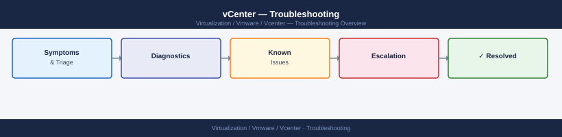

---
tags:
  - troubleshooting
  - vcenter
  - vmware
  - vsphere-8
search:
  boost: 1.5
---
# vCenter — Troubleshooting

Troubleshooting reference for VMware vCenter Server. Covers common VCSA failure patterns, SSO and certificate issues, diagnostic commands, log collection, and escalation procedures.

*Applies to: vSphere 7.x / 8.x*

<a class="kb-card" href="common-issues/">
  <strong>Common Issues</strong>
  Known failure modes, symptoms, causes, and fixes.
</a>

<a class="kb-card" href="diagnostics/">
  <strong>Diagnostics</strong>
  Diagnostic commands, log locations, and data collection.
</a>

<a class="kb-card" href="escalation/">
  <strong>Escalation</strong>
  What to collect before opening a support case and how to engage vendor support.
</a>

