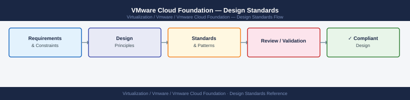

---
tags:
  - architecture
  - vcf
  - vmware
---
# VMware Cloud Foundation — Design Standards



```powershell
┌───────────────────────────── VMware Cloud Foundation — Design Standards ──────────────────────────────┐
│                                                                                                       │
│  VCF design standards define domain layout, host sizing, VLAN scheme, NSX topology,                   │
│  and upgrade sequencing following VMware VCF design guidance.                                         │
│                                                                                                       │
│   ┌──────────────────────────────────────────────┐  ┌─────────────────────────────────────────────┐   │
│   │                Domain Design                 │  │                Network Design               │   │
│   │          1 mgmt domain: min 4 hosts          │  │           VLANs: mgmt/vSAN/vMotion          │   │
│   │             1+ workload domains              │  │          NSX overlay: VXLAN/GENEVE          │   │
│   │            Separate VC per domain            │  │            25GbE minimum uplinks            │   │
│   │           NSX: shared or dedicated           │  │             MTU 9000: all VLANs             │   │
│   └──────────────────────────────────────────────┘  └─────────────────────────────────────────────┘   │
│                                                                                                       │
│  Mgmt domain hosts VCF tooling; workload domains host applications.                                   │
│                                                                                                       │
│                          ▼                                                 ▼                          │
│                                                                                                       │
│   ┌──────────────────────────────────────────────┐  ┌─────────────────────────────────────────────┐   │
│   │              Upgrade Standards               │  │               Sizing Standards              │   │
│   │           SDDC Mgr: upgrade via UI           │  │            Mgmt hosts: 512GB RAM+           │   │
│   │         Bundle: download from depot          │  │         Workload: right-size for app        │   │
│   │          Upgrade order: VCF defined          │  │             vSAN: HCL disks only            │   │
│   │         Pre-check: run before apply          │  │             NVMe/SSD: ESA or OSA            │   │
│   └──────────────────────────────────────────────┘  └─────────────────────────────────────────────┘   │
│                                                                                                       │
│  Physical Infrastructure (the hardware everything above runs on):                                     │
│  Servers must be on VCF HCL; 25GbE TOR switches; dedicated management network;                        │
│  separate OOB management (iDRAC/iLO) for host lifecycle.                                              │
│                                                                                                       │
│  Key terms:                                                                                           │
│                                                                                                       │
│  Management domain= first VCF domain; hosts SDDC Manager + shared infra                               │
│  Workload domain = application cluster; separate lifecycle from mgmt                                  │
│  SDDC Manager  = automation hub; upgrade bundles applied here                                         │
│  Bundle        = VCF update package; downloaded from VMware depot                                     │
│  Pre-check     = automated readiness validation before applying bundle                                │
│  NSX shared    = one NSX manager serving multiple domains                                             │
│  NSX dedicated = per-domain NSX manager for isolation                                                 │
│  GENEVE        = NSX-T overlay protocol; replaced VXLAN                                               │
│  MTU 9000      = jumbo frames; required for all VCF network segments                                  │
│  OOB           = Out-of-Band management; iDRAC/iLO for host power/BIOS                                │
│  HCL           = Hardware Compatibility List; VCF-specific requirements                               │
│  Upgrade order = VCF prescribes sequence; SDDC Mgr → vCenter → ESXi → NSX                             │
│                                                                                                       │
└───────────────────────────────────────────────────────────────────────────────────────────────────────┘
```

## See also

- [VMware Cloud Foundation — How It Works](how-it-works/)
- [VMware Cloud Foundation — Deploy](../deploy/)
