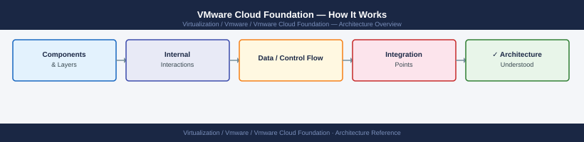
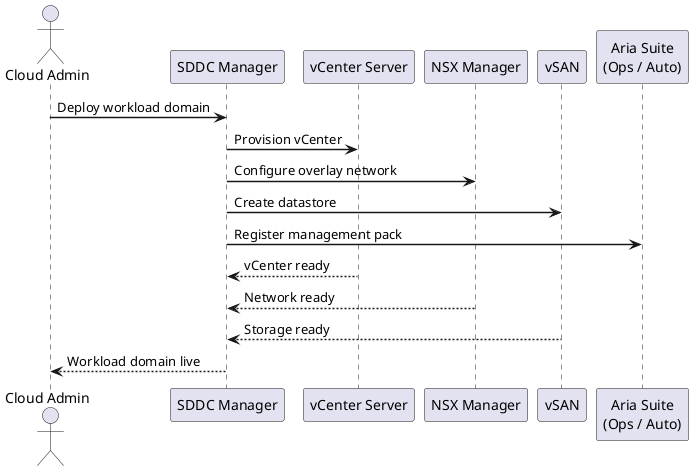
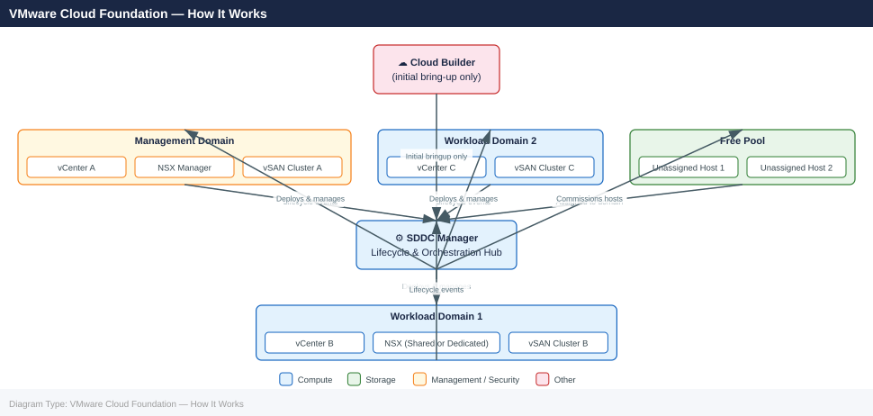

---
tags:
  - architecture
  - vcf
  - vmware
---
# VMware Cloud Foundation — How It Works

*Applies to: VMware vSphere 7.x / 8.x*


```text
SDDC Manager → Security → Password Management
→ Select component → Rotate Password
```




```text title="Expected output"
(no output — this is a PlantUML diagram definition block, not executable bash code)
```
```bash
## API — rotate a single credential
curl -sk -u 'admin@local:password' \
  -X POST \
  -H "Content-Type: application/json" \
  -d '{"credentialType": "SSH", "resourceType": "ESXI"}' \
  "https://sddc-manager.example.local/v1/credentials/rotate"

## Check credential rotation status
curl -sk -u 'admin@local:password' \
  "https://sddc-manager.example.local/v1/credentials" | python3 -m json.tool
```
```text
SDDC Manager → Security → Certificate Management
→ View expiry per component → Renew or Replace
```
```bash
## Check certificate expiry across all components (API)
curl -sk -u 'admin@local:password' \
  "https://sddc-manager.example.local/v1/certificates" | \
  python3 -m json.tool | grep -E "expirationDate|resourceFqdn"
```
```text
SDDC Manager → Network Settings → Network Pools
→ Create pool → specify VLAN, subnet, gateway, IP range
```
```text
1. Rack and cable host; configure BIOS baseline
2. Install ESXi (or use Auto Deploy)
3. Set management IP, FQDN, DNS — must resolve forward and reverse
4. SDDC Manager → Inventory → Hosts → Commission
   → Provide ESXi IP and root credentials
   → SDDC Manager validates: HCL, SSH, DNS, NTP
5. Host enters "Unassigned" state — available for domain expansion
```
```text
SSH to SDDC Manager appliance (vcf user → sudo), then check:
/var/log/vmware/vcf/sddc-manager/vcfops.log     # LCM and orchestration
/var/log/vmware/vcf/sddc-manager/sddc-svc.log   # core SDDC Manager service
/var/log/vmware/vcf/lcm/lcm-debug.log           # Lifecycle Management detail
/var/log/vmware/vcf/domainmanager/dm.log        # Workload domain operations
/var/log/vmware/vcf/commonsvcs/audit.log        # Admin actions and API calls
```



## See also

- [VMware Cloud Foundation — Design Standards](../design-standards/)
- [VMware Cloud Foundation — Deploy](../../deploy/)
- [VMware Cloud Foundation — Integrations](../integrations/)
