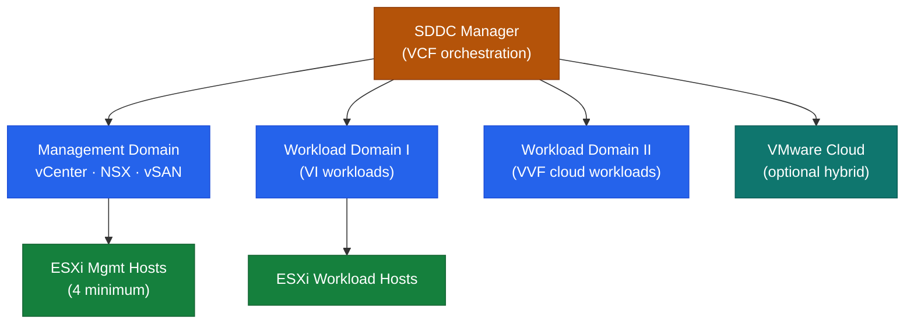

# VCF — Architecture Overview

## SDDC Stack Architecture

## Overview

VMware Cloud Foundation (VCF) is a full-stack SDDC platform that combines vSphere, vSAN, NSX, and SDDC Manager into a single integrated and lifecycle-managed platform.

Key concepts:
- **SDDC Manager** is the central orchestrator — it manages workload domains, lifecycle upgrades, password rotation, and certificate management across the entire stack
- **Management Domain** hosts the VCF management components (vCenter, NSX Manager, SDDC Manager themselves)
- **Workload Domains** are independently managed vSphere/vSAN/NSX instances provisioned by SDDC Manager for tenant or application workloads
- **Bill of Materials (BOM)** defines the validated, interoperable versions of all components for a given VCF release

---

## In this section

<a class="kb-card" href="components/"><strong>Components</strong>Core components, services, and technical specifications.</a>
<a class="kb-card" href="integrations/"><strong>Integrations</strong>Integration with other platforms and external systems.</a>
<a class="kb-card" href="standards/"><strong>Standards</strong>Sizing guidelines, design standards, and best practices.</a>

