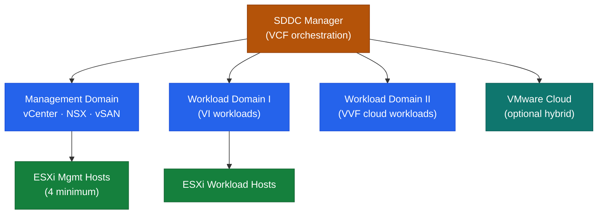

# VCF — Architecture Overview

VMware Cloud Foundation (VCF) is a full-stack SDDC platform. SDDC Manager orchestrates vSphere, vSAN, and NSX as a validated, lifecycle-managed unit across deployment domains.

| Domain Type | Purpose | Components |
|---|---|---|
| Management Domain | Hosts VCF management stack | SDDC Manager, vCenter, NSX, vSAN |
| VI Workload Domain | General-purpose vSphere workloads | vCenter, NSX, vSAN (per domain) |
| VVF Workload Domain | Cloud-native / Tanzu workloads | vCenter, NSX, vSAN + TKGs |
| Consolidated Architecture | Small deployments — management + workload combined | All on 4 hosts |

<a class="kb-card" href="how-it-works/"><strong>How It Works</strong>SDDC Manager, deployment domains, BOM, lifecycle management, passwords, certificates, and network pools.</a>
<a class="kb-card" href="integrations/"><strong>Integrations</strong>Aria Operations, Aria Automation, Active Directory, NSX Federation, backup, and SIEM.</a>
<a class="kb-card" href="design-standards/"><strong>Design Standards</strong>Management domain sizing, naming conventions, network requirements, password policy, and HCL requirements.</a>

---

## SDDC Stack Architecture

