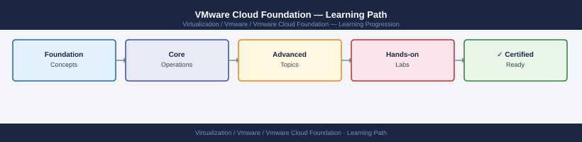

---
tags:
  - learning-path
  - vcf
  - vmware
---
# VMware Cloud Foundation — Learning Path

Recommended reading order for VMware Cloud Foundation (VCF). Follow these stages in order to build a complete mental model before working with it in production.

*Applies to: VCF 4.x · 5.x*

## Stage 1 — Architecture

**Goal**: Understand how SDDC Manager orchestrates the management domain, workload domains, and the full lifecycle of every component it manages.

**Read in this order**:

- [How It Works](../architecture/how-it-works/) — SDDC Manager as the orchestration layer, management domain vs VI workload domains, bring-up sequence, component registry, and the VCF bill of materials (BoM)
- [Design Standards](../architecture/design-standards/) — management domain host count minimums, workload domain isolation levels, vSAN storage policy alignment with VCF, and NSX overlay design within VCF
- [Integrations](../architecture/integrations/) — VCF integration with Aria Suite Lifecycle for Aria product deployment, vRealize Orchestrator, external identity providers, and Dell VxRail as a VCF-validated system

**Why first**: VCF is not a product — it is an orchestration layer over vCenter, ESXi, vSAN, and NSX. Understanding what SDDC Manager can and cannot manage, and which operations must go through SDDC Manager vs directly through vCenter, is critical before making any configuration change. Bypassing SDDC Manager for changes it owns corrupts its component inventory and breaks LCM.

---

## Stage 2 — Deployment

**Goal**: Understand the bring-up prerequisites and the SDDC Manager-driven workload domain provisioning workflow.

**Read**:

- [Deploy](../deploy/) — Cloud Builder bring-up prerequisites, JSON parameter file structure, bring-up validation checks, management domain formation, and adding the first VI workload domain
- [Install & Upgrade](../operations/install-upgrade/) — LCM bundle download and staging, upgrade sequencing (SDDC Manager → vCenter → NSX → ESXi), impact assessment, and rollback limitations per component

**Why second**: VCF bring-up is idempotent within a session but cannot be rewound after the management domain is formed. Understanding each validation stage and the parameter file requirements before starting prevents a failed bring-up that leaves a partially configured environment.

---

## Stage 3 — Operations

**Goal**: Use SDDC Manager to manage the full lifecycle of bundles, passwords, and certificates without breaking the component trust chain.

**Read in this order**:

- [Health Checks](../operations/health-checks/) — start here every shift; run the routine covering SDDC Manager service health, component certificate expiry, LCM bundle status, and workload domain connectivity
- [CLI Reference](../operations/cli-reference/) — SDDC Manager REST API for workload domain operations, `lcm-bundle-transfer-util`, and component-level CLI access via SDDC Manager SSH
- [Procedures](../operations/procedures/) — password rotation for all managed accounts via SDDC Manager, certificate rotation workflow, expanding a workload domain with new hosts, and decommissioning a host
- [Backup & Restore](../operations/backup-restore/) — SDDC Manager backup schedule configuration, restoring SDDC Manager from backup, and what component state is and is not captured in the backup
- [Scripts](../operations/scripts/) — API scripts for LCM bundle status polling, certificate expiry reporting across all workload domains, and bulk password health checks

**Why third**: VCF password and certificate rotation must go through SDDC Manager. Rotating credentials directly on vCenter or NSX without SDDC Manager awareness breaks the component trust model and causes subsequent LCM operations to fail with authentication errors.

---

## Stage 4 — Security

**Goal**: Manage SDDC Manager access controls, enforce certificate policy across all workload domains, and harden the management domain.

**Read**:

- [Access Control](../security/access-control/) — SDDC Manager roles (Admin, Operator, Viewer), vIDM integration for SSO, and how RBAC in SDDC Manager maps to permissions in vCenter and NSX
- [Authentication](../security/authentication/) — SDDC Manager local account management, vIDM/Workspace ONE integration, and service account password policy enforcement via LCM
- [Encryption](../security/encryption/) — VCF-managed certificate authority (Microsoft CA or VMCA), TLS enforcement between all components, and the impact of certificate rotation on LCM operations
- [Hardening](../security/hardening/) — SDDC Manager API access restrictions, audit log configuration, management network isolation, and minimising the bring-up appliance exposure post-deployment

**Why fourth**: Security controls in VCF must account for the SDDC Manager service accounts that need elevated access to all managed components. Hardening too aggressively before understanding these service account requirements breaks LCM and requires VMware GSS involvement to recover.

---

## Stage 5 — Troubleshooting

**Goal**: Diagnose LCM upgrade failures, SDDC Manager service errors, workload domain provisioning failures, and password sync issues.

**Read**:

- [Common Issues](../troubleshooting/common-issues/) — LCM upgrade stalled mid-sequence, SDDC Manager database corruption, workload domain creation failing at NSX transport node prep, and password rotation leaving a component out of sync
- [Diagnostics](../troubleshooting/diagnostics/) — SDDC Manager log locations (`/var/log/vmware/vcf/`), LCM task history via API, bundle download failure diagnostics, and component health API endpoints
- [Escalation](../troubleshooting/escalation/) — VCF support bundle collection, required API exports before opening a GSS case, and the component-specific logs that VMware Support will ask for first

**Why last**: Troubleshooting makes most sense once you know the normal operating state.

---

## See also

- [VCF — Deploy](../deploy/)
- [VCF — Procedures](../operations/procedures/)
- [VCF — Common Issues](../troubleshooting/common-issues/)
