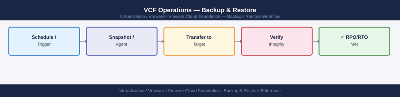
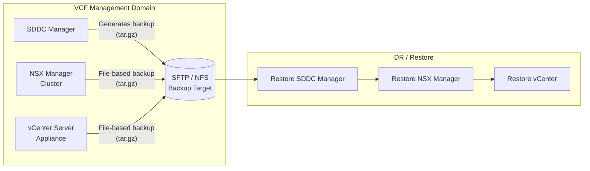
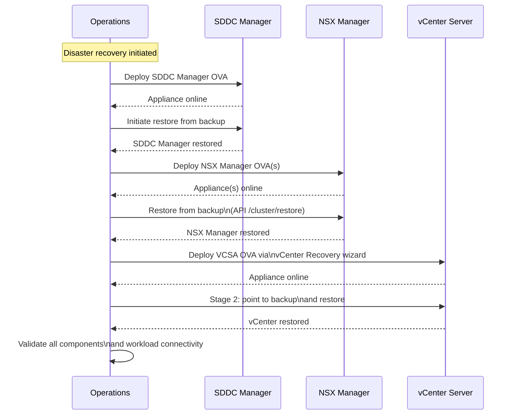

---
tags:
  - operations
  - vcf
  - vmware
---
# VCF Operations — Backup & Restore

<div class="kb-summary">
VMware Cloud Foundation backup protects the management plane components: SDDC Manager, NSX Manager, and vCenter Server. Each component has its own backup mechanism and must be restored in the correct sequence.

*Applies to: VCF 4.x / 5.x*
</div>


 This page covers configuration, scheduling, restore procedures, and validation.

---

## Before you begin

- **Access:** vCenter read-only minimum; Administrator role for remediation steps
- **Timing:** safe to run during business hours unless a step is marked ⚠ (causes interruption)
- **Dependencies:** no active upgrades or migrations on the same infrastructure
- **Logging:** capture command output — paste into the change record on completion

---

## Management Plane Backup Overview

| Component | Backup Mechanism | Backup Target |
|---|---|---|
| SDDC Manager | Built-in backup (sftp / nfs) | SFTP or NFS share |
| NSX Manager | Built-in file-based backup | SFTP server |
| vCenter Server | File-Based Backup (FBB) | SFTP, FTP, NFS, HTTP, SCP |
| vSAN | No standalone backup — configuration embedded in vCenter + cluster | VCSA backup sufficient |
| ESXi host profiles | Host Profile export | File system / SDDC Manager |

> **Restore sequence (critical):** SDDC Manager → NSX Manager → vCenter Server. Restoring out of order will cause component relationship failures.

---

## Backup Architecture



---

## NSX Manager Backup

### Configure via NSX UI

1. Log in to **NSX Manager** (`https://<nsx-manager-vip>`).
2. Navigate to **System → Backup & Restore**.
3. Click **Edit** next to **SFTP Server**.

| Field | Value |
|---|---|
| Protocol | SFTP |
| IP / FQDN | `backup-srv.corp.example.com` |
| Port | 22 |
| Username | `nsx-backup` |
| Directory | `/vcf/nsx/` |
| Passphrase | (encryption passphrase) |
| Backup Frequency | Hourly |

4. Click **Save**, then **Backup Now** to test.

### Configure via NSX API

```bash
NSX_MGR="nsx-manager.corp.example.com"
NSX_USER="admin"
NSX_PASS="NSXAdminPassword"

# Configure backup
curl -sk -u "$NSX_USER:$NSX_PASS" \
  -X PUT "https://$NSX_MGR/api/v1/cluster/backups/config" \
  -H "Content-Type: application/json" \
  -d '{
    "backup_enabled": true,
    "remote_file_server": {
      "server": "backup-srv.corp.example.com",
      "port": 22,
      "protocol": {"protocol_name": "sftp"},
      "directory_path": "/vcf/nsx/",
      "authentication": {
        "authentication_scheme": {
          "scheme_name": "PASSWORD",
          "username": "nsx-backup",
          "password": "SFTPPassword"
        }
      }
    },
    "backup_schedule": {
      "resource_type": "IntervalBackupSchedule",
      "seconds_between_backups": 3600
    },
    "passphrase": "BackupEncryptionPassphrase"
  }'

# Trigger manual backup
curl -sk -u "$NSX_USER:$NSX_PASS" \
  -X POST "https://$NSX_MGR/api/v1/cluster/backups?action=start"

# List available backups
curl -sk -u "$NSX_USER:$NSX_PASS" \
  "https://$NSX_MGR/api/v1/cluster/restore/backuptimestamps" | jq '.results[] | {backup_id, timestamp}'
```


```text title="Expected output"
{
  "backup_enabled": true,
  "remote_file_server": {
    "server": "backup-srv.corp.example.com",
    "port": 22,
    "protocol": {
      "protocol_name": "sftp"
    },
    "directory_path": "/vcf/nsx/",
    "authentication": {
      "authentication_scheme": {
        "scheme_name": "PASSWORD",
        "username": "nsx-backup"
      }
    }
  },
  "backup_schedule": {
    "resource_type": "IntervalBackupSchedule",
    "seconds_between_backups": 3600
  }
}
{
  "backup_id": "backup-20240115-143022",
  "start_timestamp": 1705329622000
}
{
  "backup_id": "backup-20240115-143022",
  "timestamp": 1705329622000
}
{
  "backup_id": "backup-20240114-091545",
  "timestamp": 1705245345000
}
{
  "backup_id": "backup-20240113-180030",
  "timestamp": 1705162830000
}
```

!!! warning "Common errors"
    **`curl: (60) SSL certificate problem: self signed certificate`** — Add `-k` flag to skip SSL verification or import the NSX Manager's CA certificate into your system trust store.
    **`{"error_code":401,"error_message":"Invalid credentials"}`** — Verify NSX_USER and NSX_PASS variables are correct and the admin account has not been locked after failed login attempts.
    **`{"error_code":400,"error_message":"Connection to remote file server failed"** — Confirm the backup server hostname resolves, port 22 is open, and the nsx-backup user credentials have write permissions on the /vcf/nsx/ directory.
---

## vCenter Server File-Based Backup (FBB)

### Configure via VAMI

1. Access vCenter VAMI: `https://<vcsa-fqdn>:5480`
2. Navigate to **Backup**.
3. Click **Configure**.

| Field | Value |
|---|---|
| Backup Protocol | SFTP |
| Server | `backup-srv.corp.example.com` |
| Port | 22 |
| Username | `vcsa-backup` |
| Password | (store in vault) |
| Backup Directory | `/vcf/vcenter/` |
| Encrypt backup | Yes |
| Backup Password | (encryption passphrase) |
| Schedule | Daily at 02:00 |
| Retention | 3 copies |

4. Click **Save**, then **Backup Now** to validate.

### Trigger Backup via REST API

```bash
VCSA="vcenter.corp.example.com"

# Authenticate (returns session ID)
SESSION=$(curl -sk -u "administrator@vsphere.local:vSpherePassword" \
  -X POST "https://$VCSA/rest/com/vmware/cis/session" \
  -H "Content-Type: application/json" | tr -d '"')

# Create backup job
curl -sk -H "vmware-api-session-id: $SESSION" \
  -X POST "https://$VCSA/rest/appliance/recovery/backup/job" \
  -H "Content-Type: application/json" \
  -d '{
    "spec": {
      "location_type": "SFTP",
      "location": "sftp://backup-srv.corp.example.com/vcf/vcenter/",
      "location_user": "vcsa-backup",
      "location_password": "SFTPPassword",
      "parts": ["common", "seat"],
      "backup_password": "BackupEncryptionPassphrase",
      "comment": "Scheduled backup"
    }
  }' | jq '.value.id'
```


```text title="Expected output"
% Total    % Received % Xferd  Average Speed   Time    Time     Time  Current
                                 Dload  Upload   Total   Spent    Left  Speed
100   512  100   512    0     0   1847      0 --:--:-- 0:00:00 --:--:-- 0:00:00
"52d4a8f1-7c2e-4a9b-b3f2-9e1c6d5a2b8f"
```

!!! warning "Common errors"
    **`curl: (60) SSL certificate problem: self signed certificate`** — Add `-k` flag to curl command to skip SSL verification (already present in example, but verify if using different curl version).
    **`{"type":"com.vmware.vapi.std.errors.unauthenticated","value":{"messages":[{"args":[],"default_message":"Invalid session.","id":"Com.Vmware.Vapi.Std.Errors.Unauthenticated"}]}}`** — Verify credentials are correct and VCSA is reachable; re-authenticate and capture SESSION variable before running backup job command.
    **`jq: parse error: Cannot index string with string "value"`** — Ensure the backup job creation succeeded by checking the full response without piping to jq first; the API may have returned an error object instead of the expected job response.
---

## vSAN Configuration Backup

vSAN configuration is captured as part of the vCenter backup (all cluster settings are stored in the vCenter database). No separate backup is required for vSAN data — only for configuration.

To extract vSAN configuration details for documentation or recovery reference:

```powershell
# Connect to vCenter
Connect-VIServer -Server vcenter.corp.example.com -User administrator@vsphere.local -Password "vSpherePassword"

# Export vSAN cluster configuration
$Cluster = Get-Cluster "VCF-Cluster-01"
$vsanView = Get-VsanView -Id "VsanVcClusterConfigSystem-vsan-cluster-config-system"
$Config   = $vsanView.VsanClusterGetConfig($Cluster.Id)
$Config | ConvertTo-Json -Depth 10 | Out-File "vsan-config-$(Get-Date -Format yyyyMMdd).json"

# Also capture disk group layout
Get-VsanDiskGroup -Cluster $Cluster | Select-Object VMHost, @{N='CacheDisks';E={$_.CacheDisk.CanonicalName}}, @{N='CapacityDisks';E={$_.DataDisk.CanonicalName -join ','}} | Export-Csv "vsan-diskgroups-$(Get-Date -Format yyyyMMdd).csv"
```

---

## Restore Procedure

### Restore Sequence



### Step 1 — Restore SDDC Manager

1. Deploy a new SDDC Manager OVA with the same IP, FQDN, and sizing as the original.
2. In the SDDC Manager UI: **Administration → Backup & Restore → Restore**.
3. Provide SFTP credentials and select the backup to restore from.
4. Monitor the restore task until completion.

### Step 2 — Restore NSX Manager

```bash
# Point the new NSX Manager appliance at the SFTP backup location
curl -sk -u "admin:NSXAdminPassword" \
  -X POST "https://<new-nsx-manager>/api/v1/cluster/restore?action=start" \
  -H "Content-Type: application/json" \
  -d '{
    "backup_timestamp": "<timestamp-from-backuptimestamps-api>",
    "passphrase": "BackupEncryptionPassphrase",
    "remote_file_server": {
      "server": "backup-srv.corp.example.com",
      "port": 22,
      "protocol": {"protocol_name": "sftp"},
      "directory_path": "/vcf/nsx/",
      "authentication": {
        "authentication_scheme": {
          "scheme_name": "PASSWORD",
          "username": "nsx-backup",
          "password": "SFTPPassword"
        }
      }
    }
  }'

# Monitor restore progress
curl -sk -u "admin:NSXAdminPassword" \
  "https://<new-nsx-manager>/api/v1/cluster/restore/status" | jq '{status, step, total_steps}'
```


```text title="Expected output"
{
  "status": "IN_PROGRESS",
  "step": 3,
  "total_steps": 8
}
{
  "status": "IN_PROGRESS",
  "step": 5,
  "total_steps": 8
}
{
  "status": "IN_PROGRESS",
  "step": 7,
  "total_steps": 8
}
{
  "status": "COMPLETED",
  "step": 8,
  "total_steps": 8
}
```

!!! warning "Common errors"
    **`curl: (60) SSL certificate problem: self signed certificate`** — Add `-k` flag to skip SSL verification (already present; if error persists, verify NSX Manager certificate is valid and hostname matches).
    **`{"error_code": 400, "error_message": "Invalid backup_timestamp format or timestamp not found"}`** — Retrieve the correct timestamp from the `/api/v1/cluster/backups/timestamps` endpoint and ensure it matches exactly.
    **`{"error_code": 401, "error_message": "Authentication failed"}`** — Verify the NSX Manager admin credentials and SFTP authentication password are correct, and that the backup file exists at the specified directory path.
### Step 3 — Restore vCenter Server

Use the **vCenter Server Installer** (ISO mounted on a management workstation):

```text
1. Mount VMware-VCSA-<version>.iso
2. Run: installer/win32/installer.exe (Windows) or installer/mac/Installer.app
3. Select "Restore"
4. Stage 1: Deploy new appliance (same IP, FQDN, sizing)
5. Stage 2: Connect to backup source (SFTP) and select backup
6. Enter backup encryption passphrase
7. Complete restore — appliance reboots with restored state
```

---

## Validation Steps

```powershell
# Connect to restored vCenter
Connect-VIServer -Server vcenter.corp.example.com -User administrator@vsphere.local -Password "vSpherePassword"

# Verify cluster and host inventory
Get-Cluster | Select-Object Name, @{N='Hosts';E={($_ | Get-VMHost).Count}}
Get-VMHost  | Select-Object Name, ConnectionState, PowerState

# Verify vSAN health
Get-VsanView -Id "VsanVcClusterHealthSystem-vsan-cluster-health-system" |
  ForEach-Object { $_.VsanQueryVcClusterHealthSummary($cluster.Id,$null,$null,$true,$null,$null,'defaultView') } |
  Select-Object overallHealth

# Check all management VMs are running
Get-VM | Where-Object {$_.Name -match "vcenter|nsx|sddc|vrops|vrli|vra"} |
  Select-Object Name, PowerState
```

```bash
# Validate NSX data plane after restore
curl -sk -u "admin:NSXAdminPassword" \
  "https://nsx-manager.corp.example.com/api/v1/transport-nodes/status-summary" \
  | jq '{up_count, degraded_count, down_count}'

# Check NSX Manager cluster status
curl -sk -u "admin:NSXAdminPassword" \
  "https://nsx-manager.corp.example.com/api/v1/cluster/status" \
  | jq '{control_cluster_status, mgmt_cluster_status}'
```


```text title="Expected output"
{
  "up_count": 47,
  "degraded_count": 2,
  "down_count": 1
}
{
  "control_cluster_status": "STABLE",
  "mgmt_cluster_status": "STABLE"
}
```

!!! warning "Common errors"
    **`curl: (60) SSL certificate problem: self signed certificate`** — Add `-k` flag to skip certificate verification, or import the NSX Manager certificate into your system trust store.
    **`jq: parse error: Cannot index number with string "up_count"`** — Verify the API endpoint is returning valid JSON and the NSX Manager service is fully initialized; check `curl -sk -u "admin:NSXAdminPassword" "https://nsx-manager.corp.example.com/api/v1/transport-nodes/status-summary"` without piping to jq first.
    **`curl: (7) Failed to connect to nsx-manager.corp.example.com port 443: Connection refused`** — Confirm NSX Manager is running and accessible on the network; verify DNS resolution and firewall rules allow connectivity to the management IP on port 443.
```bash
# SDDC Manager — validate domain health
curl -sk -H "Authorization: Bearer $TOKEN" \
  "https://<sddc-manager>/v1/domains" | jq '.elements[] | {id, name, status}'

# Check all workload domains
curl -sk -H "Authorization: Bearer $TOKEN" \
  "https://<sddc-manager>/v1/hosts" | jq '.elements[] | {hostName, status}'
```


```text title="Expected output"
{
  "id": "domain-c8",
  "name": "Management Domain",
  "status": "HEALTHY"
}
{
  "id": "domain-c12",
  "name": "Workload Domain 1",
  "status": "HEALTHY"
}
{
  "id": "domain-c15",
  "name": "Workload Domain 2",
  "status": "DEGRADED"
}
{
  "hostName": "esx-mgmt-01.lab.local",
  "status": "ONLINE"
}
{
  "hostName": "esx-mgmt-02.lab.local",
  "status": "ONLINE"
}
{
  "hostName": "esx-wld-01.lab.local",
  "status": "ONLINE"
}
{
  "hostName": "esx-wld-02.lab.local",
  "status": "OFFLINE"
}
```

!!! warning "Common errors"
    **`curl: (60) SSL certificate problem: self signed certificate`** — Add `-k` flag to skip certificate verification, or import the SDDC Manager's CA certificate into your system trust store.
    **`jq: parse error: Invalid JSON`** — Verify the API endpoint is correct and the Bearer token is valid; check `echo $TOKEN` to confirm it's set.
    **`curl: (401) Unauthorized`** — Regenerate or refresh the API token using SDDC Manager's authentication endpoint and re-export it as `$TOKEN`.
---

## Backup Schedule Reference

| Component | Frequency | Retention | Target |
|---|---|---|---|
| SDDC Manager | Hourly | 14 days | SFTP |
| NSX Manager | Hourly | 14 days | SFTP |
| vCenter Server | Daily at 02:00 | 7 copies | SFTP |
| vSAN config export | Weekly | 90 days | File archive |
| Host profiles | After any change | Versioned | SDDC Manager |

> **Test restores:** Run a full restore simulation quarterly in an isolated environment. An untested backup is not a backup.

---

## Verify

- SDDC Manager: Operations → Backups shows last backup timestamp within the backup window
- SDDC Manager backup bundle is stored at the configured external location and is retrievable
- After a restore test: SDDC Manager UI is accessible and inventory reflects the expected state
- NSX and vCenter configurations match the backup point-in-time snapshot

---

## See also

- [VCF — Procedures](../procedures/)
- [VCF Troubleshooting — Common Issues](../../troubleshooting/common-issues/)
- [VCF — Health Checks](../health-checks/)
