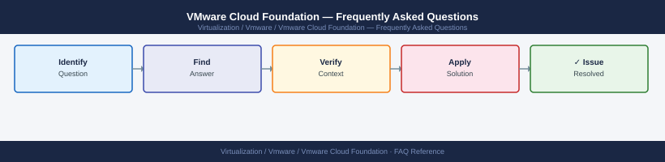

---
tags:
  - vcf
  - faq
  - operations
---
# VMware Cloud Foundation — Frequently Asked Questions

*Applies to: VMware vSphere 7.x / 8.x*

Common questions about VMware Cloud Foundation operations, configuration, and troubleshooting. For step-by-step procedures, see the <a href="index.md">Operations</a> section.

## General

**Q: What VCF version is recommended for new deployments?**
A: VCF 5.1.x or 5.2.x is the current recommendation. Check: SDDC Manager → Settings → System Configuration → Version. VCF version determines the compatible versions of all bundled components.

**Q: How do I check the current VMware Cloud Foundation version?**
A: `SDDC Manager → Settings → System Configuration → Version`

## Configuration

**Q: What is the default workload domain configuration?**
A: The Management Domain is created during VCF bringup and hosts management components. Create additional VI Workload Domains for production workloads. Never run production VMs in the Management Domain.

**Q: How do I enable VCF+ for cloud-connected management?**
A: In SDDC Manager → Administration → VCF+ → Activate. Requires a My VMware account linked to the VCF licence. VCF+ enables Skyline health checks, cloud-based inventory, and enhanced lifecycle management.

## Operations

**Q: How do I upgrade VCF using the SDDC Manager lifecycle workflow?**
A: SDDC Manager → Lifecycle Management → Software Updates → check for updates → Download → Schedule. SDDC Manager orchestrates the upgrade sequence: SDDC Manager → NSX → vCenter → ESXi hosts. Upgrade the Management Domain first, then Workload Domains.

**Q: What is the correct procedure to expand a VCF Workload Domain with new hosts?**
A: Commission hosts via SDDC Manager → Inventory → Hosts → Commission Hosts. Then expand the Workload Domain: SDDC Manager → Workload Domains → select domain → Add Hosts. SDDC Manager configures networking, storage, and vSphere automatically.

## Troubleshooting

**Q: SDDC Manager shows 'Component health check failed'. What does it mean?**
A: SDDC Manager's health check detected an issue with a VCF component (vCenter, NSX, ESXi, vSAN). Go to SDDC Manager → Health → view the failing check. Address the underlying component issue before proceeding with any lifecycle operations.

**Q: VCF lifecycle operations are slow — where do I start?**
A: Check SDDC Manager appliance resources. Verify inter-component network connectivity. Review bundle download speed — pre-stage bundles during off-peak hours. For large environments, check NSX manager health before upgrades.

## Backup and Recovery

**Q: How often should I back up VCF SDDC Manager?**
A: Daily via SDDC Manager → Administration → Backup and Restore → Configure Backup. Backup includes all workload domain configurations, commission data, and licence information. Store on external SFTP. Also back up all component products (vCenter, NSX) individually.

**Q: Can I restore a single Workload Domain configuration without a full SDDC Manager restore?**
A: Not independently — VCF configuration is holistic within SDDC Manager. For component-level recovery, restore vCenter or NSX individually. SDDC Manager restore is needed only when SDDC Manager itself is lost.

## See Also

- [VMware Cloud Foundation Operations](index.md)
- [VMware Cloud Foundation Troubleshooting](../troubleshooting/index.md)
