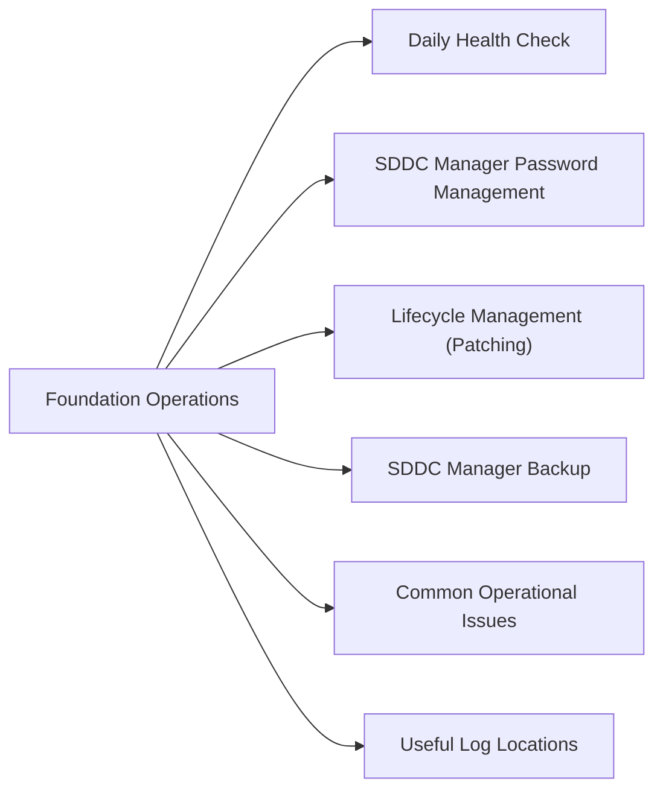

# VMware Cloud Foundation Operations

> Part of the [VCF](../) reference.

---



## Daily Health Check

Daily checks begin in SDDC Manager. NSX fabric health must also be checked separately in NSX Manager — not all NSX events surface in SDDC Manager.

**SDDC Manager:**

1. Dashboard — all workload domains show **Healthy**; no domains in Warning or Error state
2. Security → Certificates — no certificates expiring within 60 days
3. Lifecycle Management → Bundle Management — review available updates; note critical patches
4. Administration → Backup — confirm last successful backup timestamp

**NSX Manager:**

5. System → Fabric → Nodes — all transport nodes and edge nodes show **Up**
6. Networking → Tier-0 Gateways → BGP neighbours — all peers in **Established** state
7. System → Fabric → Transport Zones — all zones healthy; no degraded nodes

**vCenter (per workload domain):**

```powershell
# Check all hosts connected
Get-VMHost | Where-Object {$_.ConnectionState -ne "Connected"} | Select Name, ConnectionState

# Check for snapshots older than 3 days
Get-VM | Get-Snapshot | Where-Object {$_.Created -lt (Get-Date).AddDays(-3)} |
  Select VM, Name, Created, SizeGB

# Check for powered-off VMs without notes flagging them as intentional
Get-VM | Where-Object {$_.PowerState -eq "PoweredOff" -and $_.Notes -notmatch "intentional"}
```

8. vCenter → vSAN Cluster → Skyline Health — no critical (red) alerts

**SDDC Manager appliance disk:**

```bash
ssh vcf@<sddc-manager-ip>
df -h
# Alert if /data or / is above 80%
```

---

## SDDC Manager Password Management

VCF credential rotation is managed centrally through SDDC Manager. Do not rotate component passwords manually outside this workflow — it will cause drift between SDDC Manager's credential store and the actual component password.

```
SDDC Manager → Security → Password Management
→ Select component type (ESXi, vCenter, NSX, SDDC Manager)
→ Rotate → confirm the domain
→ Monitor in Administration → Tasks
```

**Recommended rotation schedule:** 90 days or per organisation policy.

Break-glass accounts are exempt from auto-rotation. Store them in the enterprise vault after initial deployment and rotate manually on the same schedule.

---

## Lifecycle Management (Patching)

All VCF component upgrades (vSphere, vSAN, NSX, SDDC Manager, firmware) must go through SDDC Manager LCM. Patching components independently breaks the VCF BOM (Bill of Materials) alignment and can block future LCM upgrades.

**Pre-upgrade checklist:**

- [ ] All workload domains healthy in SDDC Manager
- [ ] No active critical alarms in vCenter or NSX Manager
- [ ] vSAN Skyline Health shows no critical issues
- [ ] SDDC Manager backup completed successfully within 24 hours
- [ ] BOM compatibility confirmed — check VCF release notes for target version
- [ ] Maintenance window scheduled with change management

**Upgrade order within a VCF release:**

1. SDDC Manager itself (if SDDC Manager is being upgraded)
2. Management domain: vCenter → ESXi → vSAN → NSX (in order per BOM)
3. Workload domains (in order)

Each domain upgrade places ESXi hosts into maintenance mode one at a time, evacuates VMs via DRS, upgrades, then exits maintenance before the next host.

```
SDDC Manager → Lifecycle Management → Upgrade → select target bundle → run pre-check → schedule
```

---

## SDDC Manager Backup

SDDC Manager backup protects the VCF configuration database, domain mapping, and credential store. This is separate from VM backup.

1. Administration → Backup → Configure (SFTP target recommended)
2. Schedule: daily; retain at least 7 restore points
3. Validate: confirm last backup timestamp and status under the Backup page

**On-demand backup:**

```
SDDC Manager → Administration → Backup → Backup Now
```

Download the backup bundle after creation if you need to transfer it off-site manually.

---

## Common Operational Issues

| Symptom | Where to Check | Action |
|---|---|---|
| Workload domain shows Warning | SDDC Manager → Dashboard → domain details | Review component health; expand domain view |
| NSX transport node degraded | NSX Manager → System → Fabric → Nodes | Check NSX agent on affected ESXi host; re-install if needed |
| Certificate expiry warning | SDDC Manager → Security → Certificates | Use SDDC Manager Certificate Management to renew |
| LCM upgrade stuck | SDDC Manager → Administration → Tasks | Review task details; check `/var/log/vmware/vcf/sddc-manager/` |
| SDDC Manager disk full | SSH → `df -h` | Archive old LCM bundle downloads from `/nfs/vmware/vcf/nfs-mount/` |
| BGP peer down | NSX Manager → Networking → Tier-0 → BGP | Check edge node uptime; verify upstream router config hasn't changed |

---

## Useful Log Locations

| Component | Log Path |
|---|---|
| SDDC Manager | `/var/log/vmware/vcf/sddc-manager/` |
| LCM service | `/var/log/vmware/vcf/lcm/` |
| Domain manager | `/var/log/vmware/vcf/domainmanager/` |
| NSX Manager | NSX Manager UI → System → Support Bundle |
| ESXi (per host) | `/var/log/hostd.log`, `/var/log/vmkernel.log` |
