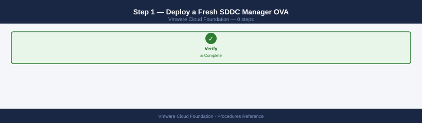
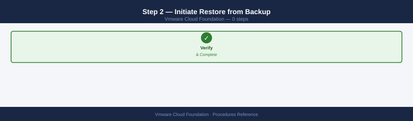
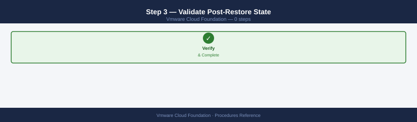
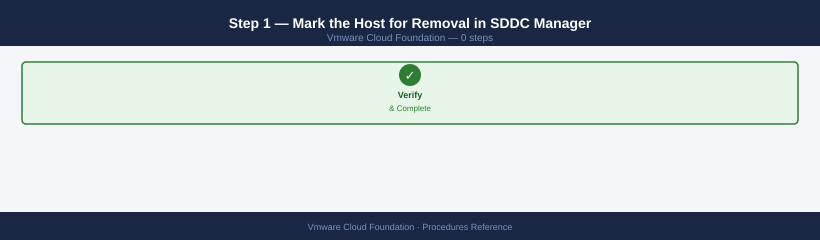
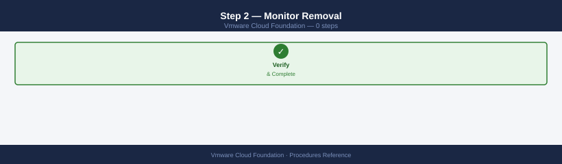
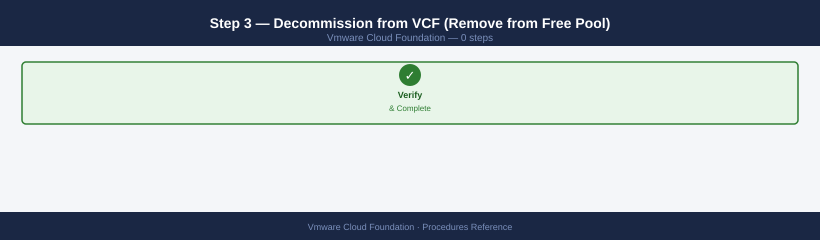
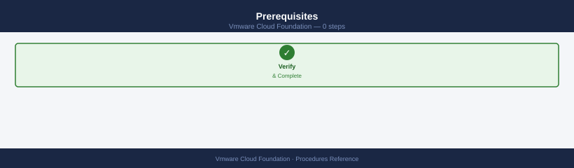
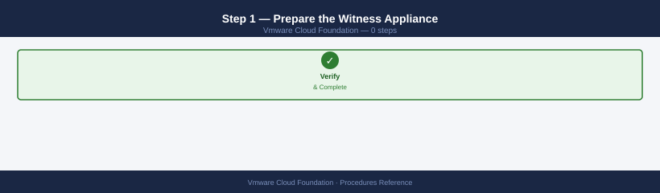
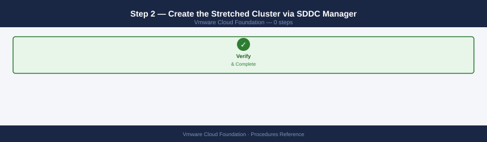

---
tags:
  - operations
  - vcf
  - vmware
---
# VCF — Procedures

<div class="kb-summary">
Procedures reference covering SDDC Manager Backup, Password Management, Useful Log Locations.

*Applies to: VCF 4.x / 5.x*
</div>

VCF Operational Procedures — Decision Map

- Schedule: daily; retain at least 7 restore points
- On-demand: `SDDC Manager → Administration → Backup → Backup Now`

## Before you begin

- **Access:** vCenter read-only minimum; Administrator role for remediation steps
- **Timing:** safe to run during business hours unless a step is marked ⚠ (causes interruption)
- **Dependencies:** no active upgrades or migrations on the same infrastructure
- **Logging:** capture command output — paste into the change record on completion

---

## Password Management
**Break-glass rotation procedure:**

1. Retrieve the break-glass account password from the enterprise vault
2. Rotate in SDDC Manager → Password Management
3. Update the vault entry immediately
4. Log the rotation in the change management system

## Useful Log Locations

| Component | Log Path |
|---|---|
| SDDC Manager | `/var/log/vmware/vcf/sddc-manager/` |
| LCM service | `/var/log/vmware/vcf/lcm/` |
| Domain manager | `/var/log/vmware/vcf/domainmanager/` |
| NSX Manager | NSX Manager UI → System → Support Bundle |
| ESXi (per host) | `/var/log/hostd.log`, `/var/log/vmkernel.log` |

---

## Commission a Host into the Free Pool

Commissioning prepares a bare-metal server for use by VCF by registering it with SDDC Manager and validating it against the Hardware Compatibility List. Once commissioned, the host enters the **Unassigned** state and is available for workload domain assignment.

**Pre-requisites:** host is physically racked, cabled to management, vMotion, vSAN, and uplink networks; iDRAC/iLO is reachable; ESXi ISO matches the VCF BOM.

1. Rack the server and connect all required network cables (management, vMotion, vSAN, overlay uplinks, and out-of-band management).
2. Configure BIOS baseline: enable HT, set boot order to internal disk first, disable legacy boot if using UEFI, set the correct power profile.
3. Install ESXi from the VCF-certified ISO — use the version specified in the SDDC Manager BOM.

    ```bash
    # Verify ESXi build number after installation
    esxcli system version get
    ```

4. Assign the host a static IP, FQDN, and DNS A/PTR records. Verify forward and reverse resolution from SDDC Manager.

    ```bash
    # From SDDC Manager appliance — verify DNS
    nslookup esxi-host-01.domain.local
    nslookup 192.168.10.51
    ```

5. Verify NTP synchronisation on the ESXi host.

    ```bash
    esxcli system ntp get
    esxcli system ntp set --server=ntp.domain.local --enabled=true
    ```

6. In SDDC Manager: navigate to **Inventory → Hosts → Commission Hosts**.
7. Enter the host FQDN, root credentials, and storage type. SDDC Manager runs automated validations:
    - HCL compatibility check
    - SSH connectivity
    - DNS resolution (forward + reverse)
    - NTP sync
    - Network connectivity to vCenter and NSX
8. Resolve any `WARN` or `ERROR` items reported by the validation before proceeding.
9. Confirm commissioning. The host moves to **Unassigned** state in the free pool.

    ```bash
    # Query host status via SDDC Manager API (optional verification)
    curl -sk -u admin@local \
      https://sddc-manager.domain.local/v1/hosts \
      | python3 -m json.tool | grep -E '"status"|"fqdn"'
    ```

---

## Create a Workload Domain

A workload domain is an isolated logical unit within VCF consisting of a vCenter Server instance, one or more NSX Managers, and one or more vSAN-backed clusters. SDDC Manager orchestrates the entire deployment from a single workflow.

**Pre-requisites:** at least 4 hosts are in the free pool (minimum 3 for vSAN stretched requires 4), DNS entries for vCenter and NSX FQDNs are pre-created, and an IP pool is configured in SDDC Manager Network Settings.

1. Navigate to **SDDC Manager → Inventory → Workload Domains → Add Domain**.
2. Select domain type: **VI** (Virtual Infrastructure) for standard workloads.
3. Provide the domain name and select the primary cluster configuration.
4. Assign hosts from the free pool — minimum 3 hosts for vSAN; minimum 4 for vSAN stretched cluster.
5. Configure vCenter Server:
    - Enter the FQDN (must resolve in DNS before proceeding)
    - Enter the datacenter and cluster names
    - Select the appropriate size (tiny/small/medium/large)
6. Configure NSX — choose **shared** (use existing NSX deployment from management domain) or **new** (deploy dedicated NSX Manager cluster):
    - If new: provide 3 NSX Manager FQDNs, VIP FQDN, and admin credentials
7. Configure vSAN storage policy, failure tolerance method (FTT=1 or FTT=2), and disk group layout.
8. Review the generated JSON specification. Validate all IP addresses, FQDNs, and VLANs before submitting.

    ```bash
    # Export the draft spec for offline review (SDDC Mgr API)
    curl -sk -u admin@local \
      "https://sddc-manager.domain.local/v1/domains/validations" \
      -H "Content-Type: application/json" \
      -d @domain-spec.json | python3 -m json.tool
    ```

9. Click **Deploy**. SDDC Manager sequentially deploys: vCenter → NSX → vSAN → joins hosts.
10. Monitor progress in **SDDC Manager → Tasks**. Total deployment time is typically 45–90 minutes.
11. Post-deploy validation:
    - Log in to the new vCenter and confirm hosts are connected
    - Confirm vSAN health in vCenter → Cluster → Monitor → vSAN → Health
    - Confirm NSX transport nodes show **Up** status

---

## Expand a Workload Domain (Add Hosts)

Expanding a workload domain adds capacity to an existing cluster by pulling commissioned hosts from the free pool. SDDC Manager handles ESXi configuration, vSAN disk group creation, and NSX transport node preparation automatically.

**Pre-requisites:** the additional hosts are commissioned and in the **Unassigned** (free pool) state; the cluster has sufficient vSAN capacity to absorb a temporary rebalance.

1. Commission any new physical hosts into the free pool (see **Commission a Host into the Free Pool** above).
2. Navigate to **SDDC Manager → Inventory → Workload Domains**.
3. Select the target domain and then select the target cluster within that domain.
4. Click **Actions → Expand**.
5. Select one or more hosts from the free pool to add to the cluster.
6. Review the summary — SDDC Manager will:
    - Configure ESXi networking (VMkernel adapters, vSwitches/DVS)
    - Add the host to vCenter
    - Join the host to the vSAN cluster and create disk groups
    - Prepare the host as an NSX transport node
7. Click **Apply**. Monitor progress in **SDDC Manager → Tasks**.
8. Post-expansion validation:

    ```bash
    # Verify host count in cluster via ESXi CLI (run from any host in the cluster)
    esxcli hardware platform get
    # Or via vCenter API
    curl -sk -u administrator@vsphere.local \
      "https://vcenter.domain.local/api/vcenter/cluster" | python3 -m json.tool
    ```

    - Confirm the new host appears as **Connected** in vCenter
    - Confirm vSAN rebalance completes and disk health is green
    - Confirm NSX transport node status is **Up**

---

## Delete a Workload Domain

Deleting a workload domain permanently removes the vCenter, NSX, and all associated clusters from VCF management. Hosts return to the free pool. This operation is irreversible — ensure all workloads are migrated before proceeding.

!!! danger "Irreversible — all data in the domain is permanently destroyed"
    SDDC Manager will destroy the vCenter, NSX Manager cluster, and all VMs that are registered in the domain. If any VMs remain on the vSAN datastore when deletion begins, those VMs are deleted. There is no undo. Complete the pre-requisites checklist and take a final SDDC Manager backup before proceeding.

**Pre-requisites (mandatory before initiating delete):**

- All VMs are powered off or migrated to another domain
- vSAN datastore is empty (no VMs, no templates, no ISO files)
- No dependent services (vRA, HCX, Tanzu) are still registered against this domain

1. Migrate all running VMs off the domain using vMotion or Storage vMotion to an alternate domain.
2. Verify the vSAN datastore is empty:

    ```bash
    # SSH to any ESXi host in the cluster
    esxcli storage vmfs extent list
    # Or check via vCenter: Storage → Datastore → Files
    ```

3. Remove any add-on services (HCX, vRA, Aria) that reference this domain in SDDC Manager.
4. Navigate to **SDDC Manager → Inventory → Workload Domains**.
5. Select the target domain.
6. Click **Actions → Delete**.
7. Confirm the decommission prompt. SDDC Manager will:
    - Deregister NSX from vCenter
    - Remove hosts from vCenter clusters
    - Uninstall NSX transport node preparation
    - Destroy vCenter and NSX VM instances
    - Return hosts to the **Unassigned** free pool
8. Monitor progress in **SDDC Manager → Tasks**. Duration is typically 20–40 minutes.
9. Post-deletion: confirm hosts appear in the free pool under **Inventory → Hosts**.

---

## Rotate Passwords (All Components)

SDDC Manager centrally manages credentials for all VCF components (ESXi, vCenter, NSX, SDDC Manager itself, and PSC). Password rotation should be performed on a scheduled basis and is mandatory after any suspected credential compromise.

!!! warning "Do not rotate passwords directly in individual product UIs"
    Changing a password in vCenter, NSX, or ESXi outside of SDDC Manager causes credential drift — SDDC Manager loses the ability to manage that component until the password is re-synced. If drift has already occurred, use SDDC Manager → Password Management → Remediate to correct it before rotating.

**Note:** Rotation is orchestrated by SDDC Manager — do not rotate passwords directly in individual product UIs, as this will cause credential drift and break SDDC Manager's ability to manage those components.

1. Navigate to **SDDC Manager → Security → Password Management**.
2. Select the **Resource Type** (e.g., ESXi, vCenter, NSX Manager, SDDC Manager, PSC).
3. Select specific resources or use **Select All** for that resource type.
4. Click **Rotate**.
5. Review the confirmation dialog — note which accounts will be rotated.
6. Click **Confirm**. SDDC Manager rotates credentials in the correct dependency order.

    ```bash
    # Monitor rotation task status via API
    curl -sk -u admin@local \
      "https://sddc-manager.domain.local/v1/tasks?pageSize=5" \
      | python3 -m json.tool | grep -E '"status"|"name"'
    ```

7. Verify the rotation task completes with **SUCCESSFUL** status in **SDDC Manager → Tasks**.
8. Confirm no downstream services are impacted:
    - vCenter alarms: check for authentication errors
    - NSX Manager: confirm all transport nodes remain **Up**
    - Any external integrations (vRA, Aria Automation) may require credential updates in their own configuration
9. Update the enterprise vault (HashiCorp Vault, CyberArk, etc.) with the new credentials if not auto-synced.

---

## Rotate Certificates (All Components)

VCF components use TLS certificates managed by SDDC Manager. Certificates can be signed by the embedded VMware CA, a Microsoft CA (via integration), or an external CA using a CSR workflow. Renewing before expiry avoids service disruption.

**Pre-requisites:** verify current certificate expiry dates before scheduling; plan for brief service restarts on NSX Manager during rotation.

1. Navigate to **SDDC Manager → Security → Certificate Management**.
2. Review the certificate inventory table — identify components with certificates expiring within 60 days.
3. Select the target component (e.g., SDDC Manager, vCenter, NSX Manager).
4. Click **Renew** (for VMware CA-signed certs) or **Generate CSR** (for external CA workflow):

    **VMware CA / Microsoft CA (auto-sign):**
    - Select certificate authority
    - Click **Generate CSR and Sign** — SDDC Manager handles the full cycle

    **External CA (manual CSR):**

    ```bash
    # After generating the CSR in SDDC Manager, download it
    # Submit to your CA, then import the signed cert + chain:
    # SDDC Manager → Certificate Management → select component → Import Certificate
    ```

5. Click **Renew** / **Apply**. SDDC Manager pushes the new certificate and restarts the affected service.
6. Verify the cert chain after rotation:

    ```bash
    # Verify vCenter certificate from command line
    openssl s_client -connect vcenter.domain.local:443 -showcerts </dev/null 2>/dev/null \
      | openssl x509 -noout -subject -issuer -dates

    # Verify SDDC Manager certificate
    openssl s_client -connect sddc-manager.domain.local:443 -showcerts </dev/null 2>/dev/null \
      | openssl x509 -noout -subject -issuer -dates
    ```

7. Confirm SDDC Manager re-registers trust with vCenter and NSX after certificate replacement — check that no **Certificate Invalid** alarms appear.
8. For NSX Manager: verify transport node connectivity is restored after the cert rotation completes.

---

## Run an LCM Precheck

The Lifecycle Management (LCM) Precheck validates the environment against a set of prerequisites before an upgrade is permitted to proceed. Always run a precheck at least 48 hours before a scheduled maintenance window to allow time to resolve findings.

**Scope:** precheck evaluates hardware compatibility, software interoperability, network connectivity, certificate validity, free disk space, and vSAN health.

1. Navigate to **SDDC Manager → Lifecycle Management → Upgrade**.
2. Select the component to be upgraded (e.g., SDDC Manager, vCenter, ESXi, NSX).
3. Ensure the target upgrade bundle has been downloaded (see **Apply a VCF Upgrade Bundle**).
4. Click **Run Precheck**.
5. SDDC Manager executes checks across all affected components. This takes 5–15 minutes.
6. Review the results categorised by severity:
    - **INFO** — informational; no action required
    - **WARN** — advisory; resolve before upgrade if possible
    - **ERROR** — blocking; upgrade cannot proceed until resolved

    ```bash
    # Retrieve precheck results via API for export to change ticket
    curl -sk -u admin@local \
      "https://sddc-manager.domain.local/v1/upgradables/prechecks" \
      | python3 -m json.tool
    ```

7. Common ERROR items and remediation:
    - **Certificate expiry** → rotate certs (see **Rotate Certificates** above)
    - **vSAN health degraded** → resolve disk/network faults before proceeding
    - **Insufficient disk space** → free space on SDDC Manager appliance (`/var` must have >20 GB free)
    - **DNS/NTP drift** → correct on affected hosts

    ```bash
    # Check SDDC Manager appliance disk usage
    df -h /var
    ```

8. Re-run precheck after resolving issues; proceed to upgrade only when all ERRORs are cleared.

---

## Apply a VCF Upgrade Bundle

VCF upgrades are applied via the LCM module in SDDC Manager. The upgrade order is fixed: SDDC Manager → vCenter → NSX → ESXi hosts → vSAN. Never upgrade components out of order.

!!! warning "Do not interrupt once started — partial upgrade states are unrecoverable without VMware GSS"
    Closing the SDDC Manager browser session or losing connectivity to the appliance mid-upgrade does not stop the upgrade task, but it may leave the UI unable to track progress. Do not power off SDDC Manager, vCenter, or NSX Manager nodes during the upgrade. If a step fails, open a VMware GSS case before attempting any manual recovery — out-of-order component upgrades are not supported and can leave VCF in an unrecoverable state.

**Pre-requisites:** precheck has completed with zero ERRORs; a maintenance window is scheduled; all VMs with HA/DRS enabled are in a known state; snapshots of management VMs are taken.

1. Navigate to **SDDC Manager → Lifecycle Management → Check for Updates**.
2. SDDC Manager contacts the VMware depot and lists available bundles. If the environment is air-gapped, upload the bundle manually:

    ```bash
    # Copy bundle to SDDC Manager (from a jump host with access)
    scp vcf-bundle-4.x.x.x.tar.gz vcf@sddc-manager.domain.local:/nfs/vmware/vcf/nfs-mount/bundles/

    # Trigger a local depot rescan
    curl -sk -u admin@local -X POST \
      "https://sddc-manager.domain.local/v1/bundles/retrigger" \
      -H "Content-Type: application/json"
    ```

3. Select the target bundle. Verify the SHA-256 checksum matches the VMware KB for that release:

    ```bash
    sha256sum vcf-bundle-4.x.x.x.tar.gz
    # Compare output to the checksum published in the VMware release notes
    ```

4. Click **Download** and wait for the bundle status to show **SUCCESSFUL**.
5. Schedule the upgrade window in SDDC Manager (date, time, notification email).
6. Run Precheck one final time immediately before the maintenance window opens (see above).
7. Click **Upgrade**. SDDC Manager upgrades components in the correct dependency order:
    - SDDC Manager appliance (self-upgrade; brief UI outage)
    - vCenter Server
    - NSX Manager cluster (rolling)
    - ESXi hosts (sequential, with maintenance mode; DRS evacuates VMs)
    - vSAN on-disk format upgrade (if applicable)
8. Monitor progress in **SDDC Manager → Tasks**. Do not interrupt the upgrade once started.

    ```bash
    # Tail the LCM log during upgrade for real-time status
    tail -f /var/log/vmware/vcf/lcm/lcm.log
    ```

9. Post-upgrade validation:
    - Confirm SDDC Manager build number matches the target release
    - Confirm all vCenter, NSX, and ESXi versions match the BOM
    - Run vSAN health check
    - Verify NSX transport nodes are **Up**
    - Remove any pre-upgrade snapshots from management VMs

---

## Configure a Network Pool

Network pools define the IP address ranges and VLAN assignments that SDDC Manager allocates to hosts and components during workload domain creation. Pools must be created before deploying a new domain.

**Note:** network pools are consumed at domain creation time and cannot be changed after the domain is deployed. Plan IP ranges carefully to avoid overlap.

1. Navigate to **SDDC Manager → Network Settings → Network Pools**.
2. Click **New Pool**.
3. Provide a descriptive pool name (e.g., `wld-01-pool`).
4. Configure the network types required for the target domain:
    - **Management** network: VLAN ID, subnet, gateway, MTU, IP range start/end
    - **vMotion** network: VLAN ID, subnet, gateway, MTU, IP range start/end
    - **vSAN** network: VLAN ID, subnet, gateway, MTU, IP range start/end
    - **NSX Host Overlay** (TEP) network: VLAN ID, subnet, gateway, MTU, IP range start/end
5. Verify that IP ranges are sized to accommodate the maximum expected host count in the domain (current + future expansion).
6. Click **Save**. The pool appears in the network pool inventory.

    ```bash
    # List configured network pools via API
    curl -sk -u admin@local \
      "https://sddc-manager.domain.local/v1/network-pools" \
      | python3 -m json.tool | grep -E '"name"|"id"'
    ```

7. The network pool is automatically assigned to the domain during the **Create a Workload Domain** workflow — select it in the vCenter/NSX configuration step.
8. Post-creation: verify the allocated IPs appear under **SDDC Manager → Network Settings → IP Allocations**.

---

## Review Audit Logs

SDDC Manager records all administrative actions (login events, task submissions, configuration changes) in its audit log. Audit logs are essential for change control reviews, security investigations, and compliance reporting.

**Retention:** the audit log file rolls over when it reaches 100 MB. For long-term retention, configure a syslog target in **SDDC Manager → Administration → Syslog**.

**Via CLI (SDDC Manager appliance):**

```bash
# View the last 100 audit log entries
tail -100 /var/log/vmware/vcf/commonsvcs/audit.log

# Search for a specific user's actions
grep "user@domain.local" /var/log/vmware/vcf/commonsvcs/audit.log | tail -50

# Filter for login events
grep -i "LOGIN\|LOGOUT\|AUTH" /var/log/vmware/vcf/commonsvcs/audit.log | tail -50

# Filter for a specific action type (e.g., password rotation, domain creation)
grep -i "ROTATE\|COMMISSION\|CREATE_DOMAIN" /var/log/vmware/vcf/commonsvcs/audit.log
```

**Via SDDC Manager UI:**

1. Navigate to **SDDC Manager → Administration → Audit Logs**.
2. Apply filters:
    - **User** — filter by the account that performed the action
    - **Action** — filter by operation type (e.g., Commission, Rotate, Upgrade)
    - **Timeframe** — set start and end date/time for the review window
    - **Resource** — filter by target resource (host FQDN, domain name, etc.)
3. Export results to CSV for inclusion in change management records or security reports.

**Syslog forwarding (recommended for compliance):**

```bash
# Configure syslog target via SDDC Manager API
curl -sk -u admin@local -X POST \
  "https://sddc-manager.domain.local/v1/syslog-configuration" \
  -H "Content-Type: application/json" \
  -d '{"host": "syslog.domain.local", "port": 514, "protocol": "UDP"}'
```

**Key audit log fields:**

| Field | Description |
|---|---|
| `timestamp` | UTC time of the event |
| `user` | Account that initiated the action |
| `action` | Operation performed (e.g., `COMMISSION_HOST`) |
| `resource` | Target resource FQDN or ID |
| `status` | `SUCCESS`, `FAILURE`, or `IN_PROGRESS` |
| `sourceIp` | Client IP address of the initiating session |

---

## Configure SDDC Manager File-Based Backup

SDDC Manager backup captures its own database and configuration — not the managed product backups.

1. SDDC Manager → **Administration** → **Backup and Restore** → **Configure**
2. Select backup type: **SFTP** or **NFS**
3. Enter:
   - Server FQDN or IP
   - Backup directory path
   - Credentials (for SFTP)
   - Encryption passphrase (required — store securely; needed for restore)
4. Click **Test Connection** → confirm write access
5. Set schedule: daily backup recommended; retain at least 3 copies
6. Click **Save**

To trigger an immediate backup:
```bash
# Via SDDC Manager API
curl -sk -u 'admin@local:<password>' -X POST \
  "https://sddc-manager.example.local/v1/backups" \
  -H "Content-Type: application/json" \
  -d '{"elements": [{"resourceType": "SDDC_MANAGER"}]}'
```

---

## Add an ESXi Host to the Free Pool

Hosts must be in the free pool before they can be assigned to a workload domain.

1. SDDC Manager → **Hosts** → **Commission Hosts**
2. Enter the ESXi host FQDN — host must be:
   - Running the VCF-approved ESXi build
   - Reachable from SDDC Manager
   - Time-synced (NTP drift < 5 minutes)
   - SSH enabled
3. SDDC Manager runs pre-validation (network, NTP, connectivity)
4. Confirm and submit — host moves from **Unassigned** to **Unallocated** (free pool)

```bash
# Verify host is in the free pool via API
curl -sk -u 'admin@local:<password>' \
  "https://sddc-manager.example.local/v1/hosts?status=UNASSIGNED_USEABLE" \
  | jq '.elements[] | {fqdn: .fqdn, status: .status}'
```

---

## Configure External Certificates for VCF Components

VCF supports replacing VMCA-signed certificates with CA-signed certificates for all managed components.

1. SDDC Manager → **Administration** → **Certificates** → **Generate CSRs**
2. Select the components to replace (SDDC Manager, vCenter, NSX Manager, etc.)
3. Submit — SDDC Manager generates CSR files for each component
4. Download the CSR bundle and submit to your CA
5. Import signed certificates:
   - SDDC Manager → Certificates → **Import Certificate**
   - Upload the signed PEM and the CA chain for each component
6. SDDC Manager → Certificates → **Replace Certificates** → select all components
7. SDDC Manager orchestrates the certificate push to each component — monitor via **Tasks**

```bash
# Check current certificate expiry for all VCF components
curl -sk -u 'admin@local:<password>' \
  "https://sddc-manager.example.local/v1/certificate-authorities/certificates" \
  | jq '.elements[] | {resourceFqdn: .resourceFqdn, notAfter: .certificate.notAfter}'
```

---

## Review SDDC Manager Health Dashboard

1. SDDC Manager → **Dashboard** — shows overall health status (green/yellow/red) for:
   - Management domain components (vCenter, NSX, vSAN, ESXi)
   - Workload domains
   - Storage and network health
2. Click any component tile to drill into component-level health
3. For degraded components, review the **Tasks** panel for in-progress or failed tasks
4. Run an explicit health check: **SDDC Manager → Workload Domains → select domain → Health Check**

```bash
# Run SOS health check from SDDC Manager appliance
ssh vcf@sddc-manager.example.local
sudo /opt/vmware/sddc-support/sos --health-check --domain-name sfo-m01
# Output saved to /var/log/vmware/vcf/sddc-support/sos-<timestamp>/
```

---

## Recover SDDC Manager from Backup

Use when SDDC Manager is unrecoverable (VM deleted, disk corruption, failed upgrade) and no VM snapshot exists.

!!! warning "Restore from backup reverts SDDC Manager's database to the backup point in time"
    Any VCF changes made after the backup (new hosts commissioned, new domains created, certificate rotations) will not be reflected in the restored SDDC Manager. After restore, audit the current infrastructure state and reconcile manually. VMs in workload domains continue running during SDDC Manager downtime — only management operations are blocked.

### Step 1 — Deploy a Fresh SDDC Manager OVA



1. Download the SDDC Manager OVA from the Broadcom portal — use the same version as the backup
2. Deploy the OVA to the management domain vCenter using the same IP and FQDN as the original SDDC Manager
3. Complete first-run setup: accept EULA, set admin credentials — **do not configure any domains or hosts at this stage**

### Step 2 — Initiate Restore from Backup



SDDC Manager backup restore is performed via the API (no UI restore wizard):

```bash
# 1. Retrieve the list of available backups on the backup target
curl -sk -u 'admin:VMware1!' \
  "https://<sddc-manager-ip>/v1/backups/tasks" | jq '.elements[] | {id: .id, createdAt: .createdAt}'

# 2. Trigger restore using the backup ID from step 1
curl -sk -u 'admin:VMware1!' \
  -X POST \
  -H "Content-Type: application/json" \
  -d '{"backupFile": "<path-to-backup-file>", "encryption": {"passphrase": "<backup-passphrase>"}}' \
  "https://<sddc-manager-ip>/v1/restores/tasks"
```

The restore process may take 20–60 minutes. SDDC Manager restarts multiple times.

### Step 3 — Validate Post-Restore State



```bash
# Confirm SDDC Manager service health after restore
curl -sk -u 'admin:VMware1!' \
  "https://<sddc-manager-ip>/v1/system/health-summary" | jq '.elements[] | {service: .type, status: .status}'
```

In the SDDC Manager UI:
- **Workload Domains** → all domains should be visible and show their current state
- **Inventory → Hosts** → all commissioned hosts should be listed
- **Certificates** → verify certificate status for all components

If any hosts or domains are missing from SDDC Manager after restore (added after the backup was taken), they must be re-commissioned or re-imported.

---

## Remove a Host from a Workload Domain

Used when decommissioning an ESXi host that is part of an existing VCF workload domain — for hardware retirement or capacity reduction. The host is moved to the free pool, then decommissioned.

!!! warning "Minimum host counts: VI domain needs ≥ 4 hosts; vSAN stretched cluster needs ≥ 6"
    Removing a host that would drop the domain below minimums is blocked by SDDC Manager. Verify the remaining host count before starting.

### Step 1 — Mark the Host for Removal in SDDC Manager



1. SDDC Manager → **Inventory → Workload Domains** → select the target domain
2. Click the **Hosts** tab → locate the host to remove
3. Select the host → **Remove Host**

SDDC Manager validates the removal (checks vSAN capacity headroom and minimum host counts) before proceeding.

### Step 2 — Monitor Removal



SDDC Manager orchestrates:
1. vSAN data evacuation from the host (Full data migration)
2. vMotion all VMs off the host
3. Remove host from the vSphere cluster
4. Return host to the VCF Free Pool

```bash
# Monitor via SDDC Manager API
curl -sk -u 'admin:VMware1!' \
  "https://<sddc-manager>/v1/tasks/<task-id>" | jq '{status: .status, subTasks: .subTasks[].status}'
```

### Step 3 — Decommission from VCF (Remove from Free Pool)



Once in the Free Pool, the host can be decommissioned from VCF entirely:

1. SDDC Manager → **Inventory → Hosts → Free Pool** → select the host
2. Click **Decommission** — SDDC Manager removes the host from inventory, deletes its record from the VCF database
3. The host still has ESXi installed — wipe it if repurposing

---

## Configure a vSAN Stretched Cluster in VCF

A vSAN Stretched Cluster in VCF provides synchronous replication between two sites within a VCF workload domain, achieving RPO=0 and automatic failover.

### Prerequisites



- Two physical sites with ≤ 5 ms RTT between them (10 ms maximum for vSAN stretched cluster)
- A third witness site (can be a small VM) with ≤ 200 ms RTT to both sites
- Equal number of hosts per site (minimum 3 per site = 6 total)
- VCF 4.x+ with vSAN 7.x+

### Step 1 — Prepare the Witness Appliance



1. Download the vSAN Witness OVA and deploy it to the witness site (a separate vCenter or standalone ESXi)
2. Assign the witness an IP reachable from both primary sites on the vSAN witness network
3. Configure the witness VMkernel: `esxcli vsan network ipv4 add -i vmk1 -T=witness`

### Step 2 — Create the Stretched Cluster via SDDC Manager



SDDC Manager → **Workload Domains → select domain → Clusters → select cluster → Stretch Cluster**

In the wizard:
- **Site A hosts**: hosts physically located at the primary site
- **Site B hosts**: hosts physically located at the secondary site
- **Witness host**: the witness appliance IP
- **Fault domain mapping**: assign each host to its correct fault domain (site A or site B)

SDDC Manager configures vSAN stretched cluster mode, sets up fault domains, and configures the witness VM automatically.

### Step 3 — Validate Stretched Cluster Health


```bash
# From any host in the cluster — check stretched cluster status
esxcli vsan cluster get | grep -E "Sub-Cluster Type|Witness|Preferred"

# Check both sites are equally represented in vSAN
esxcli vsan health cluster get | grep -E "Stretched|Fault Domain|Witness"
```

In SDDC Manager: **Inventory → Workload Domains → cluster** — stretched cluster topology should show two fault domains and the witness.

---

## See also

- [VCF — Health Checks](../health-checks/)
- [VCF Troubleshooting — Common Issues](../../troubleshooting/common-issues/)
- [VCF Operations — CLI Reference](../cli-reference/)

## Verify

- **Alarms:** vSphere Client → Home → Alarms — no new critical alarms after the operation
- **Events:** monitor the vCenter Events view for the affected object for 5 minutes
- **Health check:** run the morning health-check sequence for the affected product tier
